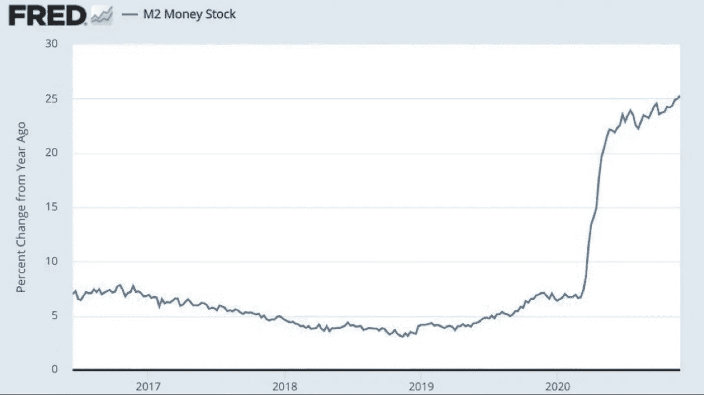
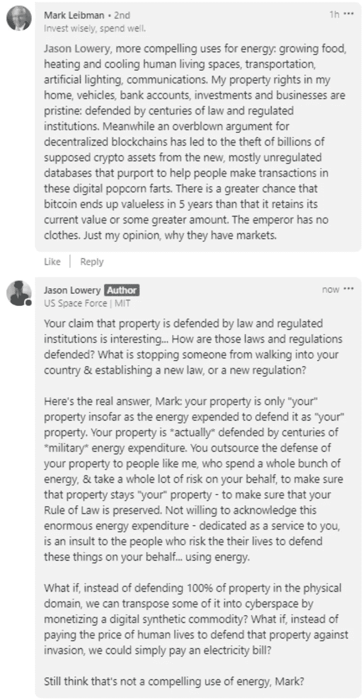
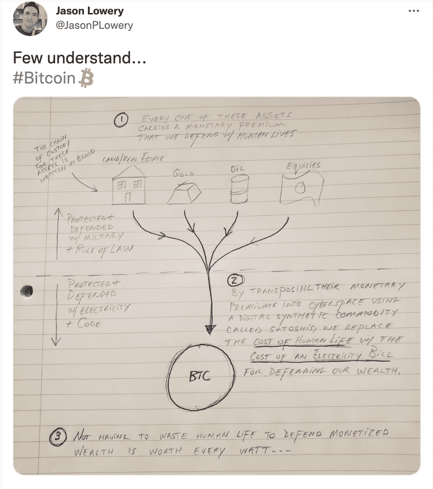

# 比特币的信仰体系比法定货币的信仰体系更好

> 原文：<https://medium.com/coinmonks/bitcoins-belief-system-is-better-than-fiat-currency-s-belief-system-fc4d2d1ea216?source=collection_archive---------3----------------------->

所有的经济体系都是信仰体系，与宗教没有什么不同。通过我们的经济行为，我们有意识或无意识地表达我们的信念。

Photo by [Thought Catalog](https://unsplash.com/@thoughtcatalog?utm_source=medium&utm_medium=referral) on [Unsplash](https://unsplash.com?utm_source=medium&utm_medium=referral)

2021 年 11 月 3 日，马克·墨比尔斯，这位 85 岁的著名投资者和 LLP Mobius Capital Partners 的创始人，在 Squawk Box 上谴责 crypto 是一种“宗教”而不是“投资”

他不是第一个以这种方式批评这个空间的人，考虑到围绕它出现的充满活力(有时非常深奥)的文化，有许多人会欣然地、由衷地同意他的观点。值得注意的是，尽管 Mobius 使用了带有贬义的“宗教”一词，但其他人，如 a16z 的 Chris Dixon，已经以明显非贬义的方式将比特币称为一种宗教。我想探讨一下在莫比乌斯意义上比特币是宗教的观点，也就是说从这个角度来说，这是一个负面的属性。虽然很明显，像莫比乌斯这样的人认为他们正在提供不言自明的批评，但我认为探索这种观点的基础最终会揭示更多关于菲亚特系统的信息，而不是比特币。

为了打下一些基础并明确一些定义，让我们承认有许多不同的方式来定义或概念化宗教，因为宗教对无数的人意味着无数的事情。在这里，我想把重点放在宗教的一个基本框架上(尽管肯定不是排他的或详尽的)。

一种思考宗教的方式是把它看作一个信仰系统和一个信徒网络。每种宗教从根本上来说都包含了一个由它的实践者共享的信仰体系。信仰是宗教的组织和指导力量。源于信仰体系本身的是实践、仪式、道德观念、生活准则等等。实践者本身是一个网络，意味着他们通过他们共享的信仰系统形成和分享联系。

现在，当像 Mobius 这样的人把比特币称为一种宗教而不是一种投资时，这是一种区分宗教和投资(或值得投资的东西)的比较声明。有几个假设支持这样一种观点，即这些东西是如此明显地可以区分的。第一，值得“投资”的事物，即以法定货币计价的投资工具，完全存在于任何类似宗教的事物之外，并与之分离。这是一种含蓄的说法，可以说这些投资工具符合可识别的理性框架，不依赖于人类和信仰这样的东西，但 T2 的那些投资(如比特币)是非理性的，只符合 T4 的信仰逻辑。第二个假设是，拥有与宗教相同的一些特征会使某些东西不值得投资。

第一个假设在极其重要的方面是错误的，尽管在某些方面并不明显。我认为，法定系统和仍在假设中的比特币系统都是宗教，就像我们上面概述的那样，也就是说，它们是拥有信徒网络的信仰系统。区别在于，那些一生或大部分时间都生活在这个法定体系中的人没有意识到，它在很多方面都是宗教性的，就像莫比乌斯和其他人指责比特币是宗教性的一样。为什么这里会失败？

对如此普遍存在的事物无法拥有或获得任何客观性是很常见的，也是意料之中的。回想一下戴维·福斯特·华莱士在*这是水*中著名的寓言，两条向一个方向游的小鱼遇到了一条向相反方向游的大鱼。年长的鱼问候年轻的鱼，问“水怎么样？”两条小鱼不停地游着。最终其中一个转向另一个说，“水到底是什么？”这个寓言强调了最显而易见的、包罗万象的真理和现实是如何难以看到或欣赏的，尤其是当我们从未存在于这些现实之外的时候。另一个明显的，虽然更反乌托邦的类比当然是*《黑客帝国》*。

菲亚特世界与比特币被指控拥有许多相同的宗教特征，但构成菲亚特系统的一系列信仰是如此普遍，是我们的经验所固有的，以至于最初很难察觉。然而，它们确实存在。所以让我们开始打开它们。

菲亚特世界的信仰体系首先是关于美元(“USD”)的霸权。整个全球经济都锚定并围绕美元的霸权组织起来。美国的外交政策和国内政策都致力于维护美元的霸权地位。由于美元和其他法定货币都不是由黄金支持的，所以整个体系本质上是由美国军事力量和美国政府的“完全信任和信用”支持的。前者，正如我们将在下面讨论的，需要消耗石油和人命。随着我们的国债增长到可笑的数量，外国买家停止购买我们的债券，后者经常受到侵蚀。

在 1971 年后的后金本位世界中，保持美元作为全球储备货币的至高无上地位，导致、影响并促成了全球范围内过多的负面事件和趋势。美元霸权的永久化是我们得到石油美元体系的原因，尽管目前有所松动，但该体系在过去 50 年里一直管理和协调着全球经济。

要深入了解石油美元体系，我推荐阅读亚历克斯·格拉德斯坦的文章《[揭露石油美元的隐藏成本](https://bitcoinmagazine.com/culture/the-hidden-costs-of-the-petrodollar)，并观看理查德·詹姆斯的电影《石油美元*。简单来说，这是一个沙特阿拉伯(以及后来中东的其他产油国)同意以美元为所有石油合同定价的体系，作为交换，美国承诺提供防御。*

*这对美国是有利的，因为我们过去(现在)正在积累大量债务。沙特阿拉伯同意从他们以美元进行的石油贸易中获取利润，并购买美国债务。从根本上总结这是如何塑造全球经济的，每个国家都需要石油作为能源，所以大多数国家都需要美元来支付石油，这使美元走强，使我们的出口失去竞争力，这或多或少地摧毁了我们的制造业，削弱了中产阶级，这也导致了一切的金融化，这当然导致了系统中更多的杠杆，这就是我们现在的情况。*

*石油美元体系是美元全球储备地位的重要组成部分，维持这一体系需要美国在不同时期以不同方式进行军事干预，这明显损害了参战者、纳税人和环境。毕竟，美国军队本身就是世界上最大的石油机构消费者，并且自 1971 年以来，已经被部署在多个场合，无论是间接的还是直接的(争论仍在激烈进行),来保卫一个完全依赖于石油生产的系统。*

*因此，看待法定信仰体系的一种方式是，它围绕着美元的霸权，尽管西方精英集团(金融机构、国防承包商、大公司、政治家等)获得了大量集中利益。)，造成了很大的伤害，夺去了很多人的生命，并对很多新兴市场经济体产生了负面影响。这种信仰体系极大地扩大了财富差距，因为它掏空了制造业和生产性工作岗位，同时推动了金融服务，加速了经济的金融化，这显然有利于那些有资本投资金融产品的人。*

*构建这一信仰体系的另一种方式是通过 2008 年以来货币供应空前扩张导致美元持续贬值的视角。随着货币供应量的增加，现有的美元越来越不值钱。我们都很熟悉通货膨胀以及美元是如何每年失去购买力的。由于上述货币供应扩张的加速，这一过程自 2008 年以来已经加速。例如，目前流通的美元中约有四分之一是自 2020 年 3 月以来创造的。*

**

*由于我们的美元持续贬值，人们转向其他资产来储存价值。想想房地产、股票、黄金、石油等。这些资产正在膨胀，因为越来越多的人转向它们来充当价值储存的角色，在理想情况下，应该由健全的功能性货币来充当。正如杰森·洛维里指出的那样，这些获得货币溢价的资产受到法律和监管机构的保护，重要的是，这些机构最终也受到美国军方的保护:*

**

*这一切都表明，和比特币一样，传统的法定经济体系也是一个拥有信徒网络的信仰体系。这两种信仰体系的区别在于，比特币的原则是明确的，而对大多数人来说，菲亚特的原则是含蓄的。*

> **但是不要搞错，我们的经济体系*或明或暗地是*信仰体系，我们通过我们的经济行为选择我们信仰的体系。**

*当一个人含蓄或明确地表示相信当前的法定制度时，他含蓄或明确地表示相信政治家和央行行长的善意、通货膨胀、可操纵的货币、坎蒂隆效应、金融准入的减少和不平等、美国在中东和其他地方的军事干预、化石燃料的过度消费、每年失去购买力的货币、日益扩大的财富差距以及金融中介机构决定谁可以被银行存款和交易的世界。我还想补充一点，在一个真实资产呈现货币溢价的世界里，那些有能力也渴望掠夺这些资产的人会受到激励。*

*当一个人含蓄或明确地宣称相信比特币系统时，他就是在宣称相信数学(不需要政治家或央行行长)，防止通货膨胀，不可操纵的货币，增加和更加平等的金融准入，为没有银行账户的人提供银行服务，激励可再生能源的使用，推进人权工具，阻止冲突和掠夺，解决财富差距，阻止掠夺/战争，以及削弱金融中介的权力。*即使*你显然只是为了收益(因为我们所说的“数字上升技术”)而投资比特币，你仍然通过你的经济行为，心照不宣地表达了对上述事物的信念，因为你的行为推动了一项推进所有这些想法的技术。比特币社区中另一个普遍适用的说法是“为收益而来，为革命而留。”*

**

*通过相信比特币，你相信将附加于其他资产的货币溢价“转移”到比特币中(这是美元持续贬值的结果)。正如洛维里指出的那样，前者受到法治和我们的机构的保护，而后者却常常被忽视，必须用军事精力和人的生命来捍卫。另一方面，比特币受到电力(越来越多的电力是可再生的)、数学和去中心化的保护。*

**

*因此，为了让这个循环完整，当马克·墨比尔斯这样的人轻蔑地将比特币称为“宗教”时，他们这样做的前提是当前的法定系统本身不是一个信仰系统，需要一个信徒网络，也就是说有点像一个宗教本身。*

*如果每个系统，迄今尚未实现的比特币系统和当前的法定系统，都像宗教一样，是一个信仰系统，那么在某种意义上，我们每个人都在选择自己的宗教。菲亚特世界的基本原则可能很难看到，或者无处不在，以至于不引人注意，这使得默许没有摩擦，并且在很大程度上是自动的。另一方面，比特币的基本原则是透明的，对所有愿意参与的人来说都显而易见。*

*最后，这也让我们回到了支持莫比乌斯观点的第二个假设，即拥有与宗教相同的一些特征使得某些东西不值得投资。我们现在可以看到，这依赖于一个错误的二分法，因为菲亚特系统，像比特币一样，*也是*信仰系统。我们的经济行为，即我们把钱投到哪里以及我们如何交易，是对我们希望在世界上看到的经济体系的投票。我们希望在世界上看到的经济体系应该能够最好地反映我们的信念，即什么样的基本原则能够培育一个共享富足和人类繁荣的世界。*

*你喜欢这篇文章吗？如果是，请点击👏按钮，分享，订阅 [**想比特币**](https://thinkbitcoin.substack.com/) **，我的免费比特币周报。***

***在 Twitter 上关注我**[**FI 的为什么**](https://medium.com/u/8c9a638a2ccb?source=post_page-----fc4d2d1ea216--------------------------------)*

*在 Instagram 上关注我*

*[**订阅**](https://thinkbitcoin.substack.com/) **想比特币***

***免责声明**:我不是投资顾问，这不是投资建议，也无意成为投资建议。这不是买卖任何证券或数字资产的建议。本文仅用于教育和信息目的。*

> *加入 Coinmonks [电报频道](https://t.me/coincodecap)和 [Youtube 频道](https://www.youtube.com/c/coinmonks/videos)了解加密交易和投资*

## *另外，阅读*

*   *[网格交易机器人](https://blog.coincodecap.com/grid-trading) | [Cryptohopper 审查](/coinmonks/cryptohopper-review-a388ff5bae88) | [Bexplus 审查](https://blog.coincodecap.com/bexplus-review)*
*   *[7 个最佳零费用加密交换平台](https://blog.coincodecap.com/zero-fee-crypto-exchanges)*
*   *[3Commas 对 Pionex 对 Cryptohopper](https://blog.coincodecap.com/3commas-vs-pionex-vs-cryptohopper) | [Bingbon 评论](https://blog.coincodecap.com/bingbon-review)*
*   *[加密复制交易平台](/coinmonks/top-10-crypto-copy-trading-platforms-for-beginners-d0c37c7d698c) | [如何在 WazirX 上购买比特币](/coinmonks/buy-bitcoin-on-wazirx-2d12b7989af1)*
*   *[信用贷款审查](https://blog.coincodecap.com/coinloan-review)|[Crypto.com 审查](/coinmonks/crypto-com-review-f143dca1f74c) | [货币融资融券交易](/coinmonks/huobi-margin-trading-b3b06cdc1519)*