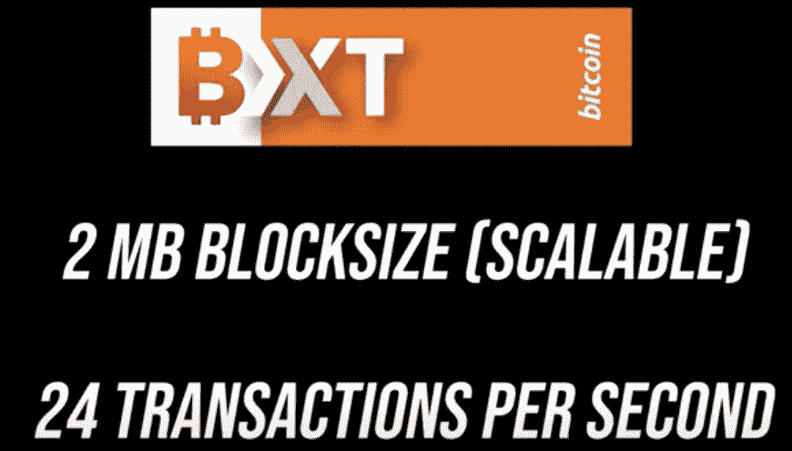
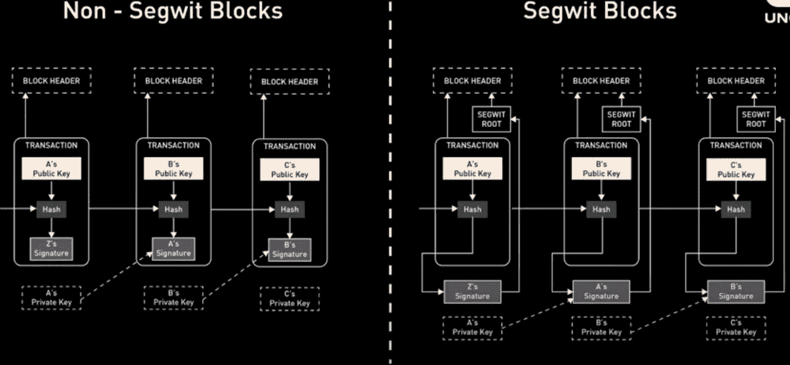
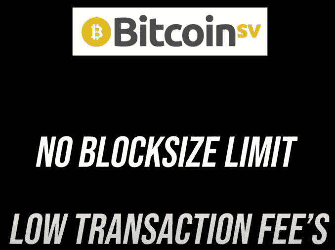

# 比特币的块大小战争:价值储存还是交换媒介？

> 原文：<https://medium.com/coinmonks/bitcoins-blocksize-wars-store-of-value-or-medium-of-exchange-93cbcf716efe?source=collection_archive---------7----------------------->

Photo by [Bermix Studio](https://unsplash.com/@bermixstudio?utm_source=medium&utm_medium=referral) on [Unsplash](https://unsplash.com?utm_source=medium&utm_medium=referral)

2008 年 8 月 18 日，域名*bitcoin.org*被注册。这，据大家所知，是‘比特币’这个词的首次公开亮相。2008 年 10 月 31 日，[发表了一份白皮书](http://www.metzdowd.com/pipermail/cryptography/2008-October/014810.html)

在这本[白皮书](https://bitcoin.org/bitcoin.pdf)中，中本聪为不可变分布式公共账本(区块链)奠定了基础，解决了当时臭名昭著的[重复支出问题](https://www.investopedia.com/terms/d/doublespending.asp)。我们不会在这里深入细枝末节，因为这不是本文的目的，但基本的争论是这样的:鉴于加密货币算法记录交易需要一些处理时间，如何阻止一个聪明的坏人两次使用同一个加密？

# 什么是积木？

> 区块是一批批交易，这些交易被确认并随后在比特币的公共账本区块链上共享。

区块规模战争的起源始于 2015 年。更大的区块大小将意味着比特币能够在区块链上每秒存储和记录更多的交易。

这将使比特币能够与维萨、万事达和贝宝等法定货币支付处理器竞争。

这项新提案在 BTC 社区引发了一场内战。最简单的冲突集中在一个看似相对偶然的技术特征上:*比特币区块应该有多大？但事实证明，这种明显的技术讨论是对治理、政治控制和协议本质等更深层问题的代理。*

比特币是什么？应该是什么？应该如何发展？应该如何改变？最终，这场争论从 2015 年一直激烈到 2019 年左右。数亿或数十亿美元被用来对抗它。

主要担心的是，提高数据块大小限制将意味着更少的完整节点，因为涉及的数据存储成本会增加，这可能会阻止用户操作完整节点，并将系统集中在能够处理更大数据块的实体周围。一些反对更大区块的人说，这将违背比特币分布式、抗审查的本质。

因为块包含所有事务记录，所以块的大小会影响性能。Satoshi 设置了 1MB 的限制，因为他不希望有人设置较高的块大小来阻塞系统。随着越来越多的用户上网，支付时间越来越长，费用也越来越高。今天，每秒 7 次交易。PYPL 做 15 和签证 2000。

本质上，“小拦截者”将 BTC 视为一种价值储存手段——缓慢而安全。反垄断，以避免大公司控制可以支持高交易率的大型区块的开采。“大阻挡者”将 BTC 视为一种现金，要求更高的交易率和优先的效率。

## 增加区块大小的建议:

1.  第一次 BTC 拆分— **比特币 XT**

Gavin Anderson 和 Mike Hearn 制定并提出了 2MB 的块大小，可以支持 24 个事务/秒。遭到小拦截者的强烈反对。这些新的 XT 节点受到了 DDOS 攻击。

2. **Segwit** 又名 Segregated witness，于 2017 年激活，通过删除加密签名仅保留接收者和发送者信息，以更高效的方式存储交易数据。这为在块上存储交易提供了更大的空间。

3.**比特币现金**:2017 年 8 月，对赛格威不满意的硬分叉人创造了 BCH。这些新的 BCH 支持者认为这是比特币项目作为点对点电子现金的合法延续。分叉时的所有比特币持有者(块 478，558)自动成为比特币现金的所有者。由笔名 [Satoshi Nakomoto](https://coinmarketcap.com/alexandria/article/who-is-satoshi-nakamoto) 发明的比特币仍然是一种独立的加密货币。

截至 2020 年 11 月，比特币现金的块大小为 32MB。

4.2018 年，Craig S. Wright 博士创立了**比特币 SV (Satoshi Vision)** ，他坚信 BTC 是一种货币形式。它目前已经达到了 638 MB 的块大小，并且可以支持> 2k 事务/秒。单一实体，Coingeek 控制>矿区 52%的区块。这可能导致操纵，导致 SV 协议投降。

## 然而，BTC 的权力有多分散？

Blockstream 成立于 2014 年，旨在构建基于比特币的金融基础设施和应用。 [Blockstream](https://blockstream.com/about/) 的初衷是释放 BTC 网络的压力，在侧链上单独执行事务，以提高可扩展性。这是通过向企业出售侧链，收取固定的月费和交易费来实现的。这种中间人式的参与在 BTC 社区受到质疑。Blockstream 在保持盈利组织的同时让 BTC 保持缓慢的兴趣是值得怀疑的。批评者声称，区块流可能对比特币的去中心化性质构成威胁，而其他人则认为这是必要的，因为它为 T2 的比特币开发者提供了资金来源。

理由是 1MB 的块大小是有意保留的。考虑到高昂的费用和漫长的等待，他们的解决方案是闪电枢纽又名银行业。他们从安盛保险公司获得了 5500 万美元的保险，这是一家对他们的叙述没有帮助的保险公司。

# 结论:

最终，如果我们将 BTC 白皮书中的*现金*一词替换为*黄金*，就能明白为什么区块大小战争没有导致比特币协议的改变。

增加比特币的区块大小，将违背比特币的根本本质，因为它违反了共识算法的最重要原则，即要求比特币通过去中心化的网络架构传输无债务价值。

## 这将我们带到哪里去解决扩展问题呢？

> 翻转。

[翻转](https://www.blockchaincenter.net/flippening/)指的是未来以太坊(ETH)超越比特币成为市值最高的加密货币可能发生的事件。我个人认为，**在后菲亚特时代，ETH 有潜力成为“互联网”,它让个人和组织能够通过解决现实世界的问题来提供价值，而 BTC 仍然是像黄金一样的原始价值储存手段——通缩对冲。**随着卡尔达诺、索拉纳、波尔卡多特等 ETH 杀手在 2021 年牛市中经历上涨，这种逆转是延迟的，尽管是不可避免的。

参考资料:

 [## 比特币的历史

### 从 2008 年卑微的开端到 2017 年的价格峰值，比特币已经让投资者和世界受益匪浅。在…

money.usnews.com](https://money.usnews.com/investing/articles/the-history-of-bitcoin) 

## 另外，阅读

 [## 最佳免费加密交易机器人——前 16 名比特币交易机器人[2021]

### 2021 年币安、比特币基地、库币和其他密码交易所的最佳密码交易机器人。四进制，位间隙…

medium.com](/coinmonks/crypto-trading-bot-c2ffce8acb2a)  [## 最佳 6 个加密交易信号电报通道

### 这是乏味的找到正确的加密交易信号提供商。因此，在本文中，我们将讨论最好的…

medium.com](/coinmonks/best-crypto-signals-telegram-5785cdbc4b2b)  [## BlockFi 评论 2021 —通过您的加密获得 8.6%的利率

### 让你的密码发挥作用，获得比特币和其他加密货币的最佳利率

medium.com](/coinmonks/blockfi-review-53096053c097) 

> 加入 [Coinmonks 电报频道](https://t.me/coincodecap)，了解加密交易和投资

## 另外，阅读

*   [币安费用](/coinmonks/binance-fees-8588ec17965) | [Botcrypto 审核](/coinmonks/botcrypto-review-2021-build-your-own-trading-bot-coincodecap-6b8332d736c7) | [Hotbit 审核](/coinmonks/hotbit-review-cd5bec41dafb) | [KuCoin 审核](https://blog.coincodecap.com/kucoin-review)
*   [我的加密副本交易经历](/coinmonks/my-experience-with-crypto-copy-trading-d6feb2ce3ac5) | [AAX 交易所评论](/coinmonks/aax-exchange-review-2021-67c5ea09330c)
*   [Bybit 融资融券交易](/coinmonks/bybit-margin-trading-e5071676244e) | [币安融资融券交易](/coinmonks/binance-margin-trading-c9eb5e9d2116) | [Overbit 审核](/coinmonks/overbit-review-9446ed4f2188)
*   [加密货币储蓄账户](/coinmonks/cryptocurrency-savings-accounts-be3bc0feffbf) | [YoBit 审查](/coinmonks/yobit-review-175464162c62) | [Bitbns 审查](/coinmonks/bitbns-review-38256a07e161)
*   [Botsfolio vs nap bots vs Mudrex](/coinmonks/botsfolio-vs-napbots-vs-mudrex-c81344970c02)|[gate . io 交流回顾](/coinmonks/gate-io-exchange-review-61bf87b7078f)
*   [Godex.io 评审](/coinmonks/godex-io-review-7366086519fb) | [邀请评审](/coinmonks/invity-review-70f3030c0502) | [BitForex 评审](/coinmonks/bitforex-review-c4bb28d9e271) | [北海巨妖评审](/coinmonks/kraken-review-6165fc1056ac)
*   [最佳比特币保证金交易](/coinmonks/bitcoin-margin-trading-exchange-bcbfcbf7b8e3) | [萝莉点评](/coinmonks/lolli-review-e6ddc7895ad8) | [比特币保证金交易](https://blog.coincodecap.com/bityard-margin-trading)
*   [创造并出售你的第一个 NFT](https://blog.coincodecap.com/create-nft) | [本地比特币评论](/coinmonks/localbitcoins-review-6cc001c6ed56) | [Prokey 评论](/coinmonks/prokey-review-26611173c13c)
*   [加密保证金交易交易所](/coinmonks/crypto-margin-trading-exchanges-428b1f7ad108) | [赚取比特币](/coinmonks/earn-bitcoin-6e8bd3c592d9) | [Mudrex 投资](https://blog.coincodecap.com/mudrex-invest-review-the-best-way-to-invest-in-crypto)
*   [WazirX vs CoinDCX vs bit bns](/coinmonks/wazirx-vs-coindcx-vs-bitbns-149f4f19a2f1)|[block fi vs coin loan vs Nexo](/coinmonks/blockfi-vs-coinloan-vs-nexo-cb624635230d)
*   [杠杆代币](/coinmonks/leveraged-token-3f5257808b22) | [最佳密码交易所](/coinmonks/crypto-exchange-dd2f9d6f3769) | [Paxful 点评](/coinmonks/paxful-review-4daf2354ab70)
*   [加密套利](/coinmonks/crypto-arbitrage-guide-how-to-make-money-as-a-beginner-62bfe5c868f6)指南| [如何做空比特币](/coinmonks/how-to-short-bitcoin-568a2d0b4ae5) | [1xBit 回顾](https://blog.coincodecap.com/1xbit-review)
*   [如何在印度购买以太坊？](https://blog.coincodecap.com/buy-ethereum-in-india) | [如何在币安购买比特币](https://blog.coincodecap.com/buy-bitcoin-binance)
*   [在美国如何使用 BitMEX？](https://blog.coincodecap.com/use-bitmex-in-usa) | [BitMEX 评论](https://blog.coincodecap.com/bitmex-review) | [期货交易机器人](/coinmonks/futures-trading-bots-5a282ccee3f5)
*   [最佳加密交易信号电报](/coinmonks/best-crypto-signals-telegram-5785cdbc4b2b) | [MoonXBT 评论](/coinmonks/moonxbt-review-6e4ab26d037)
*   [OKEx 评论](/coinmonks/okex-review-6b369304110f) | [Coinswitch 俱吠罗评论](/coinmonks/coinswitch-kuber-review-1a8dc5c7a739) | [比特币基地收费](/coinmonks/coinbase-fees-831e77d4f2c5)