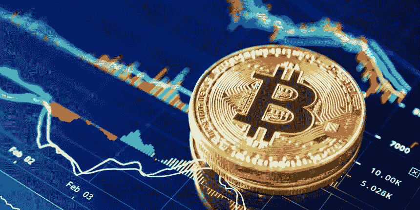
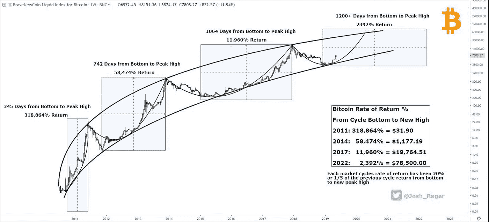
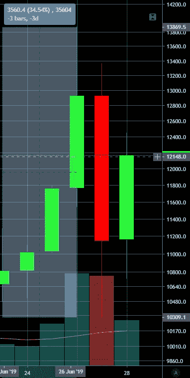
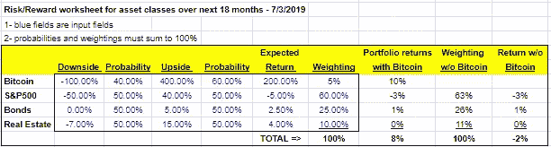
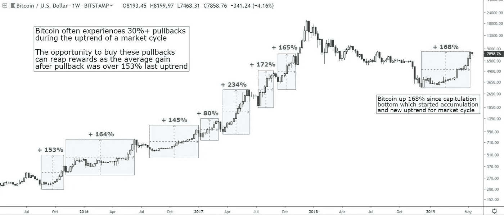

# 比特币已经从底部反弹了 250%，现在买还来得及吗？

> 原文：<https://medium.com/coinmonks/bitcoins-bounced-250-off-the-bottom-is-it-too-late-to-buy-it-here-4be9f273ada4?source=collection_archive---------0----------------------->

我在去年 11 月开始关注比特币，4 月 2 日,和[称之为底部，随后比特币开始狂飙，在 6 月 26 日达到 14K 美元的本地峰值。它从那个峰值回落到今天的 1.1 万美元范围，但仍然比 3K 底部高出 250%。这个大动作回避了问题，现在买比特币还来得及吗？](/coinmonks/btc-the-bottom-is-in-and-fundamentals-are-looking-up-2ad04e9265c3)

我不能告诉你该怎么做，因为我不知道你的个人财务状况和复杂程度，但我会分享我做出购买比特币决定的决策过程。我将介绍我评估的一些因素，比如我对比特币与其他潜在投资的预期回报，我对基本面和技术面现状的看法，以及什么是有吸引力的入门水平。

**每一项投资都应该根据其预期风险/回报(RR)进行评估，并与所有可用的投资进行比较。**我们对 RR 的估计当然是主观的，但我们会做出一些保守的假设。比特币非常不稳定，在短期和长期周期中上下波动。没有巨大的风险/波动，你就不会有巨大的回报。比特币每年都会存活下来，网络变得更大，比特币变得更强大。@josh_rager 在 Twitter 上发布了这个奇妙的日志图表，它清楚地显示了这些长期周期(3 个完整的周期，我们在第 4 个周期)以及之前每个周期的相关回报。我们可以看到，周期从 245 天持续到 1200 天——趋势似乎是它们越来越长。然而，每个周期的回报从 319K%(是的，一千)压缩到 12K%。外推这条曲线，我们可以在 2019 年初比特币的$3K 底部 1200 天内获得 2400%的回报。它不太可能完全以这种方式结束，但我倾向于认为长期趋势将会结束，尽管会有一个平坦的周期。

Bitcoin Cycle Returns from Bottom to New High from [Josh Rager](https://medium.com/u/6a14cd9fd6e?source=post_page-----4be9f273ada4--------------------------------)

如果我们简单地推断比特币自 2011 年以来的上升轨迹的对数标度趋势线，那么到 2020 年底，比特币的价格将达到 58K 美元。这相当于 18 个月的回报率约为 400%。当然，正如我提到的，图表暗示周期正在延长，但我将使用 18 个月的 400%回报率来保守地计算我们的 RR。

我们已经研究了潜在的好处，那么坏处呢？我们已经讨论了什么是正确的，现在让我们来解决什么是错误的。比特币最糟糕的情况可能是重大的监管打击、金融市场崩溃、大规模黑客攻击或某种严重影响比特币价格的软件漏洞。我会将这些因素归类为需求冲击，我将逐一讨论，但尽管它们可能导致价格大幅下跌，但这些因素将是暂时的，比特币将会复苏。当然，基本面背景可能会改变(央行收紧？)或者一种技术上更先进的硬币可能会取代比特币，在这种情况下，比特币可能会归零，但我认为这不会很快发生。

**让我们快速浏览一下这些风险因素，从监管环境的变化开始。**我认为在美国或全球范围内进行重大监管打击是不太可能的——首先监管者现在应该已经这么做了，这让我想到了我的第二点——这会伤害太多的投资者，而监管者的工作是保护投资者。美国监管机构已经关闭了一些较小的交易所，最近他们似乎威胁世界上最大的加密交易所币安开设一家美国子公司，以满足拥有适当 KYC/反洗钱的美国客户。我希望看到更多对可疑交易所和 ico 的监管，但目前我没有看到大规模的打击。我相信监管机构正专注于改善 KYC 和反洗钱条款，我认为这正是他们应该做的。一些城市和国家(主要在欧洲)正在拥抱加密货币生态系统。此外，在美国成立的公司，如脸书、富达、eTrade、CME、TD Ameritrade 和 ICE Exchange 等等。我认为监管机构能阻止脸书的加密货币 Libra 吗？当然，他们可以，这将是短期的负面影响，但我不认为这将偏离比特币的长期路线。

Mt Gox 量级的重大黑客攻击。Mt Gox hack 如此重要的原因是当时世界上只有一个密码交易所。如今，有数百家交易所和老牌公司进入这个领域，如 ICE、Bakkt、e-Trade、CME 和 TD Ameritrade。我们看到最大的密码交易所，币安，最近在最小的破坏下被黑客攻击。请记住，比特币非常稳健，从未被黑客攻击过。当比特币被盗时，受到黑客攻击的是交易所、钱包和手机。打个比方，银行被传统的银行劫匪黑了或者抢了。我的网上银行网站最近似乎经常宕机，所以当我看到摩根大通首席执行官杰米·戴蒙所说的“网络风险可能是金融系统面临的最大风险”时，我并不感到惊讶。我相信传统银行正受到黑客的围攻，许多盗窃事件没有被报道。我不是说你银行里的钱现在有风险，但问题越来越严重了。回到我的观点，银行被抢不会降低我们对美元的信心，那么为什么会降低我们对比特币的信心呢？尤其是比特币本身从来没有被黑过。

**发现重大软件漏洞或比特币网络崩溃。**这与上一段关于黑客攻击的内容密切相关，因为通常是某种软件缺陷导致了黑客攻击。比特币是开源的，人们已经尝试破解它 10 年了，但没有成功。如果有一个致命的软件错误，网络崩溃或出错，我相信区块链将被回滚。全球停电可能会导致网络崩溃，但这种事情什么时候发生过？

**比特币是一种风险资产，因此金融市场崩溃将产生重大影响。本世纪以来的宽松货币政策可以用一句老话来形容，水涨船高。当我们遭遇金融市场崩溃时——我们会的——我们会发现谁在裸泳。我们正处于美国历史上持续时间最长的扩张期，我开始注意到知名投资者、官僚和高管的评论，他们说“这一次不同了”，我们已经找到了无止境经济扩张的神奇公式。我 100%确定金融市场会崩溃，比特币也会受到影响。对比特币的影响程度部分取决于发生这种情况时使用了多少杠杆。从我过去看到的情况来看，比特币往往比股票下跌得少一点，而且恢复得更快，但比特币还太年轻，没有在股市崩盘中经受过考验。**

June 27, 2019 - $BTC 1D 35% Drop

**比特币没有内在价值或估值支撑，它可以归零。**没有内在价值——资产或现金流——来支撑价格。即使在最糟糕的情况下，如果比特币确实归零，也不意味着你必须一直持有它归零。我不是说你应该在你的比特币投资上设置严格的止损，而是建议你在当前价格的基础上，随着时间的推移，止损 40%+ 。我不建议急停的原因是，比特币价格经常会在 30-40%的范围内大幅回调。许多这类提款是由“鲸鱼”或操纵者发起的，他们将止损作为一种交易策略。他们查看各交易所的订单簿，结合历史上交易的分组情况，预测止损最多的分组情况，然后在交易清淡的时候放弃大的市场订单。最近，在 6 月 27 日，我们看到一天之内从波峰到波谷的回调接近 35%(见上图)。价格在 6 月 26 日达到 13900 美元的峰值，第二天跌到 10300 美元，所以如果你在这个区间的任何地方止损，它都会被触发。当然，如果发生这种情况，也可能引发纳税义务。

根据我的保守假设，比特币具有极端不对称的正风险/回报，这在当今的有效市场中很难找到。对于那些看过或读过“大空头”的人来说，2008 年的信用违约互换也有类似的不对称 RR 曲线。对于比特币的风险回报计算，保守地说，我将假设下跌 100%，你失去全部投资，以及在未来一年半内上涨 400%的基本情况。现在我们需要阻碍这些发生的概率来获得我们的预期回报。这也是非常主观的，但我认为这比乐观的情况要好。我认为是 80:20，但让我们保守一点，假设是 60:40。保守地说，这给了我们 18 个月内比特币的概率调整后预期回报率为 200%。但是不要把你一生的积蓄都投入其中，因为这是一个“预期”，而不是一个有保证的回报率。拥有单一资产没有分散投资的好处，而且下行的情况，仍然有相当高的可能性实现，可能会削弱你的投资组合！

现在我们已经有了比特币的 RR，让我们从股票开始算出替代货币的 RR。我们正处于美国历史上持续时间最长的扩张期，最近几十年的特点是资产泡沫，这给了我们 10 年左右的良好回报，随后是一场大崩盘。如今金融市场的傲慢和过度开始让我想起 2000 年互联网泡沫破裂时，我在雷曼兄弟(Lehman Brothers)工作，负责半导体和计算机硬件股票。2008 年的大衰退是由抵押贷款的过度风险造成的，当抵押贷款出现问题时，几乎拖垮了整个金融体系。虽然股票在 2008 年损失了 50%以上的价值，但我没有看到 2000 年股市科技股泡沫时的过度和傲慢。今天的泡沫是债务驱动的，“一切泡沫”，由极度宽松的货币政策和货币战争驱动。雷伊·达里奥在他的新书[大债务危机](https://www.bridgewater.com/big-debt-crises/)中警告说，我们正处于一个长达 75 年的债务超级周期的末期，这个周期有可能导致我们陷入萧条。在这个问题上，我会尊重达利奥先生，他是最大和最成功的对冲基金之一(这是一个宏观对冲基金，所以这是他们的专长)的创始人和联席首席信息官，而不是任何政治家、首席执行官或经济学家。今天，就像 2000 年一样，市值巨大的无利可图的公司横行无忌——优步的市值为 780 亿美元，上个季度损失了超过 1B 美元。息税折旧及摊销前利润(EBITDA)和价格销售比(price to sales ratios)以及其他“创造性”估值指标再次受到欢迎——千禧一代的宠儿 Beyond Meat 以 100 倍的销售额进行交易。软银 1000 亿美元的愿景基金一次投资数亿美元，几乎没有尽职调查——他们刚刚在一个遛狗应用程序上投资了 3 亿美元。目前，Russel 2000 公司中有 21%亏损，而其中 22%是无力偿还债务的“僵尸”公司，这意味着他们 12 个月的后续利息支出超过了过去三年的 EBIT 平均水平。也就是说，很难预测这个泡沫什么时候会破裂，通常泡沫的尾端会有最极端的价格升值。因此，我认为 18 个月内有 50%的机会获得 40%的回报，而股票有 50%的机会下跌 50%。这使得股票的概率调整预期回报率为-3%。现在，你不要认为我是一个长期看跌股票的人，如果你问我，在这个周期的早期，比如说 2010 年，我认为股票的 RR 是多少，我会说 30%的机会有-3%的回报，70%的机会有+17%的回报，预期回报率为+11%。值得注意的是，即使股票在 2019 年和 2020 年上涨，这种情况也很可能只会发生在**因为持续的超宽松货币政策。这种超宽松的货币政策也是比特币的基本驱动力，因此比特币可能会比股票升值更多。**

我在下面的工作表中总结了我对各种资产类别和未来 18 个月潜在回报率的看法。正如你所看到的，在 18 个月的时间里，只需将 5%的份额分配给比特币，就可以将回报率从-2%提高到+8%。但是不要相信我的话，如果你不同意我的任何假设(我肯定很多人不认为股票会下跌 50%)，这里有一个[链接](https://docs.google.com/spreadsheets/d/134SfwqJeiQ3soOvlWmqtBe6rbByaZyWwr_qXGjteWyA/edit?usp=sharing)到工作表，所以请随意输入你自己的假设。

作为比特币的主要基本面驱动因素，全球央行的一致宽松政策依然存在。克里斯蒂娜·拉加德刚刚被任命为下一任欧洲央行行长。从她的评论中，我们知道她支持加密货币和负利率政策(NIRP)。最近一次美联储会议发表了温和的评论，预计这个“有史以来最强的经济体”本月将降息 25 个基点。特朗普的两位最新美联储提名人都持有鸽派观点。美联储已经把自己逼到了一个角落——消费者和企业现在都沉迷于低利率。通过进一步降息，美联储知道他们正在鼓励更多的冒险和我们经济的持续僵尸化。目前的不平等程度如此之高，以至于绝大多数财政或货币刺激措施都不会刺激更广泛的经济，而是立即被富人获得并投资于股票。此外，要说这些上市公司中的大多数(当然僵尸除外)不需要资本或股价的进一步上涨。他们需要的是买得起他们产品和服务的顾客。各国央行被迫不断降息和增加赤字支出，一美元比一美元有效，直到以一场没有人能够预见的壮观崩盘告终。

**我在什么级别买比特币？这是一个价值百万美元的问题，因为选择你的参赛作品可能具有挑战性。理想的情况是，你想在一个相当强的支撑位上方买入，然后祈祷这个支撑位能够保持住。此外，请记住，比特币在历史上总是给我们带来 30-40%的大幅回调，这往往是很好的进场点(见下图)。这是一个非常好的平衡，将你的买入订单放在阻力附近 30-40%的位置，然后在阻力的另一边止损。但是请确保你的止损点离阻力足够远，不会被灯芯碰到。我们最近经历了一次大的回调，比特币从 14K 美元跌至 9.6K 美元。现在，我们位于 11K 美元左右的微弱阻力带上方。**

Bitcoin pullbacks from last bull cycle —courtesy of [Josh Rager](https://medium.com/u/6a14cd9fd6e?source=post_page-----4be9f273ada4--------------------------------)

我何时/何地销售？我不相信往返投资，但我也不相信过度交易比特币这样的工具。我和几个在 2017 年牛市期间成为全职比特币交易员的人聊过，他们后悔在短期交易上投入了这么多时间。他们似乎认为，通过买入并持有，他们可以做得一样好，或者接近那样。这就是 HODL 咒语的由来，别想多了，就 HODL。卖出的时机将是当我们已经有了抛物线式的增长，杠杆和融资利率很高(把这个留给我)，每个人，包括你的妈妈、爸爸和优步司机都拥有比特币的时候。还记得 2017 年 12 月吗？比特币是每个节日派对的话题(很像 2008 年的房地产)，此外，美国消费者新闻与商业频道还有一个永久的比特币交易平台。我们离那个阶段还很远；在我看来，本轮牛市的第一局更多是由鲸鱼和家族理财室推动的。我认为，机构正在做他们的研究和尽职调查，很快就会成为资金来源，零售将 FOMO 在 2 万美元左右。今天，我只是没有很多人突然问我 crypto 发生了什么，这是一个好迹象。

**总之，我们正处于比特币第四轮牛市的早期阶段。我认为这个周期可能会持续 2-4 年，回报率在 400-2200%之间。基于这种相对于其他资产类别的预期回报，我相信大多数人应该考虑将投资组合的一小部分配置到比特币。小心进场并止损，准备好 30-40%的大幅回调作为买入机会，最重要的是，不要过度交易，只做 HODL！**

在 Twitter 上关注我，获取更多更新 [@jonphorvath](https://twitter.com/jonphorvath) 。

> [直接在您的收件箱中获得最佳软件交易](https://coincodecap.com/?utm_source=coinmonks)

