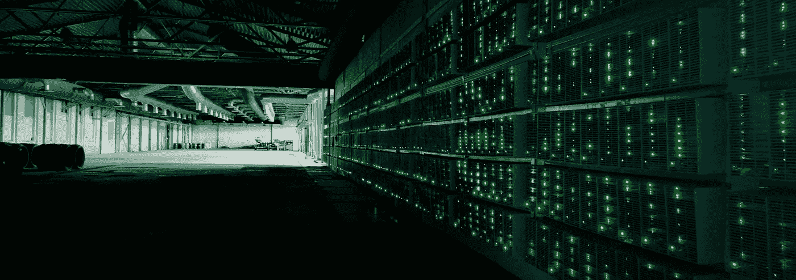

# 比特币的生产成本——比特币估值模型

> 原文：<https://medium.com/coinmonks/bitcoins-cost-of-production-a-valuation-approach-for-bitcoin-dcd76951040a?source=collection_archive---------0----------------------->

比特币自诞生以来，对大多数人来说一直是个谜。是注定破灭为零的投机泡沫，还是未来的货币？或许可以提出一个论点来支持将它视为一种商品？如何证明它的价格，更重要的是它的价格行为？跨平台的技术分析师，如 TradingView、Twitter 或 Telegram 等，在以下方面存在分歧…