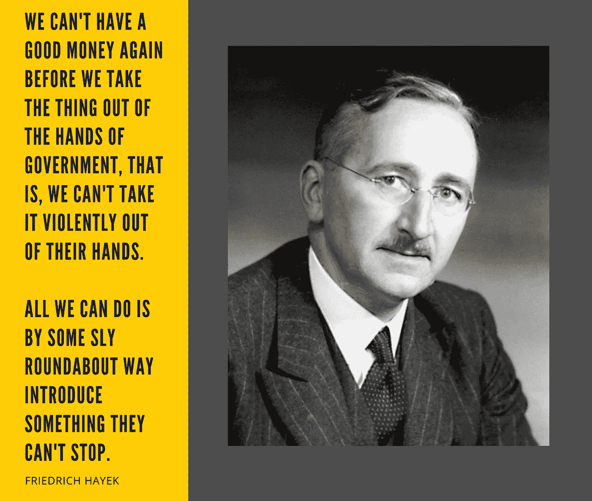
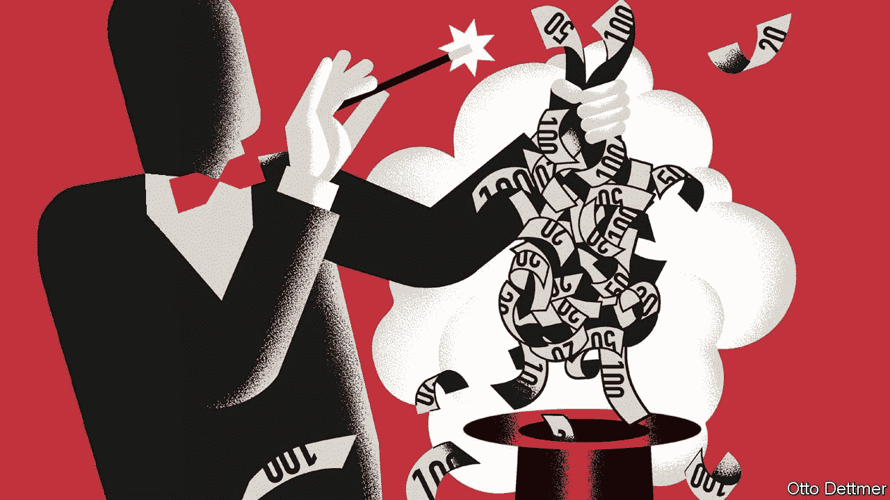
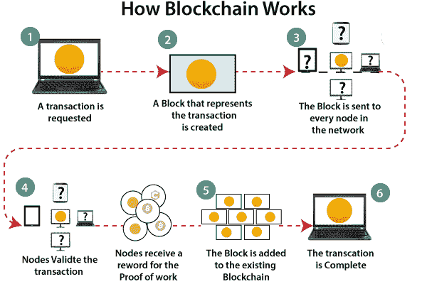
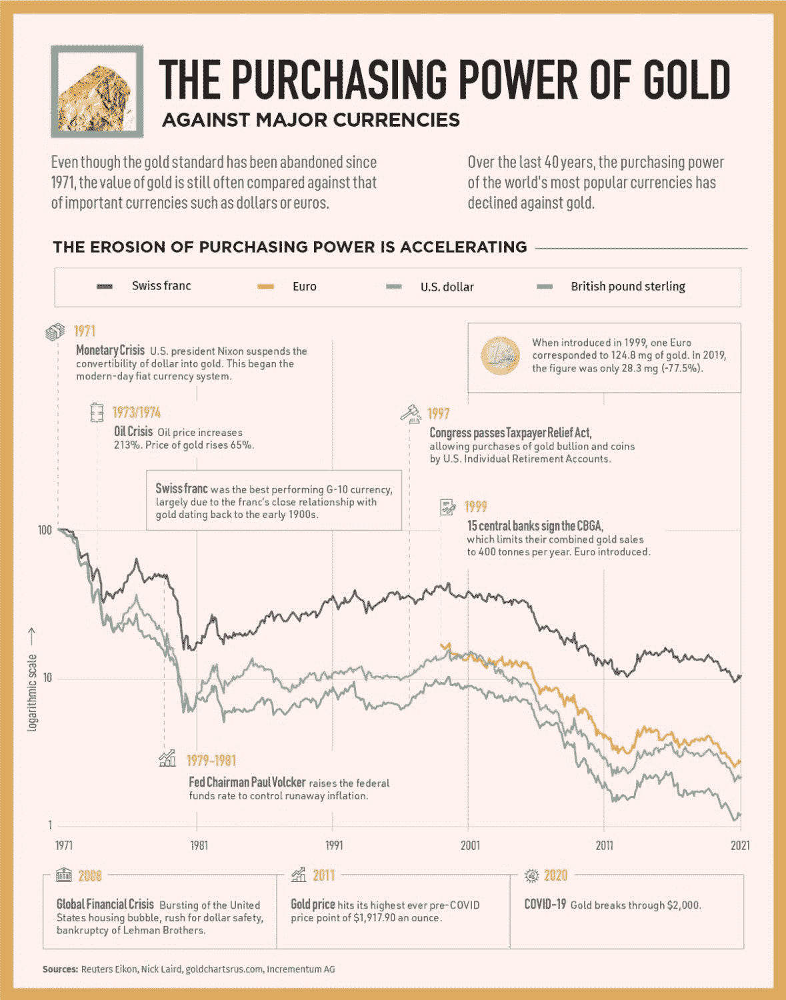

# 现代货币理论，奥地利经济学派&比特币

> 原文：<https://medium.com/coinmonks/bitcoins-creation-was-always-a-matter-of-time-81184f75e02?source=collection_archive---------8----------------------->

Source: commons.wikimedia.org — dick clark mises

## 现代货币理论

过去十年，全球金融体系一直处于重症监护之中，近零利率和通过印钞机提供生命支持的重大资产价格操纵。复苏是不稳定的，鉴于这些事实，相信全球货币秩序存在结构性缺陷更为公平。这就是“现代货币理论”(MMT)，它从默默无闻中脱颖而出。

MMT 认为，一个主权国家自己赚钱，就不会受到财政限制的约束。尽管这是不可否认的事实，但 MMT 的观点是基于这样一种观念，即政府可以也应该随心所欲地支出。价格上涨是唯一的限制。MMT 的支持者认为，通过实施稳健的就业政策，政府可以实现充分就业，避免就业和价格之间的短期权衡，并将自然就业率提高到接近充分就业。

Source: The Economist — Otto Dettmer

根据现代货币理论，发行本国货币的主权国家政府不依赖税收来为其支出提供资金。货币是国家产品，由于政府支出而流通。毫无疑问，法定货币发行者不会破产，因为不需要税收来支付预算。

那么，既然政府不能破产或资不抵债，为什么还需要收税呢？简而言之，答案是否定的。

## 政府不需要你的税收。这是“控制”的一种形式。

美国著名经济学家、对冲基金经理和政治家沃伦·莫斯勒(Warren Mosler)在其著作《七大致命无辜欺诈》(The Seven Deadly Innocent Frauds)中考察了税收及其在政府偿付能力中的真实作用，称之为“致命无辜欺诈”。

> ***致命无辜诈骗#1:*** *联邦政府为了支出，必须通过税收或借贷来筹集资金。换句话说，政府支出受到其征税或借贷能力的限制。*
> 
> 事实:联邦政府支出在任何情况下都不会受到收入的限制，这意味着不存在“偿付风险”换句话说，联邦政府总是可以用自己的货币支付所有款项，不管赤字有多大，或者税收有多少。

政府向我们征税有一个很好的理由。税收在经济中产生对美元的持续需求，因此个人需要出售他们的商品、服务和劳动来赚取美元。在税收义务到位的情况下，政府可能会用本来毫无价值的钱购买商品，因为有人需要美元来纳税，就像对儿童征收的优惠券税创造了对优惠券的持续需求，这些优惠券可以通过为父母做家务来获得。

## “货币非国有化”

Source: commons.wikimedia.org — dick clark mises

诺贝尔经济学奖获得者弗里德里希·哈耶克(Friedrich Hayek)在其 1976 年的著作《货币的非国有化》(The Denationalization of Money)中指出，必须消除政府对货币的垄断，以结束在过去一个世纪中变得更加明显的反复出现的高通胀。

在他的书中，他写了大量关于“私人货币”的内容，以及货币如何不同于法律、语言或道德，不一定要由政府“制造”成法定货币。相反，他谈到了“四大缺陷”——通胀、不稳定、无纪律的政府支出和经济民族主义——它们有着共同的原因和共同的解决办法:用私人发行者提供的货币竞争取代政府对货币的垄断，私人发行者为了保持公众信心，将限制发行的纸张数量，从而保持其价值。

尽管在过去的 100 年里，包括 1929 年、1937 年、1973 年、1987 年、1991 年、1997 年和 2000 年，发生过多次经济和市场崩溃，但大多数人无疑会联想到最近的重大事件。

## 2008 年金融危机

Source: commons.wikimedia.org — gary dee

西方领导人对自由市场的解释受到了米尔顿·弗里德曼(Milton Friedman)等知识分子的影响。弗里德曼认为，如果事情出了问题，他们可以介入，修改制度，让事情回到正轨。然而，奥地利经济学派，特别是哈耶克的世界观，声称正是这种傲慢扭曲了市场经济的愿景，导致了 2008 年的经济灾难。要理解政府而非市场是如何制造了这场危机，我们必须回到危机爆发前的几年。

2001 年 1 月，美联储降低了利率，因为它“担心”美国经济正在衰退。他们降低利率的原因和央行通常做的一样:让企业和消费者更容易借贷和投资。美联储大幅降息的决定被视为埋下了金融灾难的种子。事实上，实际上政府对市场的每一次干预，如救助破产企业、实施贸易限制或操纵利率，都有造成长期经济损害的风险。

在 2001 年后的几年里，美联储继续大幅降息，这导致了一场无法持续的房地产繁荣，2007 年初，美国房地产泡沫破裂，全球金融危机开始。

Source: commons.wikimedia.org — respres

事实上，美联储根本不应该决定利率。这种对国家在市场监管中的作用的根本否认，使哈耶克与其他自由市场理论家有所不同，因为他认为，如果政府不干涉市场，市场会在自我监管方面做得更好。

当政府固定利率时，这是一种价格固定，类似于苏联固定食品价格的方式。决定利率的应该是市场，而不是政府。

最后一个问题是，在没有重大市场参与者腐败和操纵的可能性的情况下，市场将如何“设定”利率或自我监管？

## 区块链和加密货币

以数字货币为动力、以区块链为基础的去中心化金融(DeFi)是一个古老难题的答案，即市场如何在没有市场操纵或腐败可能性的情况下进行自我监管。

先说比特币的发明，发生在 2008 年。2008 年金融危机后，一个被称为“中本聪”的神秘个人或个人团体发表了一份开创性的白皮书，提出了一个简单的点对点电子支付系统，最终成为比特币。支撑比特币的胚胎区块链技术自问世以来的十年里，一直被誉为具有与印刷机或互联网一样的激进潜力，尤其是对老牌银行业构成了重大挑战。

Source: shishirkant.com

简单来说，区块链是一个数字分布、去中心化的公共账本，存在于一个广泛的网络中。通过使用加密技术，区块链保证了数据记录的保真度和安全性，并且无需可信的第三方就能产生信任。这个概念并不新鲜；密码学家和计算机科学家 Stuart Haber 和 Scott Stornetta 在 1991 年将它作为一个研究项目提出。

在比特币之后的几年里，区块链的使用激增，出现了大量加密货币、不可替代的代币、智能合约，当然还有去中心化金融。

建立在足够分散和安全的区块链基础上的分散金融为市场提供了一种完全自我监管的手段。例如，利率会根据供求关系自动调整，并在 DeFi 应用程序中使用数学算法来确定。

我们可以确信该系统是透明和真实的，因为任何时候都可以在区块链上获得所有信息，包括交易量、未偿贷款和总债务，并且其中任何一项都不能被修改或操纵。基于这些理由，从来不需要政府干预。

## 摘要

现代货币理论支持者声称主权国家可以随心所欲地创造尽可能多的法定货币，这是正确的，但这并没有否定稀缺定律。货币的价值随着它变得不那么稀缺而减少，即使它仍然是国家接受的作为纳税形式的唯一货币。请想一想:自 18 世纪以来存在的 750 种货币中，只有大约 20%幸存下来，所有幸存的货币都已经贬值。考虑下面的图表。

Source: elements.visualcapitalist.com

本质上，黄金的价值并没有增加；相反，它周围的一切都在贬值。比特币也是如此。

那么，问题来了，现有的制度真的管用吗？

*免责声明:本文包含的信息仅用于教育目的，并不构成 Wheatstones 的任何形式的建议或推荐，用户在做出(或避免做出)任何投资决定时也不打算依赖这些信息。*

> 加入 Coinmonks [电报频道](https://t.me/coincodecap)和 [Youtube 频道](https://www.youtube.com/c/coinmonks/videos)了解加密交易和投资

## 另外，阅读

*   [如何购买 Monero](https://blog.coincodecap.com/buy-monero) | [IDEX 评论](https://blog.coincodecap.com/idex-review) | [BitKan 交易机器人](https://blog.coincodecap.com/bitkan-trading-bot)
*   [如何在 Bitbns 上购买柴犬(SHIB)币？](https://blog.coincodecap.com/buy-shiba-bitbns) | [印度币安](https://blog.coincodecap.com/binance-in-india)
*   [币安 vs 比特邮票](https://blog.coincodecap.com/binance-vs-bitstamp) | [比特熊猫 vs 比特币基地 vs Coinsbit](https://blog.coincodecap.com/bitpanda-coinbase-coinsbit)
*   [如何购买 Ripple (XRP)](https://blog.coincodecap.com/buy-ripple-india) | [非洲最好的加密交易所](https://blog.coincodecap.com/crypto-exchange-africa)
*   [非洲最佳加密交易所](https://blog.coincodecap.com/crypto-exchange-africa) | [晤交易所评论](https://blog.coincodecap.com/hoo-exchange-review)
*   [eToro vs robin hood](https://blog.coincodecap.com/etoro-robinhood)|[MoonXBT vs by bit vs Bityard](https://blog.coincodecap.com/bybit-bityard-moonxbt)
*   [Stormgain 回顾](https://blog.coincodecap.com/stormgain-review) | [Bexplus 回顾](https://blog.coincodecap.com/bexplus-review) | [币安 vs Bittrex](https://blog.coincodecap.com/binance-vs-bittrex)
*   [Bookmap 点评](https://blog.coincodecap.com/bookmap-review-2021-best-trading-software) | [美国 5 大最佳加密交易所](https://blog.coincodecap.com/crypto-exchange-usa)
*   [如何在 FTX 交易所交易期货](https://blog.coincodecap.com/ftx-futures-trading) | [OKEx vs 币安](https://blog.coincodecap.com/okex-vs-binance)
*   [如何在势不可挡的域名上购买域名？](https://blog.coincodecap.com/buy-domain-on-unstoppable-domains)
*   [印度的加密税](https://blog.coincodecap.com/crypto-tax-india) | [altFINS 审查](https://blog.coincodecap.com/altfins-review) | [Prokey 审查](/coinmonks/prokey-review-26611173c13c)
*   [布洛克菲 vs 比特币基地](https://blog.coincodecap.com/blockfi-vs-coinbase) | [比特坎评论](https://blog.coincodecap.com/bitkan-review) | [币安评论](/coinmonks/binance-review-ee10d3bf3b6e)