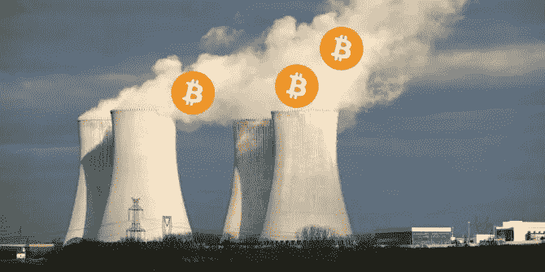
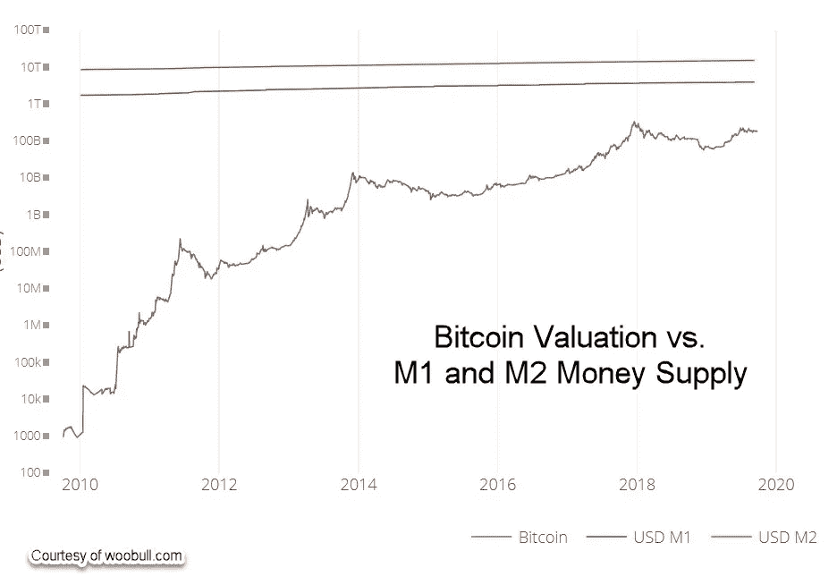
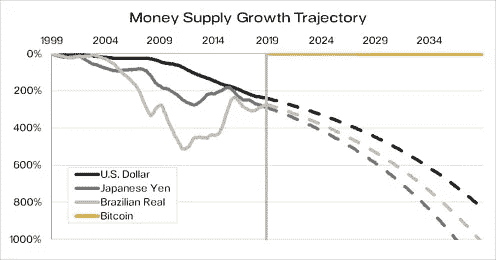
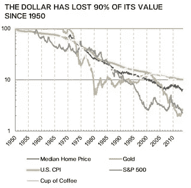
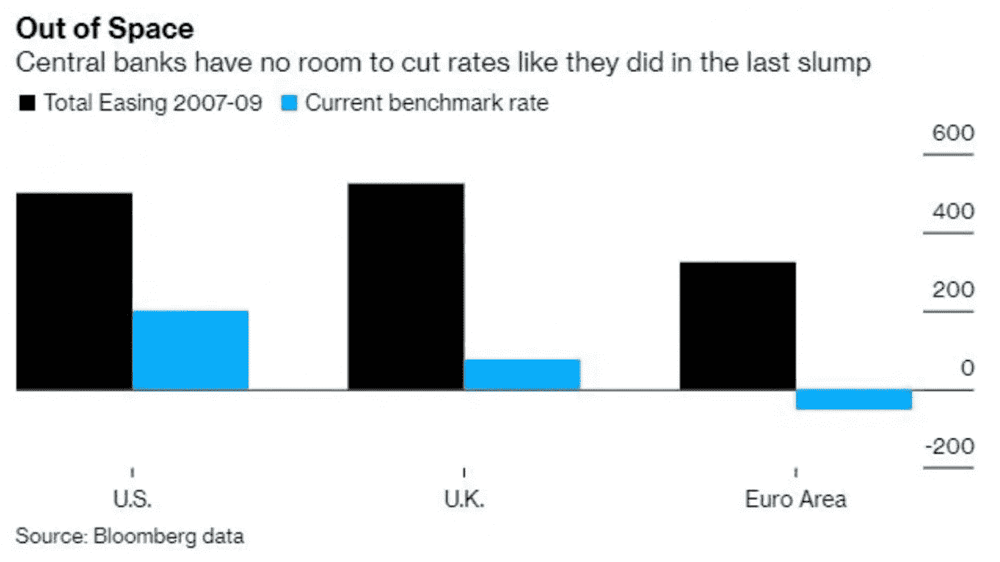

# 比特币的能源消耗对比化石燃料对比核能

> 原文：<https://medium.com/coinmonks/bitcoins-energy-consumption-vs-fossil-fuels-vs-nuclear-power-97eedfd331aa?source=collection_archive---------3----------------------->

**由克利斯·凯驰博士主持的** [**汉瑟数字接入**](https://hansedigitalaccess.com) **、KJA 数字资产投资** [**美德自私投资**](http://www.selfishinvesting.com)

**crypto technologies…Cryptonite for Governments**

**被错误妖魔化的技术:核能**

这篇最近经过深思熟虑的文章把我带回了在加州大学伯克利分校的日子，那时我和埃尔伯特·吉奥索、诺贝尔奖获得者格伦·西博格以及其他知名人士一起在劳伦斯·伯克利国家实验室的 88 英寸回旋加速器和超级加速器上工作。当时，尽管我们参与了基本的重元素研究，并且第一个制造了 110 号元素(达姆施塔汀)的原子，并确认了 106 号元素，我们将其命名为 Seaborgium，尽管我们没有参与核电行业，但文化上对我们还是有抵触情绪。

人们有一种倾向，认为任何涉及核科学的东西都是不好的。也就是说，自三里岛事件以来，围绕核能的负面报道是完全错误的。钍基核电反应堆仍然是最清洁和最安全的能源之一，因为反应可以很容易地停止，因为操作不必在极端压力下进行。与铀反应堆相比，钍反应堆产生的废物要少得多，产生的废物放射性也低得多，寿命也短得多。事实上，当谈到错误地妖魔化一项技术时，隐藏在兔子洞下面的不光彩的动机不仅仅是深的，而且通常是多维的。

在福岛核反应堆灾难发生后，我接受了采访，听众人数超过了 1200 万。我接受了乔治·诺里的采访，他是最广泛的联合电台访谈节目主持人。这是我第二次接受他的采访。我是少数几个对核科学有深刻理解的人之一，我从加州大学伯克利分校获得了核物理博士学位，并在金融和投资领域有 20 多年的经验，是市场传奇人物威廉·奥尼尔(William O'Neil)表现最好的投资组合经理和市场分析师。在采访中，我引用了加州大学伯克利分校的一位核工程师的话，他说目前的高水平辐射“不太可能对健康造成长期危害，因为这些水平会下降。”关于核电的危险，全世界所有的核电厂累积运行了约 2 万年，而在核反应堆存在的整个时间里，只有 3 起与核反应堆相关的事故。在过去的 20 年里，没有人死于核电站。联合国委员会 2012 年的一份报告指出，海啸以来死亡的六名福岛工人中没有一人死于辐射暴露。与此同时，燃煤电厂是“无声杀手”，因为它们影响着数百万人的健康，但它们的影响需要数年才能显现。此外，核能的碳排放为零，因此它可以应对气候变化。

**虚假妖魔化技术:比特币**

今天，我们对比特币的能源消耗进行了妖魔化，但这是一种错误的、短视的观点，也是由左翼动机推动的。1971 年，美元成为世界储备货币。尼克松总统随后将美元与黄金脱钩。美国现在可以无限制地印刷更多的钞票，而其他国家则通过稀释总法定货币的间接税收间接受到惩罚，毕竟，几乎所有东西都是相互关联的，特别是当涉及到货币时，货币可以被认为是经济引擎中的“石油”(请原谅双关语)。在这种情况下，印刷货币会使美元贬值，但会使其他货币以更快的速度贬值，因为由于美元是储备货币，世界其他地区被迫支撑美元。这是一个关键因素。因此，问题就变成了美国如何维持其储备货币地位。如果以史为鉴的话，占主导地位的军事力量控制着储备货币，因此美国一直在保持比其他任何国家都强大的军事力量方面拥有既得利益。通过这种形式的隐含力量，其他国家以美元交易石油等关键商品。这些被称为石油美元，支付给出口石油的国家。石油美元体系将美元提升为世界储备货币。因此，美国享有持续的贸易逆差，是全球经济霸权。石油美元体系还通过石油美元的“再循环”为美国提供了流动性和外国资本流入的来源。这是美国股市是最高的侏儒的原因之一。

因此，毫不奇怪，尽管就癌症死亡人数而言，核能比石油更清洁、更安全，但美国一直存在左翼驱动的反核电指令。每年有超过 80 万人死于燃煤电厂的排放物。与此同时，核能反应堆在其整个运行历史中总共只杀死了几千人。这包括对三里岛、切尔诺贝利和福岛的癌症发病率升高的长期研究。确凿的数据显示，主流媒体严重夸大了事实。

**大炮支持核能**

出于本文前面提到的所有原因，比尔·盖茨正在积极发展核能。他开发了一项技术，可以利用废弃的铀废料。中国是核能的大力支持者，因此，在美国政府批准交易后，中国将与盖茨达成交易，购买他的反应堆技术。但随后特朗普贸易战开始，该协议被撤销。盖茨的密友之一纳森·梅尔沃德完全支持核能。梅尔沃德是一个古怪的天才，已经出版了诸如《恐龙尾巴移动的速度》和一本 5 卷 2600 页的关于面包的书。那些批评他“精神错乱”的人没有抓住要点。梅尔沃德 14 岁进入大学，主修数学，并获得了史蒂芬·霍金的奖学金。比尔·盖茨和内森在 1986 年相遇，并成为了好朋友。任何事情都有联系，即使看起来跑题了。当然，跳过一个维度的点可能会在匆忙之后失去观众，让许多人认为你有点傻。但正如理查德·费曼一部优秀作品的标题所言:“你在乎别人怎么想吗？”

**退出油，进入核**

当涉及到理解一个有许多层面的复杂问题时，理性的声音是罕见的。教育很少教会学生如何思考。主流媒体在许多层面上引发了非理性的恐惧，因为它卖出了更多的报纸。由于许多人通常只看到几个层次的问题，他们没有看到出现的二阶和三阶效应。同时，一个复杂的问题往往有几个层面，如果要得出正确的结论，就必须了解这些层面。许多主流媒体知道这一点，并利用这一弱点。公众教育是罪魁祸首，但我离题了。

作为许多非理性行为*的例子之一，有些人害怕飞行以及许多其他极不可能发生的灾难。然而，同一批人总是驾驶着一辆汽车，这辆汽车发生严重事故的可能性比所有不可能发生的灾难加在一起要大得多。

我不是在评判一个患有飞行恐惧症的人。但理性的人知道他们的恐惧是非理性的，并会寻求各种方法来克服恐惧症。

**比特币，世界储备货币？**

但美国政府最担心的是任何可能威胁到美元储备货币地位的技术，因为其影响深远。核能和可持续能源是不鼓励的，因为它会影响石油产生的石油美元，从而削弱美元作为世界储备货币的地位。因此，左翼主导的主流媒体暗示比特币的碳足迹巨大也就不足为奇了，而事实是比特币只占世界碳排放量的微不足道的%。比特币使用的大部分电力实际上来自清洁能源，如风能、太阳能和水力发电。比特币网络 74.1%的电力来自可再生能源，这使得它比世界上几乎所有其他大型行业都更受可再生能源的驱动。

另一方面，仅交通运输一项，石油就占了碳排放的 15%,而以石油为基础制造的食品则占了 30%。大约有 97 亿吨碳排放到大气中，创下了历史记录。

随着量化宽松将利率进一步推低，债务达到更高的创纪录水平，比特币可能有机会在未来几年成为世界储备货币。这种可能性会遭到美国政府的强烈反对，美国政府会像中国一样试图禁止比特币。但由于比特币的去中心化性质，政府在时间上可能没有多少选择。如果出现这种情况，预计替代形式的能源(如核能)将会胜出，并增加对指数增长技术的资本分配，减少对美国军事的分配。

随着比特币的价值攀升，最终达到 6-7 位数，其市值将达到数万亿。按 100 万美元/btc 计算，其价值约为 16 万亿美元。如果它保持 50%左右的主导地位，整个加密空间的价值将是这个数字的两倍，鉴于股票价值 70 万亿美元，这并不难想象。纳斯达克前首席执行官曾表示，他相信 5 年后区块链的所有股票都将被令牌化。我们还有 228 万亿美元的房地产，其中一些将被令牌化。此外，由于经济优势，即将上线的效率更高、成本效益更好的分散式区块链技术将取代传统技术。因此，目前总估值仅为 2250 亿美元的密码空间在未来几年将大幅增长。

只是时间问题，如下图所示:

*资料来源:1999 年 Q2 彭博 M1 货币供应数据—2019 年 Q2
基于 20 年 CAGR* 的预测

*资料来源:美国劳工统计局、美国人口普查局、标准普尔、世界黄金协会和 Blockchain.info.*

但是，即使考虑到上述情况，也不能保证。如果比特币由于政府干预而无法成为世界储备货币，以确保央行获胜，从而使货币控制权不会丧失，比特币可以与下一种储备货币共存，就像黄金在 1971 年之前与美元挂钩一样。比特币届时将真正成为数字黄金，因为下一个储备货币的价值将与比特币挂钩。届时，世界将再次拥有一种与真实的稀缺程度挂钩的储备货币。与黄金一样，比特币是分散的，没有国籍，但与黄金不同的是，它是私有的，安全的，并且可以抵抗审查。比特币的供应水平是固定且透明的。这消除了人们对与黄金生产过剩相关的典型通胀压力的担忧，这种压力可能会降低黄金的价值。此外，比特币处于反通胀供应状态，而全球黄金供应量在过去一个世纪每年增长 1——2%。尽管如此，黄金的数量可能会飙升。采矿技术和太空探索的重大进步可能会给市场带来数量惊人的黄金供应。

此外，比特币是无缝的，而黄金在储存和运输方面很麻烦。与此同时，比特币交易最终将是即时的，而存储在钱包或冷库中的比特币将变得相对防黑客。与黄金不同，比特币也是防伪的，正如本文[中](https://strategiccoin.com/why-bitcoin-is-superior-to-gold/)所讨论的。

黄金价值 8 万亿美元，可以想象，如果世界法定货币因永无止境的量化宽松计划而贬值，比特币的价值将随着这股顺风继续飙升。敬请关注。

> [在您的收件箱中直接获得最佳软件交易](https://coincodecap.com/?utm_source=coinmonks)

