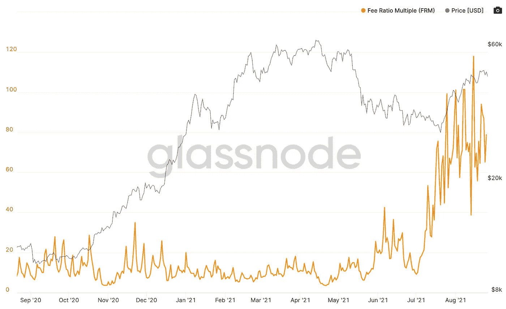
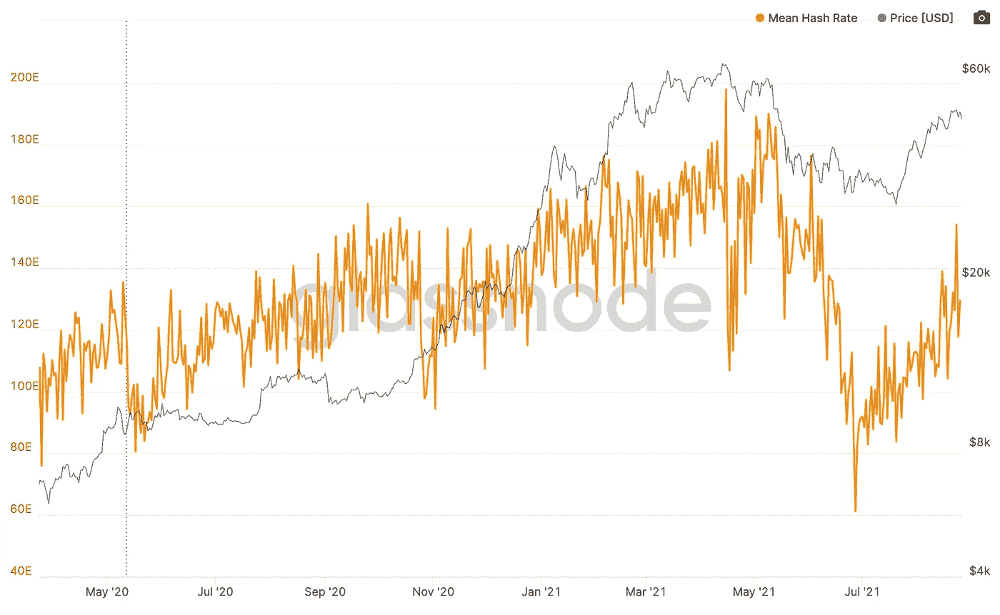
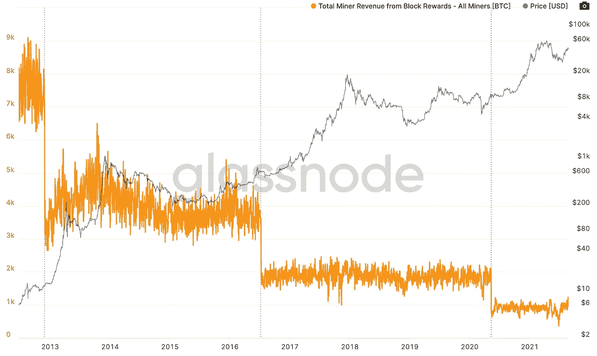
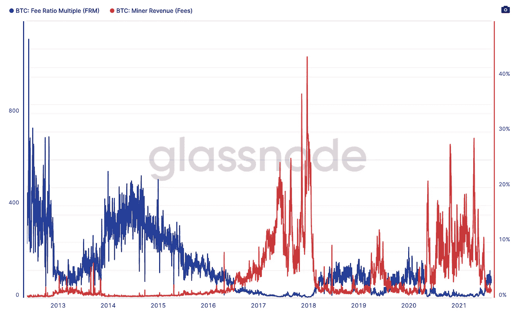

# 比特币的费用比率倍数解释(以及为什么比特币最终胜出)

> 原文：<https://medium.com/coinmonks/bitcoins-fee-ratio-multiple-explained-and-why-bitcoin-wins-in-the-end-f62c4d1f0e59?source=collection_archive---------3----------------------->

在我的上一篇文章中，我讨论了市值/热套比率，这是一个用来预测主要市场顶部/底部的工具，这次我想讨论一些不太以交易为中心的东西，费用比率倍数(FRM)。

FRM 不是你想用来做百万美元交易的东西，但如果你正在评估区块链的长期投资机会，它可能值得一看，因为它代表了区块链的长期价值主张……让我解释一下；

**什么事？**

FRM 计算如下:矿工收入(区块奖励+费用)/费用。

这种计算得出的值，如果乘以费用，将等于矿工收入。因此，我们可以计算出网络的总费用收入与当前的总安全预算相差多少。

BTC FRM dual chart (source: [Glassnode](http://glassnode.com))

**为什么这很重要？**

嗯，比特币依靠矿工来保护网络，验证交易并创建新的区块提交给链……但由于采矿的难度(*工作*工作证明的一部分),这需要大量的计算能力，因此需要大量的电力，所以他们不会免费这样做，这是比特币安全的原因，因为创建一个无效的区块并加倍花费你的比特币需要你拥有所有采矿能力的 51%,这将是难以置信的成本，而且由于受金钱利益的驱使，对黑客来说是适得其反的。

然而，这也产生了“激励问题”。这里要问的问题是，“我们如何激励矿商这么做？”和往常一样，答案是钱。

比特币协议允许新区块的每个矿工向自己发放新代币，作为对其工作的支付……唯一的问题是，这种奖励津贴每 4 年减半，最终将为 0，因此我们需要另一种激励；交易费用。

你可以正确地假设，安全激励越高，安全性越高，因此，一个良好的长期区块链将需要(最终)能够适应高安全预算，而不考虑整体回报，因此，更接近 1 的 FRM 值是可取的(恰好为 1 的 FRM 倍数将意味着矿工的回报 100%由交易费资助)。

没有必要担心 BTC·FRM 轻松地坐在 20-100 的范围内，因为我们仍然处于链条发展的早期，所以块奖励仍然非常可观，为 6.25 BTC(撰写本文时为 294，200 美元)(此外，20-100 与大多数其他代币相比非常低，如莱特币的 FRM = 624)。

在一个完美的世界中，我们继续看到 FRM 随着时间的推移逐渐接近 1，*而*没有看到散列率(专用于安全的总计算能力的度量)的大幅下降。

Hash rate and BTC price over time (source: [Glassnode](http://glassnode.com))

**结论/对 FRM 的批判……以及为什么比特币最终会胜出；**

在评估区块链投资机会时，FRM 是一个非常有趣的指标，然而，我认为仅仅理解比积极地用作指标更有用，原因如下:

**1:** FRM 很嘈杂，它很容易受到内存池拥塞(将您的交易提交给 block 的队列，这鼓励使用更高的交易费用作为一种“跳过队列通行证”)的日常波动的严重影响……并且考虑到 block 奖励保持相对稳定(在减半事件之间)，大约每 10 分钟就有一定数量的比特币，这取决于您处于哪一半；

BTC hash rate over time (source: [Glassnode](http://glassnode.com))

这意味着 FRM 本质上成为衡量交易费用的反向代理，这更容易理解，更高的费用=更多的使用，更多的使用=更高的网络价值。

这是 BTC·FRM 针对矿商的费用收入绘制的图表，他们实际上只是绘制了彼此相反的图表，FRM 上升，费用同时下降:

FRM vs Miner Revenue (Fees) (source: [Glassnode](http://glassnode.com))

但我不想对 FRM 太苛刻，因为它确实是一个很好的衡量标准，可以衡量安全预算在多大程度上受到了块奖励的补贴，而且由于块奖励正在降至零，一个很好的衡量标准是，要达到*网络安全的当前水平*需要增加多少交易费，块奖励应该会消失……当前水平是这里的关键词，这导致了我对 FRM 的第二个批评:

**2:** FRM 认为当前的哈希速率是成功的区块链所必需的。只要获取网络总计算能力的 51%在经济上不可行，只要这一事实保持真实，比特币保持安全，FRM 可以随心所欲地跳舞，但这不会改变网络的内在价值主张，哈希速率，或者你喜欢的网络安全就足够了。

> ***这就是比特币最终胜出的原因……***聪已经想到了一切。

> 加入 [Coinmonks 电报频道](https://t.me/coincodecap)，了解加密交易和投资

## 另外，阅读

 [## 最佳加密交易所| 2021 年十大加密货币交易所

### 加密货币交易所的加密交易需要了解市场，这可以帮助你获得利润…

blog.coincodecap.com](https://blog.coincodecap.com/crypto-exchange)  [## 2021 年 9 大最佳加密借贷平台

### 当谈到加密货币贷款时，大量因素等同于良好的收入状况。此外，借款的一部分…

blog.coincodecap.com](https://blog.coincodecap.com/crypto-lending)  [## 2021 年最佳加密交易机器人(免费和付费)

### 2021 年币安、比特币基地、库币和其他密码交易所的最佳密码交易机器人。四进制，位间隙…

medium.com](/coinmonks/crypto-trading-bot-c2ffce8acb2a)  [## 最佳 4 个加密交易信号电报通道

### 这是乏味的找到正确的加密交易信号提供商。因此，在本文中，我们将讨论最好的…

medium.com](/coinmonks/best-crypto-signals-telegram-5785cdbc4b2b)  [## BlockFi 评论 2021:利弊和利率

### 今天，我们提出了一个全面的 BlockFi 评论，这是一个成立于 2017 年的加密贷款平台，拥有其…

blog.coincodecap.com](https://blog.coincodecap.com/blockfi-review)  [## 如何在印度购买比特币？2021 年购买比特币的 7 款最佳应用[手机版]

### 如何使用移动应用程序购买比特币印度

medium.com](/coinmonks/buy-bitcoin-in-india-feb50ddfef94)  [## 加密税务软件——五大最佳比特币税务计算器[2021]

### 不管你是刚接触加密还是已经在这个领域呆了一段时间，你都需要交税。

medium.com](/coinmonks/best-crypto-tax-tool-for-my-money-72d4b430816b)  [## Pionex 评论-被动交易者的简单交易机器人

### 在本文中，我们将回顾 Pionex，它提供了加密交易机器人自动化工具，集成了一个…

blog.coincodecap.com](https://blog.coincodecap.com/pionex-review-exchange-with-crypto-trading-bot)