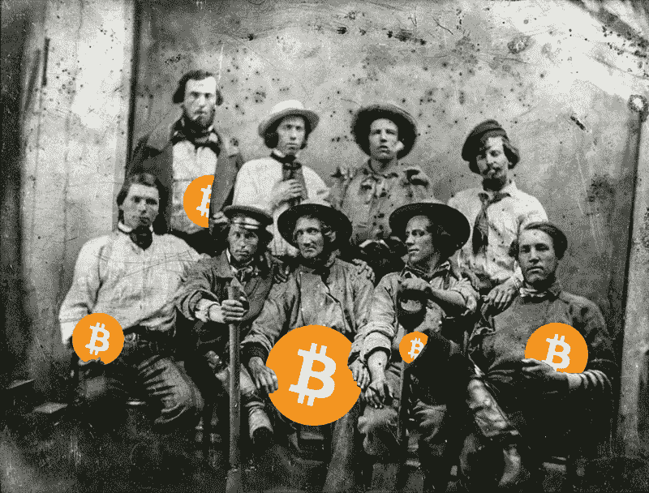

# 比特币的未来:未来的模式转变——挖掘比特币注定要失败，如今对新来者来说已经是不可能的了

> 原文：<https://medium.com/coinmonks/bitcoins-future-paradigm-shift-ahead-mining-bitcoin-is-doomed-and-today-a-non-starter-for-31d801e6e90?source=collection_archive---------11----------------------->

在比特币中，处理点对点网络的交易，并将交易打包成块，密封并打上时间戳，最后存储在一个长区块链中，这被称为挖掘。为了确保最高的安全性，比特币发明者中本聪将这项任务包装在某种结合了难度系数的竞赛中。将事务放入块中所需的散列必须以特定数量的零开始。需要的零越多，哈希值就越难找到。这个难度系数每隔 2016 个区块调整一次，使得找到一个区块的平均时间在十分钟左右。根据每 14 天左右的全局哈希表，难度被调整。到目前为止，一切顺利。

但是除了确认交易的主要功能之外，铸造新硬币并使其流通也是在采矿过程中完成的。这就是“采矿”一词的由来，尽管在最初的白皮书中并不这么叫，但中本聪将这一过程与淘金相提并论。实际上，这很容易实现。每当一名矿工生产一个新区块的潜在版本时，他都会以一笔交易开始，这笔交易会用特定数量的比特币奖励自己。如果方块是正确的，并且满足常规方块的所有要求(在时间上，方块高度没有被超过，难度没问题，自我放纵的奖励高度没问题，等等)，并且几个节点接受它，创建者将得到他的奖励。

报酬率大约每四年减半。一开始，你可以每块获得 100 个比特币，然后是 50 个、25 个，今天你仍然可以在一块中“找到”12.5 个比特币。

**中间结果:采矿有两个目的——主要目的和次要目的:**

初级:处理交易，确认它们并产生一个有效块

**二级:** 铸造新硬币并投入流通

虽然挖掘的主要原因是更重要的原因，而次要原因只是为了激励节点公平竞争并为网络提供 cpu 能力。

# 从前铸币变成了采矿

剩下的就是历史了——不长，但是历史。长话短说:用 CPU 挖矿变成了用 GPU 挖矿，难度提高了，比特币变得越来越受欢迎，汇率上升了，作为一个单独的矿工，你再也负担不起挖矿了，结合了他们散列能力的池被创造出来，首先是分散的，但后来集中的结构出现了，ASIC 被发明了，硬件发明者和矿工几乎跟不上快速增长的行业，中国和北欧的集中化参与进来，汇率爆炸， 交易费也是，最后在比特币的汇率达到历史最高水平的情况下，关于比特币的规模和总体未来的持续斗争最终导致了从最初的比特币到替代比特币比特币现金(以及作为一种坚持“拥有自己的印钞机”原则的替代比特币)的分叉。 由 Satoshi 接过接力棒的这些团体，仍然致力于将比特币发展成为一种真正的货币，而不仅仅是一种全球公认的商品。

# 注定——你们都注定要失败！

比特币最终金额限定为 2100，000，000，000，000，000 Satoshi。那是 2100 万个比特币，但是可以被分割到小数点后第 8 位。1700 万比特币已经在流通，这意味着超过 80%的比特币已经被发现。据我所知，比特币的数量将呈线性增长，最后一块将在 2140 年被发现。

与此同时，全球散列率在过去 10 年中呈非线性增长，并在加速增长的过程中遇到了困难。这使得对于横向进入者来说，如果没有硬件方面的高额投资，今天几乎不可能开始采矿。但是市场或多或少被一个供应商所控制。对于家庭采矿者或小型采矿者来说，已经不可能及时赶上最新的采矿硬件，尤其是因为一家硬件供应商也是世界上最大的游泳池运营商，并且似乎在使用期限即将结束时向公众发布新的硬件。因此，当最新一代的硬件可用时，它们已经过时了，硬件供应商甚至可以控制它变得低效和过时的时间点——除非你家里有自己的核电站。

在未来 122 年内，需要花费巨大的努力来“挖出”最后 400 万个比特币，并以准垄断的方式对其进行完全控制。相关的公司、政府和个人肯定知道并反映了这一点。机构投资者和社会各界已经将其与被操纵的金价进行了长期比较。相似之处显而易见。

# 比特币结束了？失败？

别担心。比特币的第一个大泡沫已经结束。价格跌至 6000 美元以下，但如果你退后一步，看看大局，这是一个相当“正常”的发展。比特币正在将其价值调整至均值。如果你是一个比特币的爱好者和传播者——我称自己为一个——你也可以说类似“一个比特币将永远保持一个比特币——波动的是法定货币！”。好吧，我从哪里偷了这句话，但这是真的。不幸的是，我当地的面包店不接受比特币——目前还不接受。(下面有更多相关内容。)

比特币是一场革命，旨在成为一种全球数字货币，并将允许同行之间在不受第三方信任和控制的情况下进行交易。意识形态的想法是削弱金融机构、全球企业和政府的权力，将货币权力和金融控制权交还给用户。至少我是这么理解的。比特币不是一种商品或财富储存或重大技术突破。不要误会我的意思，这句话不会贬低 Satoshi 的成就，但会让你把注意力转向正确的方向，专注于比特币的真正用途。

如果我对比特币 NVT 比率的解读是正确的，那么这个网络正处于高速增长阶段，大投资者已经着眼于高额回报，否则价格正在形成不可持续的泡沫。我个人倾向于前者，但我不排除另一个巨大泡沫正在形成的可能性。这两种情况我都没意见，很快你就会知道为什么。

难道我只是一个无可救药的乐观主义者，因多年错误的想象和宣扬比特币意识形态而自负？

# 我用我的小眼睛窥探…

我是加密领域的[，特别是从 2013 年末开始研究比特币](https://www.jens-schendel.com/nuetzliches/bitcoin-trading-mining-und-andere-crypto-currencies/)。这使我在技术开发和形势评估方面拥有了经验优势。我不想承认下面的一些想法是“基于直觉”或者称之为直觉。

**请跟随我的考虑:**

比特币汇率低。但远低于在没有坏消息的情况下的预期。比特币的公众关注度仍然很高，越来越多的投资者和机构投资者关注比特币和其他密码。但是没有看到贸易的上升趋势——即使像“罗斯柴尔德家族正在走向比特币”这样的消息正在通过媒体传播。另一方面，负面新闻(如被黑的交易所)和(政府)试图监管或对比特币征税和控制 ico 的“微妙威胁”无法解释比特币价格如此之低，没有任何复苏迹象。

这表明价格受到高度操纵。有几个例子可以证明这一点，也许是出于不同的原因。因为有大量比特币的早期采用者(鲸鱼)，像大型采矿池这样的团体，他们只需要挤出一些钱来支付他们不断增加的电费，大型投资者和交易者，他们希望以合理的低价再次买入，其他竞争性的密码——嗯，谁知道呢？但你可以肯定总会有人。

此外，还有一个仍然被完全低估的发展，它将以雷霆手段改变比特币及其周围的完整生态系统:闪电网络。这将改变一切，因为它将利用区块链在全球范围内开通低收费或免费的个人对个人支付选项。这将使比特币成为一种全球货币。(在[我的另一篇文章](/@jagottsicher/the-lightning-network-will-revolutionize-a-revolution-or-why-hodling-is-not-the-solution-but-part-13716ef55c1e)中了解更多信息)。

当对闪电网络的影响的理解成为常识，这些想法在人们的脑海中出现时，对比特币的兴趣将迅速提高。在一个短时期后，一个自我实现的预言效应将会发生，汇率将会飙升，一旦突破上限。我试图避免“到月球”的术语，因为它仍然继承了比特币在法定货币中的价值。但这不再是我的观点了。你应该根据比特币的用途来评估它的价值。嗯，任何人都不要指望这次高峰会是结束，但会有另一个巩固阶段。价格会再次平静下来。

在第二阶段，它将进入一个可持续的增长期。在此期间，应用程序将持续部署，如在您最喜欢的咖啡店中进行比特币支付，在全球商品交易平台、网络商店、若干社交媒体上接受比特币，以及个人对个人的支付等。尽管比特币汇率无论如何都是需要的，但它用一个更具线性的因素阻止了其高波动性和增长。比特币将成为主流。不要指望这是“火箭登月”的事情。我认为比特币的使用会变得越来越普遍，越来越多的人发现他们可以使用比特币预订假期，并在早上上班的路上购买面包圈。

# 比特币是一种货币——它对采矿业意味着什么？

我的结论非常简单，你可以称之为天真，但如果闪电网络正在接管“谈判”的责任，并使用直接的点对点渠道进行任何类型的比特币交易，那么主要工作挖掘(记住:确认交易)的重要性将会转移到闪电网络。区块链的主要目的将转移到“记账”，嗯，更好的是“将结果写入数据库”。

采矿者的内含费用将会降低很多——通常需要写入区块链的交易金额也会降低。每 4 年回报将减半，但全球能源价格将保持不变(或有上升趋势)。采矿将变得越来越低效，对采矿的需求将随着其重要性而减少。

采矿业注定会变得不那么重要。不完全是，因为它仍然是闪电网络的“独立”数据库和簿记的基础。矿商、资金池，尤其是比特大陆这样的公司认为自己所处的角色，将会完全改变。至少这是我所希望的。一些脱离将帮助他们形成他们的性格，并从“我们是比特币！我们拥有所有的力量！我们拥有一切！”到“感谢你仍然需要我们找到最后一枚隐藏的比特币。”比特币的力量在用户一方。

整个矿业将会收缩整合。随着哈希力量的缩小，难度会自动降低。所有的硬件和大量的能源都将过时，不再能有效地找到仍然隐藏的少量比特币。长期来看，大型数据中心将被拆除。效率将不再紧紧依赖于法定货币的汇率，因为在更长的时期内，你可以将比特币作为一种货币，直接购买商品并兑换成所需的服务。当公众最终通过闪电网络充分发现比特币迫在眉睫的用途时，比特币的重要性将会上升。

短期内，法定货币不会消失——也许永远不会。“太大而不能倒”在这里是正确的术语。但是任何法定货币都有一个缺陷，那就是通货膨胀。比特币的数量有限，这使得它几乎不受通货膨胀的影响。到目前为止，更多的价值将转移到数字货币，特别是比特币和其他参与闪电网络的加密货币。菲亚特向数字化转型的阶段才刚刚开始。