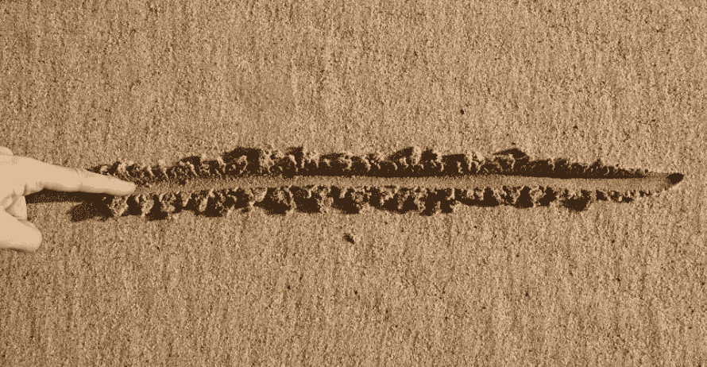
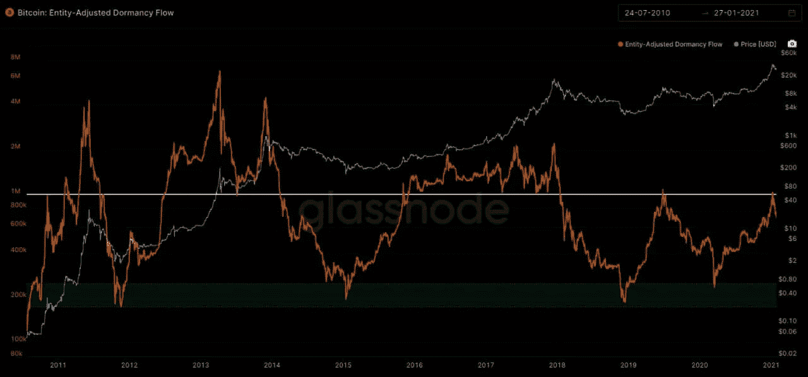

# 比特币的分界线

> 原文：<https://medium.com/coinmonks/bitcoins-line-of-demarcation-f442f53615c1?source=collection_archive---------4----------------------->

## *我们越过这条线，游戏就在*开始了

这就好像 12 年前的占领运动爆发了，并获得了 MBA 学位。这就是现在发生的事情。

它开始时是堕落的交易者想要 tendies(在金钱期权上大赚一笔的良好感觉)…现在已经发展成为工人阶级反对精英和政府的运动。99%的人都被打勾了。

我们都知道系统被操纵了。但是在光天化日之下做，就是自大。

现在，称之为占领 2.0 或第四次转折的开始可能还为时过早。但想想也挺好玩的。成为这种权力平衡的历史性转变的一部分，将会是一种非同寻常的经历。更不用说为这样一个事件写的剧本可能在它的脚注中有一段关于财富转移的内容…从政府铸造的货币转移到一个人们可以信任的地方。

如果这种事件真的发生了，比特币和加密货币作为一个整体将成为这种转移的目的地。它会被贴上资本外逃的标签。

为了让这样的事件发生，我们需要一些严重的市场动荡。

随着股票市场可能见顶，许多企业仍在放缓，刺激措施效果不佳，现在政府的崩溃迫使罗宾汉在一些最大的风险资本家的干预下做了什么……这意味着如果市场进入重大调整，如 25 %- 40 %,这将是点燃大火的火花。

不过，假设已经说得够多了……我们想知道，随着周末的到来，比特币市场的状况会是怎样。

# **市场更新**

今天我们想探讨一个指标。

这是实体调整休眠流程。它是比特币的市值与比特币休眠程度的比率，以及使用年化数字计算的比特币价格。

换个说法，没动的比特币越多，价值越低。又名 HODL 越多，价值越低。把它想象成智能货币指示器。

现在，当休眠上升时，聪明的资金愿意放弃他们的比特币。当这些精明的资金开始卖出时，从历史上看，这是一个大牛市的良好指标。

看下面的图表，你可以看到相对于价格的休眠流。中间的水平线是牛市和熊市的临界点。牛市在上方，而下方的任何读数都被视为熊市。(向这一指标的创造者大卫·普威尔快速点头致意)

如你所见，我们就在这条分界线上。再往上，就是全面的大牛市了。

随着二月初/中旬[灰度效果](/coinmonks/grayscale-trust-and-the-effect-on-crypto-prices-3bbd49d6fcb7)的出现，它可能会成为推动这一指标更高的催化剂。

也就是说…除非…只是可能…键盘 Reddit 战士开始领先华尔街，迫使他们在灰度效应开始之前以更高的价格购买比特币…现在那不是很好吗。

你的脉搏在加密，

B

附:这篇文章最初发表在我们的每日时事通讯《浓缩咖啡》上。你可以在这里报名[。](http://eepurl.com/g8pW9f)

**贾维斯实验室**:我们提供可操作的链上数据(ChainPulse 网站——即将推出)，软件解决方案，以及依赖于我们的自主人工智能/人工智能交易软件贾维斯人工智能的研究。我们的客户是对冲基金、家族理财室和零售客户。

如果您想了解更多关于 Jarvis Labs、Jarvis AI 或 ChainPulse 的信息，请在我们的网页上给我们发消息，网址是 [www.jarvis-labs.xyz](http://www.jarvis-labs.xyz/) ，或者发送电子邮件至 askus@jarvis-labs.xyz

你也可以在 t.me/jarvis_labs,的 Telegram 上关注我们，在 Telegram @Ben_Lilly 上给我发消息，或者在 ben.lilly@jarvis-labs.xyz 上给我发电子邮件