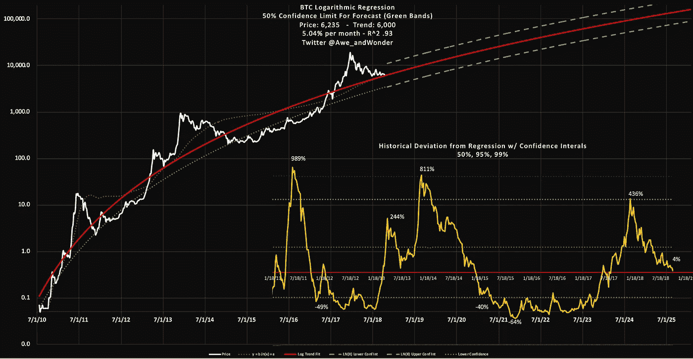
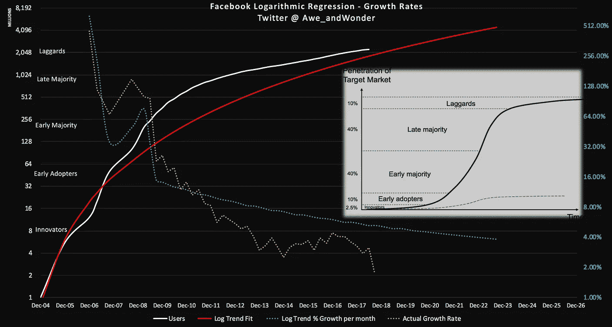
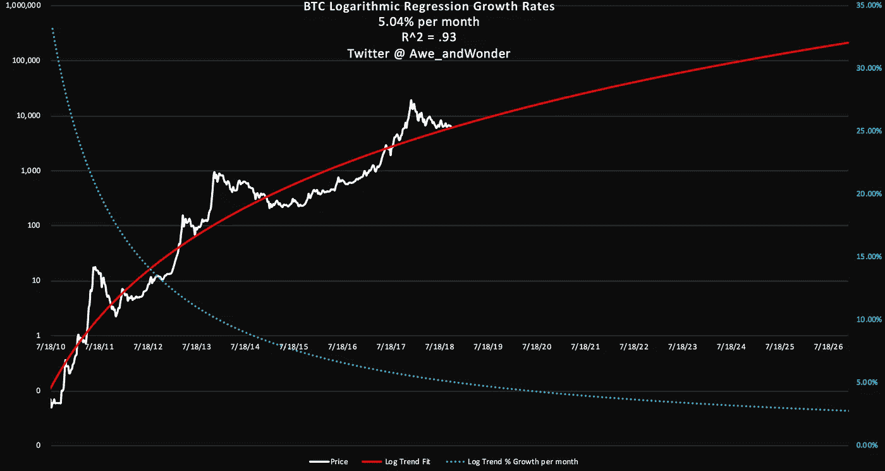
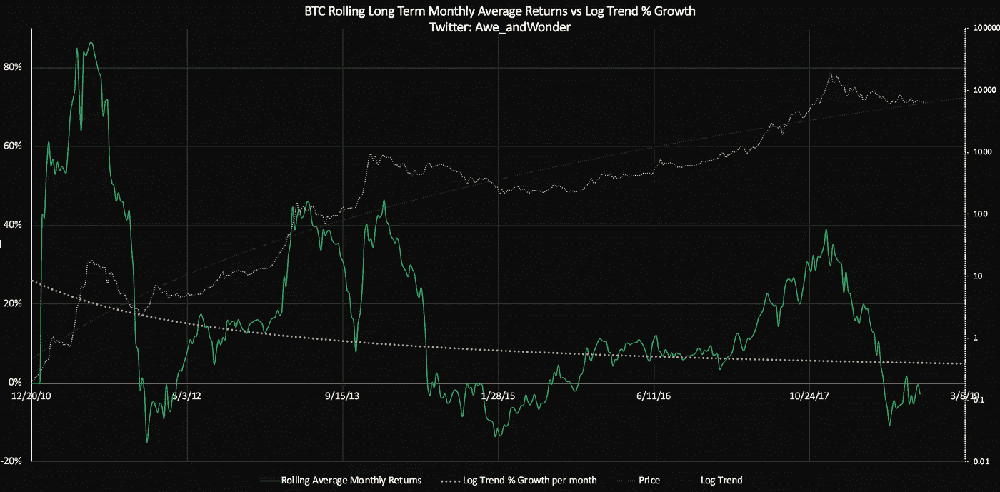
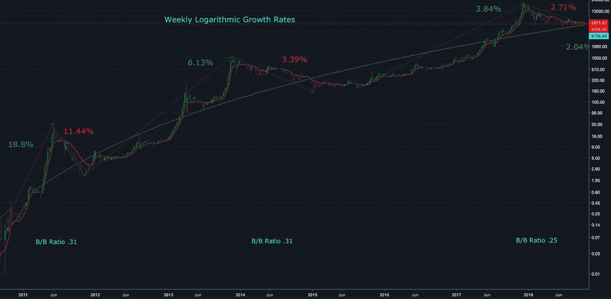
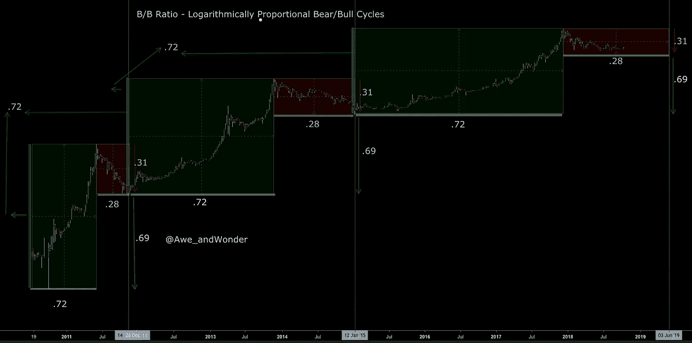

# 比特币的对数增长率、脸书的 S 曲线和未来预测

> 原文：<https://medium.com/coinmonks/bitcoins-logarithmic-growth-rates-facebook-s-s-curve-and-future-projections-22d8acaaa801?source=collection_archive---------1----------------------->

By: [敬畏&惊叹](https://twitter.com/Awe_andWonder)

> *免责声明:非财务建议。过去的表现并不代表未来的结果。*

让我们开始吧。BTC 的长期趋势是以每月 5.04%的统计显著速度增长，预计到 2022 年底将达到 50，000 美元。在这种情况下，50%的置信区间是在该时间点的 28，000 美元和 85，000 美元之间的范围。这种方法在过去很有效，但是很明显，任何事情都可能发生。

[Bitcoin’s](https://blog.coincodecap.com/a-candid-explanation-of-bitcoin/) logarithmic regression - mapping out Bitcoin’s powerful price and time dynamics

在某种程度上，这种模式是通过价格来计算实际用户增长率的。一个很好的例子是脸书 S 曲线的增长率(对数标度)。请注意用户增长率是如何以递减的速度增长的。加密货币市场也出现了同样的对数增长。人们可以推测，2007 年至 2008 年间出现的用户激增将不会发生在加密货币领域。根据 Willy Woo 的说法，这个领域目前正处于早期采用阶段。

Facebook’s S-curve (log scale)

红色对数曲线是使用 2008 年 9 月之前大约 1 亿用户的数据在早期多数增长高峰后拟合和外推的。总的来说，这个预测很好地预测了十年后的用户采用曲线。虽然不可否认，它没有达到真正的中间采用。

> 所有的模型都是错的，但有些是有用的——乔治·博克斯。

> 交易新手尝试[密码交易机器人](/coinmonks/crypto-trading-bot-c2ffce8acb2a)或[复制交易](/coinmonks/top-10-crypto-copy-trading-platforms-for-beginners-d0c37c7d698c)

BTC is increasing in price at a decreasing rate

与线性回归不同，对数(非线性)回归按比例跟踪随时间的增长。对于 x 的每一个比例变化，y 也有一个比例变化。

目前，时间每增加 1%，价格就会相应增加 5.87%。

同样，类似于脸书的采用 S 曲线，BTC 是在以递减的速度增加价格。

Bull runs historically start when rolling returns flip positive

深入研究，当价格在对数趋势线附近波动时，其增长率会相应变化。如果滚动平均回报率低于对数趋势增长率，则有理由预期价格会向下/横向波动。如果滚动平均回报与对数趋势的增长持平，人们可以预期一个较低的波动性环境，其中新趋势试图在产生突破之前建立某种基础。一旦足够的动量建立，趋势是指数增长，并开始大大超过对数趋势的增长。最终，这种增长速度变得不可持续，新的周期开始重复。

仔细观察会发现同样的概念。每个周期的周增长率都低于前一个周期。这很有道理，因为持续不断的指数增长是不可持续的。

上面的 B/B 比率代表了以对数单位表示的熊市周期和牛市周期之间的比例。换句话说，这是牛市中被熊市周期抹去的部分。为了全面实现对数比例的熊牛周期，价格应该下跌到 4800 点左右。这进一步增加了我之前工作中描述的 4400–5000 区域的信心。然而，这纯粹是巧合现象。另外，目前的价格走势看起来有点奇怪。几乎就像有一个不自然的底价。可能有一个大型的基于算法的市场参与者正在大规模交易，他们可能有其他想法。

也就是说，让我们看看其他的市净率。绿色牛市周期的高度是对数比例的。向上波动性以每周期 0.72 个对数单位的比率递减。同样的概念适用于随后的削减(. 31)。下行波动性也成比例降低。由于牛市的宽度增加，熊市的宽度(0.28)也成比例增加。考虑到价格正以递减的速度增长，较低的增长率需要更多的时间来覆盖相同的“地面”是合理的。将这一概念应用于当前的熊市，同比例分形表明，下一轮牛市的最高*几率*大约在 2019 年年中。—2018 年 10 月 23 日更新。感谢[马克·德·梅塞尔](https://twitter.com/marcdemesel)的观察促成了这次更新。

总之，对数回归已被证明是 BTC 最好的预测工具。指数回归超过了长期的实际增长率，逻辑分析需要非常强的关于拐点和估计最高价格的假设。同样，任何类型的分析都不应该孤立地使用。相反，它只能作为得出合理结论的一小部分证据。

感谢阅读。请在 twitter 上关注我，分享这篇文章，以示支持。

 [## Awe & Wonder(@ Awe _ and Wonder)| Twitter

### Awe & Wonder 的最新推文(@Awe_andWonder)。密码市场的统计预测。不是金融…

twitter.com](https://twitter.com/Awe_andWonder) 

> 加入 Coinmonks [电报频道](https://t.me/coincodecap)和 [Youtube 频道](https://www.youtube.com/c/coinmonks/videos)获取每日[加密新闻](http://coincodecap.com/)

## 另外，阅读

*   [复制交易](/coinmonks/top-10-crypto-copy-trading-platforms-for-beginners-d0c37c7d698c) | [加密税务软件](/coinmonks/crypto-tax-software-ed4b4810e338)
*   [电网交易](https://coincodecap.com/grid-trading) | [加密硬件钱包](/coinmonks/the-best-cryptocurrency-hardware-wallets-of-2020-e28b1c124069)
*   [密码电报信号](http://Top 4 Telegram Channels for Crypto Traders) | [密码交易机器人](/coinmonks/crypto-trading-bot-c2ffce8acb2a)
*   [最佳加密交易所](/coinmonks/crypto-exchange-dd2f9d6f3769) | [印度最佳加密交易所](/coinmonks/bitcoin-exchange-in-india-7f1fe79715c9)
*   [面向开发人员的最佳加密 API](/coinmonks/best-crypto-apis-for-developers-5efe3a597a9f)
*   最佳[密码借贷平台](/coinmonks/top-5-crypto-lending-platforms-in-2020-that-you-need-to-know-a1b675cec3fa)
*   杠杆代币的终极指南