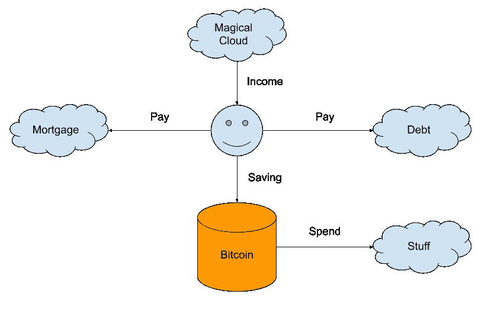
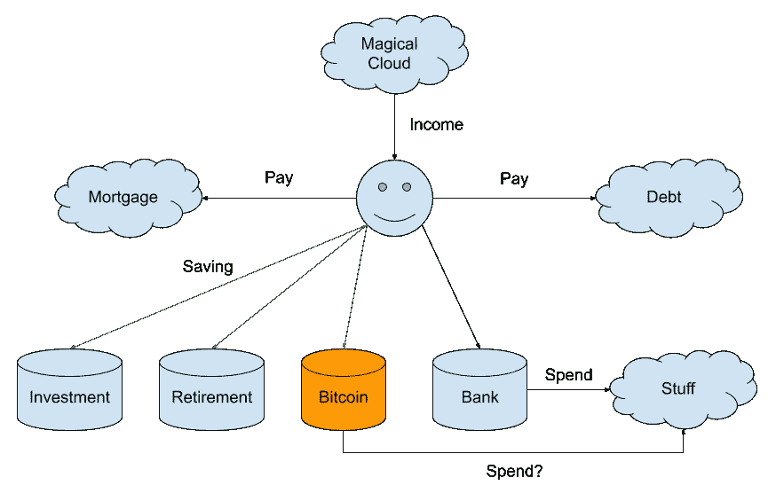
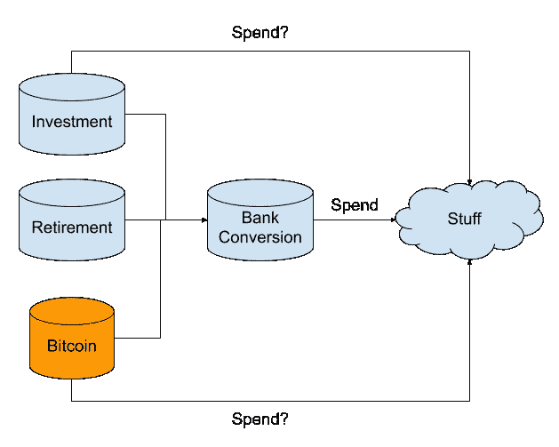
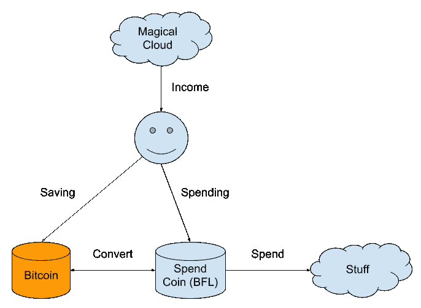

# 比特币与世界缺失的一环

> 原文：<https://medium.com/coinmonks/bitcoins-missing-link-to-the-world-1465aaddd6f5?source=collection_archive---------4----------------------->

随着 2020 年 5 月预期减半，比特币正在积聚上升到下一个水平的势头。比特币看涨者吹捧散列率上升、奖励减半、闪电网络、全球不稳定是价格上涨的主要原因。也许，会达到万亿市值。2018 年的牛市是用 altcoins 和 ico 催化的。有人认为 ICO 分散了注意力。但如果没有 ICOs 的炒作，很难说比特币价格会涨到近 2 万美元。这一次，altcoins 和 ico 的市场似乎死了。比特币市值主导地位继续上升。孤独的国王需要向世界证明。

但如果认为这些已知的基本面会推动比特币价格更上一层楼，那就太天真了。我认为比特币的采用是价格的关键驱动因素。能够使用它很重要。在这篇文章中，我描述了我所看到的比特币与世界之间缺失的一环。

# 比特币个人理财中心化

尽管谈论去中心化和金融自由，但围绕比特币的最主要的叙事导致了人们金融的集中化。在这种模式下，用户将所有的钱都投入比特币。当他们需要消费时，他们使用或兑换所需数量的比特币。图 1 描述了这个模型中的资金流动。

*图 1:比特币中心化*

这个模型可能来自于工程思维。这是合乎逻辑的，也是最优的。但是现实世界通常既不符合逻辑也不是最优的。人们把事物分类和分开。钱是一个需要分开的东西。混合货币用例导致损失。这就是为什么经常性被动投资往往比主动管理投资带来更好的结果。

# 个人理财的混乱世界

现实生活中的情况更复杂。随着时间的推移，人们积累资产和负债。比特币可能会成为一种新的资产类别。图 2 描绘了一幅更为典型的个人理财图。

*图二:个人理财*

在这个模型中，比特币是一种资产类别。一个用户买卖比特币成为法定货币来消费。比特币被视为一种投资和价值储存手段，而非用于消费的银行账户。比特币和法定货币之间的转换是一个复杂的过程。

*比特币能用于直接消费吗？我认为答案多半是否定的。原因多半是心理上的。*

正如我在第一部分提到的，人们不喜欢混合金钱用例。如果可能的话，人们已经在用他们的储蓄和投资进行直接消费了。图 3 描述了使用投资或价值储存的直接支出模型。我认为不太可能发生。

*图 3:使用投资或价值储存的直接支出*

我认为这个拼图中缺少的一块是用于消费的加密货币。每次你想买咖啡之类的小商品时，打开你的比特币账户都是令人头疼的事情。如果我们把消费和储蓄分开，我们就把一个熟悉的个人理财系统引入了画面。图 4 对图 1 进行了调整。

*图 4:独立的储蓄和消费账户*

用于消费的加密货币让用户熟悉加密软件。用户可以在价值比特币商店(储蓄)和消费比特币之间进行转换。消费代币也不如比特币值钱。账户分离提供了额外的安全保障，让您高枕无忧。

> [在您的收件箱中直接获得最佳软件交易](https://coincodecap.com/?utm_source=coinmonks)

