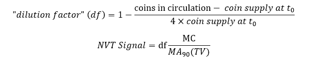
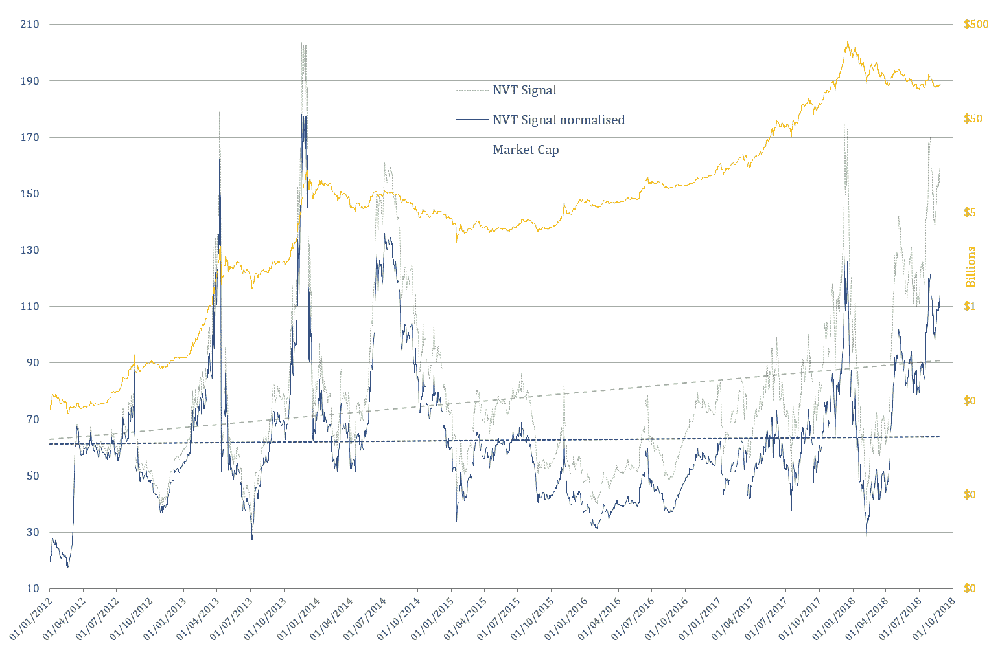
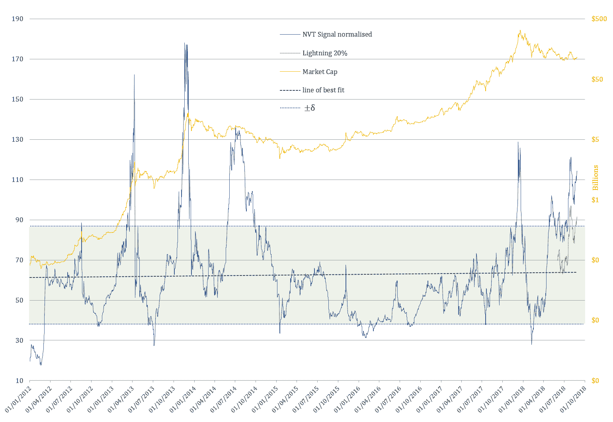
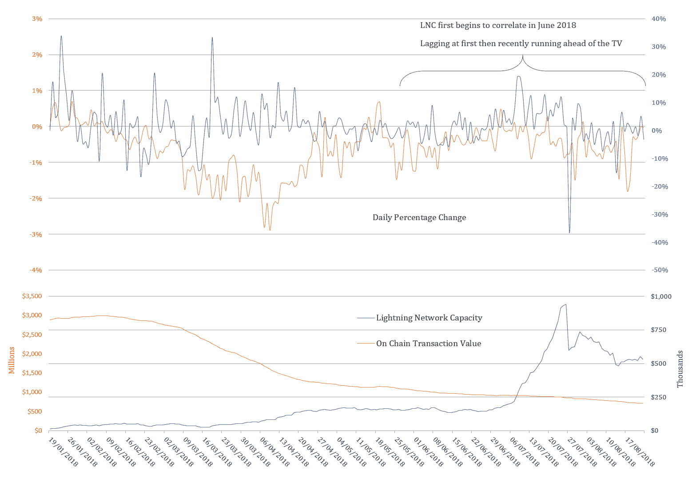

# 比特币的 NVT 比率因流通供应量的通胀而正常化

> 原文：<https://medium.com/coinmonks/bitcoins-nvt-ratio-normalised-for-inflation-in-the-circulating-supply-c045d9a5ef00?source=collection_archive---------3----------------------->

为了跟进上一篇**的文章，我调整了比特币的 NVT 比率(更具体地说是 [**吴的 NVT 信号**](http://charts.woobull.com/bitcoin-nvt-signal/) )，以考虑比特币对硬币供应的通胀。NVT 比率的向上倾斜更准确地说是链上交易量(BTC)和流通中硬币供应量趋势长期差异的结果。自 2012 年以来，NVT 比率的趋势增加了 57%，而流通中的硬币增加了 114%。为了将 NVT 比率保持在“历史”范围内，以保持其作为参考点(如信号)的有用性，可以通过“稀释系数”对其进行“捏造”/“归一化”:**

********

**任意地，或者如我在前面的 [**篇**](/@cryptopoiesis/brief-observations-and-questions-on-the-lightning-networks-effect-bitcoin-s-nvt-ratio-3beb4bd61f1f) 中所解释的，2012 年的开始被选为 t0。使用此公式生成的值会产生一条几乎平坦的最佳拟合线。我相信，以这种方式扭曲/捏造/归一化比率是明智的，因为，除了考虑到比率因素的基本面之外，它还生成了一条最佳拟合线和平均值的标准差，非常整齐地落在图表的关键水平上:**

****

# **我们能降到多低？**

**如果闪电网络的采用继续，通常跟随牛市的大量链上交易可能不会像以前的周期那样明显，尽管净值是在链上结算的。如前一篇文章所述，闪电网络容量确实与连锁电视相关，因此可以作为一个代理来帮助计算更具包容性的电视。然而，还不清楚如何确切地解释/处理这个度量。**

****

**事实上，在 2017 年的牛市中，比特币的统治地位前所未有地下降，加密领域的毒性和欺骗水平也是如此，(比如“Bitcooooonect！”找到进入前 1000 万的方法)是将继续影响当前市场的最关键的方面。因此，我认为最恰当的问题是:“我们能走多久？“这并不是说投机者厌倦了比特币，而是人们被过多的骗局和独角兽榨干了。司法系统将做出几个例子的速度，以推迟/缩小诈骗的水平，以及这些“企业”吸走的大笔资金，这可能使他们继续下去，变形，重新塑造品牌，并继续先令并不令人鼓舞。因此，我认为 **BTC 的优势**是未来几个月最重要的因素，而不是 NVT 比率。要么大幅增长，要么我们将在一段时间内停滞不前。**

## **承认**

**[威利·吴 ](https://woobull.com/)**

**[**德米特里**](/@kalichkin) &密码实验室资本**

**免责声明:内容仅作为我个人的观察和问题，以供进一步考虑、回答或丢弃，因此本文远非详尽，不是也不能作为任何金融/投资/交易建议的基础。**

> **[直接在您的收件箱中获得最佳软件交易](https://coincodecap.com/?utm_source=coinmonks)**

****