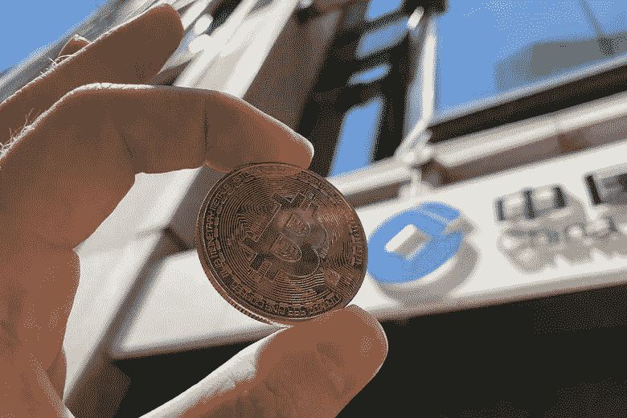
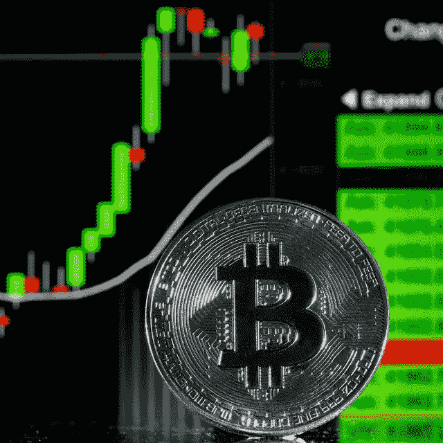

# 比特币 10 月份的价格上涨表明，在监管之下，近期将出现加密牛市

> 原文：<https://medium.com/coinmonks/bitcoins-october-price-rise-suggests-near-term-crypto-bull-run-amid-regulation-143500ad4d26?source=collection_archive---------16----------------------->

比特币和其他加密形式的货币本周在图表中快速上升，继续以它们在上个月从证券交易所分离出来的例子为例。虽然比特币(BTC-美元)不可预测的行为实际上困扰了许多金融支持者，但它无疑是最安全的赌注，因为控制者总体上签署了一项对加密领域的修复。

虽然一般的加密市场不时与资源上的其他危险保持同步，但自 10 月以来，资源类别显示出一些不同。标准普尔 500 指数(^GSPC)上个月下跌，但最大的加密货币比特币上涨了 15%以上，周四的汇率约为 54，000 美元。以太坊(ETH-USD)和 Dogecoin (DOGE-USD)在上周又获得了超过 15%的股份。在此期间，柴犬币(Shiba 美元)已经上涨超过 150%,然而，在一便士的价值之下仍然是巨大的交换。

然而，全天来看，日常加密市场停留在没完没了的价值披露，金融支持者将普遍同意本周是 BTC 看涨。比特币 1 万亿美元的市值和巨大的储存价值——被比作黄金——对长期持有人来说，比最近记忆中的任何时候都更有吸引力。对于更大的机构金融支持者来说，其管理清晰性使其比其他众多的加密资源更具吸引力。其他全面指标，例如美联储出现的选择，可能会进一步推动市场支持比特币。

## 领先的风险指标

“就潜在收益而言，比特币看起来实际上很完美，”DailyFX.com 的高级规划师克里斯托弗·维奇欧(Christopher Vecchio)说。虽然韦基奥提出，很难将比特币这种不可预测程度的资源视为避难所，但他说，不管怎样，比特币是创新股票的主要危险指标，BTC 可能在未来几周走高。

这种资源的长期持有者通常会同意，比特币的最大玩家正在大规模层面上遵循其行为的危险。

“大型现金交易商关注的是美国证券交易委员会、美联储、扩张、ETF 指引。英国投资公司 Lakestar 的 Ben Cousens 告诉雅虎财经。

作为比特币的所有者，Cousens 表示，比特币价值的不可预测性使最近几个月成为了根深蒂固的比特币金融支持者所谓的“投机者天堂”。“在这段不稳定时期，BTC 的长期持有者最近一直在收藏。这通常会导致股票崩盘，就像我们现在看到的那样，”他说。

调控效应

亿万富翁投资者兼企业家马修·罗斯扎克(Matthew Roszak)表示，比特币也受益于对监管的日益关注。Roszak 告诉雅虎财经:“就国会和美国政府机构内部的声明而言，比特币和以太坊“具有非凡的管理清晰度”。

在对加密领域的调查不断扩大的时期，比特币——尽管它可能很不安全——由于受到打击，已经成为最安全的加密资源之一。

美国证券交易委员会主席加里·詹斯勒周三在美国众议院金融服务委员会发表讲话时强调，他坚信应该更加严格地控制加密领域。Gensler 表示，大多数数字货币形式都不是货币标准，而是投机工具，应该受到美国保护法的管理。

“5、6 千种私房钱是不可能坚持下去的。金融史让我们知道这是牵强的，”Gensler 在他的声明中说。“因此，很多这样的标准实际上并不是货币标准。它们没有被用来在星巴克购买一些浓缩咖啡……它们中的大部分是投机工具，是美国商业远见者筹集资金的途径。”

点击这里学习新的比特币投资策略:[https://www.digistore24.com/redir/372937/vadymlbusiness/](https://www.digistore24.com/redir/372937/vadymlbusiness/)

尽管如此，Gensler 对 Roszak 表示了部分赞同，称一批适度的加密资源“可能会与黄金或白银相媲美”，解决了“具有重大价值的高级投机商店，因为黄金在长期内具有重大价值的投机商店。”詹斯勒的说法遵循了前任主席杰伊·克莱顿(Jay Clayton)领导下的 SEC 在他面前提出的参考点，即比特币和以太坊组织中的数字货币以太(ether)不受保护。
展望未来，Gensler 和其他美国控制者，如财政部和美联储，希望在担保人和阶段层面围绕稳定的信贷制定更详尽的指导方针。虽然 stablecoins 的指导方针可能不会直接影响比特币和以太网的成本，但如果 stablecoins 看到更严格的指导方针，短期内可能会对更广泛的加密市场产生巨大影响。

康奈尔大学金融方面的教师、《货币的未来》一书的作者埃斯瓦尔·帕萨德认为，就个人目的而言，这会降低流动性。“这种指导方针可以被视为对数字货币和加密资源进行更广泛的行政打击的主要优势，”Parsad 说。

“它将停止一些交换流，接受个人不改变到其他算法[稳定]硬币，”芝加哥大学的右手教师吉娜·皮特尔斯说，她探索了稳定硬币。更具活力的加密交易商通常与美元的比例固定为 1:1，在高度不可预测的时期，他们经常使用 stablecoins 作为进出比特币等其他非固定数字货币的方法。

虽然指导方针可能会降低金融支持者对稳定硬币的开放程度，并在短时间内停止交换数据流，但比特币与标准普尔 500 的不同可能同样意味着金融支持者再次将它视为避难所。

比特币市值 1 万亿美元，经常被比作“高级黄金”。黄金传达了 10 万亿美元的市值。要让比特币接近这个规模，比特币必须达到 50 万美元。虽然罗扎克预计比特币在不久的将来不会达到这个价格，但他仍然乐观。在他长期持有这种资源的过程中，随着它的大幅上涨和下跌，“这当然会考验你，”他说。

> 加入 Coinmonks [电报频道](https://t.me/coincodecap)和 [Youtube 频道](https://www.youtube.com/c/coinmonks/videos)了解加密交易和投资

## 另外，阅读

*   [什么是保证金交易](https://blog.coincodecap.com/margin-trading) | [美元成本平均法](https://blog.coincodecap.com/dca)
*   [支持卡审核](https://blog.coincodecap.com/uphold-card-review) | [信任钱包 vs 元掩码](https://blog.coincodecap.com/trust-wallet-vs-metamask)
*   [Exness 回顾](https://blog.coincodecap.com/exness-review)|[moon xbt Vs bit get Vs Bingbon](https://blog.coincodecap.com/bingbon-vs-bitget-vs-moonxbt)
*   [如何开始通过加密贷款赚取被动收入](https://blog.coincodecap.com/passive-income-crypto-lending)
*   [阿联酋 5 大最佳加密交易所](https://blog.coincodecap.com/best-crypto-exchanges-in-uae) | [SimpleSwap 评论](https://blog.coincodecap.com/simpleswap-review)
*   购买 Dogecoin 的 7 种最佳方式 | [ZebPay 评论](https://blog.coincodecap.com/zebpay-review)
*   [最佳期货交易信号](https://blog.coincodecap.com/futures-trading-signals) | [流动性交易回顾](https://blog.coincodecap.com/liquid-exchange-review)
*   [3 商业评论](/coinmonks/3commas-review-an-excellent-crypto-trading-bot-2020-1313a58bec92) | [Pionex 评论](https://blog.coincodecap.com/pionex-review-exchange-with-crypto-trading-bot) | [Coinrule 评论](/coinmonks/coinrule-review-2021-a-beginner-friendly-crypto-trading-bot-daf0504848ba)
*   [莱杰 vs n rave](/coinmonks/ledger-vs-ngrave-zero-7e40f0c1d694)|[莱杰 nano s vs x](/coinmonks/ledger-nano-s-vs-x-battery-hardware-price-storage-59a6663fe3b0) | [币安评论](/coinmonks/binance-review-ee10d3bf3b6e)
*   [Bybit 交易所评论](/coinmonks/bybit-exchange-review-dbd570019b71) | [Bityard 评论](https://blog.coincodecap.com/bityard-reivew) | [CoinSpot 评论](https://blog.coincodecap.com/coinspot-review)
*   [3 commas vs crypto hopper](/coinmonks/3commas-vs-pionex-vs-cryptohopper-best-crypto-bot-6a98d2baa203)|[赚取秘密利息](/coinmonks/earn-crypto-interest-b10b810fdda3)
*   最好的比特币[硬件钱包](/coinmonks/hardware-wallets-dfa1211730c6) | [BitBox02 回顾](/coinmonks/bitbox02-review-your-swiss-bitcoin-hardware-wallet-c36c88fff29)
*   [BlockFi vs 摄氏度](/coinmonks/blockfi-vs-celsius-vs-hodlnaut-8a1cc8c26630) | [Hodlnaut 审核](/coinmonks/hodlnaut-review-best-way-to-hodl-is-to-earn-interest-on-your-bitcoin-6658a8c19edf) | [KuCoin 审核](https://blog.coincodecap.com/kucoin-review)
*   [Bitsgap 评审](/coinmonks/bitsgap-review-a-crypto-trading-bot-that-makes-easy-money-a5d88a336df2) | [Quadency 评审](/coinmonks/quadency-review-a-crypto-trading-automation-platform-3068eaa374e1) | [Bitbns 评审](/coinmonks/bitbns-review-38256a07e161)
*   [加密复制交易平台](/coinmonks/top-10-crypto-copy-trading-platforms-for-beginners-d0c37c7d698c) | [Coinmama 审核](/coinmonks/coinmama-review-ace5641bde6e)
*   [印度的加密交易所](/coinmonks/bitcoin-exchange-in-india-7f1fe79715c9) | [比特币储蓄账户](/coinmonks/bitcoin-savings-account-e65b13f92451)
*   [OKEx vs KuCoin](https://blog.coincodecap.com/okex-kucoin) | [摄氏替代品](https://blog.coincodecap.com/celsius-alternatives) | [如何购买 VeChain](https://blog.coincodecap.com/buy-vechain)
*   [币安期货交易](https://blog.coincodecap.com/binance-futures-trading)|[3 comas vs Mudrex vs eToro](https://blog.coincodecap.com/mudrex-3commas-etoro)
*   [AscendEx Staking](https://blog.coincodecap.com/ascendex-staking)|[Bot Ocean Review](https://blog.coincodecap.com/bot-ocean-review)|[最佳比特币钱包](https://blog.coincodecap.com/bitcoin-wallets-india)
*   [Bitget 回顾](https://blog.coincodecap.com/bitget-review)|[Gemini vs block fi](https://blog.coincodecap.com/gemini-vs-blockfi)|[OKEx 期货交易](https://blog.coincodecap.com/okex-futures-trading)
*   [美国最佳加密交易机器人](https://blog.coincodecap.com/crypto-trading-bots-in-the-us) | [经常性评论](https://blog.coincodecap.com/changelly-review)
*   [在印度利用加密套利赚取被动收入](https://blog.coincodecap.com/crypto-arbitrage-in-india)
*   [霍比评论](https://blog.coincodecap.com/huobi-review) | [OKEx 保证金交易](https://blog.coincodecap.com/okex-margin-trading) | [期货交易](https://blog.coincodecap.com/futures-trading)
*   [麻雀交换评论](https://blog.coincodecap.com/sparrow-exchange-review) | [纳什交换评论](https://blog.coincodecap.com/nash-exchange-review)
*   最好的[加密税务软件](/coinmonks/best-crypto-tax-tool-for-my-money-72d4b430816b) | [CoinTracking 评论](/coinmonks/cointracking-review-a-reliable-cryptocurrency-tax-software-5114e3eb5737)
*   [Stackedinvest 评论](https://blog.coincodecap.com/stackedinvest-review) | [北海巨妖评论](/coinmonks/kraken-review-6165fc1056ac) | [期货交易机器人](/coinmonks/futures-trading-bots-5a282ccee3f5)
*   最佳[加密借贷平台](/coinmonks/top-5-crypto-lending-platforms-in-2020-that-you-need-to-know-a1b675cec3fa) | [杠杆代币](/coinmonks/leveraged-token-3f5257808b22)
*   最佳[加密制图工具](/coinmonks/what-are-the-best-charting-platforms-for-cryptocurrency-trading-85aade584d80) | [最佳加密交易所](/coinmonks/crypto-exchange-dd2f9d6f3769)
*   [比特币基地僵尸程序](/coinmonks/coinbase-bots-ac6359e897f3) | [AscendEX 审查](/coinmonks/ascendex-review-53e829cf75fa) | [OKEx 交易僵尸程序](/coinmonks/okex-trading-bots-234920f61e60)
*   [如何在印度购买比特币？](/coinmonks/buy-bitcoin-in-india-feb50ddfef94) | [瓦济克斯审查](/coinmonks/wazirx-review-5c811b074f5b)
*   [隐料斗替代品](/coinmonks/cryptohopper-alternatives-d67287b16d27) | [HitBTC 审查](/coinmonks/hitbtc-review-c5143c5d53c2)
*   [折叠 App 审核](https://blog.coincodecap.com/fold-app-review) | [Kucoin 交易机器人](/coinmonks/kucoin-trading-bot-automate-your-trades-8cf0ca2138e0) | [Probit 审核](https://blog.coincodecap.com/probit-review)
*   [如何匿名购买比特币](https://blog.coincodecap.com/buy-bitcoin-anonymously) | [比特币现金钱包](https://blog.coincodecap.com/bitcoin-cash-wallets)