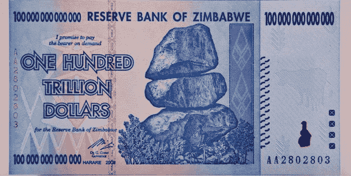
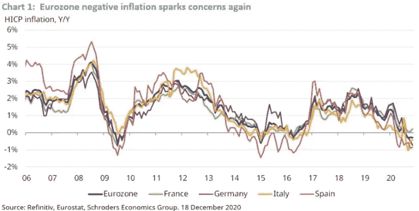
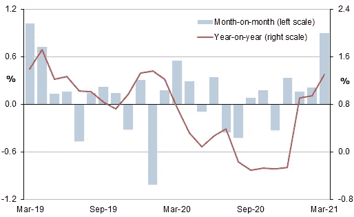
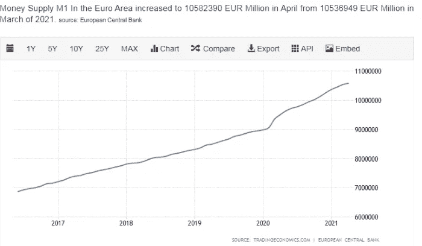
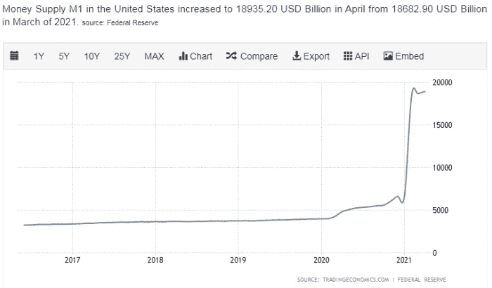
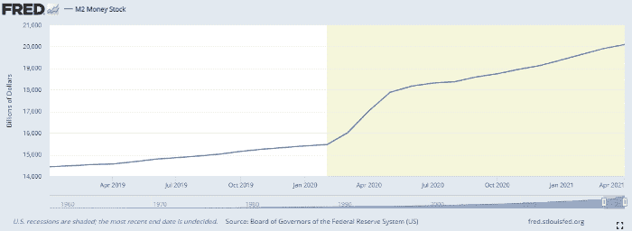

# 比特币取代菲亚特的完美对称

> 原文：<https://medium.com/coinmonks/bitcoins-perfect-symmetry-in-replacing-fiat-f13b808ef164?source=collection_archive---------7----------------------->

这篇文章描述了通货紧缩及其后果，同时也探讨了比特币的稀缺性和 BCH 作为法定货币替代品的利用。

正如亚当·斯密在《国富论》中所言，一只看不见的手正在推动自由市场的价格。贷款产生泡沫，泡沫达到临界点后破裂。根据泡沫的影响，它可以创造螺旋事件，导致经济衰退和通货紧缩。

大多数遭受高通胀的经济体很可能会有非常低的失业率。然而，通货紧缩总是意味着高失业率，通常与经济衰退有关。

通货膨胀和通货紧缩通常通过政府和中央银行如美联储和欧洲央行的行动来调整。此外，政府对货币供应的干预通常是造成这些问题的主要原因。

**我写比特币现金**。这篇文章的标题是指比特币现金，而不是 BTC。由于高昂的费用和无法扩大规模，BTC 没有财产可以用作现金。这需要时间，但最终每个人都会明白这个事实。

由于通货膨胀，政府支持的货币(法定货币)的价值正在随着时间的推移而下降，我们已经知道这一点，这是我们投资的主要原因，并且在我们的现金储备中只持有很小一部分。

Satoshi 设计比特币时考虑到了稀缺性。虽然从一开始限制就是 2100 万，但也有讨论要增加这个数字。代码没有被锁定，开发人员可以修改任何东西，只要得到社区绝大多数人的支持。

当然，我在这里并不是为了增加“固定供应”加密货币的总供应量。作为投资者，我对稀缺性感兴趣，然而这篇文章不是关于个人投资者，而是扩展到宏观经济的范围。

通货紧缩也是政府和央行干预的结果。

通货紧缩会给经济带来巨大的问题，而这通常与经济衰退联系在一起。

通货膨胀意味着国家货币正在贬值，通货紧缩基本上加剧了这一点。通货紧缩意味着经济学家用来衡量价格变化的一篮子商品的平均价格正在下降。

发现价格随着时间的推移而降低可能很好，但是，这意味着我们的资产和投资也在贬值，因为所有的价格都在下降，不仅仅是消费品。

当在银行持有大量现金时，通货紧缩是非常严重的。钱没有贬值，但还在升值。乍一看很棒，因为这意味着我们现在可以用更少的钱购买商品。

然而，有许多衰退使得通货紧缩在任何经济体中都不起作用。

*   我们的资产价格也在下降，而且通常速度很快。
*   工资也下降了，抵消了家庭低价购买的优势
*   投资减少，资金从大型投资中撤出，退出国家经济，转向更好的选择。
*   由于价格下跌和需求减少，新的投资停滞，生产减少。
*   GDP 因此大幅下降。
*   失业率正在上升。
*   政府债务价值增加(因为通货紧缩)。同样的债务现在要花更多的钱来偿还，而且在通货紧缩结束之前还会花更多的钱。
*   消费减少，因为预计未来价格会下降。
*   因为消费减少了，生产就更少了。
*   由于生产减少，失业率会更高。

所有上述情况在遭受衰退打击的国家都曾发生过。负面事件的螺旋式上升最终会自行消失，因为它首先以许多负面方式影响了这些经济体的人口。然而，政府总是试图进行干预，以制造拯救经济的假象，但结果可能更糟。

通货紧缩对非常高的通货膨胀同样不利。

欧盟有一个仍然没有正确处理的大问题。欧洲不像美国、中国、俄罗斯那样是一个稳固的经济体。

这是一个几十年来各自遵循不同模式的经济体联盟。2008 年后，just Germany 做出的决定对欧盟产生了负面影响，对许多经济体实施了严格的监管。当时的问题是西班牙、意大利、葡萄牙、爱尔兰、希腊、塞浦路斯等国的高负债。

比利时在 2008 年也有非常高的债务/GDP 比率(超过 100%)，但是没有人讨论过这个问题，因为布鲁塞尔被选为欧盟的指挥中心。

但以上内容超出了本文的范围，我只是觉得有必要补充一下，因为债务是一个需要记住的重要因素。

这两个图表很好地表明了欧盟的通缩担忧，这是由 Covid 效应引起的对衰退的担忧引起的。

[*Source*](https://www.schroders.com/en/uk/adviser/insights/economics/has-deflation-returned-to-europe/)

欧盟自 2009 年以来第三次达到通缩水平。从我的角度和知识来看，这一次，欧盟没有大幅增加货币供应，目前，通胀回到了约 2%的预期水平。

欧洲央行没有遵循美联储的逻辑，货币供应(M1、M2)没有大幅增加。这一事实也推高了欧元对美元的价格(~ 1.22 美元)，这一价格看起来仍受到压制。为了应对通缩，欧洲央行自 2021 年初以来增加了货币供应，并在 3 月份达到更高水平。

[*Source*](https://tradingeconomics.com/euro-area/money-supply-m1)

欧洲没有通货膨胀问题，在当前的危机中也不会有。真正的危险是长期通缩，它会减少生产、投资、开发、研究和创新。

与此同时，美国以不同的方式对待货币，M1 的货币供应量从 2021 年初开始几乎翻了两番。

当观察这两张图表时，预计美国的高通胀将持续 12-24 个月。(在[inflationdata.com](https://inflationdata.com/Inflation/Inflation/Money_Supply_and_Inflation.asp)找到更多关于 M1 供应和通货膨胀的关系)。[阅读下面的编辑，M1 供应量的增加不是因为流通中的新货币，而是因为会计方法的改变]

> *“我们必须记住，随着货币供应量的增加在整个体系中浮动，会有一个时滞。通常时滞被认为是 12 -18 个月。因此，如果我们在货币供应图表中引入一个时滞，这就是我们得到的结果。”*
> 
> ——【Inflationdata.com 

一般来说，1-5%之间的小通胀水平是必要的，也是重要的，欧盟 20 年来已经证明了这一点。这是一种可行的经济运行方式。高于 5%(据报道)的通货膨胀是危险的，会使经济过热，产生不利影响。

# [编辑 2021 年 6 月 20 日](https://read.cash/@Pantera/bitcoins-perfect-symmetry-in-replacing-fiat-5b10bd39#edit-2062021)

[编辑]:对于我对美国 M1 供应的分析，我深感抱歉，因为我犯了一个错误。这张图表似乎是正确的，M1 供给迅速变化，但这不是因为美联储的行动。

货币 M1 不只是在美国增长了 350%，当图表表现如此时，我应该尝试做更多的研究。

> *在 M1 增加的 14 万亿美元中，11.2 万亿美元(80%)* ***来自会计规则的改变*** *将资金从储蓄账户转移到支票账户。*
> 
> *来源:* [*协作基金*](https://www.collaborativefund.com/blog/the-fed-isnt-printing-as-much-money-as-you-think/)

M2 描述的储蓄账户现在在美国也被视为支票账户。改变的是会计规则，而不是美联储印制了数量惊人的美元。

我没有借口，也不会去找借口。这是我的错，不管其他人是否也把 M1 的这种变化说成是通货膨胀，它实际上不是。

M2 图表是这样的:

Source: [Fred Economic Data](https://fred.stlouisfed.org/series/M2SL)

> 传统的法定货币允许政府或银行印钱并导致通货膨胀。在比特币现金的情况下，总供应量将达到 2100 万 BCH。印刷额外的货币会导致通货膨胀，如果没有额外的货币印刷，比特币现金的价值应该会随着需求的上升(更多的人将开始使用比特币现金)和供应的下降或持平(不再有比特币现金被“印刷”)而增加。这使得比特币现金类似于黄金，供应量有限，无法“印刷”或人为创造。
> 
> [-尼斯哈希](https://www.nicehash.com/countdown/BCH-halving-2024-04-01-12:00)

比特币现金是维持比特币所抛弃的资产。加密货币的数字现金方面。

作为一种资产，有限的供应对投资来说是非常好的，当用户群不断增加时，资产的公允价值也会不断增加。

然而，就宏观经济规模而言，资产和货币之间存在重大差异。用比特币作为货币价值来比较价格和通货膨胀是不可能的。

也许在完全取代法定货币来对商品、服务和资产进行估价之前，至少在未来几十年内，还需要一个法定标准。

用比特币取代法币意味着比特币将成为标准，价格将以美元 BCH 为单位。

比特币现金的通胀水平目前是 1.8%，这是一个合理的通胀水平，在下一个减半之前的 3 年多时间里，它将保持这种水平。我认为比特币的稀缺性模型可以更好地发挥作用，因为没有政府能够滥用货币体系来暂时增加流通中的货币，并为选举目的和民粹主义创造假财富。

随着下一个减半，它将减少到 0.9%，这是一个低通胀水平，并随着每四年新供应减半而进一步降低。

然而，加密货币是通用的。固定且递减的货币通胀率适用于所有经济体，而不仅仅是一种加密货币可能被大量用作现金而非法定货币的经济体。

对于加密货币或任何数字货币，我支持稀缺性，因为固定供应创造了更好的价值储存。

在宏观层面上，加密货币(具有固定稀缺性)不可能永久取代国家法定货币，但这可能会彻底改写经济学。

也可以有别的东西。一篮子加密货币可以作为法定货币。采取的任何措施都不会只影响一个经济体。然而，每个单位的价值都有影响，正如外汇和法定货币战争一样，加密也会发生同样的情况。

我们今天可以用于日常交易的最高效的工具是什么？

那些用起来便宜的和网络即时确认交易。比特币现金当然是首选，其次是 Dash next，也许是 LTC，也许是 XRP，也许是 Monero，只要可行，没有法律或中央集权问题，就能被人们接受。

不过，一种固定供应量的单一加密货币不可能完全取代一种国家法定货币。

萨尔瓦多是考虑接受加密货币作为法定货币的经济体之一。我还没有读到太多关于它在这方面的策略，但我觉得阅读标题为“萨尔瓦多比特币法定货币”( [source](https://www.trustnodes.com/2021/06/06/el-salvador-bitcoin-legal-tender-game-changing-or-nothingburger) )的新闻很有趣，因为这只是关于采用早已放弃其货币属性的$BTC。

我还了解到支付处理应用“Strike”的首席执行官宣布了这一消息，因此这需要一些研究来发现它究竟如何处理加密货币交易，以及它是否真的有利于 crypto 或将其置于类似于 Paypal 的限制之下。

任何对此有不同看法的人，我都愿意讨论，因为在这篇文章中，所有的内容都是以一种非常松散和非正式的方式发表的。这只是一些想法和想法，我愿意讨论。

我赞成国家货币的小通胀，然而，一种或多种固定供应量的加密货币也可以与法定货币并行运行。

当然，遭受恶性通货膨胀的经济体将会发现这样做很有用处。在国家货币失灵的情况下，采用加密货币和法定货币可能是一种可持续的解决方案，有助于稳定经济。

我想通过这篇文章表达的观点是，只有一种固定供应量的加密货币可能无法完全取代法定货币。稀缺不会造成通货膨胀，然而，它可能会造成通货紧缩的担忧，为了解决这些问题，也许一个菲亚特系统应该一直并行存在。

对每个经济体来说，小比例的通货膨胀似乎是必要的。

毫无疑问，当一种加密货币取代法定货币时，它将需要现金的所有属性。

虽然没有一种加密货币能够完美地实现这种采用，但拥有高效、分散网络的一篮子加密货币可能是更好的解决方案。

导语图片取自:[大英百科全书](https://www.britannica.com/topic/fiat-money)

最初发布于 [read.cash](https://read.cash/@Pantera/bitcoins-perfect-symmetry-in-replacing-fiat-8d6b400d)

**在以下网络上写作:**

我还活跃在以下社交媒体上:

*原载于 2021 年 6 月 7 日*[*https://read . cash*](https://read.cash/@Pantera/bitcoins-perfect-symmetry-in-replacing-fiat-5b10bd39)*。*