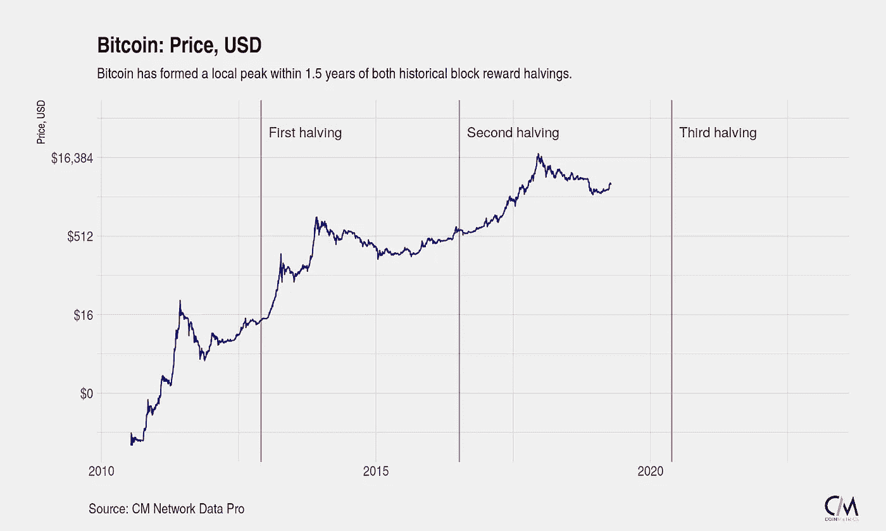

# 比特币的安全性没问题

> 原文：<https://medium.com/coinmonks/bitcoins-security-is-fine-adcf0429a41e?source=collection_archive---------3----------------------->

[**CoinCodeCap**](https://coincodecap.com)

*   上周，Skycoin 在其 Github 知识库上获得了最多的提交次数(161 次)。

**本周语录-**

> "未经审视的人生不值得过。"——**苏格拉底**

本周故事👇👇

## 比特币的安全性没问题

大约每 10 分钟，就会创建一个新的比特币区块，其中包含新铸造的比特币(“区块补贴”)加上交易(包括发送交易的实体支付的交易费)。新铸造的硬币加上交易费的价值被称为“块奖励”

根据比特币的硬编码货币政策，每块新铸造的硬币数量随着时间的推移而减少，最终在 2140 年达到 0%(也称为[反通胀模型](https://www.investopedia.com/terms/d/disinflation.asp))。在这篇文章发表时，超过 83%的比特币已经被铸造出来，目前的年通胀率仅为 3.8%。到 2040 年，99%以上将被开采。

.. [***此处阅读全文***](https://blog.picks.co/bitcoins-security-is-fine-93391d9b61a8)

由[丹举办](https://medium.com/u/405d30706535?source=post_page-----adcf0429a41e--------------------------------)(丹是互通的联合创始人，你可以在 [*上关注他的*](https://twitter.com/danheld) )

> [直接在您的收件箱中获得最佳软件交易](https://coincodecap.com/?utm_source=coinmonks)

想在 CoinCodeCap 上市吗？ [***填写此表。*T34**](https://airtable.com/shrc4sXB70HPpuSM8)

发微博给我，或者发邮件给我，地址是 gaurav@coincodecap.com

> “我们是一个非宣传性和非营利性的教育出版物，如果您喜欢阅读 [Coinmonks](https://medium.com/coinmonks) ，[您也可以捐助我们](/coinmonks/monks-need-your-help-7440418d67ec)”

***暂时就这样，送我❤️，下次再说。***