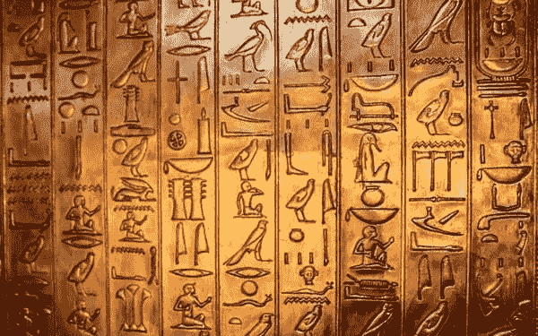

# 比特币令人不安的价格

> 原文：<https://medium.com/coinmonks/bitcoins-uncomfortable-price-33d4bc28ade9?source=collection_archive---------3----------------------->

# 估价问题

资产分类通常很简单:特斯拉是科技股，黄金是贵金属，美元是货币。你会如何给比特币分类？科技股？一种数码贵金属？一种数字货币？以上全部？比特币很难定位，因为可以为上述所有情况提出论据。这也是为什么比特币的价格，即使是对最客观的投资者来说，也是大相径庭——估值取决于你如何对它进行分类。

## 比特币不是科技股

科技股让投资者赚钱。过去 10 年，它的产品和服务消耗了我们的注意力和钱包。我们对技术及其股票的预先熟悉，诱使我们将比特币归类为科技股。换句话说，将一项外国技术归类到一个熟悉的领域会给我们一种控制感、舒适感和自信。我们希望它符合我们所熟悉的心智模式，以便理解新事物。完全是人。在内心深处，我们大多数人并不关心比特币是什么，但作为投资者，我们肯定希望利用它的增长。当我们不知道某样东西是什么时，我们的本能是通过比较分析得出价格。主流媒体不断将比特币与科技股进行比较，这让我们更加困惑。出于显而易见的原因，人们很容易写出吸引眼球的标题，比如[“比特币现在比美国银行、网飞和 Shopify 还要大”](http://Bitcoin Is Now Bigger Than Bank of America, Netflix, and Shopify)。虽然这种说法是正确的，但这种比较是误导性的。

**比特币不是科技股**。比特币没有员工，没有营销部门，没有销售团队，没有董事会，没有股息，不提供前瞻性指导，不是合法注册的公司，不发布财务报表。它不对股东做出承诺，也不会被起诉或承担责任。*应该考虑的关键估价标准是双方都从网络效应中受益*。具有网络效应的产品随着每一个新用户而增值；一旦达到临界质量，产品就会变得有粘性，很难被竞争对手取代。

## 比特币比黄金更好

另一个常见的比较是比特币作为黄金的数字模拟。具有讽刺意味的是，大多数人对黄金几乎一无所知，只知道它闪闪发光，价值不菲。黄金被用于硬件技术，但从投资角度来看，这两者截然相反——这是为什么呢？比特币是一种技术，但其设计原则符合黄金的价值品质:稀缺性、可分割性、耐久性、便携性、可替代性和难以生产。这不是巧合。黄金是历史上存活时间最长、最成功的货币形式，可以追溯到公元前 700 年。黄金从实物到数字的转变是比特币的达尔文时刻。达尔文的进化论采用了一种经过战斗考验的基础配方，并添加了一种在现代生存所必需的新功能:比特币的黄金适应性使其能够立即传送到地球上的任何地方，同时保留黄金的关键估值属性。比特币遵循进化地图，这是最大化主义者对其持久性的信心之所在。比特币是数字黄金的有力证明。

据估计，黄金的市值为 9 万亿美元。如果比特币消耗了黄金的全部市值，那么比特币的估值上限为每枚 48.6 万美元。黄金不太可能归零，所以这个数字是一个初始标志。有趣的地方就在这里:比特币对人类的贡献比黄金大得多。最好的类比是建筑材料:木材、石头和钢铁。木制房屋通常跨度不超过 3 层。库西城堡是最高的石头城堡，大约有 13 层。这使得石头比木头提高了 4 倍。迪拜塔是世界上最高的钢铁摩天大楼，高达 160 层，是之前的 12 倍。木头和石头是自然形成的。钢是炼金术的发现——一项人类取得的技术突破。钢铁使整个大都市涌现出来，改变了整个地球的面貌。钢在几十年内完成了木头和石头几个世纪都无法完成的事情。比特币与钢铁有着同样的关系:两者都是人为的技术突破。两者都取代了自然竞争者的血统。比特币开启了一个超乎我们想象的未来。*因此，486，000 美元不是估价上限，而是估价下限。*

## 比特币具有货币潜力

比特币作为一种货币听起来很准确，因为它被吹捧为高科技货币。既然可以把比特币从 A 人发给 b 人，那么这个说法是有道理的**比特币是货币吗？不*。**不在当前状态。而且不是现代意义上的。为了使货币变得有用，它必须被广泛接受，保持价格稳定，并能立即交易。比特币目前的形式无法满足这些要求。比特币的核心价值基于黄金的蓝图，但有一个转折:它也继承了软件的最佳特性，使其能够进化。

比特币能否成为一种被广泛接受、价格稳定、能够瞬间清算交易的货币？是的，到时候。和互联网一样，比特币受益于网络效应。随着时间的推移和采用，只要比特币继续存在并提供效用，比特币能够被广泛采用的想法是完全合理的。采用和可用性升级导致更广泛的接受和用比特币定价的可能性。这种推理遵循了网络效应的老路。目前，基础层的交易速度需要几分钟才能完成，这对于日常使用来说太长了。幸运的是，比特币是软件，可以自我构建。证明这一点的是比特币的闪电网络，这是一个完全实验性的 5 年前，并可在今天的生产。下载[Zap](https://strike.zaphq.io/)的罢工 app。它看起来和感觉完全像 Venmo 或 PayPal，完全以美元交易。但是在引擎盖下，你使用的是通过闪电网络瞬间清算的比特币。闪电网络只是建立在比特币基础上的创新浪潮的一个例子。这仅仅触及了比特币将如何在功能和效用方面胜过传统货币的表面。

我预计，从长远来看，比特币会被归类为货币，但目前不会。从比特币成为货币的那一天起，它的估值就飙升至七位数，甚至八位数。现存的货币总量估计有 80 万亿美元。考虑到全球政府仅在 2020 年就印刷了约 20 万亿美元，这还是非常保守的。加上“世界上所有的钱”，包括像股票市场、衍生市场和房地产这样的基石部门；你很快就会达到 7 或 8 位数的估值。当然，这些估值是天上掉馅饼，可能需要几代人的时间。

## 未来的看涨期权

幸运的是，比特币能够经受住时间的考验。如果我们理解了为什么比特币作为一种产品意义重大，我们就可以创建基于知识的估值图。如果我们仅仅基于价格波动来理解比特币，我们会误解它，给它起名字，给它贴错标签，并且害怕它。我的结论是，低于 2 万美元的比特币被严重低估。我已经和你分享了我的估价图。我欢迎你来挑战你所看到的不同，这样我们就可以建立更好更准确的地图。

> 加入 Coinmonks [Telegram group](https://t.me/joinchat/EPmjKpNYwRMsBI4p) 并了解加密交易和投资

## 另外，阅读

*   什么是[闪贷](https://blog.coincodecap.com/what-are-flash-loans-on-ethereum)？
*   最好的[密码交易机器人](/coinmonks/crypto-trading-bot-c2ffce8acb2a) | [网格交易](https://blog.coincodecap.com/grid-trading)
*   [3 商业评论](/coinmonks/3commas-review-an-excellent-crypto-trading-bot-2020-1313a58bec92) | [Pionex 评论](/coinmonks/pionex-review-exchange-with-crypto-trading-bot-1e459d0191ea) | [Coinrule 评论](https://blog.coincodecap.com/coinrule-review-a-perfect-trading-bot)
*   [AAX 交易所评论](/coinmonks/aax-exchange-review-2021-67c5ea09330c) | [德里比特评论](/coinmonks/deribit-review-options-fees-apis-and-testnet-2ca16c4bbdb2) | [FTX 交易所评论](/coinmonks/ftx-crypto-exchange-review-53664ac1198f)
*   [n 零审核](/coinmonks/ngrave-zero-review-c465cf8307fc) | [Phemex 审核](/coinmonks/phemex-review-4cfba0b49e28) | [PrimeXBT 审核](/coinmonks/primexbt-review-88e0815be858)
*   [Bybit Exchange 审查](/coinmonks/bybit-exchange-review-dbd570019b71) | [Bityard 审查](https://blog.coincodecap.com/bityard-reivew) | [CoinSpot 审查](https://blog.coincodecap.com/coinspot-review)
*   [3Commas vs Cryptohopper](/coinmonks/3commas-vs-pionex-vs-cryptohopper-best-crypto-bot-6a98d2baa203)
*   最好的比特币[硬件钱包](/coinmonks/the-best-cryptocurrency-hardware-wallets-of-2020-e28b1c124069?source=friends_link&sk=324dd9ff8556ab578d71e7ad7658ad7c) | [BitBox02 回顾](/coinmonks/bitbox02-review-your-swiss-bitcoin-hardware-wallet-c36c88fff29)
*   [莱杰 vs n rave](https://blog.coincodecap.com/ngrave-vs-ledger)|[莱杰 nano s vs x](https://blog.coincodecap.com/ledger-nano-s-vs-x)
*   [加密拷贝交易平台](/coinmonks/top-10-crypto-copy-trading-platforms-for-beginners-d0c37c7d698c) | [比特码拷贝交易](https://blog.coincodecap.com/bityard-copy-trading)
*   [Vauld Review](https://blog.coincodecap.com/vauld-review)|[you hodler Review](/coinmonks/youhodler-4-easy-ways-to-make-money-98969b9689f2)|[BlockFi Review](/coinmonks/blockfi-review-53096053c097)
*   最好的[加密税务软件](/coinmonks/best-crypto-tax-tool-for-my-money-72d4b430816b) | [硬币追踪评论](/coinmonks/cointracking-review-a-reliable-cryptocurrency-tax-software-5114e3eb5737)
*   最佳[加密借贷平台](/coinmonks/top-5-crypto-lending-platforms-in-2020-that-you-need-to-know-a1b675cec3fa) | [杠杆代币](/coinmonks/leveraged-token-3f5257808b22)
*   [莱杰纳米 S vs 特雷佐 one vs 特雷佐 T vs 莱杰纳米 X](https://blog.coincodecap.com/ledger-nano-s-vs-trezor-one-ledger-nano-x-trezor-t)
*   [block fi vs Celsius](/coinmonks/blockfi-vs-celsius-vs-hodlnaut-8a1cc8c26630)|[Hodlnaut Review](https://blog.coincodecap.com/hodlnaut-review)
*   [Bitsgap 审查](/coinmonks/bitsgap-review-a-crypto-trading-bot-that-makes-easy-money-a5d88a336df2) | [Quadency 审查](/coinmonks/quadency-review-a-crypto-trading-automation-platform-3068eaa374e1)
*   [埃利帕尔泰坦评论](/coinmonks/ellipal-titan-review-85e9071dd029) | [赛克斯斯通评论](https://blog.coincodecap.com/secux-stone-hardware-wallet-review)
*   [DEX Explorer](https://explorer.bitquery.io/ethereum/dex) | [区块链 API](https://explorer.bitquery.io/graphql)|[local bitcoins 审核](https://blog.coincodecap.com/localbitcoins-review)
*   最佳[区块链分析](https://bitquery.io/blog/best-blockchain-analysis-tools-and-software)工具| [赚比特币](https://blog.coincodecap.com/earn-bitcoin)
*   [加密套利](/coinmonks/crypto-arbitrage-guide-how-to-make-money-as-a-beginner-62bfe5c868f6)指南:新手如何赚钱
*   最佳[加密制图工具](/coinmonks/what-are-the-best-charting-platforms-for-cryptocurrency-trading-85aade584d80) | [最佳加密交易所](/coinmonks/crypto-exchange-dd2f9d6f3769)
*   了解比特币的[最佳书籍有哪些？](/coinmonks/what-are-the-best-books-to-learn-bitcoin-409aeb9aff4b)

> [直接在您的收件箱中获得最佳软件交易](/coinmonks/newsletters/coinmonks)

