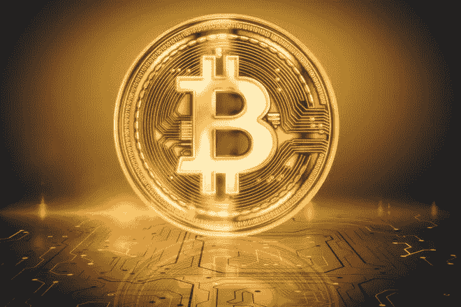
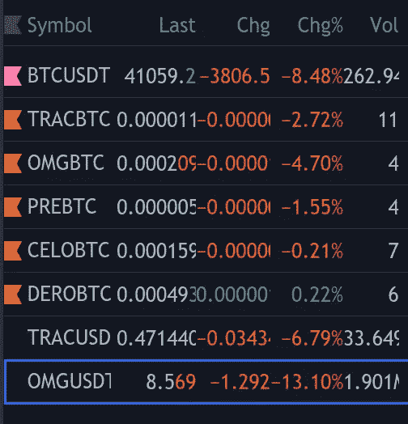
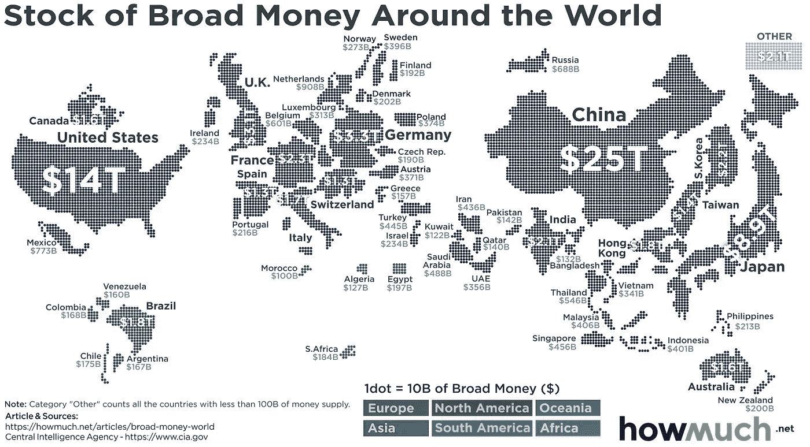

# 比特币的波动性，让我们仔细看看。

> 原文：<https://medium.com/coinmonks/bitcoins-volatility-let-us-take-a-closer-look-d39622ce8da3?source=collection_archive---------10----------------------->

比特币是做市商，当它上涨时，市场会上涨，当它下跌时，整个市场都会下跌。我是两极的，我很了解这种模式；有时它甚至跟随市场。

年轻的市场是两极的……这正是年轻的发展中市场在极度发达、资本雄厚的对手周围徘徊时的表现。

所有这些波动都是好事。这意味着有资金流入/流出市场。如果你相信市场长期来看是增长的，那么长期来看流入量将超过流出量。我的投资总是针对比特币交易。为什么？因为市场是不稳定的，而且比特币随着市场波动，用比特币衡量投资是明智的，可以给出更好的市场预测。

Always check BTCUSDT and USDT’s marketcap numbers before investing

我所有的交易视图列表顶部都有 BTCUSDT。我*一直在*学习的一件事是如何预测多帧窗口上的运动。我在一周内选了一些看起来不错的股票(2D、3D、5D……)，与比特币进行了对比，但一夜之间它们就暴跌了。我完全知道它们会下跌，坚持认为一周之后这些资产会保持其最佳价值。我仍然相信这些是退税后反弹最好的硬币。

看到比特币可能会下跌，我把一大块投资组合放在了戴身上。这样做的好处是，我的投资组合损失与比特币下跌的百分比大致相同——鉴于更大的市场环境，我认为这是一场胜利。现在我的储备中有一点额外的资金，我可以利用它们，希望在下一波中收回 16%或更多。我所有的止损触发平仓成比特币？为什么比特币会出现在一个低迷的市场中？比特币总是先反弹。有些房间里流传着这样一句话:奇迹发生前不要离开(IYKYK)。我坚信比特币的未来。如果我明天就死了，我在技术上面临挑战的家族仍将拥有一项增长型资产，当他们想出如何兑现时，他们将拥有比一个充满戴的投资组合更多的东西。

无论市场有多好(我看到 AVAX 在退出后又上涨了 10%，这很难)，它不能也不会保持 25%的价值增长。不考虑当天的新闻，全球市场的担忧，等等:25%的价值增长是闻所未闻的，应该得到保护。

在 AVAX 的丰收日之前，我给自己定了一些规则。我向自己承诺，在任何 15%的收益后，我都会卖掉或转移资产，但我错过了，因为它涨得太快了。当我看到自己的股票增值了 25%时，我知道好日子就要到头了，所以我把钱投给了戴。永远要有规则，永远不要担心未实现的回报，成长就是成长，所以只关注成长。

即使是你嗑药的朋友也需要睡觉；很难知道他们什么时候会再次受到冲击，但最终他们需要睡眠。比特币是金融世界的冰毒——这就是为什么它正在分解整个金融系统，而不是打算把它重新组装起来。

我曾经是一名在哈里斯堡(宾夕法尼亚州首府)致力于民主立法的积极分子。我儿子问我州政府是做什么的，我不得不考虑我的回答。有一些显而易见的担忧:国家公园、道路、市政项目的资金等等。我没有向我三岁的孩子解释的是，任何政府都主要充当财富的再分配者。有时，这有助于渴望的大众，但大多数时候，政府是资源和财富流向已经富裕起来的人的渠道；足够富有的人在哈里斯堡有代表为他们辩护。

如果比特币作为一种值得持有的资产被今天的人们普遍接受，零售商将开始接受它，这将是全球货币体系最大的民主化。我们可以重新分配全球货币供应。政府争论比特币和其他通货紧缩的资产/货币作为合法的财富储存和交易手段的长期潜力。他们认为这是通缩，当经济降温，需要向货币供应注入更多资金时，这将束缚监管者的手脚。

尽管比特币是通缩的，这是经济学界的一个热门话题，但尚不清楚通缩的货币基础对更大的宏观经济政策是好是坏。美联储放出的货币越多，通胀就开始上升得越多。通货膨胀引发通货膨胀，最终会产生潜在的多米诺骨牌效应。如果你是一名经济学家，通货膨胀是你可能害怕的最可怕的指标之一，如果你是一名秘密交易者，通货膨胀是真正好的 T2。

> 在一个由债务推动的资产价格泡沫主导的经济中，通缩可能导致暂时的金融危机和投机性投资的清算期，称为债务通缩。
> - [Investopedia，为什么通货紧缩对经济不利](https://www.investopedia.com/articles/personal-finance/030915/why-deflation-bad-economy.asp)？

如果一个国家使用比特币或用比特币支持其货币，他们会经历通货膨胀或通货紧缩吗？我猜你可以比较两种不同的密码来确定一种货币是否经历了通货膨胀，但随着普遍采用，通货膨胀和通货紧缩可能会消失，因为全球购买力保持不变。

比特币可以是一种稳定的货币，我们见证了它在过去 13 年中的稳定。如果比特币的市值不是 8000 亿美元，而是 8 万亿美元，它就会像英镑、欧元和美元对其他加密货币一样波动。8 万亿美元是一个令人难以置信的数字，对于一个只有 10 年历史的资产/货币来说，8 千亿美元是一个令人难以置信的数字:但这些都是发展中市场的早期阶段，8 美元对比特币来说绝对是可能的。仅美国就有 14-20 万亿美元的货币供应。如果只有日本采用比特币(或任何加密技术，我正在看你的 ADA ),它的市值将稳定下来，价值波动将从 8.5%降至 0.85%。

> **M2** 是 M1 的供应，加上小额定期存款(少于 100，000 美元)。2021 年 3 月，M2 货币供应量约为 19.9 万亿美元【来源:[美联储](https://www.federalreserve.gov/releases/h6/current/default.htm)】。

Courtesy of [HowMuch.net](https://howmuch.net/articles/broad-money-world-2019)

作为一个只有 13 年历史的市场的投资者，这一切对你来说意味着什么？如果你相信这个市场有后劲，那么这是一个进入的好时机，HODL，如果你不相信加密货币有后劲，只是一种时尚，那么把你所有的钱投入到特斯拉、英伟达和苹果，并比较 10 年后的结果。所有这些都是强劲的增长机会，但 crypto 可能不适合你。

我拥抱波动。就像一股冷不防的浪潮冲刷着你的头顶；你可以看到它来了，但你希望它不会到达岸边。在里面洗过之后，你又湿又冷又生气。但是当阳光灿烂的时候，这只是漫长的一天中的一点放松，更多的乐趣和兴奋正在等待着你。

*一个有 13 年历史的货币足以负责处理世界经济和管理我们的整个经济体系吗？你让它今晚把车带走还是延长宵禁时间？*

说说你对 [Reddit](https://www.reddit.com/user/_civilizedRatty) 的看法。

> *这不是投资建议。这纯粹是信息性的。我与本文中提到的任何证券、硬币或其他金融工具无关，也不认可它们。这些文章是一种记录变化和保存预测密码市场成功或失败的公开证据的手段。我不对损失负责。声明:我在我概述的资产中持有少量股份，因为我相信它们有增长潜力。我不是霍德勒，我是一个没有证书的业余交易者，我也不是一个财务顾问。不要相信我说的话，做你自己的研究。*

> 加入 Coinmonks [电报频道](https://t.me/coincodecap)和 [Youtube 频道](https://www.youtube.com/c/coinmonks/videos)了解加密交易和投资

## 另外，阅读

*   [尤霍德勒 vs 科恩洛安 vs 霍德诺特](/coinmonks/youhodler-vs-coinloan-vs-hodlnaut-b1050acde55a) | [Cryptohopper vs 哈斯博特](https://blog.coincodecap.com/cryptohopper-vs-haasbot)
*   [币安 vs 北海巨妖](https://blog.coincodecap.com/binance-vs-kraken) | [美元成本平均交易机器人](https://blog.coincodecap.com/pionex-dca-bot)
*   [新加坡十大最佳加密交易所](https://blog.coincodecap.com/crypto-exchange-in-singapore) | [购买 AXS](https://blog.coincodecap.com/buy-axs-token)
*   [MXC 交易所评论](/coinmonks/mxc-exchange-review-3af0ec1cba8c) | [Pionex vs 币安](https://blog.coincodecap.com/pionex-vs-binance) | [Pionex 套利机器人](https://blog.coincodecap.com/pionex-arbitrage-bot)
*   [我的密码交易经验](/coinmonks/my-experience-with-crypto-copy-trading-d6feb2ce3ac5) | [《比特币基地评论》](/coinmonks/coinbase-review-6ef4e0f56064)
*   [CoinFLEX 评论](https://blog.coincodecap.com/coinflex-review) | [AEX 交易所评论](https://blog.coincodecap.com/aex-exchange-review) | [UPbit 评论](https://blog.coincodecap.com/upbit-review)
*   [AscendEx 保证金交易](https://blog.coincodecap.com/ascendex-margin-trading) | [Bitfinex 赌注](https://blog.coincodecap.com/bitfinex-staking) | [bitFlyer 审核](https://blog.coincodecap.com/bitflyer-review)
*   [麻雀交换评论](https://blog.coincodecap.com/sparrow-exchange-review) | [纳什交换评论](https://blog.coincodecap.com/nash-exchange-review)
*   [加密货币储蓄账户](/coinmonks/cryptocurrency-savings-accounts-be3bc0feffbf) | [加密交易机器人](https://blog.coincodecap.com/best-crypto-trading-bots)
*   [BigONE 交易所评论](/coinmonks/bigone-exchange-review-64705d85a1d4) | [CEX。IO 审查](https://blog.coincodecap.com/cex-io-review) | [交换区审查](/coinmonks/swapzone-review-crypto-exchange-data-aggregator-e0ad78e55ed7)
*   [最佳比特币保证金交易](/coinmonks/bitcoin-margin-trading-exchange-bcbfcbf7b8e3) | [比特币保证金交易](https://blog.coincodecap.com/bityard-margin-trading)
*   [加密保证金交易交易所](/coinmonks/crypto-margin-trading-exchanges-428b1f7ad108) | [赚取比特币](/coinmonks/earn-bitcoin-6e8bd3c592d9) | [Mudrex 投资](https://blog.coincodecap.com/mudrex-invest-review-the-best-way-to-invest-in-crypto)
*   [WazirX vs coin dcx vs bit bns](/coinmonks/wazirx-vs-coindcx-vs-bitbns-149f4f19a2f1)|[block fi vs coin loan vs Nexo](/coinmonks/blockfi-vs-coinloan-vs-nexo-cb624635230d)
*   [BlockFi 信用卡](https://blog.coincodecap.com/blockfi-credit-card) | [如何在币安购买比特币](https://blog.coincodecap.com/buy-bitcoin-binance)
*   [火币交易机器人](https://blog.coincodecap.com/huobi-trading-bot) | [如何购买 ADA](https://blog.coincodecap.com/buy-ada-cardano) | [Geco？一次审查](https://blog.coincodecap.com/geco-one-review)
*   [加密副本交易平台](/coinmonks/top-10-crypto-copy-trading-platforms-for-beginners-d0c37c7d698c) | [五大 BlockFi 替代方案](https://blog.coincodecap.com/blockfi-alternatives)
*   [信用贷款审查](https://blog.coincodecap.com/coinloan-review)|[Crypto.com 审查](/coinmonks/crypto-com-review-f143dca1f74c) | [货币融资融券交易](/coinmonks/huobi-margin-trading-b3b06cdc1519)
*   [拜比特 vs 币安](https://blog.coincodecap.com/bybit-binance-moonxbt)|[stealthexreview](/coinmonks/stealthex-review-396c67309988)|[Probit Review](https://blog.coincodecap.com/probit-review)
*   [顶级付费加密货币和区块链课程](https://blog.coincodecap.com/blockchain-courses)