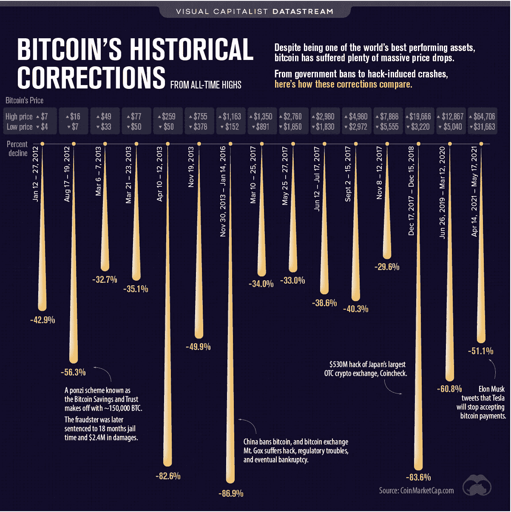

# 比特币的波动性——这并不新鲜

> 原文：<https://medium.com/coinmonks/bitcoins-volatility-nothing-new-a957654e77?source=collection_archive---------7----------------------->

## 透视 BTC 价格的最新波动

Source: [Visual Capitalist](https://www.visualcapitalist.com/bitcoin-historical-corrections-from-all-time-highs/)

上图来自 Visual Capitalist，它描绘了自 2012 年 1 月以来 BTC 最重大的 15 次价格下跌。

明显的 BTC 价格波动并不是什么新鲜事。

前七名中的三名(45%或更高)发生在过去四年…