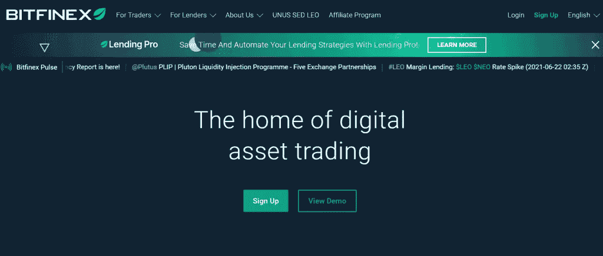

# Bitfinex 评论 2021 —它是合法的还是骗局？

> 原文：<https://medium.com/coinmonks/bitfinex-review-48727c953cc0?source=collection_archive---------9----------------------->

Bitfinex Reviews

如网站所述， [**Bitfinex**](https://blog.coincodecap.com/go/bitfinex) 是一个必去的[加密交易所](https://blog.coincodecap.com/go/crypto-exchange)平台，用于交易加密货币。这家交易所成立于 2012 年。本博客将对功能、费用、安全性等进行评论。，对 [Bitfinex](https://blog.coincodecap.com/go/bitfinex) 的详细交换。此外，Bitfinex 的评论也将帮助你理解 Bitfinex 交易所的利与弊。

# 总结(TL；博士)

*   Bitfinex 是一家总部位于香港的加密货币交易所，于 2012 年推出，由 iFinex Inc .管理。
*   使用 Bitfinex，您可以轻松交易超过 100 种数字资产，如[比特币](https://blog.coincodecap.com/a-candid-explanation-of-bitcoin)、Tron、Ether、Tether 等。
*   就交易量而言， [**Bitfinex**](https://blog.coincodecap.com/go/bitfinex) 是[领先的加密交易](https://blog.coincodecap.com/crypto-exchange)平台之一。
*   交易平台通常由中级和经验丰富的交易者使用。
*   这种[加密交换](https://blog.coincodecap.com/go/crypto-exchange)对美国客户和其他四个国家不可用，包括孟加拉国、玻利维亚、厄瓜多尔和吉尔吉斯斯坦。
*   Bitfinex exchange 是一个多语言平台，提供四种语言，即英语、俄语、普通话和粤语。
*   用你的邮件，首先，你要通过注册一个新账户来开一个账户，然后验证你的身份。之后，您可以通过选择加密货币来存入您的账户。
*   Bitfinex 也有许多订单类型，并具有保证金融资、[保证金交易](https://blog.coincodecap.com/go/margin-trading)等功能。
*   使用 Bitfinex 移动应用程序，您可以快速查看头寸、订单和交易历史。
*   Bitfinex 钱包带来了安全存储密码的便利。此外, [Bitfinex 联盟项目](https://blog.coincodecap.com/go/bitfinex)允许交易者[通过推荐赚取秘密](https://blog.coincodecap.com/go/earn-bitcoin)佣金。
*   您可以通过银行转账和加密货币进行支付。
*   Bitfinex 将客户 99.5%的资金存放在冷库中，其余 0.5%的资金存放在热钱包中，以提供交易所所需的必要流动性。
*   如果你通过 Google Authenticator 进行双重认证，那将是最好的。第二个安全级别是通用第二因子(U2F ),您必须使用物理安全密钥。

# 什么是 Bitfinex 交易所？

这个[密码交易所](https://blog.coincodecap.com/go/crypto-exchange)于 2012 年推出，允许用户买卖和交易数字硬币。 [**Bitfinex**](https://blog.coincodecap.com/go/bitfinex) 支持通过银行转账和加密货币的支付方式。这个交易平台也支持菲亚特交易。就交易量而言，Bitfinex 是最好的加密交易所之一。使用这个加密交易平台，您可以轻松地交易超过 100 种数字资产，如比特币、创、以太、系绳等。

中级和经验丰富的交易者通常使用这个平台。不幸的是，交换平台分别在 2015 年和 2016 年被黑了两次。此外，[2016 年的黑客攻击](https://www.coindesk.com/bitfinex-bitcoin-hack-know-dont-know)被认为是加密领域最大的黑客攻击之一，因为损失了 12 万 BTC。因此，Bitfinex 必须偿还客户的损失，他们必须加强安全措施。

[Bitfinex](https://blog.coincodecap.com/go/bitfinex) 秉承提供最佳和终极加密交易体验的坚定信念，努力通过向用户提供许多最先进的数字资产交易服务来履行其使命。

# 如何使用 Bitfinex？

*   用你的邮箱，首先你要在 [**Bitfinex**](https://blog.coincodecap.com/go/bitfinex) 上注册一个新账号。
*   要验证您的身份，您必须单击帐户中的“验证”选项。然后，你必须通过输入一些个人信息并上传政府颁发的身份证来验证你的身份。
*   验证后，通过银行转帐将资金存入您的 Bitfinex 帐户，然后单击“存款”按钮。然后选择您必须存款的货币，然后输入所需的银行详细信息。
*   向您的帐户注入资金后，您可以通过点击“交易”按钮并选择交易对来开始交易。

# Bitfinex 评论:移动应用

Bitfinex 移动应用面向 [Android](https://play.google.com/store/apps/details?id=com.bitfinex.mobileapp&hl=en) 和 [iOS](https://itunes.apple.com/us/app/bitfinex/id1436383182?ls=1&mt=8) 用户，你可以通过 Google Play 或 Apple Store 下载。但是，你必须下载 Bitfinex 应用程序，出于安全原因创建新的 API 密钥和密码/生物特征，并登录。

# Bitfinex 移动应用程序:功能

Bitfinex 移动应用程序的一些用途如下:

*   这个应用程序给你完全的投资组合控制。使用 Bitfinex 应用程序，您可以快速查看头寸、未平仓订单和交易历史。
*   使用 [**Bitfinex**](https://blog.coincodecap.com/go/bitfinex) 手机应用程序，你可以在世界任何地方交易多种数字货币。
*   Bitfinex 创建了这个移动应用程序，以适应交易者和用户繁忙的生活方式。该应用程序还能让你全面了解所有加密交易的最新情况，你可以随时随地进行交易。

# Bitfinex 的特性

## Bitfinex 保证金融资

Bitfinex 的融资市场允许你通过提供资金以安全的方式赚取法定货币和数字货币的利息，如果你想利用杠杆进行交易。您也可以使用自动续订选项自动续订您的优惠。

## Bitfinex 保证金交易

Bitfinex 通过从点对点保证金融资平台接收资金，为[保证金交易](https://blog.coincodecap.com/bitcoin-margin-trading-exchange)提供高达**10 倍的杠杆**。您可以输入订单并购买您想要的资金，或者您可以建立一个头寸，Bitfinex 将为您提供最优惠的资金。

## 交易交易所

[**Bitfinex**](https://blog.coincodecap.com/go/bitfinex) 提供具有顶级流动性的订单簿。此外，它使用户能够轻松兑换许多数字货币，如比特币、以太坊、EOS 等。

## 比特币期货

如果你希望降低与数字代币波动性相关的风险，Bitfinex 期货应该是你的下一站。除了[保证金交易](https://blog.coincodecap.com/go/margin-trading)和保证金融资，Bitfinex 还支持他们交易所的永久衍生品合约。交易员可以在各种交易订单上用高达 100 倍的杠杆与**进行衍生品交易。**

## Bitfinex 附属公司

如果你想发现创新的方法来获得加密，你可以尝试 Bitfinex 会员计划。交易者可以通过推荐赚取无限佣金。简单地说，在仪表板上生成邀请链接；在你的社交媒体圈里分享它们。每注册一次你的推荐，你的加密收入就会增加。

## 高级订单类型

输入多个订单可能是一项单调乏味的任务。Bitfinex 为此专门创建了一个名为 Scaled Orders 的工具。根据 [**Bitfinex**](https://blog.coincodecap.com/go/bitfinex) 的说法，这是一种“算法订单类型，旨在使交易员能够更专注于策略，而不是花费时间手动输入订单。”这个工具会在一个确定的价格范围内自动创建多个限价单，并且您仍然可以设置订单的多样性和分布。

## 票据交易

该功能允许交易者在模拟市场环境中测试交易策略，而无需存入实际资金。

还有一些高级功能，如 Bitfinex 增强报告框架、Bitfinex 终端、API 等。在 [**Bitfinex**](https://blog.coincodecap.com/go/bitfinex) 的“高级功能”部分查看它们。

# Bitfinex 评论:钱包

一个标准的 Bitfinex 帐户扩展了三个独立的钱包来支持每一个核心功能。这些钱包有利于即时资金转账，无需任何费用。

1.  **Bitfinex 交换钱包** —在支持的数字货币之间交换资金。
2.  **保证金钱包**——交易杠杆空头或多头头寸。
3.  **Bitfinex 融资钱包** —向其他交易者提供保证金融资。

除了这些， [Bitfinex](https://www.bitfinex.com/) 还有**衍生品**和**代币出售**钱包来支持那些功能。

# Bitfinex 交易所费用

您可以通过银行转账和加密货币进行支付。

## Bitfinex 存款费用

通过银行转账将资金存入 [**Bitfinex**](https://blog.coincodecap.com/go/bitfinex) 账户，要支付 0.1%的固定费用。但是，如果您通过加密货币存款，Bitfinex 将根据加密货币收取较少的费用。

## Bitfinex 取款费

如果你想通过银行转账提款，你必须支付 0.1%的手续费。但是，您可以支付 1%的费用，在工作日的 24 小时内获得。并且提取加密货币的费用因加密货币而异。

## Bitfinex 交易费用

交易费根据你一个月的交易量而变化。此外，它还取决于你是市场“接受者”(即接受报价的人)还是市场“造市者”(投资者)。此外，如果你一个月交易超过 50 万美元，你必须支付 0.2%的手续费。

# 在美国如何使用 Bitfinex？

[**Bitfinex**](https://blog.coincodecap.com/go/bitfinex) 因监管规定，不在美国提供服务。但是，如果你希望使用美国的 Bitfinex，你可以安装一个 chrome VPN 扩展，如 [Hola VPN](https://hola.org/get_hola?a_aid=606ecf87d43eb) 、 [Nord VPN](https://go.nordvpn.net/aff_c?offer_id=612&aff_id=54763) 等。然后，您可以更改您的 IP 地址位置，并开始使用 Bitfinex。

# Bitfinex 评论:安全性

在“您的安全是我们的首要任务”的标题下，Bitfinex 声明其持续改进其端到端安全措施。然而，它也表示，由于“安全和专有”的原因，它不能透露太多的安全细节。

*   [**Bitfinex**](https://blog.coincodecap.com/go/bitfinex) 将其客户 99.5%的资金存放在冷库中，其余 0.5%的资金存放在[热钱包](https://blog.coincodecap.com/best-crypto-wallets-app)中，以提供交易所所需的必要流动性。
*   你需要通过谷歌认证通过双因素认证。
*   第二个安全级别是通用第二因子(U2F ),您必须使用物理安全密钥。
*   还有高级 API 密钥权限。
*   取款是由 IP 地址和其他用户行为模式监控的。因此，这将触发管理员手动检查任何不正常的取款。
*   电子邮件加密通过加密的电子邮件通信( [PGP](https://en.wikipedia.org/wiki/Pretty_Good_Privacy) )提供更多隐私和安全性
*   DDoS 防护([分布式拒绝服务](https://en.wikipedia.org/wiki/Denial-of-service_attack))防止交易因外部攻击而停止。

# Bitfinex 评论:客户支持

*   在网站的右上角有一个绿色信息气泡形式的实时聊天。
*   在 [**Bitfinex**](https://blog.coincodecap.com/go/bitfinex) 的“帮助中心”中，列出了许多指南、定义和步骤来帮助用户进行交易和创建账户。
*   您也可以在帮助中心的搜索框中搜索您的查询。
*   您可以在网站的[联系部分](https://support.bitfinex.com/hc/en-us)填写并提交您的请求。为此，您需要提供您的电子邮件和姓名。

# Bitfinex 评论:利弊

使用 Bitfinex 的一些优点和缺点如下表所示。您可以快速浏览下表，然后再做决定。

Bitfinex Reviews: Pros and Cons

# Bitfinex 评论:结论

尽管发生了黑客事件，这家总部位于香港的加密交易所仍然是网上交易者中最好的加密交易所之一。Bitfinex platform 已经采取了所有必要的措施来纠正和挽回其客户因安全问题而失去的信任。它提升了它的安全性，它有各种保护，如 2FA，U2FA，高级 API 密钥权限，撤回保护等。

[**Bitfinex**](https://blog.coincodecap.com/go/bitfinex) 的一个优点是它提供了高流动性。Bitfinex 也有许多订单类型，并具有保证金融资、[保证金交易](https://blog.coincodecap.com/margin-trading)等功能。此外，Bitfinex 平台有一个用户友好的界面，允许用户轻松浏览网站。

但是，凭借其先进的交易工具，Bitfinex 更适合有经验的用户，而不是新手。而且 [Bitfinex](https://blog.coincodecap.com/go/bitfinex) 的大部分安全措施都不透明，很难对其安全级别进行评估。如果你是新用户，请查看我们网站上的其他交易所博客评论，以更好地了解[加密交易所](https://blog.coincodecap.com/go/crypto-exchange)和加密货币世界。

# 常见问题

**我如何为我的 Bitfinex 账户提供资金？**

您可以开始在 [Bitfinex](https://blog.coincodecap.com/go/bitfinex) 用加密货币和法定货币(如美元、欧元、英镑和日元)为您的账户注资。

在 Bitfinex 取款通常需要几个小时？

根据 Bitfinex 网站，最长取款时间可达 12 小时。但是典型的戒断时间只需要 1-2 个小时。

**如何在 Bitfinex 上购买比特币？**

下面是如何在 Bitfinex 上交易比特币的步骤。
**–**登录/注册您的 Bitfinex 帐户。
**–**从存款页面的-加密货币部分选择购买 BTC 所需的加密货币。
**–**在兑换钱包上，创建存款地址；在相应的换乘处进行换乘。
**–**一旦资金到位，就可以开始交易了。

**Bitfinex 安全吗？**

[Bitfinex](https://blog.coincodecap.com/go/bitfinex) 不受监管，在 2015 年和次年 2016 年经历了两次黑客攻击。还是。它提供双因素认证，99。5 %的客户资金存放在冷藏库和许多其他安全级别的地方。所有的安全措施都不是透明的；我们无法评估安全状况。因此，尽管交易平台的安全级别有所提升，我们也不能确定它的安全性。

**Bitfinex 提供多少种加密货币？**

它提供 100 多种加密货币。

**Bitfinex 交易所在哪里？**

Bitfinex 是一家总部位于香港的加密货币交易所，由 iFinex 公司管理。

***披露—关联链接包括***

> 加入 [Coinmonks 电报频道](https://t.me/coincodecap)，了解加密交易和投资

## 另外，阅读

*   最好的[密码交易机器人](/coinmonks/crypto-trading-bot-c2ffce8acb2a)
*   [3 商业评论](/coinmonks/3commas-review-an-excellent-crypto-trading-bot-2020-1313a58bec92) | [Pionex 评论](/coinmonks/pionex-review-exchange-with-crypto-trading-bot-1e459d0191ea) | [Coinrule 评论](/coinmonks/coinrule-review-2021-a-beginner-friendly-crypto-trading-bot-daf0504848ba)
*   [莱杰 vs n rave](/coinmonks/ledger-vs-ngrave-zero-7e40f0c1d694)|[莱杰 nano s vs x](/coinmonks/ledger-nano-s-vs-x-battery-hardware-price-storage-59a6663fe3b0) | [币安评论](/coinmonks/binance-review-ee10d3bf3b6e)
*   [Bybit 交易所评论](/coinmonks/bybit-exchange-review-dbd570019b71) | [Bityard 评论](/coinmonks/bityard-review-7d104239be35) | [CoinSpot 评论](https://blog.coincodecap.com/coinspot-review)
*   [3 commas vs Cryptohopper](/coinmonks/3commas-vs-pionex-vs-cryptohopper-best-crypto-bot-6a98d2baa203)|[赚取加密利息](/coinmonks/earn-crypto-interest-b10b810fdda3) | [网格交易机器人](https://blog.coincodecap.com/grid-trading)
*   最好的比特币[硬件钱包](/coinmonks/the-best-cryptocurrency-hardware-wallets-of-2020-e28b1c124069?source=friends_link&sk=324dd9ff8556ab578d71e7ad7658ad7c) | [BitBox02 回顾](/coinmonks/bitbox02-review-your-swiss-bitcoin-hardware-wallet-c36c88fff29)
*   [BlockFi vs 摄氏度](/coinmonks/blockfi-vs-celsius-vs-hodlnaut-8a1cc8c26630) | [Hodlnaut 审核](/coinmonks/hodlnaut-review-best-way-to-hodl-is-to-earn-interest-on-your-bitcoin-6658a8c19edf) | [KuCoin 审核](https://blog.coincodecap.com/kucoin-review)
*   [Bitsgap 审查](/coinmonks/bitsgap-review-a-crypto-trading-bot-that-makes-easy-money-a5d88a336df2) | [Quadency 审查](/coinmonks/quadency-review-a-crypto-trading-automation-platform-3068eaa374e1) | [Bitbns 审查](/coinmonks/bitbns-review-38256a07e161)
*   [密码本交易平台](/coinmonks/top-10-crypto-copy-trading-platforms-for-beginners-d0c37c7d698c) | [Coinmama 审核](/coinmonks/coinmama-review-ace5641bde6e)
*   [印度比特币交易所](/coinmonks/bitcoin-exchange-in-india-7f1fe79715c9) | [比特币储蓄账户](/coinmonks/bitcoin-savings-account-e65b13f92451)
*   [CoinDCX 评论](/coinmonks/coindcx-review-8444db3621a2) | [加密保证金交易交易所](https://blog.coincodecap.com/crypto-margin-trading-exchanges)
*   [CoinLoan 审查](/coinmonks/coinloan-review-18128b9badc4) | [YouHodler 审查](/coinmonks/youhodler-4-easy-ways-to-make-money-98969b9689f2) | [BlockFi 审查](/coinmonks/blockfi-review-53096053c097)
*   最好的[加密税务软件](/coinmonks/best-crypto-tax-tool-for-my-money-72d4b430816b) | [硬币追踪评论](/coinmonks/cointracking-review-a-reliable-cryptocurrency-tax-software-5114e3eb5737)
*   [Stackedinvest 评论](https://blog.coincodecap.com/stackedinvest-review) | [北海巨妖评论](/coinmonks/kraken-review-6165fc1056ac) | [期货交易机器人](/coinmonks/futures-trading-bots-5a282ccee3f5)
*   最佳[加密借贷平台](/coinmonks/top-5-crypto-lending-platforms-in-2020-that-you-need-to-know-a1b675cec3fa) | [杠杆令牌](/coinmonks/leveraged-token-3f5257808b22)
*   最佳[加密制图工具](/coinmonks/what-are-the-best-charting-platforms-for-cryptocurrency-trading-85aade584d80) | [最佳加密交易所](/coinmonks/crypto-exchange-dd2f9d6f3769)
*   [如何在印度购买比特币？](/coinmonks/buy-bitcoin-in-india-feb50ddfef94) | [WazirX 审查](/coinmonks/wazirx-review-5c811b074f5b) | [HitBTC 审查](/coinmonks/hitbtc-review-c5143c5d53c2)
*   [WazirX vs coin dcx vs bit bns](/coinmonks/wazirx-vs-coindcx-vs-bitbns-149f4f19a2f1)|[block fi vs coin loan vs Nexo](/coinmonks/blockfi-vs-coinloan-vs-nexo-cb624635230d)
*   [本地比特币审核](/coinmonks/localbitcoins-review-6cc001c6ed56) | [加密货币储蓄账户](https://blog.coincodecap.com/cryptocurrency-savings-accounts)
*   [比特币基地评论](/coinmonks/coinbase-review-6ef4e0f56064) | [德里比特评论](/coinmonks/deribit-review-options-fees-apis-and-testnet-2ca16c4bbdb2) | [FTX 评论](/coinmonks/ftx-crypto-exchange-review-53664ac1198f)
*   [n 平均零点评审](/coinmonks/ngrave-zero-review-c465cf8307fc) | [Phemex 评审](/coinmonks/phemex-review-4cfba0b49e28) | [PrimeXBT 评审](/coinmonks/primexbt-review-88e0815be858)
*   最佳[区块链分析](https://bitquery.io/blog/best-blockchain-analysis-tools-and-software)工具| [赚比特币](/coinmonks/earn-bitcoin-6e8bd3c592d9)
*   [加密套利](/coinmonks/crypto-arbitrage-guide-how-to-make-money-as-a-beginner-62bfe5c868f6)指南| [如何做空比特币](/coinmonks/how-to-short-bitcoin-568a2d0b4ae5) | [Prokey 回顾](/coinmonks/prokey-review-26611173c13c)
*   [币安交易机器人](/coinmonks/binance-trading-bots-d0d57bb62c4c) | [OKEx 审查](/coinmonks/okex-review-6b369304110f) | [阿塔尼审查](https://blog.coincodecap.com/atani-review)
*   [最佳加密交易信号电报](/coinmonks/best-crypto-signals-telegram-5785cdbc4b2b) | [MoonXBT 评论](/coinmonks/moonxbt-review-6e4ab26d037)
*   [Godex.io 审核](/coinmonks/godex-io-review-7366086519fb) | [邀请审核](/coinmonks/invity-review-70f3030c0502) | [BitForex 审核](/coinmonks/bitforex-review-c4bb28d9e271)

*原载于 2021 年 6 月 23 日 https://blog.coincodecap.com***。**