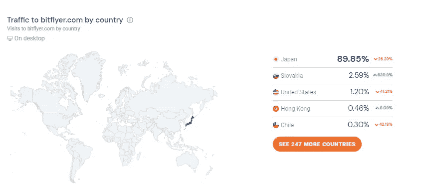
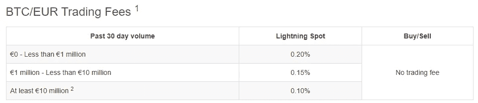

# Bitflyer 评论——为什么它在美国还不流行？

> 原文：<https://medium.com/coinmonks/bitflyer-review-why-its-not-popular-yet-in-the-us-d5e5ea8a749b?source=collection_archive---------2----------------------->

# bitFlyer 加密货币交易所概述

在阅读完这篇 **bitFlyer 评论**之后，你将对这个加密货币交易所有足够的了解，知道这个交易所是否适合你。

bitFlyer 被认为是最古老的加密货币交易所之一。2014 年在日本成立，2017 年在美国和欧洲扩大业务。bitFlyer's 是日本最受欢迎的交易所之一，自那以来，他们与其他加密巨头如 **Liquid exchange** 和 **Huobi Global 一起在日本获得了很大的市场份额。**

**在撰写本文时，bitFlyer 是第 13 大比特币交易市场，过去 24 小时的交易量为 383，681 美元。**

让我们来看看一些关键指标，以了解 bitFlyer 的规模。

他们每月有大约 446 万游客，其中最大一部分游客来自日本。其次是斯洛伐克和美国，分别只占其游客总数的 2.59%和 1.2%。

这证实了我们之前的陈述——bit flyer 的主要关注点是日本。他们的营销和客户获取目标都与日本有关，这也是如此大规模的交易所迄今为止从未在美国大受欢迎的原因。

这将在未来几周内改变，因为 bitFlyer 已经推出了在其他国家获得更大市场份额的计划，主要是美国。

值得注意的是，bitFlyer 以合法的方式开展业务，因为他们是一家完全受监管的加密货币交易所，并拥有以下许可证:

1.  卢森堡金融监督委员会(CSSF)颁发的支付机构许可证允许他们在欧洲开展业务。
2.  BItFlyer 被日本金融厅注册为虚拟货币交易所。
3.  BitFlyer 获得了在美国 42 个州运营的许可。

# bitflyer 的评论

**在评估了加密货币交易的所有关键因素后，bitFlyer 获得了 85%的总分。作为一家领先的交易所，它们具备所有的基本条件。**

bitFlyer 在 5 个支柱中的 3 个取得了非常好的分数**,使得加密货币交易所表现强劲，在另外两个支柱中取得了平均分数**。****

********

# ****bitFlyer 的优势****

## ****安全性****

****每年都有许多交易所被黑客攻击，这应该是所有保持虚拟资产在线的加密爱好者所关注的问题。****

****本周，日本另一家领先的加密货币交易所 Liquid 被盗，价值超过 9000 万美元的加密货币被盗。这提醒我们，安全应该是所有爱好者的头等大事。****

****所有的交易所都包括液态交易，它们将资金冷藏起来，并拥有一流的安全系统。****

******这说起来容易做起来难。******

****我们不是这方面的专家，也不知道黑客是否可以利用其他的漏洞。****

******我们只知道黑客攻击仍在发生。******

****在任何交易所保存加密货币都有很大的风险，这与 bitFlyer 没有什么不同。****

****然而，我们知道，如果你想每天交易加密货币，你必须在交易所保留一定比例的加密货币，这使你能够尽快出售和重新购买。****

****使用像 bitFlyer 这样的交易所，它在安全方面有着防弹性能，可以保证你把钱放在网上最安全的地方之一。****

****别忘了， **bitFlyer 在他们 7 年的运营中**从未被黑过。这意味着他们正在做的事情在安全性方面是正确的。****

********

## ****bitFlyer 超级用户友好****

****很难找到一家布局比 bitFlyer 更简单的交易所。登录后，主控制面板会提示您，让您可以轻松浏览平台。****

****加密货币交易所为了吸引用户，向用户提供大量信息和复杂产品，这是一种非常常见的做法。根据经验，这通常会适得其反——尤其是对于初学者。****

****当初学者信息超载时，他们最终会放弃。****

****通常新手友好的交流是有价格的，而且比通常的费用要高——这不是 bitFlyer 的情况，因为他们设法保持他们的价格非常有竞争力。****

## ****竞争性费用****

****bitFlyer 的交易费是业内最低的。如下所示，费用因过去 30 天的交易量而异，但小额交易的费用仍然很低。****

****此外，bitFlyer 费用因您所在的司法辖区而异，这意味着 **bitFlyer Japan** 、 **bitFlyer USA** 和 **bitFlyer Europe** 采用不同的费用结构。****

## ****bitFlyer 欧洲费用****

****欧洲版的 bitFlyer 对现货交易和从其平台上提取某些加密货币收取费用。在进行欧元存款和取款时，还需要支付与 SEPA 银行转账相关的费用。****

****应付费用的最高金额为 **0.20%的费用，适用于闪电地点**。****

****************

## ****bitFlyer 美国费用****

****bitFlyer 美国交易所的收费结构相对简单，与欧洲类似。****

****如果交易所仅用于在贸易账户或贸易专业账户上买卖加密货币，则不收取固定费用。****

****该交易所通过对在**闪电地点**的交易和交换加密货币收费来赚钱，还收取电汇费(Fedwire)。****

****提现费有点多，可以用 ACH 来避免。****

********

****No fee for buying and selling.****

********

****Withdrawal fees bitFlyer (US)****

# ****bitFlyer 的弱点****

## ****全球平均用户数****

****加密货币交易所的用户越多，该交易所就越有信心和信誉。****

****bitFlyer 传达了对日本的信心，事实上他们是日本的第二大交易所，然而这个**在世界其他地方仍然不是这样。******

****虽然这已经在交易所的议程上，但我们希望看到 bitFlyer 按照他们的计划在美国和欧洲打破壁垒。****

****这将表明交易所在整个公司范围内都有坚实的基础，而不仅仅是在他们的重点市场。****

## ****支持硬币****

****我们预计，这种规模的交易所将有很好的加密货币组合，用户可以将它们添加到自己的投资组合中。****

****目前，bitFlyer 只提供市值较大的硬币，因此用户几乎没有机会尝试不太知名的风险更高的硬币。****

****最常用的中级/高级策略之一是在**大市值硬币、中等市值硬币和低市值硬币之间进行分割。******

****这使得交易者能够分散不同虚拟资产的风险。不幸的是，bitFlyer 目前无法做到这一点，这使得该交易所不适合高级交易者。****

****目前，bitFlyer 支持**比特币、以太坊、以太坊经典、莱特币、比特币现金、MonaCoin 和 LISK。******

********

# ****在 bitFlyer 上购买密码的逐步指南****

# ****使用 bitFLyer 开户****

****用 Bitflyer 创建一个账户非常简单——这是在其他地方开设其他账户的常见流程。您必须提供您的个人详细信息和联系方式，包括您的电子邮件和手机号码。****

********

****一旦您开立账户，您将立即获得基本类型账户**‘交易账户’**。此帐户有一些限制，可以通过提供身份证明和居住证明升级到**‘Trade Pro**’。****

****这两个账户类别之间的主要区别在于存入和提取的金额。下表对这些进行了概述。****

****比如说。您只能在'**贸易账户**'上进行最高 249.99 欧元的交易，而您在**'贸易专业账户'上拥有无限的最高交易金额。******

********

****bitFlyer 推出了一个名为**‘快速身份验证’，**的即时验证程序，允许新用户验证他们的账户，并在几分钟内无限制地开始交易。****

****这对于 bitFlyer 来说是一个很大的优势，因为加密世界的节奏很快，任何人都没有必要等待几个小时或几天才能买到想要的加密货币。****

********

****在右下角，你可以找到你的帐户的状态。包括以下详细信息****

*   ****您的帐户类别。在**贸易**或**贸易之间。******
*   ****双因素认证****
*   ****个人信息****
*   ****身份证明****

****如果您想启动验证流程，您只需点击**‘未提交’**按钮，流程便会启动。此外，出于安全原因，我们强烈建议您启用双因素认证，这将保护您的帐户免受黑客攻击或欺诈。****

********

# ****在 bitFlyer 上购买加密货币****

****在 Bitflyer 上购买加密货币包括两个步骤:****

*   ****通过**“账户资金”**部分为您的账户提供资金。****
*   ****使用存入的资金购买加密货币****

****目前有两种方法可以为你的 bitFlyer 账户提供资金，要么通过银行转账，要么使用 Paypal。 Visa 和万事达卡充值目前在交易所禁用。****

****Paypal 是为您的帐户充值的最简单方式。由于加密货币带来的风险，Paypal 只与几家声誉良好的交易所合作，幸运的是，bitFlyer 就是其中之一。****

****Paypal 等电子钱包因其便利性而闻名，如果易用性是你的首要考虑，那么 Paypal 肯定是一个选择。****

****值得注意的是，便利是有代价的，根据你所在的位置，Paypal 的押金最低为 4.9%。****

********

****在**“账户资金”**部分，需要注意以下几点:****

1.  ****所选支付方式的费用。****
2.  ****存款到达交易所所需的时间。他们表示，银行转账可能需要 3 个工作日，但在大多数情况下，资金会更快到达，尤其是在 SEPA 转账(欧盟)时。****

********

****相同的**“账户资金”**部分也用于提款。出于安全原因，只能从与注册用户同名的银行账户提款。****

********

****从**购买/出售**部分，您可以购买/出售您的加密货币。在顶部，你可以看到提供的加密选项。****

********

# ****什么是 bitFlyer 闪电交易所？****

********

******Lightning Network 是一种比特币技术，它是 bitFlyer exchange 的一部分，支持参与节点之间近乎即时、近乎免费的交易**。有人提出，这是对比特币目前点对点技术的升级，目的是安全地建立一个参与者网络，他们可以直接相互交易。****

****闪电网络建立的参与者网络或支付渠道可用于进行小额支付，这在区块链通常是昂贵且耗时的。****

****一方将发送交易以打开支付通道并存入必要的金额。另一方将从另一个节点进行同样的操作，在它们之间建立连接。**双方可以通过此连接进行支付，而无需在区块链**上广播任何内容，除了打开和关闭频道。****

********

****主账户的**相同登录信息**用于 bitflyer lightning。bitFlyer 上的闪电交易所是一项允许您使用闪电网络(LN)交易比特币(BTC)的服务****

******您只能使用比特币(BTC)** 的闪电服务。当您执行交易时，您帐户中的 BTC 将自动加载到闪电钱包中，并在平仓后撤回到您的主帐户中。****

****这个过程类似于在开仓时存入的比特币，但在闪电的情况下，比特币是从一个人的账户中取出的。****

****你可以在开始交易前存入 BTC。当您开始交易时，BTC 的存款金额将被锁定在一个 LN 节点中，用于将来的支付交易。****

****在你的锁定被确认后，你将可以与另一个人交易。****

****在交易开始前已经存入并锁定到 LN 节点的 BTC 在交易结束后仍然存在。当你开始一个新的交易时，你现有的锁定可以再次使用。****

****您可以在 bitFlyer Lightning Exchange 上访问您的全部 BTC 余额。****

****您可以随时从您的主 bitFlyer 账户中提取部分或全部 BTC 余额。****

****最小批量为 0.01BTC (0.1mBTC)。请在执行前检查当前的市场状况并使用您的最佳判断，**可以肯定地说，bitFlyer lightning exchange 不适合初学者。******

********

# ****闪电兑换和 bitflyer 上的主账户有什么区别？****

****如前所述，闪电交易所用于交易。这涉及到确定市场将在哪里赚取额外的钱，**而主账户是一项持有你的比特币的服务**。****

****有了 bitFlyer 的主账户，你可以存钱、取钱和转账。例如，您可以使用它向他人汇款或将现金兑换成数字货币。****

# ****关于 bitFlyer 的结论****

****[**bitFlyer 加密货币交易所对于寻求以**安全、便捷和受监管的方式买卖虚拟货币的交易者和投资者来说，是一个极好的交易****](https://bitflyerglobal.pxf.io/c/2565056/858437/11990) 选择。交易所为**新用户和中间用户提供优质服务，**因为密码只需几步就能买到。****

**此外，bitFlyer 的费用是业内最低的，事实上，正如之前在费用结构部分中强调的**，买卖加密货币是免费的，除非你使用闪电点进行交易。这使得它成为每个寻找快速、可靠、廉价菲亚特网关的人的便捷选择。****

**回到我们最初的问题— **为什么 bitFlyer 在美国还不流行？****

**在看了美国市场后，很明显，美国的密码爱好者更喜欢使用交易所，如比特币基地和北海巨妖。这两家加密货币交易所是美国市场的大玩家，被公众认为是蓝筹交易所。如果美国公民想购买加密货币，在比特币基地或北海巨妖开立账户是很自然的事情。**

**[**别忘了比特币基地曾数次成为头条新闻，尤其是因为他们是今年第一家在纳斯达克上市的交易所。**](https://cryptoenthusiast.net/coinbase-review-with-infographic)**

****

****比特币基地上 55%的访客来自美国**，很明显他们的营销努力集中在美国市场。对于 bitFlyer 来说，想要在美国获得良好的市场份额并不是一件容易的事情。改变公众的观点往往是该公司最困难的任务之一，然而现实是，bitFlyer 提供的服务可以与比特币基地的服务相媲美。**

**通过正确的努力，这可能很快就会发生！**

**

bitFlyer key Features** 

> **加入 coin monks 电报频道，了解加密交易和投资**

*   **[币安收费](/coinmonks/binance-fees-8588ec17965) | [Botcrypto 审查](/coinmonks/botcrypto-review-2021-build-your-own-trading-bot-coincodecap-6b8332d736c7) | [Hotbit 审查](/coinmonks/hotbit-review-cd5bec41dafb) | [KuCoin 审查](https://blog.coincodecap.com/kucoin-review)**
*   **[我的加密副本交易经历](/coinmonks/my-experience-with-crypto-copy-trading-d6feb2ce3ac5) | [AAX 交易所评论](/coinmonks/aax-exchange-review-2021-67c5ea09330c)**
*   **[Bybit 融资融券交易](/coinmonks/bybit-margin-trading-e5071676244e) | [币安融资融券交易](/coinmonks/binance-margin-trading-c9eb5e9d2116) | [Overbit 审核](/coinmonks/overbit-review-9446ed4f2188)**
*   **[有哪些交易信号？](https://blog.coincodecap.com/trading-signal) | [比特斯坦普 vs 比特币基地](https://blog.coincodecap.com/bitstamp-coinbase)**
*   **[ProfitFarmers 点评](https://blog.coincodecap.com/profitfarmers-review) | [如何使用 Cornix Trading Bot](https://blog.coincodecap.com/cornix-trading-bot)**
*   **[加密货币储蓄账户](/coinmonks/cryptocurrency-savings-accounts-be3bc0feffbf) | [YoBit 审查](/coinmonks/yobit-review-175464162c62) | [Bitbns 审查](/coinmonks/bitbns-review-38256a07e161)**
*   **[Botsfolio vs nap bots vs Mudrex](/coinmonks/botsfolio-vs-napbots-vs-mudrex-c81344970c02)|[gate . io 交流回顾](/coinmonks/gate-io-exchange-review-61bf87b7078f)**
*   **[CoinFLEX 评论](https://blog.coincodecap.com/coinflex-review) | [AEX 交易所评论](https://blog.coincodecap.com/aex-exchange-review) | [UPbit 评论](https://blog.coincodecap.com/upbit-review)**
*   **[AscendEx 保证金交易](https://blog.coincodecap.com/ascendex-margin-trading) | [Bitfinex 赌注](https://blog.coincodecap.com/bitfinex-staking) | [bitFlyer 审核](https://blog.coincodecap.com/bitflyer-review)**