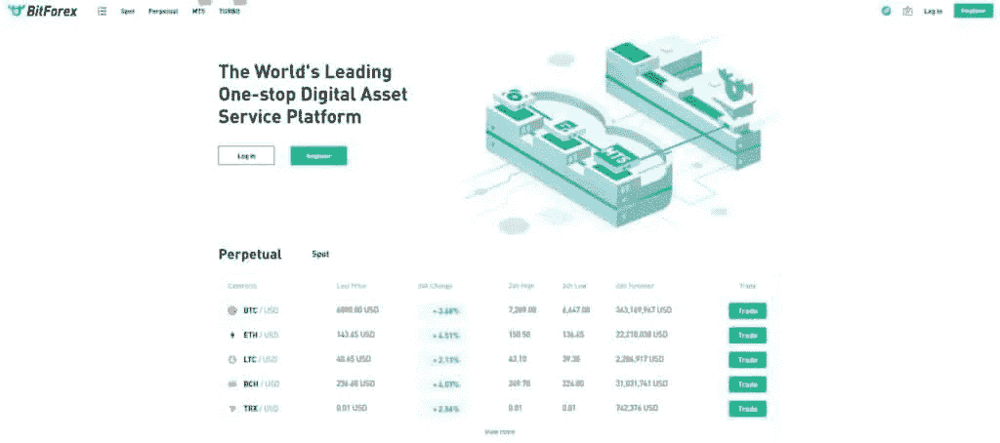
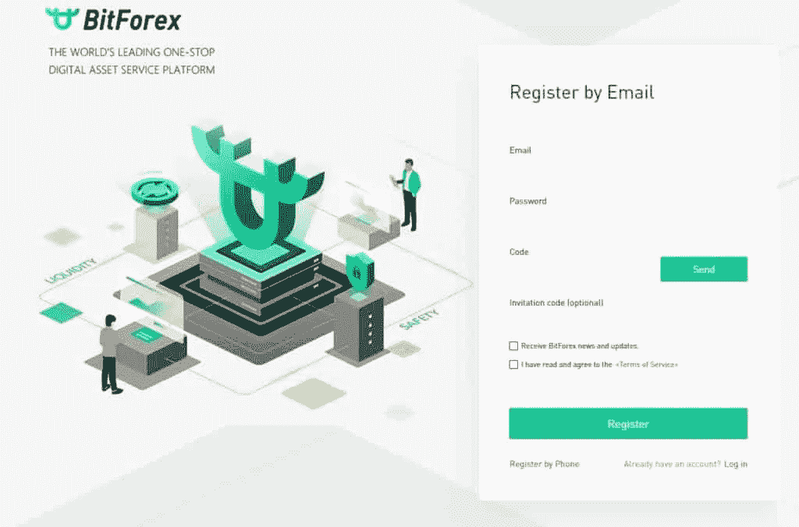
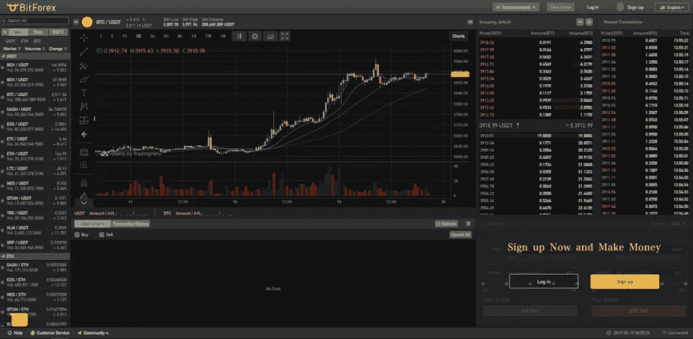
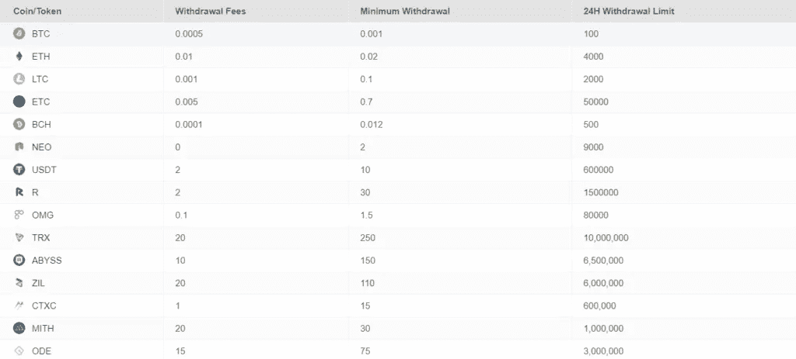
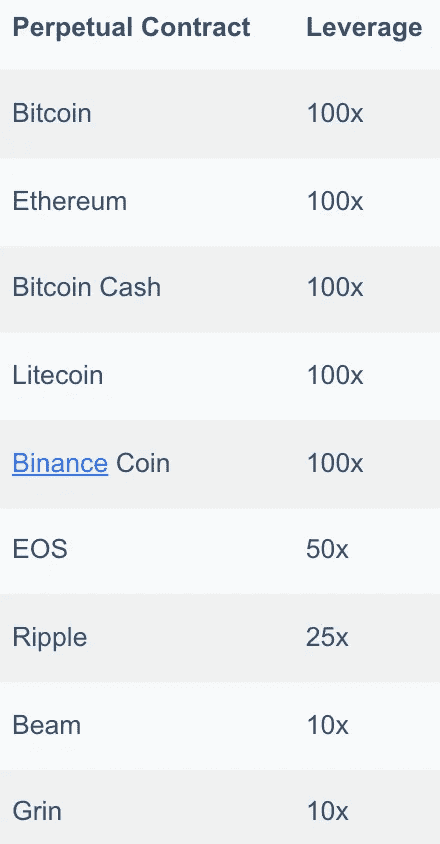
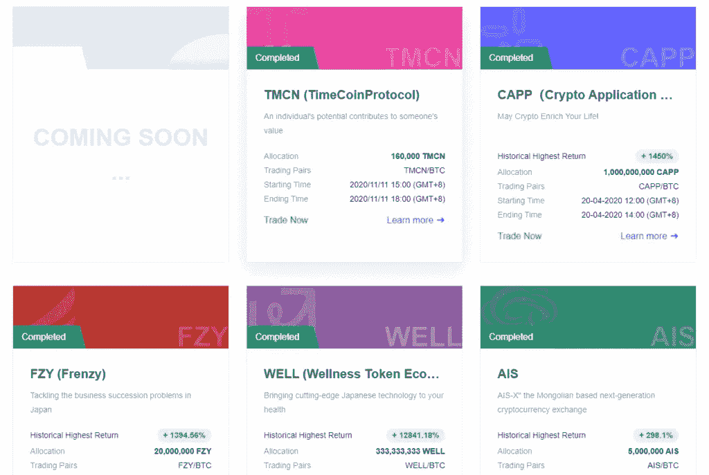
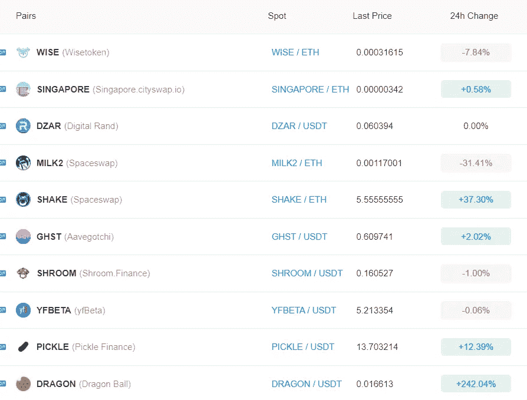
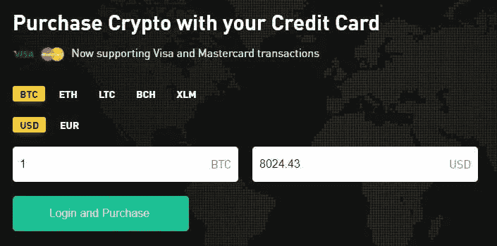
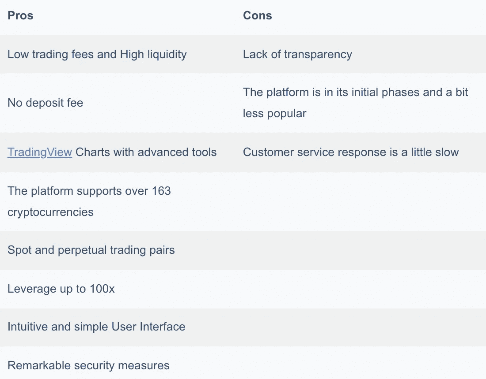
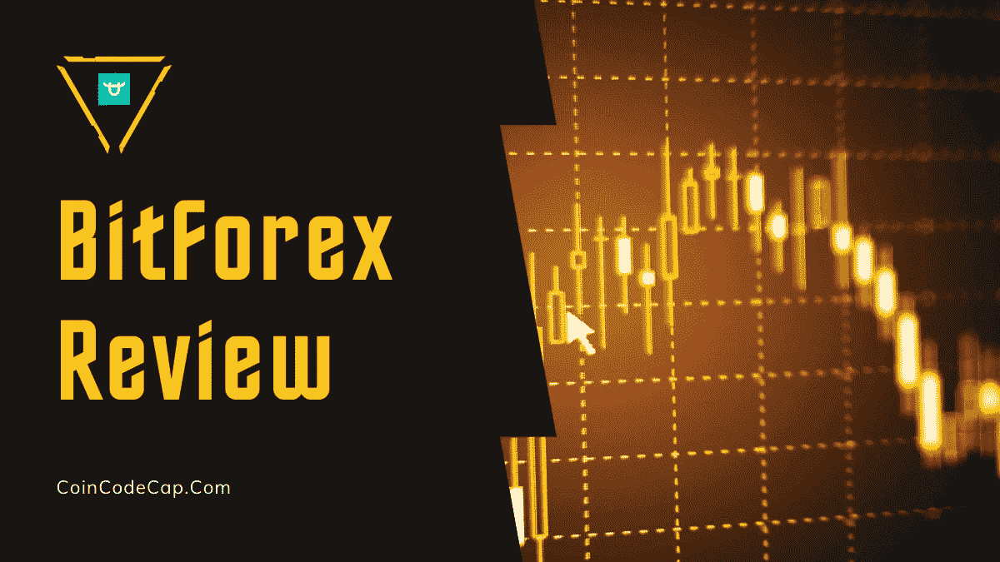

# BitForex 评论——真的安全吗？

> 原文：<https://medium.com/coinmonks/bitforex-review-c4bb28d9e271?source=collection_archive---------3----------------------->

本文我们就来回顾一下 [**BitForex**](https://blog.coincodecap.com/go/bitforex) 交易所。该平台致力于为用户参与下一代金融工具和密码交易创造一个安全、便捷、专业的平台。

## 总结(TL；博士)

[BitForex](https://www.linkedin.com/in/jason-luo-a3a72015/)的首席执行官杰森·罗说:“我们致力于通过不断推出新功能来满足新需求。我们旨在为用户提供更好的选择。”Bitforex 坚守自己的承诺，因为在过去几年中它已经推出了一些很棒的功能和产品。

*   低交易费用和无存款费用
*   [**BitForex**](https://blog.coincodecap.com/go/bitforex) 提供现货交易和永久合约，杠杆高达 100 倍。
*   没有 KYC 验证强制。
*   它还提供短信验证和 2FA 认证。
*   您还可以通过 [BitForex](https://blog.coincodecap.com/go/bitforex) API 管理选项创建您的 API 密钥。
*   BitForex 有一个上市平台，该团队为全球的优质 IEO 上市设计了这个平台。
*   BitForex 有一个易于使用的移动应用程序，可以在 [iOS](https://download.bitforex.com/app/en.html) 和 [Android](https://play.google.com/store/apps/details?id=com.bitforex.pro&hl=en_US&gl=US) 上使用(邀请码— **2793729** )

## 什么是 Bitforex？

[**Bitforex**](https://blog.coincodecap.com/go/bitforex) 是一个相对较新的交易交易所，提供现货交易、[保证金交易](https://blog.coincodecap.com/margin-trading)，杠杆高达 100 倍的永久合约，以及单独的[社交交易平台](/coinmonks/top-10-crypto-copy-trading-platforms-for-beginners-d0c37c7d698c)。它们提供大约 300 个交易对，超过 163 种加密货币，在 180 多个国家运行。

BitForex 表示，其交易引擎每秒可以处理 160 万笔订单。截至 2021 年 5 月 11 日，Bitforex 的 24 小时交易量为 5882058663 美元。“BF”是他们的代币，其对美元的价格目前是 0.01174 美元。

在公司成立之初， [Crypto Capital](https://blog.coincodecap.com/go/crypto-capital) 、 [Block VC](https://www.blockvc.com/index-en.html) 、 [Genesis Capital](https://genesis-capital.com/) 、Node Capital、 [TRON](https://tron.network/) 等知名加密投资人和机构通过投资超过 2000 万美元来资助平台的运营。

## 如何在 Bitforex 上注册？

注册 [**BitForex**](https://blog.coincodecap.com/go/bitforex) 非常简单，KYC 验证不是强制性的。一旦您访问 BitForex 网站，您将点击页面右上角的“注册”选项。您必须输入您的电子邮件 id，并为该帐户选择密码。输入验证码和邀请码( **2793729** )。然后，它将完成您的注册。

## 什么时候需要 KYC？

如果在每日交易超过 10，000 美元时检测到异常 IP 地址行为，将强制要求 KYC。

## 如何在 Bitforex 存 Crypto？

将加密货币存入 [**BitForex**](https://blog.coincodecap.com/go/bitforex) 的步骤是:

1.  选择页面右上角的“资产”选项打开您的钱包。
2.  从左侧菜单中选择“存款”。
3.  选择您喜欢的加密硬币，并使用给定的钱包地址从您的钱包中转账。

## Bitforex 最低存款

BitFore x 上没有最低存款限额**，存入的币 1 次确认后到账，3 次确认后取款有效。**

你也可以使用任何简单的信用卡购买密码。在此期间，您可以直接在平台上购买[比特币](https://blog.coincodecap.com/a-candid-explanation-of-bitcoin)、比特币现金、以太坊、莱特币和恒星流明。

如果您想要购买的加密不可用，您可以使用 EazySwap 轻松地将任何其他加密资产交换为首选资产(我们将在稍后讨论)。

## 如何在 Bitforex 下单？

对于一些人来说，下单可能会令人望而生畏，但有了 [BitForex](https://blog.coincodecap.com/go/bitforex) ，您可以轻松下单限价和有条件订单。

## 什么是限价单和有条件订单？

限价单允许你以特定的价格买入或卖出资产。而对于条件指令，如果满足指定的标准(通常是激活其他指令的触发价格),它们会自动提交订单。

## 如何在 BitForex 上交易？

您可以使用主交易窗口**进行交易。这些步骤是:**

1.  **输入您希望购买或出售的资产金额。**
2.  **陈述挂单的挂单价格。**
3.  **选择杠杆金额。**
4.  **选择买入/做多或卖出/做空。**

**下单并执行订单后，屏幕底部将显示实时交易。作为一名交易者，你可以选择查看所有当前头寸。BitForex 还允许您查看:**

*   **保证金，**
*   **数量，**
*   **值，**
*   **清算价格，**
*   **入门价格，**
*   **现价，**
*   **意识到 P&L，和**
*   **未实现的 P&L**

**如果你对自己的头寸有信心，你也可以和朋友分享这笔交易。如果您是加密交易小组的活跃影响者或有付费小组，此功能会更有用。**

## **比特外汇交易所评论:交易**

**[**BitForex**](https://blog.coincodecap.com/go/bitforex) 提供 BitForex 做空功能，在资产被高估时做空。**

**你可以在 BitForex 的现货市场和永久市场交易。**

****

## **什么是现货交易和永久合约？**

**现货交易是指你可以交易资产进行即时交割。期货合同是指相关资产在未来某一日期交割。通过使用永久合同，您有机会假设并押注数字资产的价格波动。**

**永久合同是期货合同的一种。但与期货合约不同，永久合约没有到期期限。还有，在 [**BitForex**](https://blog.coincodecap.com/go/bitforex) 上，除了资金成本，没有任何隐性收费。据估计，永久交易占 BitForex 加密货币交易总量的 70%。**

## **为什么使用永久合同？**

**例如，如果你认为 BTC/美元的价格可能会上涨，那么你可以买入或做多，从价格上涨中获利。另一方面，要获得利润，如果你认为 BTC/美元成本可能下降，你可以卖出/做空头寸。**

## **在 BitForex 进行现货和永久交易的步骤:**

1.  **确保您的 BitForex 账户有资金。**
2.  **根据您的需要，单击“定点”或“永久”。**
3.  **选择你喜欢的交易对手。**
4.  **说明订单大小和订单价格。**
5.  **确认订单，一旦您的订单被执行，您的资金将被存入您的 exchange 钱包。**
6.  **[BitForex](https://blog.coincodecap.com/go/bitforex) 然后将已执行/已取消的订单移至订单历史标签。**

## **比特外汇费用**

**检查费用是必不可少的，但当你在[保证金交易平台](https://blog.coincodecap.com/bitcoin-margin-trading-exchange)进行大量交易，并支付高于你保证金的头寸费用时，检查费用就更重要了。**

## **押金**

**BitForex 不向您收取任何存款费用。**

## **取款费**

**在 [BitForex](https://blog.coincodecap.com/go/bitforex) 的提现费可能因每种加密资产而异。例如，从 BTC 提款，你将被收取 0.0005 BTC 的费用。这仍然低于全球行业平均水平。**

## **现货交易费**

**现货交易的做市商和收单商的“固定费用”为 **0.1%** ，远低于全球行业平均水平 **0.25%** 。**

## **永久交易费**

**如果交易 BTC 或 ETH，永续交易的做市商费用为 0.04%，收单人费用为 **0.06%** 。如果你交易的密码不是 BTC 或瑞士联邦理工学院的，那么制造商和接受者的费用都是 0.06%。**

## **MT5 费用**

**[BitForex](https://blog.coincodecap.com/go/bitforex) 在 BitForex MT5 平台上交易、购买或销售产品时向您收取佣金。**

**外汇/商品/金属/指数交易的佣金为 10 美元。而对于加密货币，每笔交易的费率为 **0.08%** 。**

**尽管如此，如果符合以下条件，你将不必支付任何交易费用:**

*   **你有超过 1000 BTC 的 30 天交易量，**
*   **你在交易所至少持有 50 BTC。**

## **BitForex 美元提款**

**在从 [BitForex](https://blog.coincodecap.com/go/bitforex) 提款时，您将有每日提款限额。例如，**BTC 每日最低取款限额为 0.0001 BTC，最高为 100** 。**

**假设你碰巧提取了超过限额的金额。在这种情况下，您需要在开始交易之前进行双重身份验证。**

**如果你碰巧因为某种原因更改了密码，你将不得不等待三天才能提取你的资金。**

****

## **Bitforex 评论:移动应用**

**Bitforex 移动应用可用于 iOS 和 Android 设备。该应用程序有一个直观的用户界面，非常简单，易于使用。您可以轻松舒适地从移动应用程序访问所有功能和服务。**

## **Bitforex 交换功能**

## **交易界面**

**你会花差不多 90%的时间在主交易界面上徘徊。所以交易界面不复杂是不可能的。**

**没有拥挤的菜单和混乱。他们在左边列出了交易对，订单簿在右边。图表在中间，而卖出和买入选项在页面的底部。**

## **有哪些交易图？**

**[**BitForex**](https://blog.coincodecap.com/go/bitforex) 使用 [TradingView](https://blog.coincodecap.com/go/tradingview) 提供实时价格图表。图表界面设计得非常好，以平滑、干净和直观的图表而闻名。您可以通过使用提供的高级交易工具和指标来分析和最大化利润。**

**[交易视图](https://blog.coincodecap.com/go/tradingview)图表为你提供了广泛的时间框架，使你能够绘制趋势线，添加图表模式和指标。图表指标，如相对强度指数，简单移动平均线，布林线，平均真实范围，Ichimoku，等等。这些工具和指标帮助你用限价单、止损单或市价单完美地为你的交易计时。**

## **交易对**

**你可以在现货市场上使用超过 163 种加密货币和 9 种高杠杆的永久合约进行交易。交易对，如:**

*   **比特币(BTC/美元)**
*   **比特币现金(BCH/美元)**
*   **乙醚(乙醚/美元)**
*   **莱特币(里特/美元)**
*   **纹波(XRP/美元)**
*   **梁(梁/美元)**
*   **EOS(EOS/美元)**
*   **格林(格林/美元)**
*   **[币安](https://blog.coincodecap.com/go/binance)币(BNB/美元)有售。**

## **比特外汇杠杆**

**BitForex 为您提供高达 100 倍的永久合约杠杆。杠杆交易对交易者来说是一个强有力的工具。它有助于利用相对较小的价格波动来更快地增加你的余额。**

## **它到底是如何工作的？**

****BitForex 放下你交易总价值的一小部分，它提供剩下的部分来促进更显著的头寸规模，而不占用你的资本。然而，这也可能导致损失，因为这种投资总是受到市场风险的影响。下表显示了不同加密资产的优势。****

********

****BitForex Perpetual Contract****

## ****什么是 Bitforex 分级保证金比例制度？****

****上述比率有助于避免重要头寸的清算，因为它们会对市场流动性产生重大影响。它通过以较高的初始保证金比率向较高的头寸提供较低的杠杆来发挥作用。****

## ****Bitforex 评论:交易所产品****

****[BitForex](https://blog.coincodecap.com/go/bitforex) 有各种产品。我们在下面详细解释了它们。****

## ****BitForex MetaTrader 5 (MT5)****

****BitForex 有一个名为 MT5 的交易平台，让用户在交易传统金融产品时有更多的优惠和选择。通过这样做，他们旨在拓宽加密货币行业的经济前景。****

****[**BitForex**](https://blog.coincodecap.com/go/bitforex) 为您提供 300 多个交易对，杠杆高达 200 倍。你还可以进行差价交易，也就是差价合约交易。****

****CFD 交易让你通过参与你和经纪人之间的合约来交易一项资产，而不是直接在某个市场上开仓。****

****不同产品的差价合约如下:****

*   ****加密货币和外汇-超过 100 个差价合约****
*   ****商品-超过 20 种差价合约****
*   ****指数-超过 10 个 CFD****
*   ****费用相当低。****

****基本支持的货币有 BTC、瑞士法郎、XRP 和 USDT。****

****你可以直接从你的钱包里转账到你的 MT5 账户。最好的部分是，他们为你提供了许多先进的技术分析工具。有 30 多种流行的技术指标、时间框架和交互式图表可用。****

****在这里， [BitForex](https://blog.coincodecap.com/go/bitforex) 为您提供了“试用模拟账户”选项、一步一步的指南教程和一份产品规格 PDF。****

## ****BitForex 评论:社交交易平台****

****BitForex 的社交交易类似于[复制交易](/coinmonks/top-10-crypto-copy-trading-platforms-for-beginners-d0c37c7d698c)。作为投资者，你可以通过他们的社交交易平台分享你的交易策略、条件和情况。通过订阅该平台，您还可以获得额外收入。****

****如果你想寻找社交交易的顶级交易者，你可以使用排行榜。****

****您可以选择复制交易，将您的投资组合与您在社交交易平台上关注的交易者联系起来。这样，被跟踪的交易者的交易会自动复制到你的投资组合中。而最棒的是，你可以做到这一切，而不必支付任何额外的费用。****

## ****BitForex Turbo****

****最近，人们可以看到大量毫无价值的 IEO 项目的启动。**bit forex 给你一个黄金机会，在一个过度饱和的市场中寻找即将到来的有增长潜力的 IEO 项目。提供这种程序的密码公司数量非常少。******

******BitForex 的 Turbo 是一个上市平台。BitForex 设计它是为了在世界各地的 IEO 上市。它允许您查看和跟踪即将到来的和已完成的首席执行官的信息。这包括查看交易对、总分配、开始/结束时间等。******

************

## ******BitForex Capp******

******Capp 是 [**BitForex**](https://blog.coincodecap.com/go/bitforex) **的**开放平台，使您能够访问大量区块链应用程序。Capp 代表加密应用，也被称为 Capp 镇。提供的几个应用类别是娱乐(即 Twitch)、金融(即 Matrix Port、 [Paxful](https://blog.coincodecap.com/paxful-review) )和信息(即 [CoinGecko](https://www.coingecko.com/) )。您还可以选择在 BitForex 网站上申请自己的 Capp。******

## ****比特外汇评论:高炉部门****

****BitForex 有一个 BF 部门，一个单独的区域用于分散融资、不可替代代币和 Polkadot。通过交易这些区域的资产，你帮助创造了一个开放的、不可改变的区块链。****

********

## ****比特外汇评论:轻松互换****

****EazySwap 是一个半分散的匹配协议，作为一个自动化的流动性提供者在 ETH 上工作。这个新的交易平台允许您交易或选择超过 980 种不同的 ERC20 代币。首先，通过使用 EazySwap，你可以使用流动性池而不是传统市场进行自动交易。****

****到目前为止，EazySwap 只支持 ERC20 令牌，并且可能很快会提供一些主要的 net 令牌。此外，最大的好处是零油费、即时匹配和低滑动。处理 EazySwap 上的交易的流动性池提供商获得 100%的交易费作为奖励。此外，通过使用 EazySwap，您可以完全访问块上的数据。****

## ****BitForex 的 ETH 2.0****

****[以太坊 2.0 赌注](https://blog.coincodecap.com/binance-eth2-staking)使您能够将您的以太坊代币在 [**BitForex**](https://blog.coincodecap.com/go/bitforex) 上下注，成为节点服务商。****

****你可以从押 0.1 ETH 开始，随时持有或交易你押的 ETH。您可以根据您对 BitForex 池的贡献比例获得奖励。****

# ****BitForex 评论:存款方式****

****BitForex 的存款方式非常方便，任何新手加密投资者都会很快支付任何资产。 [**BitForex**](https://blog.coincodecap.com/go/bitforex) 被称为“入门级交易所”，因为它支持各种支付方式，如电汇、来自其他交易所的密码、信用卡、借记卡、现金，甚至银行账户转账。****

********

# ****BitForex 安全吗？****

****[**BitForex**](https://blog.coincodecap.com/go/bitforex) 利用[硬件钱包](https://blog.coincodecap.com/best-hardware-wallet-bitcoin)保管你的资金。该平台声称将 98%的用户资金存放在一个线下的[多签名钱包](https://blog.coincodecap.com/multi-signature-wallet)。从这个钱包中提取资金需要得到 BitForex 全球分布的几个管理团队成员的批准。****

****虽然他们使用热钱包存储的资金仅占总资金的 0.5%，但 BitForex 只在必要时使用这里的资金，例如在队列中完成取款。****

****Bitforex 还有 [2 因子认证](https://en.wikipedia.org/wiki/Multi-factor_authentication)，短信验证，DDoS 保护等安全功能。迄今为止， [BitForex](https://blog.coincodecap.com/go/bitforex) 还没有面临任何安全漏洞。因此，使用 BitForex 进行交易似乎是安全的。****

## ****BitForex 推荐计划****

****如果你能成功推荐，那么 BitForex 将为你提供每日结算。您还可以获得被邀请人产生的交易费佣金的 30%。****

## ****Bitforex 评论:支持的国家和硬币****

****[BitForex](https://blog.coincodecap.com/go/bitforex) 规定明确的“无地域限制”政策。这意味着您可以从世界任何地方访问该平台。它声称在日本、香港、韩国、菲律宾和马来西亚都有运营团队。****

****该交易所支持 163 种主要货币和替代货币，如 BTC、瑞士联邦理工学院、BCH、多格、马蒂奇、XRP、格林，以及现货市场上的许多其他货币。截至目前，该平台支持美元和欧元法定货币。****

## ****Bitforex 评论:客户支持****

****BitForex 是一家相对较新的公司，但其客户服务已经开始赢得许多人的信任。支持系统是高效的，有同情心的，并且反应迅速。他们为你提供一个票务系统，帮助你直接与他们联系。您将能够在 24 小时内收到回复。****

****[**BitForex**](https://blog.coincodecap.com/go/bitforex) 网站有一个广泛的常见问题解答部分，提供熟练的答案和使用该平台的指南部分。他们的知识库旨在解决您的问题和疑问。****

****联系他们最有效的方式是通过他们的实时聊天服务。你也可以加入他们的电报频道，获取最新的更新和帮助。他们的频道提供超过九种语言的帮助，使服务对用户更加方便。****

## ****Bitforex 评论:利弊****

****这个平台可能有它的好处，但我们不能忽视它的缺点。因此，这里有一个总结表说明了它的优点和缺点。****

********

****BitForex Pros and Cons****

## ****Bitforex 评论:结论****

****[**BitForex**](https://blog.coincodecap.com/go/bitforex) 尽管是一个新的[加密交易所](https://blog.coincodecap.com/crypto-exchange)，但已经取得了巨大的增长，并获得了超过 300 万用户的信任。该平台是互动的，令人鼓舞的，创新的产品，提升您的交易体验。BitForex 还没被黑，还在走强。该平台不断适应新的趋势，同时通过推出独特的功能和产品来创造自己的趋势。****

****尽管你应该注意到 **BitForex 提供的关于其去向和广泛背景的信息很少**，但该公司可以表现出更多的透明度来获得用户的信任。然而，这并没有影响它的功能和服务。****

# ****常见问题****

******我需要完成身份验证吗？******

****没有强制完成 KYC 程序。您可以在没有验证帐户的情况下开始使用 Bitforex 进行交易。****

******美国交易员可以使用 BitForex 吗？******

****BitForex 的网站没有明确说明美国交易员是否可以用 Bitforex 进行交易。Bitforex 表示要有明确的“无地域限制”政策。然而，根据 Reddit 帖子的说法，美国人可以注册并使用 BitForex 购买加密资产。****

******在 BitForex 上获得验证需要多长时间？******

****[BitForex](https://blog.coincodecap.com/go/bitforex) 声明初级验证是即时的，只需 10-30 秒即可完成。然而，假设申请不完整或在重大公共利益期间提交。在这种情况下，完成验证可能需要更长的时间。****

******bit forex 在哪里？******

****BitForex 公司总部位于香港，在塞舌尔共和国注册。****

******什么是 BitForex BF token？******

****BitForex BF token 是 BitForex 生态系统的原生 token。BF 是平台所有权的证明。****

*******包含附属链接******

## ****另外，阅读****

*   ****最好的[密码交易机器人](/coinmonks/crypto-trading-bot-c2ffce8acb2a)****
*   ****[网格交易机器人](https://blog.coincodecap.com/grid-trading) | [加密交易机器人](/coinmonks/cryptohopper-review-a388ff5bae88) | [加密交易机器人](https://blog.coincodecap.com/best-crypto-trading-bots)****

********