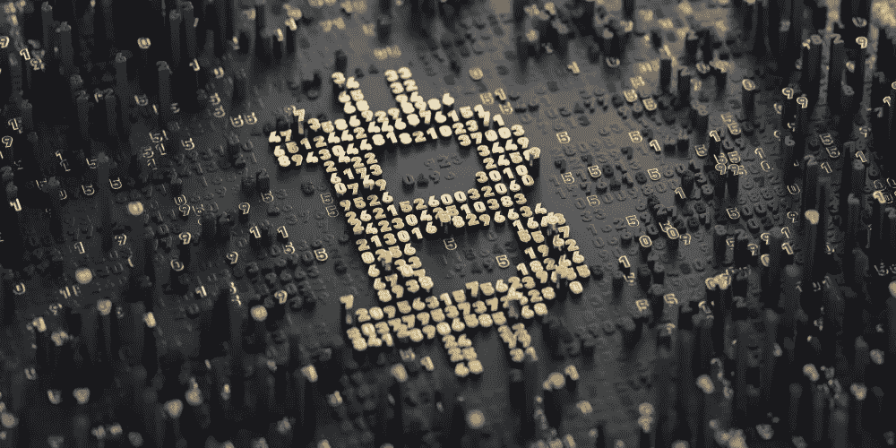

# BitMEX 首席执行官预测，到 2022 年，比特币将在五个国家合法使用

> 原文：<https://medium.com/coinmonks/bitmex-ceo-predicts-bitcoin-will-be-lawful-delicate-in-five-nations-by-2022-d2c5534c59ed?source=collection_archive---------14----------------------->

BitMEX 的首席执行官表示，新兴经济体更多地受到定居点和扩张问题的影响。

BitMEX 首席执行官 Alexander hopt ner 最近预计，创造场景中的国家不久将继续以萨尔瓦多的方式，使比特币(BTC)合法微妙。

在周三的一篇博客文章中，霍普特纳表示支持萨尔瓦多在 9 月份将比特币视为合法的微妙事物，预计新兴国家将在比特币接受方面“引领潮流”:

> “我的预期是，在接下来的一年结束之前，我们会有大约五个国家承认比特币是合法的。他们中的每一个都将是非工业国家。”

根据霍普特纳的说法，新兴国家将更快地接受比特币，因为有三个主要考虑因素:对更便宜、更快速的全球结算的发展需求，巨大的扩张，以及以政策为中心的问题。

霍普特纳说，新兴经济体的个人更多地受到跨线分期付款和膨胀问题的影响，而不是更多新兴国家的买家。

首席执行官注意到，2020 年，定居点占萨尔瓦多全国总产出的 23%，而世界银行估计，低收入和中等收入国家占全球所有定居点的 75%左右。他补充说，全球各地的个人正逐步将比特币视为应对气候巨大膨胀的答案，指的是土耳其在 19.2%的增长率中快速接收加密。

霍普特纳接着说，萨尔瓦多的比特币举措将使不同国家更容易考虑类似的举措。“然而，如果立法问题成为现实，将在比特币被视为合法微妙的接受过程中发挥重要作用，另外一个事实是，这些先驱在执行阶段的任何不足都可能损害数字货币在整体上更广泛的接受，”他补充道。

作为德国证券交易所 Boerse Stuttgart 的前首席执行官，霍普特纳于 2020 年 12 月接替阿瑟·海斯(Arthur Hayes)担任 BitMEX 的首席执行官。

霍普特纳并不是唯一一个认为会有更多国家效仿萨尔瓦多接受比特币的人。上个月，Cardano 的作者 Charles Hoskinson 预计会有更多的国家采用数字货币。广受赞誉的软件工程师爱德华·斯诺登还承认，“特立独行者可能会哀叹步履蹒跚。”

加密货币领域的一些主要人物一直不愿意吹捧萨尔瓦多总统纳伊卜·布克莱发起的加密招待会。周五，以太坊的赞助人 Vitalik Buterin 仔细研究了 Bukele 处理接受比特币的方式，认为限制组织承认特定的加密货币“与对加密空间如此重要的机会信念相反”。

> 加入 Coinmonks [电报频道](https://t.me/coincodecap)和 [Youtube 频道](https://www.youtube.com/c/coinmonks/videos)了解加密交易和投资

## 另外，阅读

*   [购买 Dogecoin 的 7 种最佳方式](https://blog.coincodecap.com/ways-to-buy-dogecoin) | [ZebPay 评论](https://blog.coincodecap.com/zebpay-review)
*   [最佳期货交易信号](https://blog.coincodecap.com/futures-trading-signals) | [流动性交易所评论](https://blog.coincodecap.com/liquid-exchange-review)
*   [3 商业评论](/coinmonks/3commas-review-an-excellent-crypto-trading-bot-2020-1313a58bec92) | [Pionex 评论](https://blog.coincodecap.com/pionex-review-exchange-with-crypto-trading-bot) | [Coinrule 评论](/coinmonks/coinrule-review-2021-a-beginner-friendly-crypto-trading-bot-daf0504848ba)
*   [莱杰 vs Ngrave](/coinmonks/ledger-vs-ngrave-zero-7e40f0c1d694) | [莱杰 nano s vs x](/coinmonks/ledger-nano-s-vs-x-battery-hardware-price-storage-59a6663fe3b0) | [币安评论](/coinmonks/binance-review-ee10d3bf3b6e)
*   [Bybit Exchange 审查](/coinmonks/bybit-exchange-review-dbd570019b71) | [Bityard 审查](https://blog.coincodecap.com/bityard-reivew) | [CoinSpot 审查](https://blog.coincodecap.com/coinspot-review)
*   [3 commas vs crypto hopper](/coinmonks/3commas-vs-pionex-vs-cryptohopper-best-crypto-bot-6a98d2baa203)|[赚取加密利息](/coinmonks/earn-crypto-interest-b10b810fdda3)
*   最好的比特币[硬件钱包](/coinmonks/hardware-wallets-dfa1211730c6) | [BitBox02 回顾](/coinmonks/bitbox02-review-your-swiss-bitcoin-hardware-wallet-c36c88fff29)
*   [BlockFi vs Celsius](/coinmonks/blockfi-vs-celsius-vs-hodlnaut-8a1cc8c26630)|[Hodlnaut 点评](/coinmonks/hodlnaut-review-best-way-to-hodl-is-to-earn-interest-on-your-bitcoin-6658a8c19edf) | [KuCoin 点评](https://blog.coincodecap.com/kucoin-review)
*   [Bitsgap 评审](/coinmonks/bitsgap-review-a-crypto-trading-bot-that-makes-easy-money-a5d88a336df2) | [Quadency 评审](/coinmonks/quadency-review-a-crypto-trading-automation-platform-3068eaa374e1) | [Bitbns 评审](/coinmonks/bitbns-review-38256a07e161)