# BitMEX 评论 2021 |保证金交易、费用、测试网和计算器

> 原文：<https://medium.com/coinmonks/bitmex-review-280ca1c00980?source=collection_archive---------2----------------------->

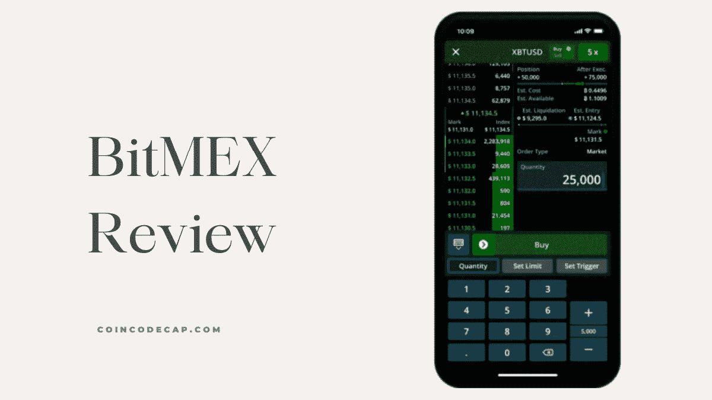

在本文中，我们将回顾一下 [**BitMEX**](https://blog.coincodecap.com/go/bitmex) ，这是一家领先的[加密保证金交易交易所](https://blog.coincodecap.com/crypto-margin-trading-exchanges) **、**，它提供永久合约和期货交易产品。

# 总结(TL；博士)

*   [BitMEX](https://blog.coincodecap.com/go/bitmex) 是历史最悠久的交易平台之一，提供合约交易产品。
*   由于其复杂的功能和过时的用户界面，开始使用 [BitMEX](https://blog.coincodecap.com/go/bitmex) 可能会很乏味。
*   没有完成身份验证，您不能在 [BitMEX](https://blog.coincodecap.com/go/bitmex) 交易。
*   BitMEX 提供杠杆交易、永久合约和期货交易服务。
*   在 BitMEX 你会得到最好的保险基金。
*   BitMEX 最近推出了适用于安卓系统和 T21 系统的移动应用。
*   整个 BitMEX 交易引擎都在 KDB+软件中，银行用它来保护自己的网络。
*   BitMEX 提供了一个广泛的支持系统和一个对双方都有利的附属计划。
*   如果你是来自美国的商人，希望使用 BitMEX，那么你可以使用 VPN。

# 什么是 BitMEX？

BitMEX 是加密交易市场的先行者之一。它位于塞舌尔，自 2014 年开始运行。BitMEX 是一个提供杠杆交易的点对点平台。

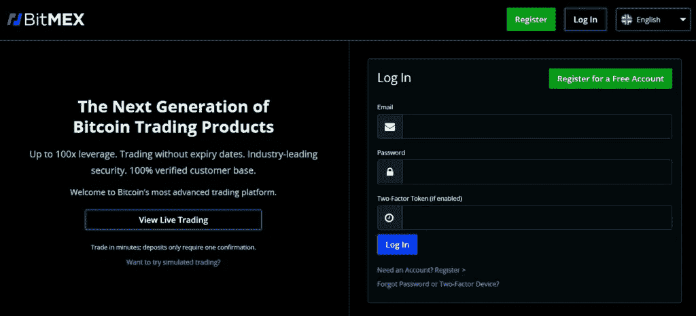

BitMEX 为您提供永久合约产品，您只能使用[比特币](https://blog.coincodecap.com/a-candid-explanation-of-bitcoin)在 BitMEX 进行交易。它还提供从订单簿匿名；但是，您必须完成您的 KYC 验证才能下订单。

# 如何使用 BitMEX？

BitMEX 配备了一个过时但复杂的用户界面，有时入门可能是一个乏味的过程。因此，我们为您提供从创建帐户到下订单和撤回退货的一步一步的指导。

# 如何在 BitMEX 上创建账户？

在 BitMEX 创建账户非常简单，你所要做的就是准确地遵循以下步骤:

1.  访问 [**BitMEX**](https://blog.coincodecap.com/go/bitmex) 官网。
2.  现在点击屏幕右上角的“注册”。
3.  在下一个窗口中，输入您的电子邮件和密码。
4.  一旦您同意所有的隐私政策，点击注册。
5.  现在，通过邮箱中的链接验证您的电子邮件。

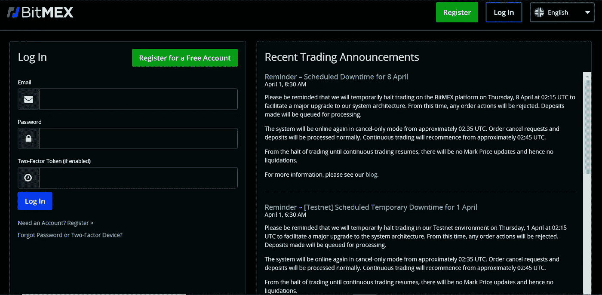

# 如何在 BitMEX 完成你的验证？

没有完成你的 KYC 验证，你**不能在 BitMEX **交易**。因此，请按照以下步骤完成您的 KYC 验证:**

1.  一旦您登录到您的帐户，您现在可以开始您的 KYC 验证过程。
2.  转到交易选项卡，并点击屏幕左上角的“开始身份验证”。
3.  现在，您必须分四个部分完成验证过程。
4.  首先，选择您的国家，然后上传您的政府批准的身份证。
5.  其次，抓拍自拍或者上传视频进行面部验证。
6.  第三，上传政府批准的文件进行位置验证或启用您的设备的位置。
7.  最后，提供您的 [**BitMEX**](https://blog.coincodecap.com/go/bitmex) 账户的资金信息。

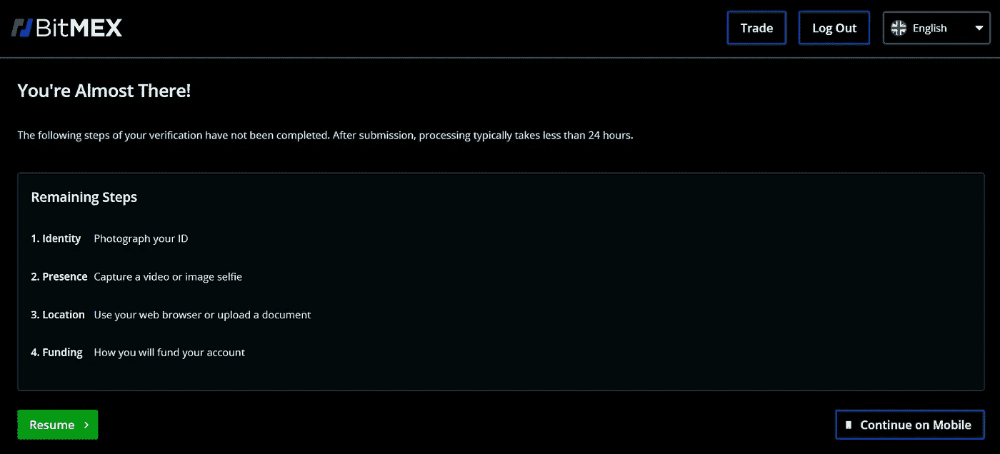

# 如何将资金存入你的 BitMEX 账户？

现在您已经验证了您的 BitMEX 帐户，您将需要开始交易。为此，您需要在您的 BitMEX 帐户中存入资金，现在您可以按照以下步骤为您的 BitMEX 帐户存款:

1.  首先登录你的 BitMEX [账户。](https://www.bitmex.com/)
2.  然后访问“交易”标签标题中的“帐户”部分。
3.  现在，点击存款按钮。
4.  最后，要么扫描二维码，要么复制钱包地址存入资金。
5.  记住， [**BitMEX**](https://blog.coincodecap.com/go/bitmex) 只接受比特币作为押金，所以不要向这个钱包地址发送任何其他加密。

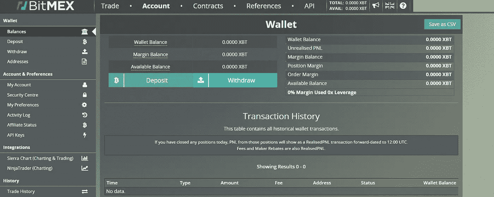

现在你的 [**BitMEX**](https://blog.coincodecap.com/go/bitmex) 钱包里有了资金，你会想直接投入交易。然而，在没有太多关于这个平台的信息的情况下直接进入，可能会在最初的交易中给你带来很多伤害。因此，为了防止这种损失，让我们首先了解一些关于在 BitMEX 交易的重要事情。

# BitMEX 的交易期权

[BitMEX](https://blog.coincodecap.com/go/bitmex) 允许其用户进行加密交易和期货交易。然而，与其他平台不同的是，BitMEX 不支持现货交易。并且据 [Coindesk](https://www.coindesk.com/bitmex-plans-to-add-spot-trading-brokerage-custody-services-report) ， [BitMEX 首席执行官](https://www.bitmex.com/app/aboutUs)最近表示，该交易所正计划增加现货交易功能。

# BitMEX 杠杆交易

BitMEX 提供[保证金交易](https://blog.coincodecap.com/go/margin-trading)服务，将你的初始保证金作为抵押品，并根据你的杠杆提供额外的资金来开仓。您可以轻松地从标题中选择您希望交易的资产，并做多或做空。

[**BitMEX**](https://blog.coincodecap.com/go/bitmex) 采用两种不同的杠杆交易方式，具体如下。阅读我们的指南，了解更多关于 BitMEX 保证金交易的信息。

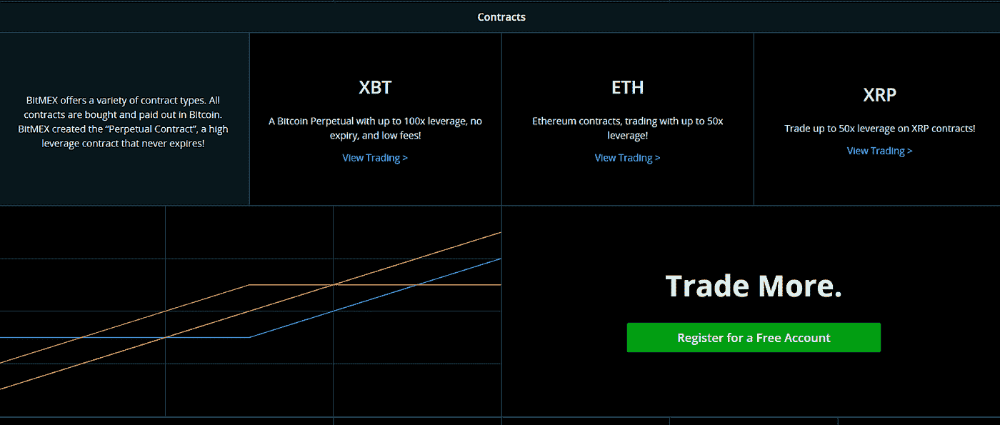

# BitMEX 交叉边距

BitMEX [交叉保证金](https://www.bitmex.com/app/isolatedMargin#Cross-Margin)允许你使用你的全部账户余额来防止清算。在某些情况下，你可能会因为某个特定的头寸损失超过你的初始保证金，但这可以防止你平仓。

# BitMEX 隔离边距

BitMEX [隔离保证金](https://www.bitmex.com/app/isolatedMargin#Isolated-Margin)只将你的初始保证金置于风险之中，因为在清算的情况下，它不会动用你的账户余额。它可以防止额外的损失，因为它不会将你的账户余额置于风险之中，但不能防止清算。

# BitMEX 永久合约

BitMEX [永久合约](https://www.bitmex.com/app/perpetualContractsGuide)在某种程度上类似于传统期货。永久合约允许你以与现货市场大致相同的标的资产参考指数价格进行交易。

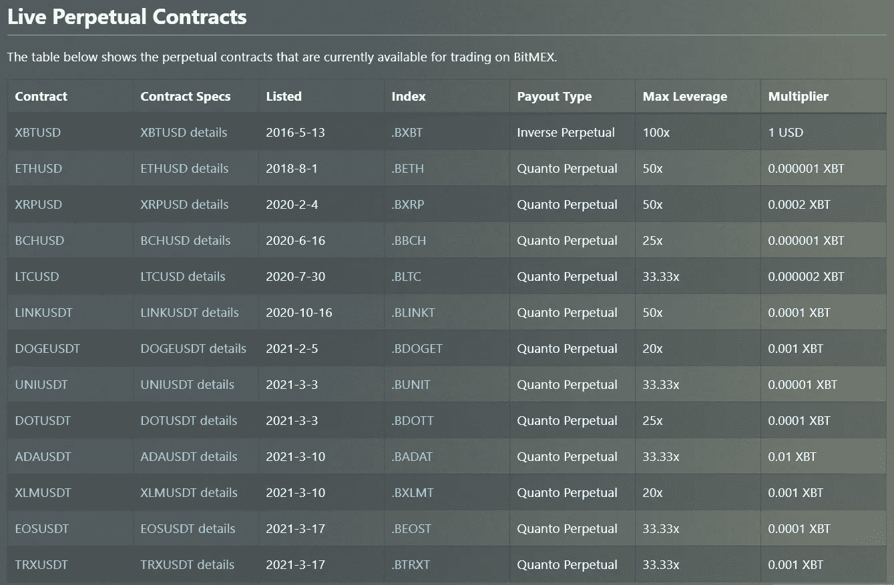

永久合同不会到期或结算；但是，他们受制于[提前结算](https://www.bitmex.com/app/exchangeGuide#Early-Settlement)。

# 反向永久合同

[反向永久](https://www.bitmex.com/app/inversePerpetualsGuide)合约最适合希望做多或做空 BTC 兑美元的交易者。例如，XBTUSD 是逆永续性的，因为基础资产是美元/ XBT。

如果基础资产的价格在[反向永续](https://www.bitmex.com/app/inversePerpetualsGuide)中向另一个方向移动，那么由于合约的非线性和反向性质，你会遭受更大的损失。

# Quanto 永久合同

Quanto permanent 合约提供了一种衍生品，其基础商品以货币计价。这种货币本身以某种固定的汇率与另一种货币结算。然而，如果你记住你的 PNL 和保证金是比特币，那么你仍然有市场风险，这是最好的。

# BitMEX 期货合约

[期货合约](https://www.bitmex.com/app/futuresGuide)是指在未来某一预定价格买入一种标的商品。 [**BitMEX**](https://blog.coincodecap.com/go/bitmex) 提供三种不同类型的期货合约，分别是

*   [全量合约](https://www.bitmex.com/app/quantoFuturesGuide)
*   [线性合同](https://www.bitmex.com/app/linearFuturesGuide)
*   [逆合同](https://www.bitmex.com/app/inverseFuturesGuide)

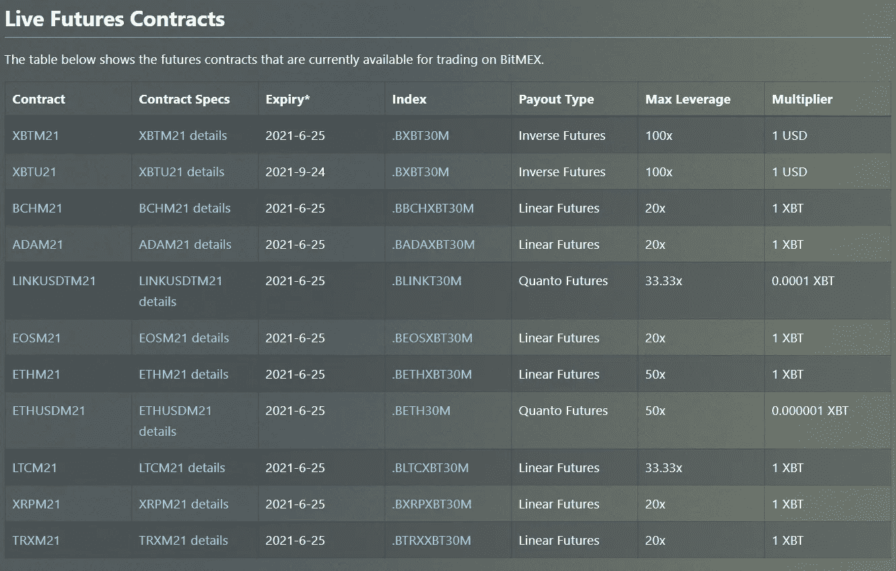

要了解更多期货合约，你可以阅读我们的 [BitMEX 保证金交易](https://blog.coincodecap.com/bitmex-margin-trading)文章。

# BitMEX 杠杆和杠杆滑块

[**BitMEX**](https://blog.coincodecap.com/go/bitmex) 对其[比特币/美元永久合约](https://www.bitmex.com/app/contract/XBTUSD)提供最高 100 倍的杠杆。杠杆率因资产而异，你可以在“交易”窗口观察最佳杠杆率。

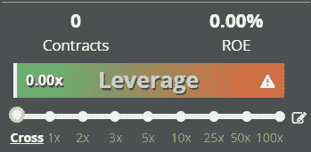

BitMEX 向其用户提供了一个杠杆滑块，因此他们可以轻松选择他们想要的杠杆和开仓。

# BitMEX API

[**BitMEX**](https://blog.coincodecap.com/go/bitmex) 实时更新其用户和市场数据，并使其可用。BitMEX 提供了一个强大的流 [WebSocket API](https://www.bitmex.com/app/wsAPI) 和一个全功能的 [REST API](https://www.bitmex.com/app/restAPI) 以及 [BitcoinCharts API](https://bitcoincharts.com/about/exchanges/) 和 UDF API。

# BitMEX 计算器

[**BitMEX**](https://blog.coincodecap.com/go/bitmex) 在其“交易”窗口提供了一个易于使用的计算器。您会在交易标签的限价单/市价单选项上方找到计算器图标。通过输入您希望开立的头寸的所有必需的详细信息，您可以轻松计算您的利润/损失、目标价格和清算价格。

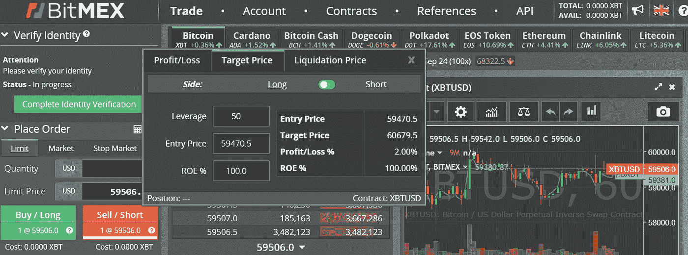

# BitMEX 机器人

[**BitMEX**](https://blog.coincodecap.com/go/bitmex) 向其用户提供了两个[自动化交易机器人](https://blog.coincodecap.com/best-crypto-trading-bots)。一个是 BitMEX 做市商，这是 Liquidbot 的一个改编版本，允许用户对双边市场报价。你可以在 Github 找到这个机器人的源代码。另一个是 [**FMZ**](https://blog.coincodecap.com/go/fmz) 号称国内最大的[算法交易平台](https://blog.coincodecap.com/best-crypto-trading-bots)。

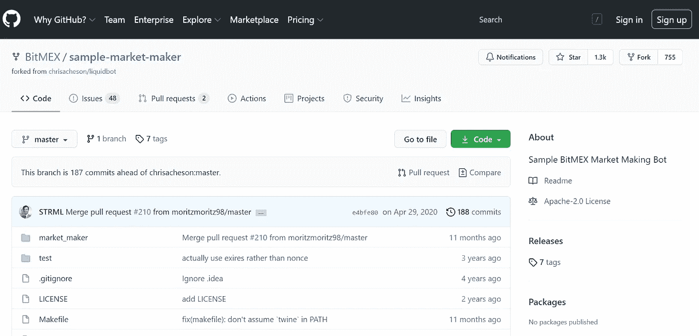

# BitMEX 保险基金

为了防止你的头寸自动去杠杆化， [**BitMEX**](https://blog.coincodecap.com/go/bitmex) 使用保险基金。在自动去杠杆化系统接管订单之前，BitMEX 使用这些资金来达成未备案的清算订单。

现在，你已经了解了 BitMEX 交易的几乎所有内容，是时候我们来看看开仓和取款的步骤了。然而，如果你仍然希望了解更多关于 BitMEX 提供的功能，请阅读我们关于 [BitMEX 保证金交易](https://blog.coincodecap.com/bitmex-margin-trading)的文章。

# 如何在 BitMEX 上交易？

加密交易听起来很有吸引力，但事实是它同样有风险。因此，如果你在遵循以下步骤之前已经完成了所有的研究工作，那就更好了。如果你有，那就跳进来吧:

1.  访问 [**BitMEX**](https://blog.coincodecap.com/go/bitmex) 官网，登录账号。
2.  然后转到“交易”标签，选择你喜欢的资产。
3.  现在，在屏幕的左侧，相应地定制所有选项。
4.  填写所有细节，然后按买入/做多做多，按做空/卖出做空。
5.  一旦您的订单执行，您将能够在屏幕底部看到它的状态。
6.  现在要关闭订单，只需点击关闭按钮。

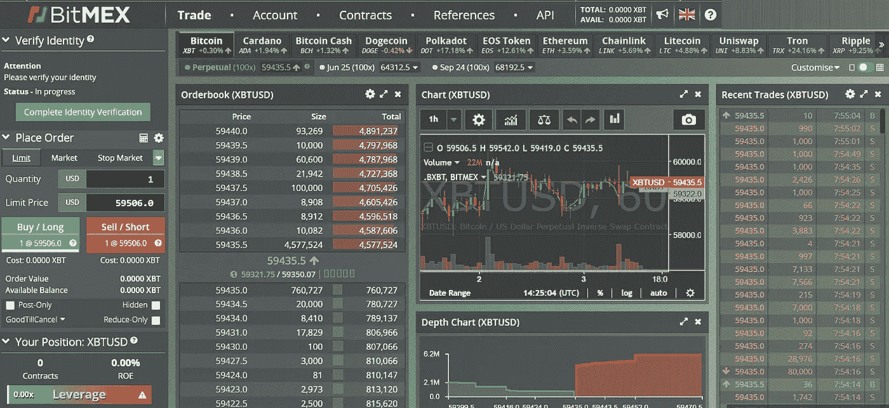

# 如何退出 BitMEX？

一旦你获得了足够的回报，并准备好将比特币提取到外部钱包中，那么你可以遵循以下步骤:

1.  登录到您的 [**BitMEX**](https://blog.coincodecap.com/go/bitmex) 账户后，点击标题中的“账户”。
2.  在下一个窗口中，单击蓝色的撤回按钮。
3.  现在，由于您只能提取 BTC，请输入您的钱包地址和您希望提取的金额。
4.  一旦您处理交易，您将在一小时内收到您钱包中的资金。

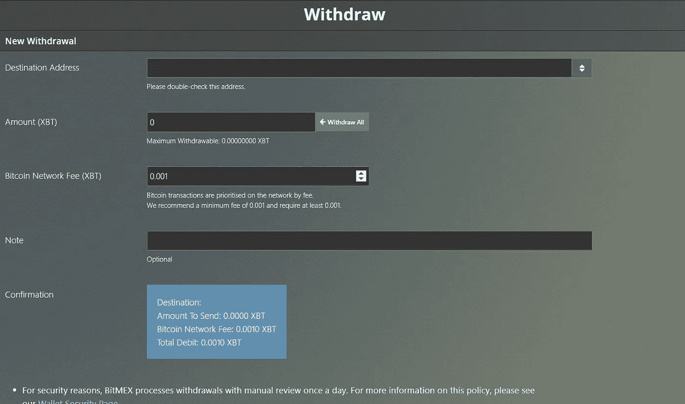

# BitMEX 移动

[**BitMEX**](https://blog.coincodecap.com/go/bitmex) 于 2020 年 9 月推出其移动应用，目前在 140 多个国家可用，并提供交易所所有的关键账户功能。你可以通过[点击这里](https://blog.bitmex.com/introducing-bitmex-mobile/)了解更多关于手机 app 的信息。BitMEX 应用程序在 Android 和 IOS 上都有，你可以通过[点击这里](https://www.bitmex.com/mobile)下载 APK。您也可以从以下链接下载适用于 Android 和 IOS 的应用程序:

*   对于安卓系统，[点击这里](https://play.google.com/store/apps/details?id=com.bitmex.mobile.android)。
*   对于 IOS，[点击这里](https://apps.apple.com/app/id1377855125)。

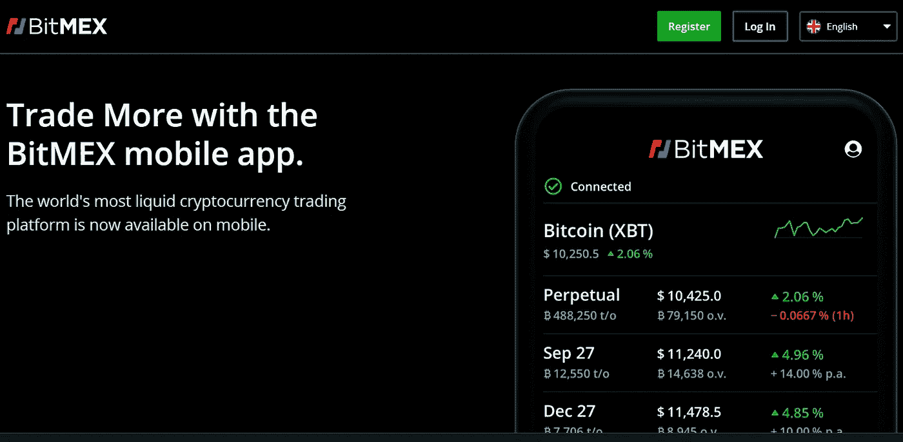

# 什么是 BitMEX testnet？

如果在直接进入市场之前，您可以先测试一个交换平台的所有功能，这不是很好吗？嗯，这就是 [BitMEX testnet](https://testnet.bitmex.com/) 的用武之地；它允许你尝试交易所的所有功能，而不需要在真实市场下单。

要使用 [BitMEX testnet](https://testnet.bitmex.com/) ，你需要在[testnet.bitmex.com](https://testnet.bitmex.com/)上单独创建一个账户。您可以按照下面的步骤来做同样的事情:

1.  首先参观 testnet.bitmex.com。
2.  其次，点击注册按钮，并在下一个窗口输入您的电子邮件和密码。
3.  第三，从你的邮箱验证你的邮件。
4.  最后，登录您的帐户，尝试 BitMEX 提供的所有功能。

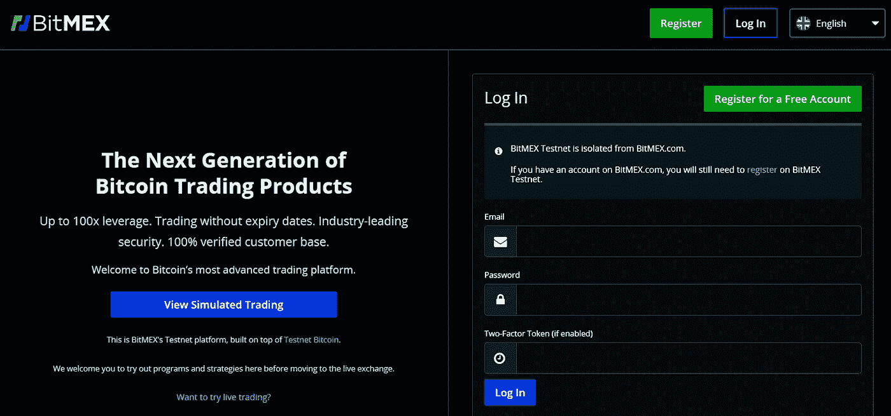

# BitMEX 费用

由于区块链负载，除了比特币的动态价格之外，BitMEX 不收取任何存款或取款费用。如果您在结算过程中有任何未平仓订单，那么 [**BitMEX**](https://blog.coincodecap.com/go/bitmex) 也会向您收取结算费用。

# BitMEX 交易费

BitMEX 收取 0.075%的交易费，并提供 0.025%的做市商返点。你可以看看下表中永久合约的交易费用。要了解传统期货和量子期货的交易费用，你可以[点击这里](https://www.bitmex.com/app/fees)。

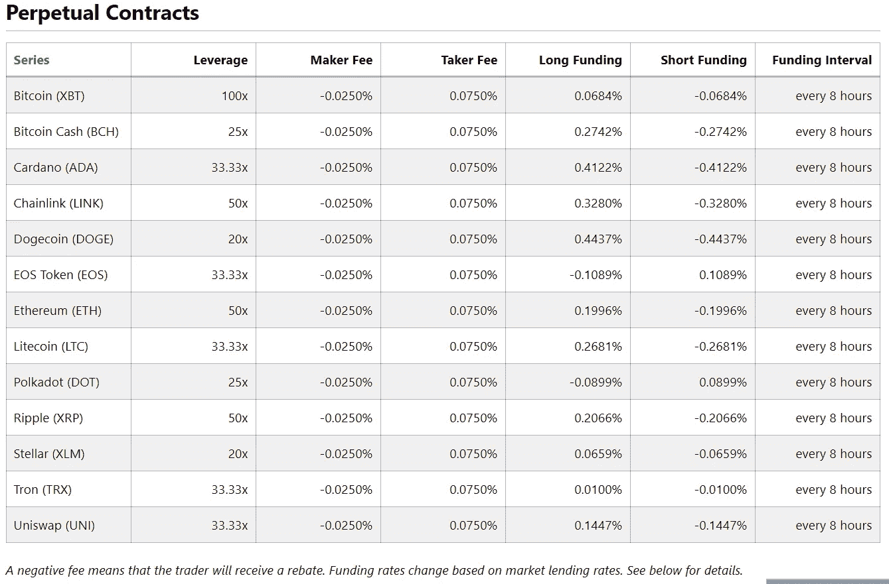

[**BitMEX**](https://blog.coincodecap.com/go/bitmex) 也收取资助费，你可以从[这里](https://www.bitmex.com/app/fees#Funding)了解更多。

# BitMEX 评论:安全性

BitMEX 将你所有的资金存储在离线钱包中，并使用其独一无二的多签名取款和存款方案。BitMEX 交易引擎在 KDB+上运行，银行用它来防止他们的服务器受到黑客攻击。 [**BitMEX**](https://blog.coincodecap.com/go/bitmex) 也在 HackerOne 等平台上运行 bug bounty 程序。点击[这里](https://hackerone.com/bitmex)可以参与 bug 赏金。

# BitMEX 支持

BitMEX 提供多种不同语言的支持服务，如中文、俄文。韩语、英语和日语。您可以通过访问 [**BitMEX**](https://blog.coincodecap.com/go/bitmex) 任意窗口底部的联系人部分来联系他们。

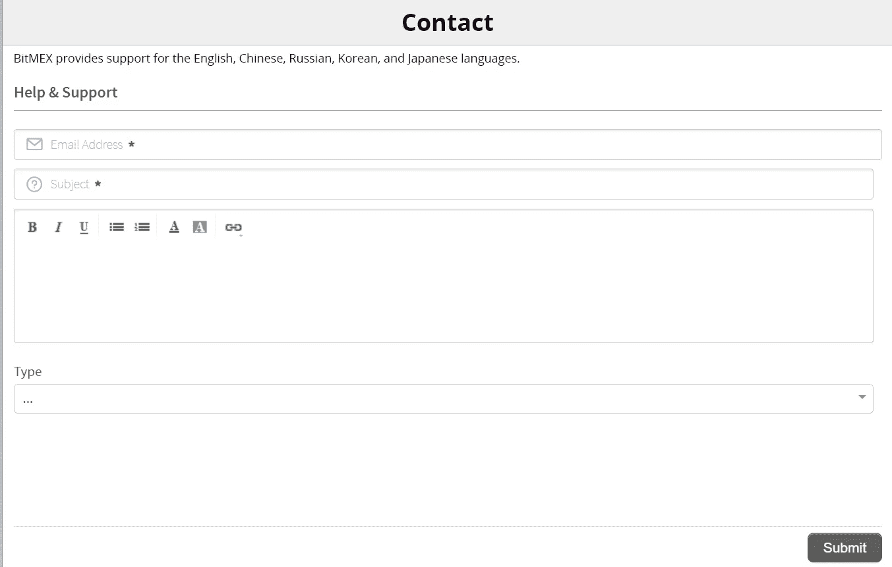

你所要做的就是输入你的电子邮件，选择一个合适的主题，附上任何相关的文件，选择一个类别，写下你的问题，然后点击提交按钮。

# BitMEX 附属计划

[**BitMEX**](https://blog.coincodecap.com/go/bitmex) 提供了一个双方都受益的推荐方案。作为一个将你的推荐代码发送给朋友的人，你将从你的朋友那里获得一定比例的佣金。与此同时，你的朋友将获得限时费用折扣。您可以查看下表中的加盟计划支出结构，并了解更多关于加盟计划的信息；你可以[点击这里](https://www.bitmex.com/app/affiliates)。

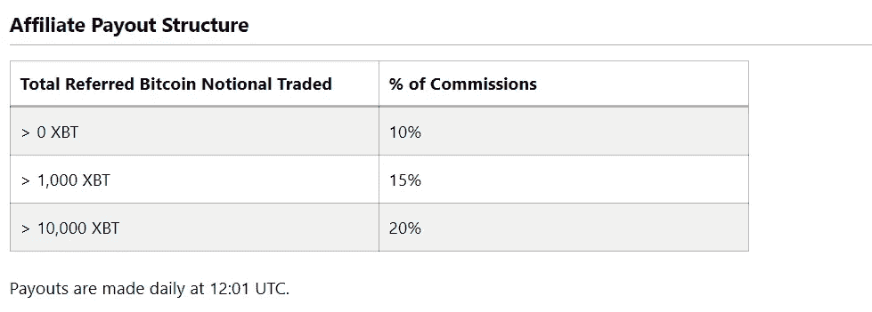

# BitMEX 评论:利弊

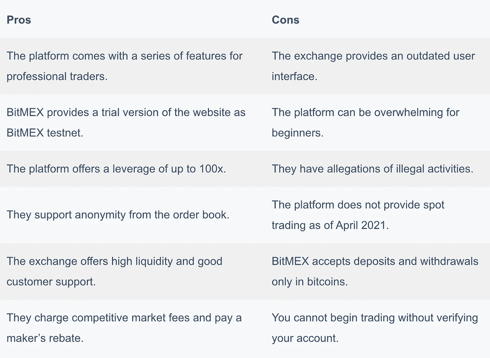

# BitMEX 评论:结论

BitMEX 是市场上提供杠杆交易服务的最佳平台之一。该交易所以其永久合约而闻名，但仅使用比特币运营。该交易所收取具有市场竞争力的交易费，并为您的资产提供顶级的安全性。如果你正在寻找一个以高杠杆提供保证金交易(T21)服务的平台，那么 BitMEX 可能是你完美的目的地。

# 常见问题

**为什么 BitMEX 在美国被禁？**

BitMEX 是一家不受监管的交易所，只提供比特币服务。由于美国政府监管加密交易，交易所要在美国运营，需要在 CTFC 注册并获得经纪人执照。BitMEX 不在美国提供服务。

**在美国如何使用 BitMEX？**

在美国使用 BitMEX 是非法的。假设你仍然希望使用相同的。在这种情况下，你可以安装一个 VPN 作为 chrome 扩展，并将你的位置设置到一个不同的国家，在那里使用 [**BitMEX**](https://blog.coincodecap.com/go/bitmex) 是合法的。一些最好的 VPN 提供商如下:
–[Hola VPN](https://hola.org/)
–[Tunnelbear](https://www.tunnelbear.com/)
–[express VPN](https://www.expressvpn.com/)
–[Nord VPN](https://nordvpn.com/)

**如何在 BitMEX 上做空？**

在 BitMEX，你既可以开多头，也可以开空头。通过建立空头头寸，你将预测基础资产价值的下跌。因此，要做空，你只需在交易标签上输入所有细节，然后点击屏幕上的做空/卖出/红色按钮。

**bit MEX 位于哪里？**

BitMEX 是基于一个名为马埃的小岛，源于塞舌尔。

*   [BitMEX 保证金交易|新手指南 2021](https://blog.coincodecap.com/?p=7452)
*   [5 家最佳比特币保证金交易交易所【2021】](https://blog.coincodecap.com/bitcoin-margin-trading-exchange)
*   [最佳加密交易所| 2021 年十大加密货币交易所](https://blog.coincodecap.com/crypto-exchange)
*   [Bybit 保证金交易指南 2021](https://blog.coincodecap.com/bybit-margin-trading)
*   [币安保证金交易 2021 |你需要知道的一切](https://blog.coincodecap.com/binance-margin-trading)

> 加入 coin monks[Telegram group](https://t.me/joinchat/EPmjKpNYwRMsBI4p)学习加密交易和投资

## 另外，阅读

*   [什么是融资融券交易](https://blog.coincodecap.com/margin-trading)
*   最好的[密码交易机器人](/coinmonks/crypto-trading-bot-c2ffce8acb2a) | [网格交易](https://blog.coincodecap.com/grid-trading)
*   [3 商业评论](/coinmonks/3commas-review-an-excellent-crypto-trading-bot-2020-1313a58bec92) | [Pionex 评论](/coinmonks/pionex-review-exchange-with-crypto-trading-bot-1e459d0191ea) | [Coinrule 评论](/coinmonks/coinrule-review-2021-a-beginner-friendly-crypto-trading-bot-daf0504848ba)
*   [AAX 交易所评论](/coinmonks/aax-exchange-review-2021-67c5ea09330c) | [德里比特评论](/coinmonks/deribit-review-options-fees-apis-and-testnet-2ca16c4bbdb2) | [FTX 交易所评论](/coinmonks/ftx-crypto-exchange-review-53664ac1198f)
*   [n ave 零点回顾](/coinmonks/ngrave-zero-review-c465cf8307fc) | [Phemex 回顾](/coinmonks/phemex-review-4cfba0b49e28) | [PrimeXBT 回顾](/coinmonks/primexbt-review-88e0815be858)
*   [Bybit Exchange 审查](/coinmonks/bybit-exchange-review-dbd570019b71) | [Bityard 审查](/coinmonks/bityard-review-7d104239be35) | [CoinSpot 审查](https://blog.coincodecap.com/coinspot-review)
*   [3 commas vs crypto hopper](/coinmonks/3commas-vs-pionex-vs-cryptohopper-best-crypto-bot-6a98d2baa203)|[赚取加密利息](/coinmonks/earn-crypto-interest-b10b810fdda3)
*   最好的比特币[硬件钱包](/coinmonks/the-best-cryptocurrency-hardware-wallets-of-2020-e28b1c124069?source=friends_link&sk=324dd9ff8556ab578d71e7ad7658ad7c) | [BitBox02 回顾](/coinmonks/bitbox02-review-your-swiss-bitcoin-hardware-wallet-c36c88fff29)
*   [总帐 vs n 平均](/coinmonks/ledger-vs-ngrave-zero-7e40f0c1d694) | [总帐 nano s vs x](/coinmonks/ledger-nano-s-vs-x-battery-hardware-price-storage-59a6663fe3b0)
*   [密码本交易平台](/coinmonks/top-10-crypto-copy-trading-platforms-for-beginners-d0c37c7d698c)
*   [CoinLoan 评论](/coinmonks/coinloan-review-18128b9badc4) | [YouHodler 评论](/coinmonks/youhodler-4-easy-ways-to-make-money-98969b9689f2) | [BlockFi 评论](/coinmonks/blockfi-review-53096053c097)
*   最好的[加密税务软件](/coinmonks/best-crypto-tax-tool-for-my-money-72d4b430816b) | [硬币追踪评论](/coinmonks/cointracking-review-a-reliable-cryptocurrency-tax-software-5114e3eb5737)
*   最佳[加密借贷平台](/coinmonks/top-5-crypto-lending-platforms-in-2020-that-you-need-to-know-a1b675cec3fa) | [杠杆令牌](/coinmonks/leveraged-token-3f5257808b22)
*   [block fi vs Celsius](/coinmonks/blockfi-vs-celsius-vs-hodlnaut-8a1cc8c26630)|[Hodlnaut 审查](/coinmonks/hodlnaut-review-best-way-to-hodl-is-to-earn-interest-on-your-bitcoin-6658a8c19edf)
*   [Bitsgap 审查](/coinmonks/bitsgap-review-a-crypto-trading-bot-that-makes-easy-money-a5d88a336df2) | [Quadency 审查](/coinmonks/quadency-review-a-crypto-trading-automation-platform-3068eaa374e1) | [Bitbns 审查](/coinmonks/bitbns-review-38256a07e161)
*   [埃利帕尔泰坦评论](/coinmonks/ellipal-titan-review-85e9071dd029) | [赛克斯斯通评论](/coinmonks/secux-stone-hardware-wallet-review-15-discount-coupon-2020-7577032faa6e)
*   [本地比特币评论](/coinmonks/localbitcoins-review-6cc001c6ed56) | [加密货币储蓄账户](https://blog.coincodecap.com/cryptocurrency-savings-accounts)
*   最佳[区块链分析](https://bitquery.io/blog/best-blockchain-analysis-tools-and-software)工具| [赚比特币](/coinmonks/earn-bitcoin-6e8bd3c592d9)
*   [加密套利](/coinmonks/crypto-arbitrage-guide-how-to-make-money-as-a-beginner-62bfe5c868f6)指南| [如何做空比特币](/coinmonks/how-to-short-bitcoin-568a2d0b4ae5)
*   最佳[加密制图工具](/coinmonks/what-are-the-best-charting-platforms-for-cryptocurrency-trading-85aade584d80) | [最佳加密交易所](/coinmonks/crypto-exchange-dd2f9d6f3769)
*   [如何在印度购买比特币？](/coinmonks/buy-bitcoin-in-india-feb50ddfef94) | [瓦济克斯评论](/coinmonks/wazirx-review-5c811b074f5b)
*   [印度比特币交易所](/coinmonks/bitcoin-exchange-in-india-7f1fe79715c9) | [比特币储蓄账户](/coinmonks/bitcoin-savings-account-e65b13f92451)
*   [CoinDCX 评论](/coinmonks/coindcx-review-8444db3621a2) | [加密保证金交易交易所](https://blog.coincodecap.com/crypto-margin-trading-exchanges)

> [直接在您的收件箱中获得最佳软件交易](/coinmonks/newsletters/coinmonks)

*原载于 2021 年 4 月 6 日 https://blog.coincodecap.com***。**