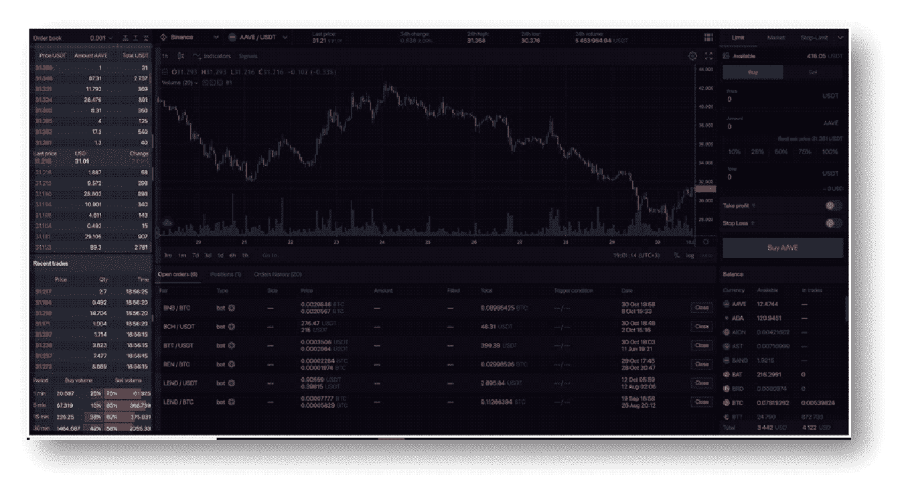
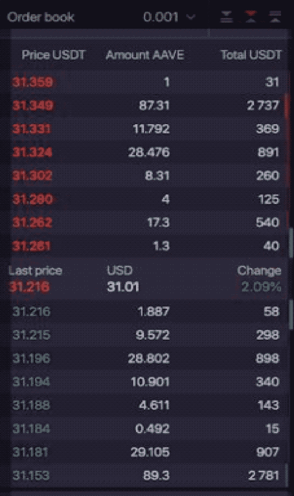
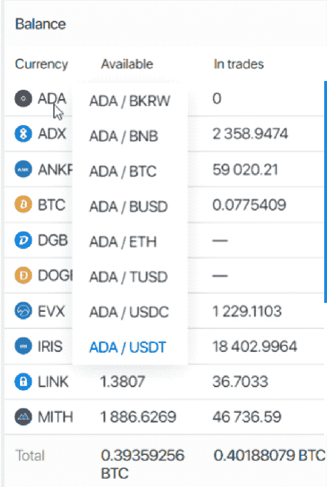
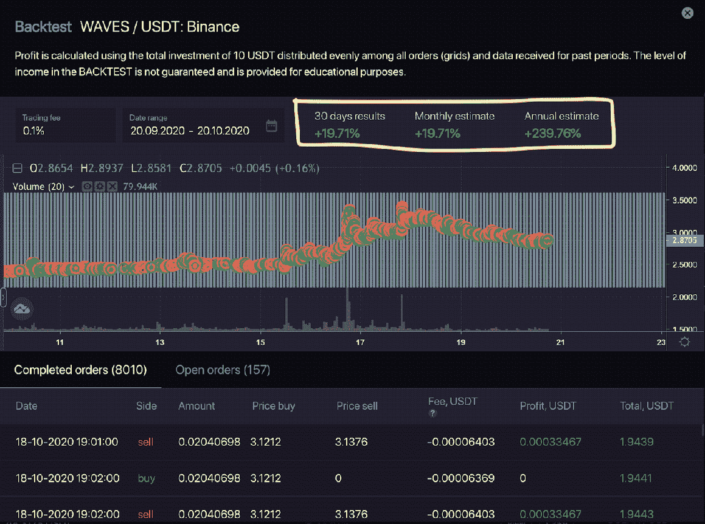
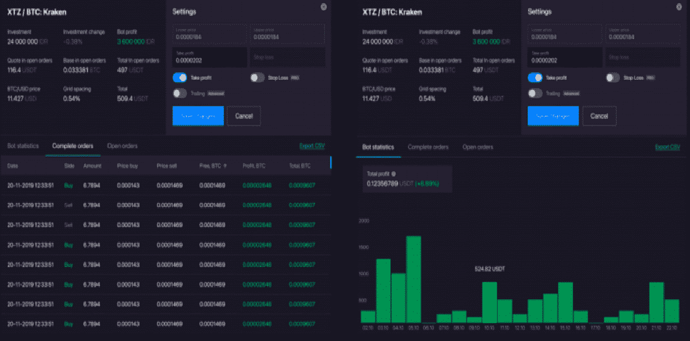

# Bitsgap 2.0 |全新的期货交易体验

> 原文：<https://medium.com/coinmonks/bitsgap-2-0-a-whole-new-futures-trading-experience-9e1ec22d3072?source=collection_archive---------3----------------------->

[**Bitsgap**](https://blog.coincodecap.com/go/bitsgap) 作为一个[交易平台](/coinmonks/the-best-crypto-trading-platforms-in-2020-the-definitive-guide-updated-c72f8b874555)给那些想在家里舒适地交易加密货币的交易者一种新的体验。为了享受无缝交易，你需要一个平台，它有支持工具(如果可能的话，最新的)，洞察力和有竞争力的费用。

季节交易者通常寻找特定的市场和对。他们还希望利用加密套利的机会。你很难在一个平台上找到所有这些特性。因此，玩家可以从一个交易所转移到另一个交易所来寻找这些功能。在不同交易所之间转换既麻烦又耗时。

Bitsgap 允许交易者在一个地方连接他们所有的交易所。该平台还有很多优点，包括能够轻松执行套利策略。该交易终端具有用于[自动交易](/coinmonks/whats-the-best-crypto-trading-bot-in-2020-top-8-bitcoin-trading-bot-c16adeb13317)的多功能界面，具有交易、现货和[投资组合管理](/coinmonks/the-best-free-cryptocurrency-portfolio-trackers-in-2019-cbb9a2013e3f)功能。

作为用户，你可以部署高级的[交易机器人](/coinmonks/crypto-trading-bot-c2ffce8acb2a)跨多个平台同时交易。该一体化平台为用户提供了独特的工具，允许交易员和投资组合经理为自动化机器人发现和开发自己的手动策略和交易配置。因此， [**Bitsgap**](https://blog.coincodecap.com/go/bitsgap) 已经发展到可以满足加密交易者的许多需求和期望。

> 另外，请阅读我们的 [Bitsgap 评论](https://blog.coincodecap.com/bitsgap-review)

尽管已经为用户提供了很好的体验，Bitsgap 仍在不断改进用户体验。通过我们最近的更新，您将获得以下最新功能，使您能够享受直观的交易:

# **超过 25 个加密货币交易所的期货和现货交易**

交易者和投资者喜欢用户友好和直观的界面，他们可以快速导航，以加快决策过程和市场分析。我们知道时间就是金钱，尤其是考虑到这种类型的贸易。

该团队发布了最新的期货交易，为交易员和投资组合经理提供了全新的交易仪表板布局。直观的仪表板使所有经验水平的用户能够更快、更容易地浏览平台，同时进行分析，从而更快地做出交易决策。

该界面分为两部分。第一部分包含决策小组，第二部分包含相关信息图表。用户现在可以更快地分析市场和做出决策。

新终端的左侧是决策面板(“订单簿”)，用于监控和分析加密货币的需求和供应。您现在可以轻松执行订单并管理您的加密货币兑换。关于你最近在市场上执行的交易的所有信息现在都可以在界面底部的“最近交易”部分找到界面最底部是标题为“牛熊比”的酷未来。此功能使您能够了解市场趋势和位置。

我们的新更新现在支持期货和现货交易从一个单一的界面。多功能界面为用户提供监控现货和期货头寸所需的数据。我们增加了币安期货**。**

**使用新的仪表板布局，您不需要为您的币安终端打开第二个浏览器窗口来监控期货头寸、设置止损和止盈订单以及启动新的交易。该平台允许您通过点击一个按钮在不到一秒的时间内切换现货和期货交易模式。**

> **使用 [Bitsgap 交易](/coinmonks/bitsgap-ftx-and-binance-futures-trading-bot-5f7e3ea7044f)FTX[和币安](/coinmonks/ftx-crypto-exchange-review-53664ac1198f)期货**

**新终端使您能够访问之前 1.5 分钟、15 分钟和 30 分钟的买卖量信息。这样的数据有助于你分析市场上的买卖压力。我们的最新更新确保您在预测市场涨跌趋势方面领先一步，帮助您做出正确的决定，从而大大增加您的盈利机会。**

**新的更新还让您可以完全访问超过 25 个加密货币交易所。无论您是投资者还是交易者，您都将能够监控所有关联交易所账户的所有加密货币投资组合。我们将多个交易所统一在一个平台上。**

**我们新建立的 n 功能还可以让您更快地选择货币(用鼠标点击),从而使交易更快。当你考虑到加密货币市场的波动性时，这个特性很有意义。**

****

# ****“影子”和“TWAP”订单类型****

**新推出的“影子订单”使您能够在订单簿之外执行秘密订单，而无需保留加密交易所的可用余额。一旦市价达到目标价格，它会自动发出限价单。**

**TWAP ( [时间加权平均价格](https://en.wikipedia.org/wiki/Time-weighted_average_price))是一种新的订单类型，按比例购买或出售选定的加密货币。如果你是一个交易量很大的交易者，你知道你可以很容易地用一次性交易影响市场。我们的新策略将帮助您将大量资金分成小部分，并在一定的时间间隔内根据市价单卖出或买入。一旦最后一小部分成交，该工具将自动计算最终的卖出/买入价格。**

# ****用于测试、运行和分析交易的自动化期货交易机器人****

**我们的[自动交易机器人](/coinmonks/whats-the-best-crypto-trading-bot-in-2020-top-8-bitcoin-trading-bot-c16adeb13317)以通过启动自动买卖为用户简化交易过程而闻名。我们的方法很简单，“不要把简单过度复杂化。”我们的机器人帮助人们 24/7 创收。我们提供了一个回溯测试工具，使用以前的数据来模拟销售策略，以预测潜在的回报。自动策略测试和时间段"[回溯测试](https://www.investopedia.com/terms/b/backtesting.asp)"使用历史数据来提供预期回报。**

****

**在我们最新的机器人更新中，我们实现了一个独特的信息图表功能，“机器人统计。”这个新特性将原始的“回溯测试”与“机器人统计”进行了强有力的结合。现在，您可以在任何一天看到活动 bot 以报价货币产生的回报。您还可以使用这个新的输入来模拟其他加密货币的预计日回报。**

**该机器人的性能和统计界面也发生了变化。所有重要的指标都显示在“查看”按钮下。如果你有两个以上的自动化策略，你现在可以更容易更快地分析一个机器人的性能。**

****

# ****最终想法…****

**加密货币市场尚未完全成熟；它仍处于成长阶段。在衍生产品和机构投资者进入加密市场方面仍有很大发展。为了跟上这个不断发展的市场， [**Bitsgap**](https://blog.coincodecap.com/go/bitsgap) 专注于开发工具和自动化算法，为交易者和投资者提供新的体验，以简化他们的交易过程，提高他们的利润。**

## **另外，阅读**

*   **最好的[密码交易机器人](/coinmonks/crypto-trading-bot-c2ffce8acb2a)**
*   **[Deribit 审查](/coinmonks/deribit-review-options-fees-apis-and-testnet-2ca16c4bbdb2) |选项、费用、API 和 Testnet**
*   **[FTX 密码交易所评论](/coinmonks/ftx-crypto-exchange-review-53664ac1198f)**
*   **最好的比特币[硬件钱包](/coinmonks/the-best-cryptocurrency-hardware-wallets-of-2020-e28b1c124069?source=friends_link&sk=324dd9ff8556ab578d71e7ad7658ad7c)**
*   **[密码本交易平台](/coinmonks/top-10-crypto-copy-trading-platforms-for-beginners-d0c37c7d698c)**
*   **最好的[加密税务软件](/coinmonks/best-crypto-tax-tool-for-my-money-72d4b430816b)**
*   **[最佳加密交易平台](/coinmonks/the-best-crypto-trading-platforms-in-2020-the-definitive-guide-updated-c72f8b874555)**
*   **最佳[加密贷款平台](/coinmonks/top-5-crypto-lending-platforms-in-2020-that-you-need-to-know-a1b675cec3fa)**
*   **[block fi vs Celsius](/coinmonks/blockfi-vs-celsius-vs-hodlnaut-8a1cc8c26630)vs Hodlnaut**
*   **[莱杰 vs 特雷佐](/coinmonks/ledger-vs-trezor-best-hardware-wallet-to-secure-cryptocurrency-22c7a3fd391e)**
*   **Bitsgap 评论——一个轻松赚钱的加密交易机器人**
*   **为专业人士设计的加密交易机器人**
*   **[3commas Review](https://blog.coincodecap.com/3commas-review-an-excellent-crypto-trading-bot) |一款优秀的密码交易机器人**
*   **[PrimeXBT 审查](/coinmonks/primexbt-review-88e0815be858) |杠杆交易、费用和交易**
*   **Bitmex 上的[保证金交易的白痴指南](/coinmonks/the-idiots-guide-to-margin-trading-on-bitmex-dbbd7742c6fc?source=friends_link&sk=7bfa99d2a181142510c8442c8ddb0786)**
*   **加密摇摆交易的权威指南**
*   **[Bitmex 高级保证金交易指南](/coinmonks/bitmex-advanced-margin-trading-guide-2270c195ce25?source=friends_link&sk=1d986cca731f5084b9a2db4a4bc4a7ad)**
*   **[开发者最佳加密 API](/coinmonks/best-crypto-apis-for-developers-5efe3a597a9f)**
*   **[加密套利](/coinmonks/crypto-arbitrage-guide-how-to-make-money-as-a-beginner-62bfe5c868f6)指南:新手如何赚钱**
*   **顶级[比特币节点](https://blog.coincodecap.com/bitcoin-node-solutions)提供商**
*   **最佳[加密制图工具](/coinmonks/what-are-the-best-charting-platforms-for-cryptocurrency-trading-85aade584d80)**
*   **了解比特币的[最佳书籍有哪些？](/coinmonks/what-are-the-best-books-to-learn-bitcoin-409aeb9aff4b)**

> **[直接在您的收件箱中获得最佳软件交易](https://coincodecap.com?utm_source=coinmonks)**

****