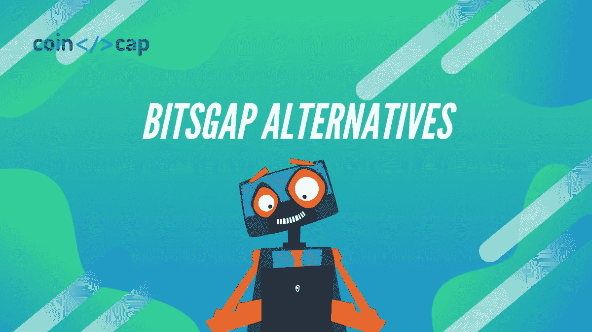
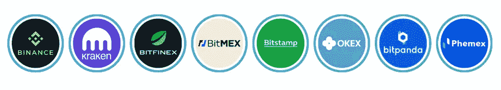
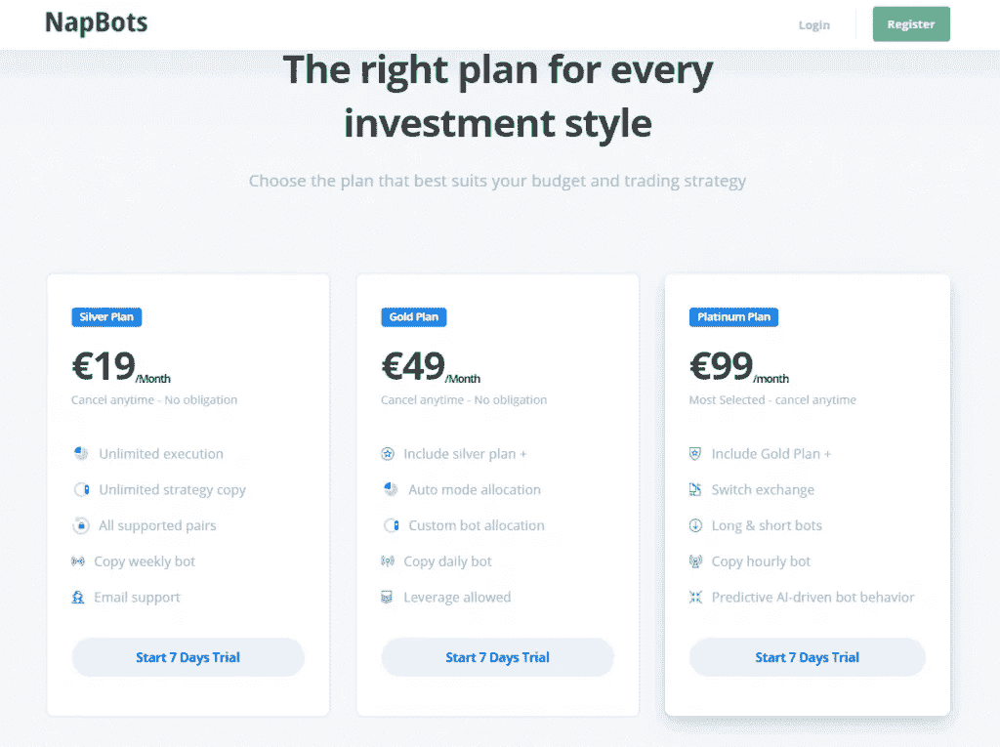
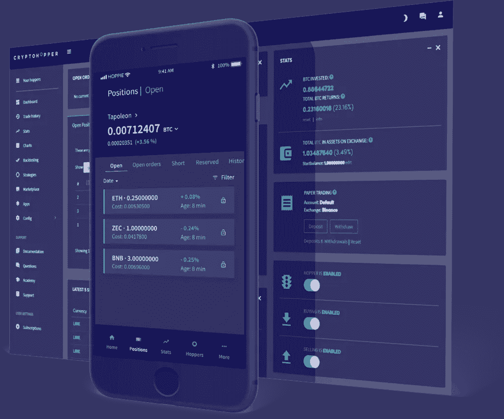
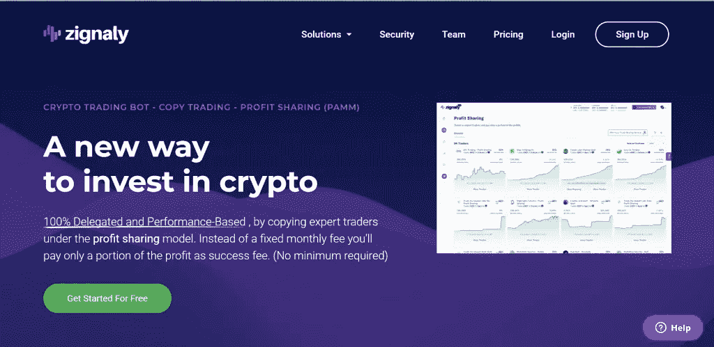
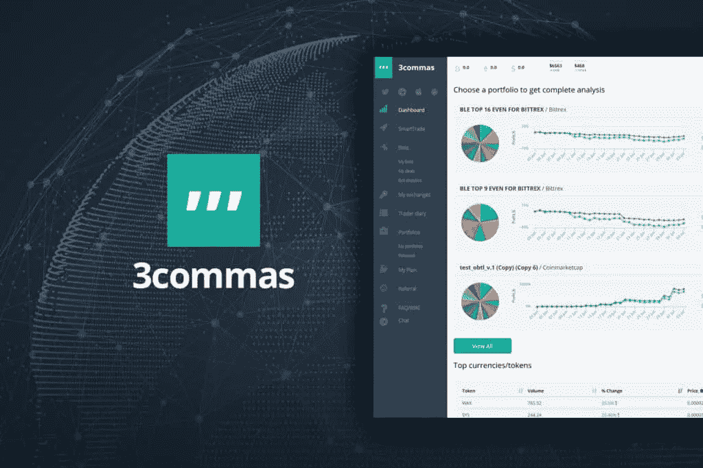
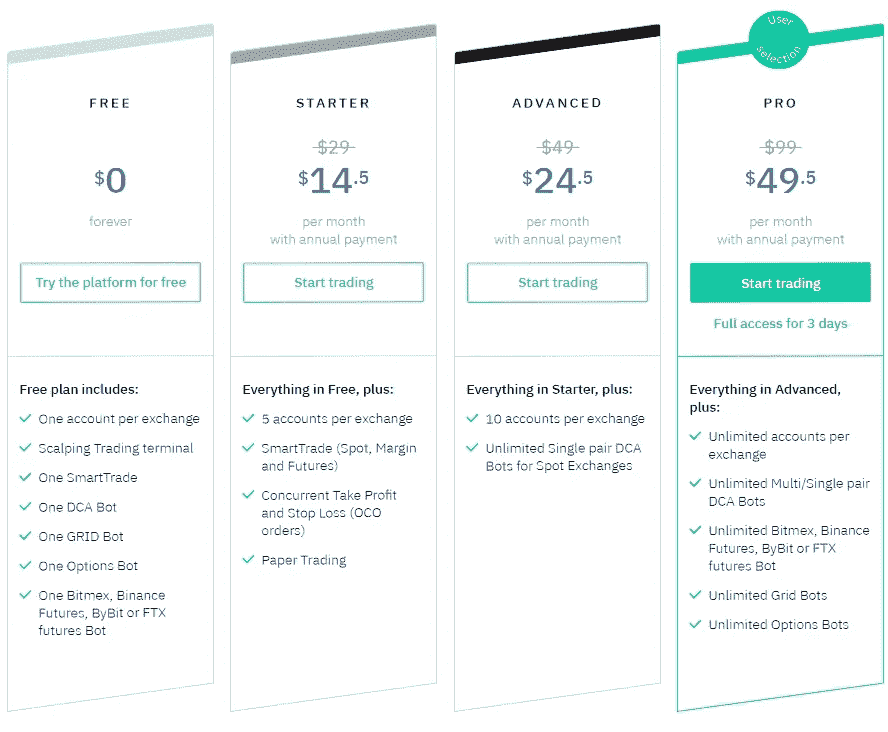

# 五大 Bitsgap 替代方案[2021]

> 原文：<https://medium.com/coinmonks/bitsgap-alternatives-d4acda86453c?source=collection_archive---------6----------------------->

What are Bitsgap Alternatives?

[**Bitsgap**](https://blog.coincodecap.com/go/bitsgap) 是[最好的密码交易机器人](/coinmonks/crypto-trading-bot-c2ffce8acb2a)提供商之一。然而，在选择服务时，你必须知道你有其他的选择。因此，本文将涵盖五种最佳 Bitsgap 替代方案。

# 总结(TL；博士)

*   [**Bitsgap**](https://blog.coincodecap.com/go/bitsgap) 平台可以让你自动化你的交易策略，自动寻找潜在机会的信号。
*   [**Napbots**](https://blog.coincodecap.com/go/napbots) 用途技术是由在主要金融机构拥有超过 15 年量化交易专业知识的专业交易员开发的。
*   [**crypto hopper**](https://blog.coincodecap.com/go/cryptohopper)bot 会自动为你在交易所交易。此外，该网站可能会提供交易指示，以帮助您决定是做多还是做空某项交易。
*   Zignaly 是下一代基于云的加密交易机器人平台，具有一系列有用的功能，包括交易多种货币的能力。
*   [**3Commas**](https://blog.coincodecap.com/go/3commas) ，加密货币 bot 交易平台，2017 年创立于加拿大温哥华。
*   [**TradeSanta**](https://blog.coincodecap.com/go/tradesanta) 是一个通过自动化处理交易策略的比特币交易机器人。

# 什么是 Bitsgap？

[**Bitsgap**](https://blog.coincodecap.com/go/bitsgap)**是一个加密货币交易平台，于 2018 年开始在爱沙尼亚运行。你可以链接到著名的[密码交易所](https://blog.coincodecap.com/crypto-exchange)并使用该程序从一个地方进行交易。**

**Bitsgap 平台允许您交易和分析 10，000 多个加密配对中的信号，从交易所之间的价格差异中套利，自动化您的交易策略，并自动发现最具潜力的货币的信号。**

****

**除了所有这些功能， [**Bitsgap**](https://blog.coincodecap.com/go/bitsgap) 还能让你实时跟踪投资组合的表现。要了解更多，请阅读 [Bitsgap 评论](https://blog.coincodecap.com/bitsgap-review)。该平台还提供了一个 [Bitsgap 期货机器人](https://blog.coincodecap.com/bitsgap-futures-bot)。**

**然而，我们将看看 Bitsgap 的竞争对手，它们同样易于使用，并在机器人交易领域提供完整的体验。**

# **第一个 Bitsgap 替代品:NapBots**

## **什么是 Napbots？**

**[**nap bots**](https://blog.coincodecap.com/go/napbots)**是一个基于云的、人工智能驱动的程序，它使任何人都可以交易加密货币，这在以前是对冲基金专有的。在大型金融机构有超过 15 年量化交易经验的专业交易者创造了这些方法。****

****[Napoleon Group](https://www.napoleon-group.com/) 由 AMF 及其姊妹公司 Napbots 管理。该平台提供交易机器人服务，自动化加密货币交易流程。此外，它还能帮助客户增加利润并避免损失。****

****大约三年前，Napbots 开始开发加密交易策略，并于 2018 年 4 月发布了其首次进入更广泛市场的方法。自那以后，又推出了 20 多项战略，每项战略都有基本的关键绩效指标和测试模板。他们最古老的技术“BTC LO”提供人类交易信号，其自动化版本目前已经推出，正在打破新 ATH。****

****要了解更多信息，请阅读[nap bot 评论](https://blog.coincodecap.com/napbots-review-crypto-trading-on-autopilot)。****

********

## ****Napbots 功能****

****此外，在一年的时间里，旗舰策略 BTC/ ETH/ USD AR 的表现超过基础策略 233%。因为它允许做空，这种技术更激进。然而，先前的成就并不能保证未来的成功。****

****事实上，定价是 Napbots 战略的关键数据库，该团队提供趋势跟踪和均值回归方法(每周、每天和每小时)。****

****除此之外，NapBots 是一个面向广大投资者的交易机器人。不仅仅是新手或临时交易者，他们可以让机器人处理一切，也可以让熟练的交易者禁用“仅机器人模式”，不使用机器人的自动化系统进行交易。这是唯一一个允许你组合策略的比特币机器人。****

****Napbots 将根据市场价格变化等信息代替用户处理任务。****

## ****如何使用 NapBots？****

****通过在自动驾驶模式下交易加密货币，你可以通过[nap bot](https://blog.coincodecap.com/go/napbots)体验财务自由，并自动赚钱。但是，首先，您必须执行以下操作，使其代表您运行:****

*   ****首先，链接到一个提供的信任交换。****
*   ****其次，从唯一列表中选择 NapBots。****
*   ****最后，用正确的方式选择你的投资计划。****

****当你完成这三个动作时，NapBots 就会准备好交易加密货币并为你赚钱。交易愉快！****

## ****Napbots 支持交换****

****NapBots 的出发点是给人们八个比特币交易所供选择。上述交易所包括[币安](https://blog.coincodecap.com/binance-review)、 [Bitmex](https://blog.coincodecap.com/bitmex-review) 、 [Bitfinex](https://blog.coincodecap.com/bitfinex-review) 、 [Okex](https://blog.coincodecap.com/okex-review) 、 [Phemex](https://blog.coincodecap.com/phemex-review) 、[北海巨妖](https://blog.coincodecap.com/kraken-review)、 [Bitstamp](https://blog.coincodecap.com/go/bitstamp) 。此外，很快，您可能会看到以下内容: [CoinBase](https://blog.coincodecap.com/coinbase-review) ， [Revolut](https://blog.coincodecap.com/go/revolut) ， [Kucoin](https://blog.coincodecap.com/kucoin-review) ， [HitBTC](https://blog.coincodecap.com/hitbtc-review) 等等。交易所的多样性为实现其算法提供了巨大的流动性。****

********

****把你的交易所和 Napbots 整合起来是小菜一碟。因为您有一个有效的 exchange 帐户，所以您需要做的就是从您的帐户中单击 Generate API Key 按钮，然后使用它来输入您的 Napbots 帐户上的数据。****

## ****Napbots 定价****

****Napbots 服务有三种不同的价格选择，定制以适应所有预算，并依赖于不同的数量水平。所有计划都包括 25，000 美元的无限交易限额。****

****下图说明了服务费:****

********

## ****为什么选择 NapBots？****

*   ****[Napbots](https://blog.coincodecap.com/go/napbots) 旨在让公众能够接触到对冲基金以前采用的复杂交易技术。****
*   ****设置和安装很容易。非专家也能使用它。NapBots 采用的新策略承诺为其客户带来非凡的价值。****
*   ****金融行业的专业人士是 T4 机器人专家小组的成员。从简历上看，他们在资金方面有丰富的专业知识，这就消除了对技术人才的需求。所以即使你在睡觉的时候使用这项服务，你仍然可以被动地赚钱。****
*   ****没有初始费用，使他们的定价非常明确。****

# ****第二个 Bitsgap 替代品:CryptoHopper****

## ****什么是隐漏斗？****

****客户可以使用 [**Cryptohopper**](https://blog.coincodecap.com/go/cryptohopper) 提供的基于云的接口，轻松管理八大(公认的)交易所的各种加密资产。该平台还提供了一个[电报加密信号机器人](https://blog.coincodecap.com/cryptohopper-telegram-bot)。****

****由于 Cryptohopper 的客户将在这些交易所访问一系列半自动交易工具，这些客户将能够参与各种交易策略。****

********

****一旦用户提供了一个账户，Cryptohopper 机器人就会自动与其进行交易。此外，你可以在网站上找到交易信号，帮助你决定是否做多或做空交易。自动化交易只是 Cryptohopper 允许交易者合作赚钱的方式之一。****

****要了解更多信息，请阅读 [CryptoHopper 评论](https://blog.coincodecap.com/cryptohopper-review)。此外，阅读我们对 CryptoHopper 上的[五款最佳免费应用的评论，以获得一些免费的东西。](https://blog.coincodecap.com/cryptohopper-apps)****

## ****CryptoHopper 支持的交易所****

****平台支持以下[加密货币交易](https://blog.coincodecap.com/go/crypto-exchange):****

****领先的[加密货币交易所](https://blog.coincodecap.com/go/crypto-exchange)包括[库币](https://blog.coincodecap.com/go/kucoin)、[币安](https://blog.coincodecap.com/go/binance)、[比特币基地](https://blog.coincodecap.com/go/coinbase) Pro、 [Bittrex](https://blog.coincodecap.com/bittrex-fees) 、[波洛涅克斯](https://blog.coincodecap.com/poloniex-exchange-review)、[北海巨妖](https://blog.coincodecap.com/go/kraken)、[火币](https://blog.coincodecap.com/huobi-margin-trading)。****

## ****密码漏斗定价****

****Cryptohopper 价格计划有三个等级，最低的是七天免费。****

*   ****先锋计划:7 天免费试用****
*   ****探险者:它有一个月的计划，每月花费 19 美元。****
*   ****冒险漏斗每月 49 美元，英雄漏斗每月 99 美元。****

********

## ****使用 Cryptohopper 有什么好处？****

*   ****收取固定价格加佣金，不收取月费。****
*   ****投资者有可能接触到顶级的分析工具。****
*   ****这款智能手机应用包含先进的安全保护措施。****

# ****第三个 Bitsgap 替代方案:Zignaly****

## ****Zignaly 是什么？****

****Zignaly 是下一代基于云的加密交易机器人平台，具有许多有用的功能，例如允许交易者处理几个硬币。以下交易所即将接入交易平台:[币安](https://blog.coincodecap.com/go/binance)和[库币](https://blog.coincodecap.com/go/kucoin)。但是，将来会增加额外的[加密交换](https://blog.coincodecap.com/crypto-exchange)。****

********

****该平台的主要目的是提供[副本交易](/p/d0c37c7d698c)、[密码交易机器人](/coinmonks/crypto-trading-bot-c2ffce8acb2a)和交易接口。它有一套独特的属性，包括在自动交易中使用第三方信号源。[加密信号](https://blog.coincodecap.com/best-crypto-signals-telegram)目前支持符合此定义的信号源，信号质量相当高。****

## ****Zignaly 定价****

****事实上， [Zignaly](https://blog.coincodecap.com/go/zignaly-2) 现在是免费的，没有兑换或货币配对的限制，这令人印象深刻，因为许多服务每月收取费用，以提供有限的援助。****

## ****使用 Zignaly 有什么好处？****

1.  ****提供许多优势的第三方信号提供商接口。****
2.  ****一个易于使用的平台。****
3.  ****注册成为免费用户。****
4.  ****托管在云平台上。****

# ****第四个 Bitsgap 备选方案:3Commas****

## ****什么是 3Commas？****

****Crypto bot 交易平台 [3Commas](https://blog.coincodecap.com/go/3commas) 于 2017 年在加拿大温哥华推出。为了在一个地方管理你所有的加密货币账户，该程序链接到多达 23 个主要的加密货币交易所。这个交易终端包括一些工具，允许你创建自己的交易策略和复制伟大交易者的交易策略。****

****[3Commas](https://blog.coincodecap.com/go/3commas) 提供四种类型的机器人:短机器人、简单机器人、复合机器人和复合短机器人。自动期权交易策略的一个例子是期权机器人。要了解更多信息，请访问我们的[3 常见评论](https://blog.coincodecap.com/3commas-review-an-excellent-crypto-trading-bot)。****

********

## ****使用 3Commas 有什么好处？****

1.  ****首先，这项服务可以让你进入最受欢迎的比特币交易所。****
2.  ****此外，能够与客户互动的高级交易机器人也是一个不错的选择。****
3.  ****最重要的是，有一个基本和直接的用户界面。****

## ****3 商品定价****

****在 [3Commas](https://blog.coincodecap.com/go/3commas) 的启动计划是每月 14.50 美元；但是， [3Commas](https://blog.coincodecap.com/go/3commas) 没有免费账号。此外，高级和专业计划每月收费 49.50 美元和 24.50 美元。只有专业和高级帐户用户可以访问交易机器人。****

********

# ****第五种 Bitsgap 替代方案:TradeSanta****

## ****什么是 TradeSanta？****

****[TradeSanta](https://blog.coincodecap.com/go/tradesanta) 是一个比特币交易机器人，采用自动化处理交易策略。最初是在 2018 年推出的，但在 2019 年后期开始流行起来。如今，这家公司在社区中拥有 25，000 名成员，完成了超过 100 万笔交易。****

****TradeSanta 简化了[加密交易机器人](/coinmonks/crypto-trading-bot-c2ffce8acb2a)的世界，并为其成员提供奇妙的交易工具。此外，该平台上活跃的交易机器人总数目前为 6400 个，超过了任何竞争对手。有三个机器人；长机器人模板、短机器人模板和定制机器人模板。****

****TradeSanta Review****

****TradeSanta 还提供额外订单、鞅、购买佣金硬币和其他 TradeSanta 功能。此外，要了解更多信息，请阅读 [TradeSanta 评论](https://blog.coincodecap.com/tradesanta-crypto-trading-bot-review)。****

## ****TradeSanta 支持的交易所****

****[Bitfinex](https://blog.coincodecap.com/bitfinex-review) 、 [Bittrex](https://blog.coincodecap.com/go/bittrex) 、 [HitBTC](https://blog.coincodecap.com/go/hitbtc) 、[币安](https://blog.coincodecap.com/go/binance)、[霍比](https://blog.coincodecap.com/go/huobi)、 [Upbit](https://blog.coincodecap.com/go/upbit) 、 [OKEx](https://blog.coincodecap.com/go/okex) 现在都是隐见的一部分，计划很快将 [BitMEX](https://blog.coincodecap.com/go/bitmex) 纳入其中。****

## ****TradeSanta 定价****

****与其他加密机器人交易服务相比，TradeSanta 价格适中。此外，以下四种套餐可供选择:最低(免费计划)、基本(14 美元/月)、高级(28 美元/月)和最高(42 美元/月)。两个交易机器人和每月 3000 美元的交易限额是最低计划的一部分。****

********

## ****使用 TradeSanta 有什么好处？****

1.  ****一个简单的基础平台。****
2.  ****它还提供许多交易机器人和其他交易工具。****
3.  ****市场驱动的定价。****
4.  ****托管在云上。****

# ****Bitsgap 替代方案:结论****

****可供选择的方案数量相当可观，而且每个平台都提供了一组独特的特征。****

****这里描述的所有交易机器人都是非常值得信赖和信任的买卖加密货币的平台。虽然[**nap bot**](https://blog.coincodecap.com/go/napbots)在功能和能力方面还有很长的路要走，但在整体能力方面它已经领先于竞争对手。****

****未来的比特币交易机器人能够让你在错过的任何市场机会中占据优势。遵循这一点，对平台要有战略眼光，你就会知名度很高。****

*   ****【2021 年五大隐料斗替代品****
*   ****[CryptoHopper vs TradeSanta |使用加密机器人实现交易自动化](https://blog.coincodecap.com/cryptohopper-vs-tradesanta)****
*   ****[2021 年贸易展回顾—加密交易机器人](https://blog.coincodecap.com/tradesanta-crypto-trading-bot-review)****
*   ****[Bitsgap 评论 2021 |加密期货交易机器人和套利](https://blog.coincodecap.com/bitsgap-review)****

> ****加入 [Coinmonks 电报频道](https://t.me/coincodecap)，了解加密交易和投资****

## ****另外，阅读****

*   ****[尤霍德勒 vs 考尼洛 vs 霍德诺特](/coinmonks/youhodler-vs-coinloan-vs-hodlnaut-b1050acde55a) | [Cryptohopper vs 哈斯博特](https://blog.coincodecap.com/cryptohopper-vs-haasbot)****
*   ****[币安 vs 北海巨妖](https://blog.coincodecap.com/binance-vs-kraken) | [美元成本平均交易机器人](https://blog.coincodecap.com/pionex-dca-bot)****
*   ****[如何在印度购买比特币？](/coinmonks/buy-bitcoin-in-india-feb50ddfef94) | [WazirX 评论](/coinmonks/wazirx-review-5c811b074f5b) | [BitMEX 评论](https://blog.coincodecap.com/bitmex-review)****
*   ****[比特币主根](https://blog.coincodecap.com/bitcoin-taproot) | [Bitso 回顾](https://blog.coincodecap.com/bitso-review) | [排名前 6 的比特币信用卡](/coinmonks/bitcoin-credit-card-bc8ab6f377c6)****
*   ****[双子座 vs 比特币基地](https://blog.coincodecap.com/gemini-vs-coinbase) | [比特币基地 vs 北海巨妖](https://blog.coincodecap.com/kraken-vs-coinbase)|[coin jar vs coin spot](https://blog.coincodecap.com/coinspot-vs-coinjar)****
*   ****[印度加密交易所](/coinmonks/bitcoin-exchange-in-india-7f1fe79715c9) | [比特币储蓄账户](/coinmonks/bitcoin-savings-account-e65b13f92451) | [Paxful 审核](/coinmonks/paxful-review-4daf2354ab70)****
*   ****[杠杆令牌](/coinmonks/leveraged-token-3f5257808b22) | [最佳密码交易所](/coinmonks/crypto-exchange-dd2f9d6f3769) | [密码交易机器人](/coinmonks/crypto-trading-bot-c2ffce8acb2a)****
*   ****[Godex.io 审核](/coinmonks/godex-io-review-7366086519fb) | [邀请审核](/coinmonks/invity-review-70f3030c0502) | [BitForex 审核](/coinmonks/bitforex-review-c4bb28d9e271) | [HitBTC 审核](/coinmonks/hitbtc-review-c5143c5d53c2)****
*   ****[Crypto.com 费用](/coinmonks/binance-fees-8588ec17965) | [僵尸加密审查](/coinmonks/botcrypto-review-2021-build-your-own-trading-bot-coincodecap-6b8332d736c7) | [替代品](https://blog.coincodecap.com/crypto-com-alternatives)****
*   ****[MXC 交易所评论](/coinmonks/mxc-exchange-review-3af0ec1cba8c) | [Pionex vs 币安](https://blog.coincodecap.com/pionex-vs-binance) | [Pionex 套利机器人](https://blog.coincodecap.com/pionex-arbitrage-bot)****
*   ****[我的加密副本交易经历](/coinmonks/my-experience-with-crypto-copy-trading-d6feb2ce3ac5) | [比特币基地评论](/coinmonks/coinbase-review-6ef4e0f56064)****
*   ****[加密货币储蓄账户](/coinmonks/cryptocurrency-savings-accounts-be3bc0feffbf) | [赌注加密](https://blog.coincodecap.com/staking-crypto) | [StealthEX 评论](/coinmonks/stealthex-review-396c67309988)****
*   ****[BigONE 交易所评论](/coinmonks/bigone-exchange-review-64705d85a1d4) | [CEX。IO 审查](https://blog.coincodecap.com/cex-io-review) | [交换区审查](/coinmonks/swapzone-review-crypto-exchange-data-aggregator-e0ad78e55ed7)****
*   ****[最佳比特币保证金交易](/coinmonks/bitcoin-margin-trading-exchange-bcbfcbf7b8e3) | [比特币保证金交易](https://blog.coincodecap.com/bityard-margin-trading) | [Prokey 点评](/coinmonks/prokey-review-26611173c13c)****
*   ****[加密保证金交易交易所](/coinmonks/crypto-margin-trading-exchanges-428b1f7ad108) | [赚取比特币](/coinmonks/earn-bitcoin-6e8bd3c592d9) | [Mudrex 投资](https://blog.coincodecap.com/mudrex-invest-review-the-best-way-to-invest-in-crypto)****
*   ****[WazirX vs CoinDCX vs bit bns](/coinmonks/wazirx-vs-coindcx-vs-bitbns-149f4f19a2f1)|[block fi vs coin loan vs Nexo](/coinmonks/blockfi-vs-coinloan-vs-nexo-cb624635230d)****
*   ****[BlockFi 信用卡](https://blog.coincodecap.com/blockfi-credit-card) | [如何在币安购买比特币](https://blog.coincodecap.com/buy-bitcoin-binance) | [网格交易机器人](https://blog.coincodecap.com/grid-trading)****
*   ****[加密副本交易平台](/coinmonks/top-10-crypto-copy-trading-platforms-for-beginners-d0c37c7d698c) | [五大 BlockFi 替代方案](https://blog.coincodecap.com/blockfi-alternatives)****
*   ****[CoinLoan 点评](/coinmonks/coinloan-review-18128b9badc4)|【Crypto.com】点评 | [火币保证金交易](/coinmonks/huobi-margin-trading-b3b06cdc1519)****
*   ****[顶级付费加密货币和区块链课程](https://blog.coincodecap.com/blockchain-courses) | [币安评论](/coinmonks/binance-review-ee10d3bf3b6e)****
*   ****[在美国如何使用 BitMEX？](https://blog.coincodecap.com/use-bitmex-in-usa) | [BitMEX 回顾](https://blog.coincodecap.com/bitmex-review) | [币安 vs Bittrex](https://blog.coincodecap.com/binance-vs-bittrex)****
*   ****[最佳免费加密信号](https://blog.coincodecap.com/free-crypto-signals) | [YoBit 评论](/coinmonks/yobit-review-175464162c62) | [Bitbns 评论](/coinmonks/bitbns-review-38256a07e161)****
*   ****[OKEx 回顾](/coinmonks/okex-review-6b369304110f) | [Kucoin 交易机器人](/coinmonks/kucoin-trading-bot-automate-your-trades-8cf0ca2138e0) | [期货交易机器人](/coinmonks/futures-trading-bots-5a282ccee3f5)****
*   ****[比特币基地跑马圈地](https://blog.coincodecap.com/coinbase-staking) | [Hotbit 评论](/coinmonks/hotbit-review-cd5bec41dafb) | [KuCoin 评论](https://blog.coincodecap.com/kucoin-review)****
*   ****[最佳加密交易信号电报](/coinmonks/best-crypto-signals-telegram-5785cdbc4b2b) | [MoonXBT 评论](/coinmonks/moonxbt-review-6e4ab26d037)****

*****最初发表于 2021 年 6 月 30 日*[*https://blog.coincodecap.com*](https://blog.coincodecap.com/bitsgap-alternatives)*。*****