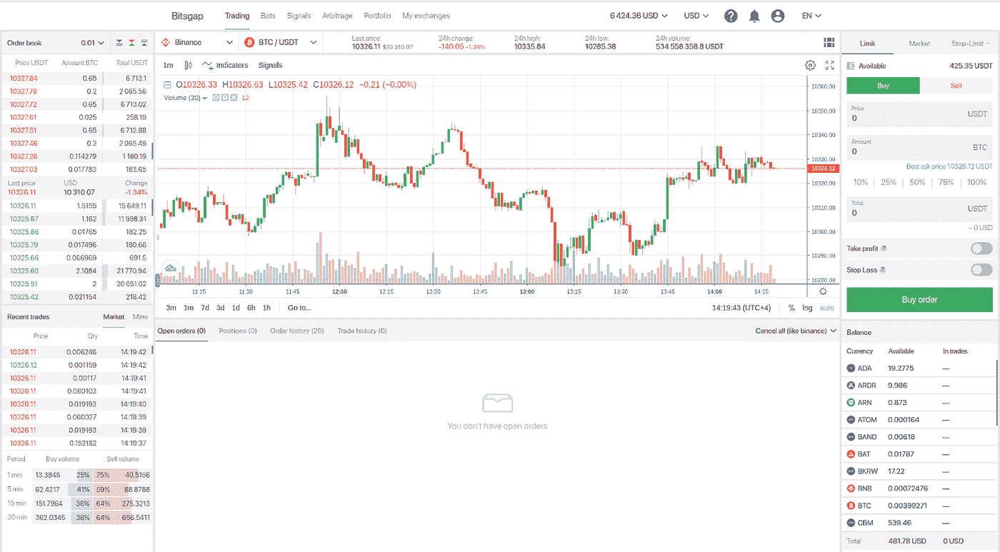
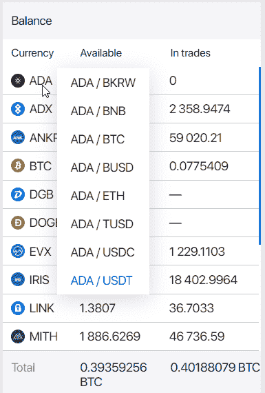
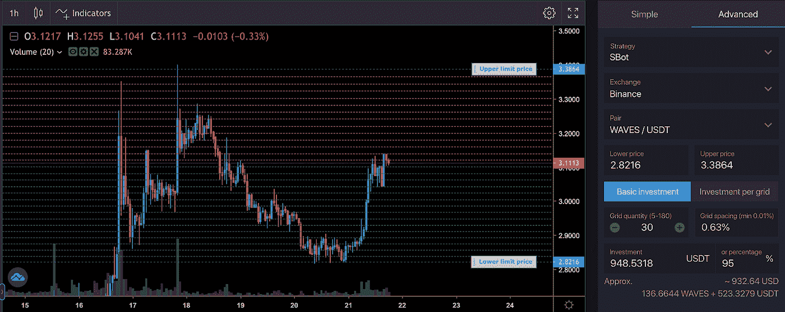
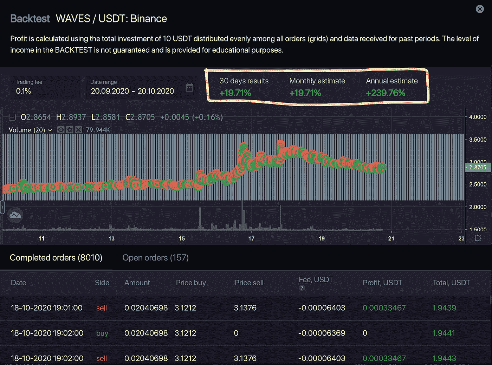
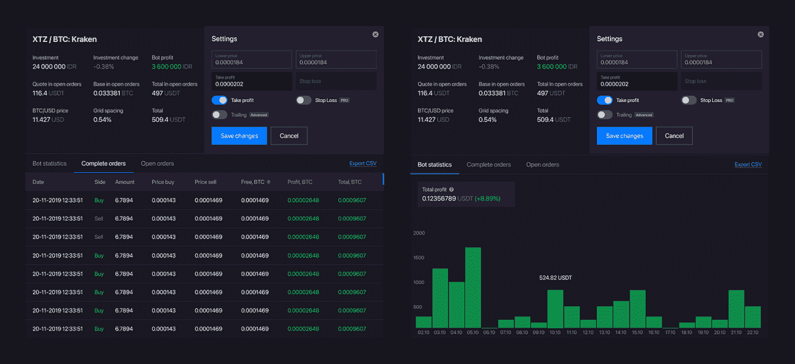

# Bitsgap: FTX 和币安期货交易终端

> 原文：<https://medium.com/coinmonks/bitsgap-ftx-and-binance-futures-trading-bot-5f7e3ea7044f?source=collection_archive---------1----------------------->

[**Bitsgap**](https://bitsgap.com/?ref=2cb1231&utm_source=bigupdate&utm_medium=article&utm_campaign=promo) 是一个交叉加密交易平台，这是一个用于交易和投资组合管理的一体化平台，自 2018 年以来一直存在于加密货币市场。世界各地的密码交易员和用户使用 [Bitsgap](https://bitsgap.com/?ref=2cb1231&utm_source=bigupdate&utm_medium=article&utm_campaign=promo) ，并完全访问自动化[交易机器人](/coinmonks/whats-the-best-crypto-trading-bot-in-2020-top-8-bitcoin-trading-bot-c16adeb13317)、[套利](/coinmonks/crypto-arbitrage-guide-how-to-make-money-as-a-beginner-62bfe5c868f6)、信号、投资组合跟踪器和交易终端，这些终端具有内置功能和新的更新，如 TWAP 策略、影子和狙击手模式、智能交易。

迄今为止，这些交易工具只对机构投资者和对冲基金开放，这些机构投资者和对冲基金拥有自己的 IT 部门，拥有庞大的财务和人力情报资源。借助人工智能、机器学习和大数据零售的力量，私人投资者现在可以更快地交易和分析市场。

[bits gap](https://bitsgap.com/?ref=2cb1231&utm_source=bigupdate&utm_medium=article&utm_campaign=promo)‘a 界面拥有新的统计数据和多种订单类型，允许交易者和投资者尝试新的策略和风险管理。

> 另外，请阅读我们的 [Bitsgap 评论](/coinmonks/bitsgap-review-a-crypto-trading-bot-that-makes-easy-money-a5d88a336df2)

# 超过 25 个加密交易所的期货和现货交易

用户友好和直观的界面是交易者和投资者正在寻找的，以使决策过程和市场分析更快。时间就是金钱！

[**Bitsgap**](https://bitsgap.com/?ref=2cb1231&utm_source=bigupdate&utm_medium=article&utm_campaign=promo) 将[交易终端](https://blog.coincodecap.com/multi-exchange-crypto-trading-platforms-features)分为两部分。第一部分是决策右侧面板，用户可以在这里执行订单，并查看他们在选定的加密货币交易所的可用余额。第二部分是左侧面板，包含相关的加密货币信息图表。先分析市场再做决定。

通过全面访问 25 个以上的加密货币交易所，交易商和投资者可以监控所有关联交易所账户的加密投资组合。多个账户统一在一个屋檐下。

随着新的更新， [Bitsgap](https://bitsgap.com/?ref=2cb1231&utm_source=bigupdate&utm_medium=article&utm_campaign=promo) 现在从一个界面支持期货和现货交易。你可以开始杠杆[交易](/coinmonks/the-best-crypto-trading-platforms-in-2020-the-definitive-guide-updated-c72f8b874555)来投机看涨或看跌市场，如果你有未平仓头寸要保护，可以使用对冲策略。平台多功能界面为用户提供了监控现货和期货头寸所需的数据。新增加密货币交易所: [**币安期货**](https://blog.coincodecap.com/go/binance) **和** [**FTX**](https://blog.coincodecap.com/go/ftx) 。

> 另外，请阅读我们的 [FTX 密码交易所评论](/coinmonks/ftx-crypto-exchange-review-53664ac1198f)

一个新的内置功能允许你点击鼠标选择货币，使交易速度更快。当价格可能朝着不希望的方向急剧变化时，这在极其不稳定的加密货币市场中尤其有用。

# **自动化期货交易机器人:测试、运行、分析**

加密货币市场充斥着大量的各种自动化解决方案，从简单的自动销售/自动购买算法到复杂的统计算法。

在 [Bitsgap](https://bitsgap.com/?ref=2cb1231&utm_source=bigupdate&utm_medium=article&utm_campaign=promo) ，主要的方法是“不要把简单性过度复杂化”。自动化交易机器人遵循一个众所周知的策略，网格交易。交易机器人在预设的交易范围内设置限价单。买入限价单低于当前市价，而卖出限价单高于当前市价。每执行一个限价买盘，bot 就会在执行价格之上下一个新的限价卖盘，反之亦然。这种完全自动化的过程是可互换的，因此给你一个显著的优势，你有机器人代表你产生回报。

在“网格策略”中，交易者和投资者分配期望的投资金额，该金额由算法按比例分配。期货交易机器人被编程为以较低的价格购买加密货币，然后以较高的价格出售，在预先定义的交易范围内交易。就这么简单。最佳市场情景是横盘和上涨市场。在熊市中，bot 产生的成本平均效应和利润抵消了基础货币的负面价格变化。

下面是一个典型的波形/USDT 对的网格配置示例:

交易者和投资者可以用 [**Bitsgap**](/coinmonks/whats-the-best-crypto-trading-bot-in-2020-top-8-bitcoin-trading-bot-c16adeb13317) 的回溯测试工具来检查他们的交易想法的表现，看看到今天为止或者过去某个特定时间段的潜在回报是多少。使用历史数据(包含有关价格波动、自动策略设置和时间段“回溯测试”的信息)可以提供预期回报:

在最新的更新中，Bitsgap 实现了一个独特的信息图表功能，“Bot statistics”。这创建了原始“回溯测试”与“机器人统计”的强大组合。在统计数据中，用户现在可以看到任何一天的报价货币中的活动机器人所产生的回报。

因此，交易者和投资者可以使用这一新的输入来模拟其他加密货币的预计日回报。根据具有不同交易配置的机器人产生的历史回报，用户可以提出最佳设置，用于未来的自动化策略。

机器人的性能和统计数据的界面也发生了变化。当你点击“查看”按钮时，所有重要的指标都显示在首页上，如果你有两个以上的活动自动化策略，这使得分析机器人的性能更容易和更快。

# **Bitsgap 5 退出策略**

1.  **止损**:当市场价格达到指定的止损价格时，自动算法卖出所有的基础货币。
2.  **取消**未结订单:自动算法关闭所有未结的卖出和买入订单。
3.  **盈亏平衡**:自动算法计算价格并发出限价卖单，在此卖单下，卖出所有基础货币导致投资变化为 0%。如果交易处于亏损状态，此选项可用。
4.  **市场卖出**:自动算法以当前市场价格卖出所有基础货币。
5.  **止盈:**自动算法在投资变动达到你设定的百分比时，卖出全部基础当前。

# 安全可靠的平台使用

[**Bitsgap**](/coinmonks/whats-the-best-crypto-trading-bot-in-2020-top-8-bitcoin-trading-bot-c16adeb13317) 无法访问您的资金，也无法访问您的私人信息。没有必要也没有机会向 Bitsgap 平台进行任何存款，因为所有操作都是直接通过 API 的安全连接在 exchange 上使用您的资金完成的。

所有信息都使用 2048 位标准协议进行加密，并存储在受防火墙保护的安全网络上，因此没有人能够访问您的数据，并且高安全性标准使 Bitsgap 的安全性是大多数互联网银行的两倍。

# 结论

随着新的衍生产品和机构投资者进入市场，加密货币市场日趋成熟。为了跟上不断发展的市场，像 [**Bitsgap**](/coinmonks/whats-the-best-crypto-trading-bot-in-2020-top-8-bitcoin-trading-bot-c16adeb13317) 这样的交易平台专注于开发工具和自动化算法，帮助各种经验水平的交易员和投资者提高回报，并从市场回调中获取利润。

要测试 Bitsgap，您可以申请 [14 天的试用期](/coinmonks/whats-the-best-crypto-trading-bot-in-2020-top-8-bitcoin-trading-bot-c16adeb13317)以换取专业订阅计划。此外，在 Bitsgap 无风险演示模式下交易，您可以发现并试验自动化机器人，尝试新订单，如狙击手、影子、TWAP 和冰山。

## 另外，阅读

*   最好的[加密交易机器人](/coinmonks/crypto-trading-bot-c2ffce8acb2a)
*   [密码本交易平台](/coinmonks/top-10-crypto-copy-trading-platforms-for-beginners-d0c37c7d698c)
*   最好的[加密税务软件](/coinmonks/best-crypto-tax-tool-for-my-money-72d4b430816b)
*   [最佳加密交易平台](/coinmonks/the-best-crypto-trading-platforms-in-2020-the-definitive-guide-updated-c72f8b874555)
*   最佳[加密贷款平台](/coinmonks/top-5-crypto-lending-platforms-in-2020-that-you-need-to-know-a1b675cec3fa)
*   [最佳区块链分析工具](https://bitquery.io/blog/best-blockchain-analysis-tools-and-software)
*   [加密套利](/coinmonks/crypto-arbitrage-guide-how-to-make-money-as-a-beginner-62bfe5c868f6)指南:新手如何赚钱
*   最佳[加密制图工具](/coinmonks/what-are-the-best-charting-platforms-for-cryptocurrency-trading-85aade584d80)
*   [莱杰 vs 特雷佐](/coinmonks/ledger-vs-trezor-best-hardware-wallet-to-secure-cryptocurrency-22c7a3fd391e)
*   了解比特币的[最佳书籍有哪些？](/coinmonks/what-are-the-best-books-to-learn-bitcoin-409aeb9aff4b)
*   [3 商业评论](/coinmonks/3commas-review-an-excellent-crypto-trading-bot-2020-1313a58bec92)
*   [AAX 交易所评论](/coinmonks/aax-exchange-review-2021-67c5ea09330c) |推荐代码、交易费用、利弊
*   [Deribit 审查](/coinmonks/deribit-review-options-fees-apis-and-testnet-2ca16c4bbdb2) |选项、费用、API 和 Testnet
*   [FTX 密码交易所评论](/coinmonks/ftx-crypto-exchange-review-53664ac1198f)
*   [n 零审核](/coinmonks/ngrave-zero-review-c465cf8307fc)
*   [Bybit 交换审查](/coinmonks/bybit-exchange-review-dbd570019b71)
*   [3Commas vs Cryptohopper](/coinmonks/cryptohopper-vs-3commas-vs-shrimpy-a2c16095b8fe)
*   最好的比特币[硬件钱包](/coinmonks/the-best-cryptocurrency-hardware-wallets-of-2020-e28b1c124069?source=friends_link&sk=324dd9ff8556ab578d71e7ad7658ad7c)
*   最佳 [monero 钱包](https://blog.coincodecap.com/best-monero-wallets)
*   [莱杰纳诺 s vs x](https://blog.coincodecap.com/ledger-nano-s-vs-x)
*   [bits gap vs 3 commas vs quad ency](https://blog.coincodecap.com/bitsgap-3commas-quadency)
*   [莱杰纳米 S vs 特雷佐 one vs 特雷佐 T vs 莱杰纳米 X](https://blog.coincodecap.com/ledger-nano-s-vs-trezor-one-ledger-nano-x-trezor-t)
*   [block fi vs Celsius](/coinmonks/blockfi-vs-celsius-vs-hodlnaut-8a1cc8c26630)vs Hodlnaut
*   Bitsgap 评论——一个轻松赚钱的加密交易机器人
*   为专业人士设计的加密交易机器人
*   [PrimeXBT 审查](/coinmonks/primexbt-review-88e0815be858) |杠杆交易、费用和交易
*   [埃利帕尔泰坦评论](/coinmonks/ellipal-titan-review-85e9071dd029)
*   [赛克斯·斯通评论](https://blog.coincodecap.com/secux-stone-hardware-wallet-review)
*   [BlockFi 评论](/coinmonks/blockfi-review-53096053c097) |从您的密码中赚取高达 8.6%的利息