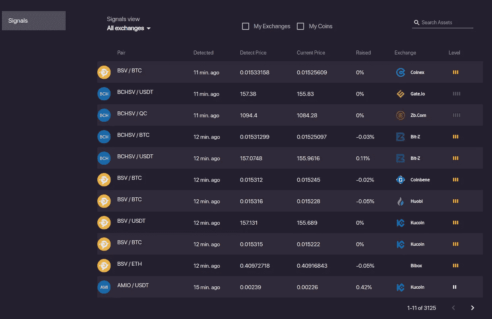

# Bitsgap 评论—加密网格交易机器人

> 原文：<https://medium.com/coinmonks/bitsgap-review-a-crypto-trading-bot-that-makes-easy-money-a5d88a336df2?source=collection_archive---------0----------------------->

本文将回顾 [Bitsgap](https://bitsgap.com/?ref=2cb1231&utm_source=coincodecap&utm_medium=article) ，这是一个满足您所有交易需求的一站式加密交易平台。它允许用户将他们所有的密码交易账户放在同一个屋檐下，通过一个集成的界面进行交易。

# 摘要

*   现货和期货交易的交易终端
*   [期货交易机器人](/coinmonks/bitsgap-ftx-and-binance-futures-trading-bot-5f7e3ea7044f)
*   跨交易所套利
*   市场信号提供了做出正确交易决定的机会
*   管理投资组合，跟踪资金
*   [网格交易机器人](https://coincodecap.com/grid-trading)让你的交易自动化
*   智能交易、TWAP 战略、狙击手和影子模式

# Bistgap 是什么？

Bitsgap 是一个一体化的加密交易平台，可以让你进行交易、管理投资组合、访问交易机器人、提供信号等等。此外，它还整合了超过 25 个主要交易所，包括比特币基地专业交易所、币安交易所、波兰交易所、北海巨妖交易所、Bitfinex 交易所等。

注册过程不会超过两分钟；它只需要验证一个电子邮件帐户。或者，用户可以通过他们的谷歌或脸书账户连接。此外， [Bitsgap](https://bitsgap.com/?ref=2cb1231&utm_source=coincodecap&utm_medium=article) 提供了 14 天的免费试用，交易者可以免费享受几项功能。

# Bitsgap 功能

以下特性只是该平台上可用的所有优秀、即用特性的冰山一角。

*   **套利** —交易者可以最大化两个或多个交易所之间的差价。
*   **交易终端**–顶级工具可帮助您使用单一界面在多个交易所进行现货和期货交易。
*   **期货交易机器人** — Bitsgap 是少数几个允许你构建期货交易机器人的交易工具之一。
*   **信号** —关注任何市场异常，以做出最佳交易决策。
*   **投资组合跟踪**–交易员将拥有实时生成的投资组合，这将使他们能够跟踪自己的资金和收益。
*   **自动化交易机器人** — Bitsgap 提供使用机器学习优化的预配置交易机器人。
*   **高安全性** —客户使用交易所的 API 密钥将他们的交易所账户连接到 Bitsgap 平台本身从来没有存款。Bitsgap 永远无法存取客户资金。它只代表用户进行交易。通过 API 的所有订单都由 Bitsgap 使用高端 2048 位加密进行保护，以提高安全性。
*   **演示交易所**—“我的交易所”是用户通过 API 连接的所有交易所账户的显示。另一方面，演示功能允许交易者练习使用 Bitsgap 上的所有特殊功能；它帮助用户熟悉平台提供的所有功能。

# Bitsgap 如何工作

*   首先，在 [Bitsgap](https://bitsgap.com/?ref=2cb1231&utm_source=coincodecap&utm_medium=article) 上创建你的账户。
*   使用您的 API 密钥将您的 Bitsgap 帐户与一个受支持的交易所链接。
*   现在，只需下订单或启动机器人，或利用 Bitsgap 从所选交易所的套利机会中获益。

# 交易终端

如果你曾经在任何加密交易所交易，你必须知道交易所更关注流动性，而不是提供最好的交易工具。

这就是像 Bitsgap 这样的解决方案致力于为交易者提供最佳加密体验的原因。 [Bitsgap 交易终端](https://blog.coincodecap.com/go/bitsgap)提供单一界面在多个密码交易所进行交易。

像止盈、影子订单、限价市场和止损这样的交易工具在创建市场订单时给了你优势。

Bitsgap Trading Terminal Review

# Bitsgap 网格交易机器人

Bitsgap 交易机器人由网格算法提供支持，允许交易者定义投资范围和限制，然后按比例分配这些投资。因此，每次系统执行限价单时，GRID 都会以略高于市场价值的价格发出另一个卖单。

对于限价单来说，反之亦然，因为每次执行前一个订单时，Bitsgap 都会以略低于市场价值的价格进行另一次买入限价。如果加密价格不超过交易者预先设定的价值范围，系统将继续不间断地进行交易。点击了解更多关于电网交易策略[的信息。](https://helpdesk.bitsgap.com/en/articles/3696368-the-grid-trading-strategy)

> **Bitsgap 提供预配置的交易机器人策略。**

# Bitsgap 审查:回溯测试

[Bitsgap](https://bitsgap.com/?ref=2cb1231&utm_source=coincodecap&utm_medium=article) 回溯测试功能针对牛市(上涨趋势)和熊市(下跌趋势)积极优化预先配置的交易机器人。

该团队通过研究和分析历史数据来利用机器学习，以最大限度地提高盈利能力并降低相关风险。

交易者可以根据他们的历史和交易机器人回报选择任何交易对。

Bitsgap Backtesting results

# Bitsgap 套利

Bitsgap 跟踪多个交易所的加密价格，并显示套利机会。

交易员可以从这些机会中获益，并通过加密套利赚钱。

Bitsgap 允许您搜索不同的加密货币，并在执行套利时分配余额。

Bitsgap arbitrage review

# 市场信号

[Bitsgap](https://bitsgap.com/?ref=2cb1231&utm_source=coincodecap&utm_medium=article&utm_campaign=promo) 也显示了市场信号。这些信号是市场中的价格异常，意味着特定加密货币的价格有急剧的波动。

这有助于交易者尽早发现价格变动并从中获益。您可以搜索这些特定的加密资产。但是，您不能配置价格变动警报。

Bitsgap market signals review

# 加密投资组合跟踪

您可以在 Bitsgap 上轻松跟踪您的加密组合。您可以查看您的所有持股、ROI(投资回报)和头寸。

此外，您还可以查看您的未结订单和历史记录。

如果您使用一个以上的加密交易所，您还可以为任何特定的交易所过滤您的投资组合。

Bitsgap portfolio tracking review

# Bitsgap 定价

[Bitsgap](https://bitsgap.com/?ref=2cb1231&utm_source=coincodecap&utm_medium=article) 提供三种订阅方案。所有的计划都有 14 天的免费试用期。

如果你是初学者，我们建议你从提前计划开始，因为它包括套利功能。如果你能成功地执行套利，你可以得到比你为 Bitsgap 支付的更多的东西。

Bitsgap pricing review

# Bitsgap 评论:利弊

## 赞成的意见

*   简单快速的开始
*   简单配置
*   预配置的交易机器人
*   套利机会
*   市场信号仪表板
*   所有功能都在一个地方
*   小额预算账户的免费套餐
*   给予 2 周的试用期，不附带信用卡

## 骗局

*   有限的交易机器人功能
*   没有移动应用程序

# Bitsgap 审查:结论

总之，无论市场状况如何，你都可以依靠 [Bitsgap](https://bitsgap.com/?ref=2cb1231&utm_source=coincodecap&utm_medium=article) 自动交易算法产生源源不断的收入。不要忘了额外的功能，如止损，止盈，退出策略，跟踪，确保你的安全和更高的投资回报率。

# 常见问题

*   **bits gap 合法还是安全？**

是的，Bitsgap 是安全合法的。该团队在其交易平台上努力工作。

*   **bits gap 有手机 app 吗？**

目前，Bitsgap 没有适用于 iOS 或 Android 设备的移动应用程序。但是，Bitsgap 有一个完全响应的网站，你可以在移动浏览器上查看。

*   **bits gap 从交易中收取费用吗？**

不，交易是不收费的。您只需支付每月订阅费，就可以使用该平台来访问有用的工具，从而提高交易和管理加密的效率。

*   **网格策略有哪些利弊？**

在网上交易的主要优势是它只需要一点点市场预测——价格在未来可能的走向。这就是为什么它是初学者和普通交易者的优秀**工具。**

但是当你让这种策略自动化时，总会有一些风险，尤其是在**不利的市场条件下**。价格突然上涨或下跌可能会影响你的结果。为了保护你的投资，你可以使用止损或者跟踪期权。

*   **bits gap 可以访问我的 exchange wallet 吗？**

Bitsgap】没有可以访问您的 exchange 钱包并在那里进行任何更改。您的资金将一直留在您的外汇账户上。

# Bitsgap 替代方案

*   [**2018 年推出的加密交易自动化平台 Quadency**](https://quadency.com/?r=ea20aa360c45d1f5ad47a19a) 。它给你带来了一个更创新的方式来交易和管理你的密码。此外，请阅读我们的[季度回顾](https://blog.coincodecap.com/quadency-review-a-crypto-trading-automation-platform)。
*   [**3commas**](https://3commas.io/?c=tc252152) 是一个在线平台，面向对使用自动化机器人进行[加密货币交易](https://blog.coincodecap.com/tag/trading/)感兴趣的人。对于没有金融技术背景或没有丰富股市经验的人来说，这尤其具有吸引力。另外，请阅读我们的[3 商业评论](/coinmonks/3commas-review-an-excellent-crypto-trading-bot-2020-1313a58bec92)。
*   [**哈森在线**](https://www.haasonline.com/?ref=11087) 是加密领域历史最悠久、最负盛名的自动化交易公司之一。他们的卓越声誉来自于他们的[交易自动化软件](https://coincodecap.com/category/trading-automation)，该软件自 2014 年以来一直为加密交易员执行交易策略。另外，请阅读我们的[哈森在线评论](/coinmonks/haasonline-review-d8d1a3400419)。
*   [**Altrady**](https://blog.coincodecap.com/go/altrady) 是一款独特的自动化加密交易工具，每天都有成千上万的交易者使用它，通过自动化交易来实现回报最大化。该公司提供几种类型的机器人，包括电网和信号机器人，为有经验的交易者提供了一种简单的方法，在没有任何知识或技能的情况下利用快节奏的市场。

> 加入 Coinmonks [电报频道](https://t.me/coincodecap)和 [Youtube 频道](https://www.youtube.com/c/coinmonks/videos)获取每日[加密新闻](http://coincodecap.com/)

## 另外，阅读

*   [复制交易](/coinmonks/top-10-crypto-copy-trading-platforms-for-beginners-d0c37c7d698c) | [加密税务软件](/coinmonks/crypto-tax-software-ed4b4810e338)
*   [网格交易](https://coincodecap.com/grid-trading) | [加密硬件钱包](/coinmonks/the-best-cryptocurrency-hardware-wallets-of-2020-e28b1c124069)
*   [密码电报信号](http://Top 4 Telegram Channels for Crypto Traders) | [密码交易机器人](/coinmonks/crypto-trading-bot-c2ffce8acb2a)
*   [最佳加密交易所](/coinmonks/crypto-exchange-dd2f9d6f3769) | [印度最佳加密交易所](/coinmonks/bitcoin-exchange-in-india-7f1fe79715c9)
*   开发人员的最佳加密 API
*   最佳[密码借贷平台](/coinmonks/top-5-crypto-lending-platforms-in-2020-that-you-need-to-know-a1b675cec3fa)
*   [杠杆代币](/coinmonks/leveraged-token-3f5257808b22)终极指南
*   [AscendEx Staking](https://coincodecap.com/ascendex-staking)|[Bot Ocean Review](https://coincodecap.com/bot-ocean-review)|[最佳比特币钱包](https://coincodecap.com/bitcoin-wallets-india)
*   [Bitget 回顾](https://coincodecap.com/bitget-review) | [双子 vs 区块链](https://coincodecap.com/gemini-vs-blockfi) | [OKEx 期货交易](https://coincodecap.com/okex-futures-trading)
*   [美国最佳加密交易机器人](https://coincodecap.com/crypto-trading-bots-in-the-us) | [经常性回顾](https://coincodecap.com/changelly-review)
*   [在印度利用加密套利赚取被动收入](https://coincodecap.com/crypto-arbitrage-in-india)
*   [霍比审核](https://coincodecap.com/huobi-review) | [OKEx 保证金交易](https://coincodecap.com/okex-margin-trading) | [期货交易](https://coincodecap.com/futures-trading)
*   [麻雀交换评论](https://coincodecap.com/sparrow-exchange-review) | [纳什交换评论](https://coincodecap.com/nash-exchange-review)

