# Bitsgap vs 3Commas vs Quadency |必读 2021

> 原文：<https://medium.com/coinmonks/bitsgap-vs-3commas-vs-quadency-must-read-2021-cdc1a40cf31d?source=collection_archive---------1----------------------->

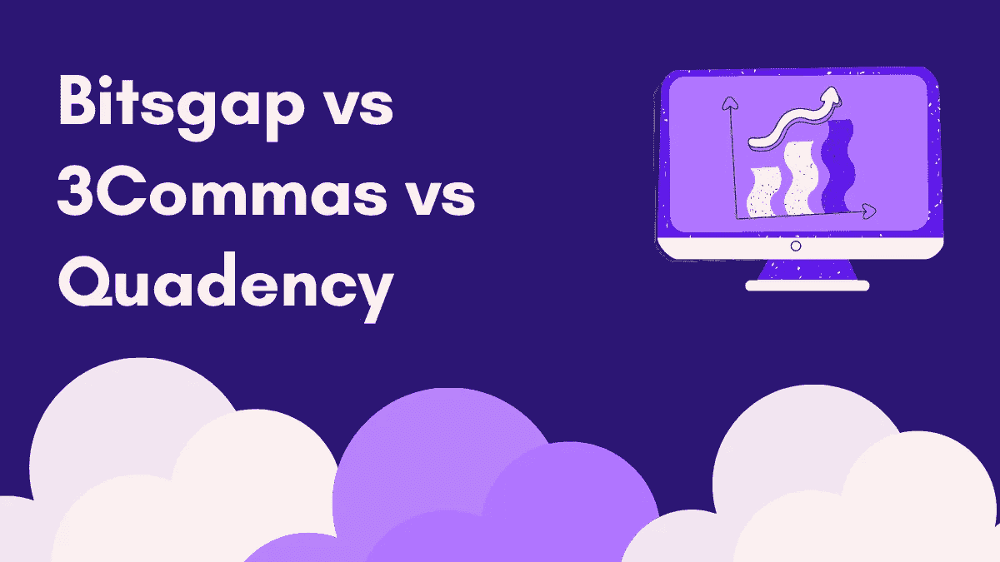

加密市场波动很大，每个人都想在低点买入，在高点卖出。但是，这需要大量的注意力和时间。如果你可以使用代表你买卖并产生利润的程序会怎么样？

这些程序已经存在，它们被称为[加密货币交易机器人](/coinmonks/crypto-trading-bot-c2ffce8acb2a)。他们持续监控市场，并根据预先设定的规则采取行动。

本文将对[排名前三的密码交易机器人](/coinmonks/crypto-trading-bot-c2ffce8acb2a)、 [Bitsgap](https://blog.coincodecap.com/go/bitsgap) 、 [3commas](https://blog.coincodecap.com/go/3commas) 和 [Quadency](https://blog.coincodecap.com/go/quadency) 进行比较。

[Bitsgap](https://blog.coincodecap.com/go/bitsgap) 是 2018 年初推出的 all in one 交易平台。他们从一个平台提供加密资产的管理——交易机器人、套利、投资组合和信号。你可以从一个界面连接到所有你喜欢的交易所。

[3commas](https://blog.coincodecap.com/go/3commas) 是一个加密货币交易平台，提供智能交易终端和自动交易机器人。他们帮助你最大化利润，以最小的风险限制损失。

[Quadency](https://blog.coincodecap.com/go/quadency) 提供了一种更智能的交易和管理加密货币的方式。他们帮助你自动化你的策略，甚至在离线钱包中监控你的财产。他们管理着 1 亿多美元。

# 交易机器人

## Bitsgap

*   全天候工作的全自动机器人。
*   在做出实际投资决定之前，您可以在演示模式或[回溯测试](https://en.wikipedia.org/wiki/Backtesting#:~:text=Backtesting%20is%20a%20term%20used,previous%20time%20period(s).)中检查机器人的性能。他们展示了你的机器人将如何应对利润和损失。
*   [Bitsgap](https://blog.coincodecap.com/go/bitsgap) 根据成功的回溯测试结果提供预定义的策略。
*   创建交易机器人策略很容易。
*   图表帮助你评估你的机器人性能。
*   如果价格快速上涨或下跌，机器人就变得无效。它在波动或中性市场中最有效。
*   如果价格超过机器人的范围，所有的 BTC 将自动出售，你只剩下实现 USDT。如果价格越过下边界，所有的买单都会被完全执行。
*   如果删除 bot，所有附加的未结订单都将被取消。

## 3Commas

[3Commas](https://blog.coincodecap.com/go/3commas) 主要提供三种现成的交易机器人——DCA、Grid 和 Options bot。

如果您希望紧急取消交易，您可以使用“恐慌性抛售”按钮。您可以在“交易者日记”部分查看您所有交易的可视化报告。

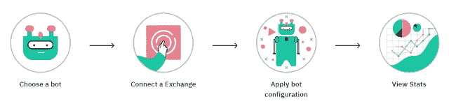

how to use [3Commas](https://blog.coincodecap.com/go/3commas)?

## 四元制

*   它提供现成的和定制的机器人。
*   参数是可定制的。
*   上线前的回溯测试。
*   您可以使用“智能建议”来搜索和复制成功的配置。这些配置由 Quadency 的超参数优化引擎生成，并分配给机器人。
*   你也可以编写一个定制的策略，T2 团队会把它放到你的账户里。

## Bitsgap vs 3Commas vs Quadency:支持的加密交换

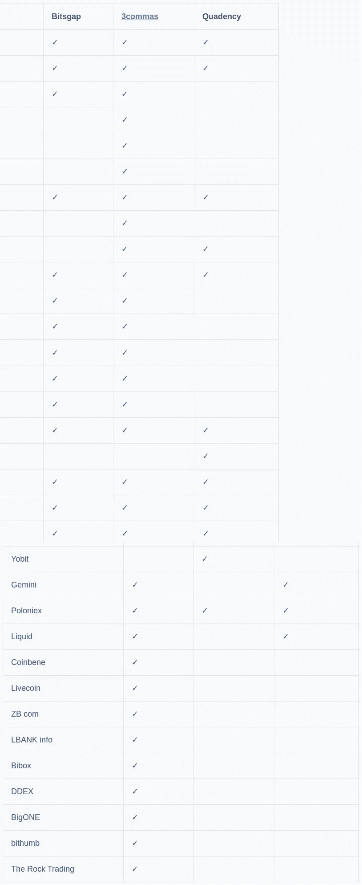

Supported Crypto Exchanges

# 安全性

## Bitsgap

在 [Bitsgap](https://blog.coincodecap.com/go/bitsgap) 中的所有资金都安全地存储在你的[加密交易所](https://blog.coincodecap.com/tag/crypto-exchange)中，并通过加密的 API 密钥连接。所有信息都用 2048 位标准算法加密，并由强大的防火墙保护。敏感帐户信息绝不会与任何第三方共享。

[Bitsgap](https://blog.coincodecap.com/go/bitsgap) 推荐使用[双因素认证](https://en.wikipedia.org/?title=Two-factor_authentication&redirect=no)，增加一层安全保障。如果有多次失败的登录尝试，将导致帐户和 API 的临时锁定。您可以根据需要限制 API 键的访问。API kets 总是隐藏的，并且是加密的格式。

## 3Commas

[3commas](https://blog.coincodecap.com/go/3commas) 通过 API 将交易机器人连接到您的交易所账户。要向外部账户转移任何加密货币，你必须提供交易所生成的 API 密钥。这有助于限制对您帐户的访问。机器人没有任何提款权。

他们在每次登录和取款时提供双因素认证。我们还建议您启用通知，以便在每次登录他们的帐户时提醒您。每当新用户从新的目的地登录时，该交换使用 IP 检测并发送验证电子邮件。

他们使用集成的安全保障和技术措施(如安全服务器和加密)来保护数据。在任何安全漏洞的不幸情况下，他们实施[事件和漏洞响应计划](https://www.securitymetrics.com/blog/6-phases-incident-response-plan#:~:text=An%20incident%20response%20plan%20is,involves%20regular%20updates%20and%20training.)，包括尽快向所有用户发送通知。

## 四元制

[Quadency](https://blog.coincodecap.com/go/quadency) 使用各种安全措施，如 API 密钥加密、未授权访问、密码和其他敏感信息。所有信息在传输和静止过程中都是加密的。密码使用 [Bcrypt](https://en.wikipedia.org/wiki/Bcrypt) 加密算法加密。他们利用现代浏览器中的[内容安全策略(CSP)](https://developer.mozilla.org/en-US/docs/Web/HTTP/CSP) 和 [HTTP 严格传输安全(HSTS)](https://en.wikipedia.org/wiki/HTTP_Strict_Transport_Security) 功能。您可以禁用 exchange API 的撤销权限，并使用双因素身份验证。

此外，在部署每个代码之前，Quadency 会根据 [OWASP](https://owasp.org/) 标准和合规性对基础设施和应用程序进行定期 pen 测试，以确保生产代码没有漏洞。

他们与 AWS 合作，消除[拒绝服务(DDoS)](https://en.wikipedia.org/wiki/Denial-of-service_attack) 攻击，并使用 [AWS WAF](https://aws.amazon.com/waf/#:~:text=AWS%20WAF%20is%20a%20web,security%2C%20or%20consume%20excessive%20resources.&text=The%20pricing%20is%20based%20on,web%20requests%20your%20application%20receives.) 减少深度防御应用中的任何攻击。

# 附加功能

## Bitsgap

**交易终端**

*   [Bitsgap](https://blog.coincodecap.com/go/bitsgap) 提供了一个用户友好的界面，支持在多个交易所进行现货和期货交易。你可以利用杠杆交易，在上涨或下跌的市场中建仓，如果你有未平仓头寸需要保护，可以运用对冲策略。
*   他们提供桌面版和移动版。
*   你可以在白天和夜晚模式之间切换。
*   [完全支持 TradingView](https://www.tradingview.com/ideas/wikipedia/) 图表。您可以从图表中更改或取消订单。
*   他们提供了 100 多种流行的指标，50 多种绘图工具，12 种可定制的图表类型。
*   他们提供交易工具，如 smart，shadow，stop-limit 和市场订单。

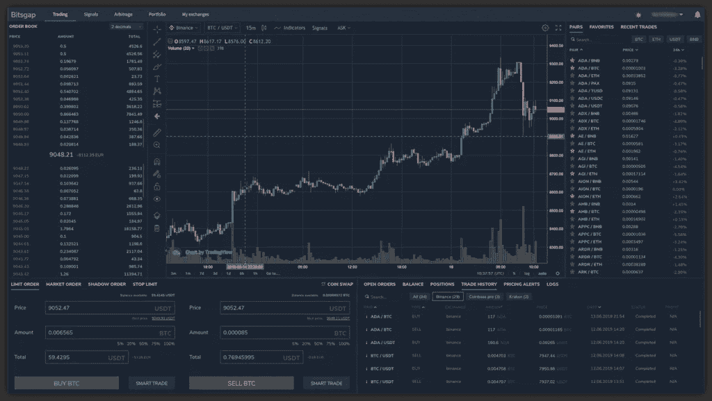

Bitsgap: User Interface

**套利**

[Bitsgap](https://blog.coincodecap.com/go/bitsgap) 加密货币[套利](https://en.wikipedia.org/wiki/Arbitrage)工具允许你追踪机会，利用交易所之间的差价。你从价格较低的交易所买入一种货币，然后在价格较高的交易所卖出。你可以在加密和不加密之间选择。你的利润包括平台收取的费用。

要获得利润，你必须在正确的时间买入和卖出，因为这些机会不会持续太久。如果你手动观察市场，会花很多时间。因此 [Bitsgap](https://blog.coincodecap.com/go/bitsgap) 提供了一个自动化的人工智能机器人。

**信号**

[Bitsgap](https://blog.coincodecap.com/go/bitsgap) 提供了一个信号工具，每秒钟可以分析超过 10，000 个 [crypto](https://blog.coincodecap.com/tag/crypto) 对的交易信号。该榜单显示了增长潜力最大的硬币。你可以设置一个聪明的订单来最小化你的风险。它允许您根据信号强度、加注百分比、信号强度、检测时间和交换来筛选机会。

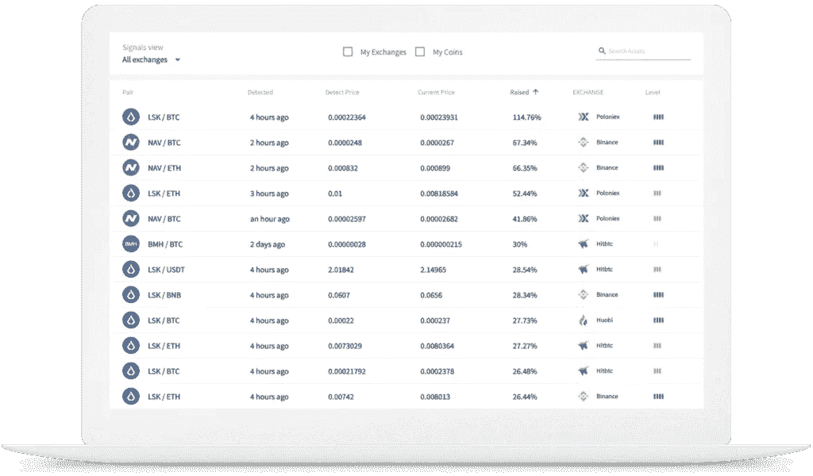

Bitsgap Signals

**投资组合**

Bitsgap 允许你追踪来自加密交换的信息。他们提供了一个自动化的免费仪表板。你可以在实时生成的[投资组合](https://en.wikipedia.org/wiki/Portfolio_(finance))中查看你的资金和收益。此外，您可以为任何特定的交易所过滤您的投资组合。

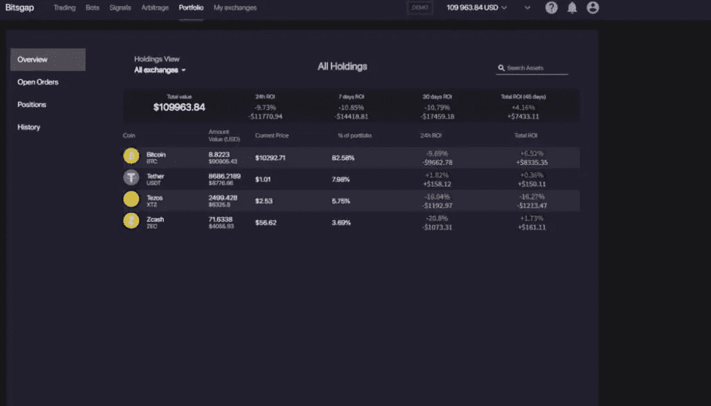

Bitsgap Portfolio

## 四元制

**交易终端**

*   Quadency 提供了一个简单易用的界面。
*   你可以在白天和夜晚模式之间切换。
*   窗口是可定制的。
*   他们提供交易工具，如高级交易图表和订单管理。
*   有 100+的技术指标和绘图工具。
*   像全部取消、交易可视化和图表点击填充等功能都是可用的。

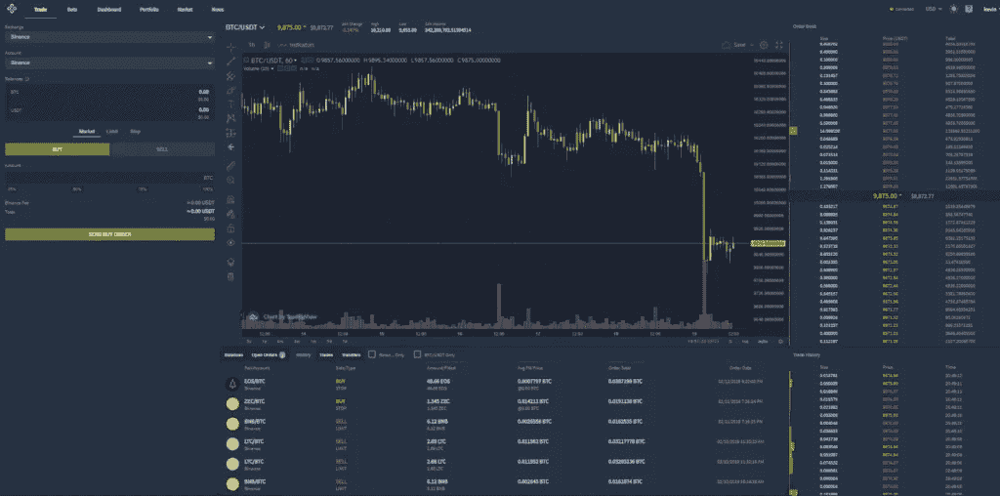

Quadency Trading Terminal

[Quadency](https://blog.coincodecap.com/go/quadency) dashboard 可以让你跟踪你的总体持有量和表现，分析统计数据，显示账户余额，图表加密硬币分配，查看最近的交易，等等。

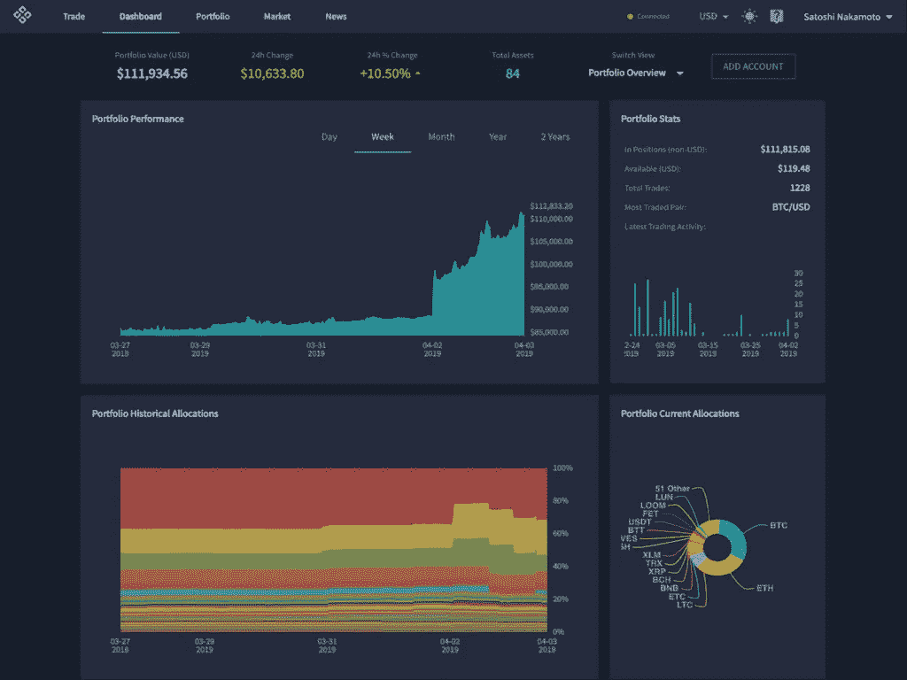

Quadency Dashboard

**作品集**

如果您已经将您的 exchange 帐户连接到 [Quadency](https://blog.coincodecap.com/go/quadency) ，您的余额、交易和订单都可以在“投资组合”页面上看到。您可以跟踪您的所有加密资产(离线硬件钱包和连接的交易所)。您的整个 crypto [投资组合](https://en.wikipedia.org/wiki/Portfolio_(finance))在一个屏幕中的可视化表示允许您正确管理交易、风险和余额变化。

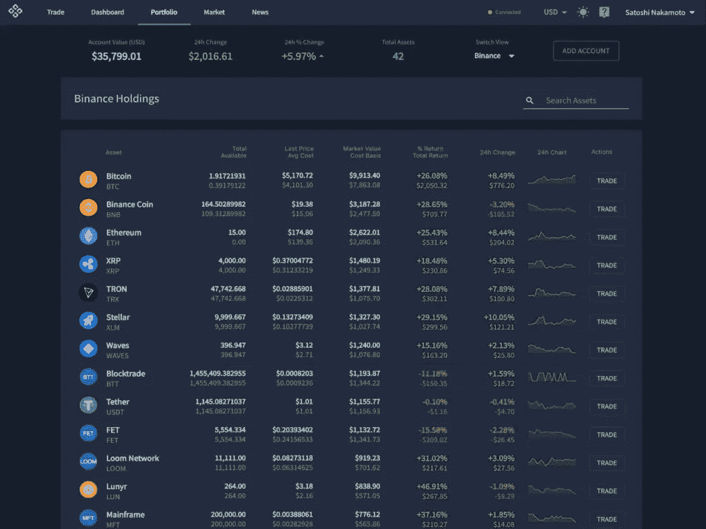

Quadency Portfolio

## 3Commas

**交易终端**

[3commas](https://blog.coincodecap.com/go/3commas) 提供了一个智能终端，您可以在这里同时查看汇率图表和 [TradingView](https://www.tradingview.com/ideas/wikipedia/) 信号。与常规交换终端相比，它们提供了额外的功能，例如-

*   同时止盈止损
*   止损止盈的跟踪机制
*   通过在计划外的市场条件下获利来提供智能掩护
*   分步销售逐步获利

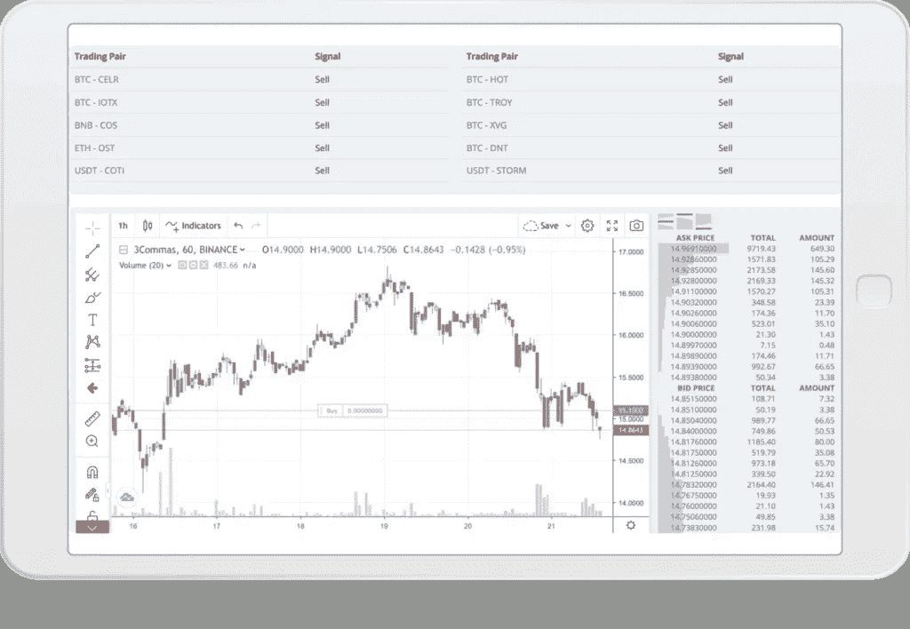

[3Commas](https://blog.coincodecap.com/go/3commas) Trading Terminal

**复制交易机器人**

[3 消息](https://blog.coincodecap.com/go/3commas)允许您查看和[复制交易机器人](/coinmonks/crypto-trading-bot-c2ffce8acb2a)。他们提供简单、短、复合和复合短机器人。此外，您可以通过按“查看配置”来检查机器人的配置所有设置都是从原始 bot 自动复制的。您也可以在使用前调整设置。在阻止这个机器人之前，你应该检查你是否有足够的钱来运行这个机器人。

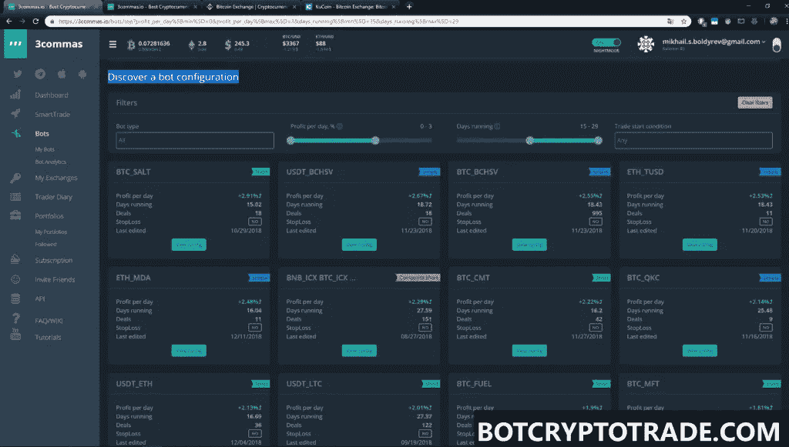

3Commas: Copy Trading Bots

# Bitsgap vs 3Commas vs Quadency:定价

## 3 商品定价

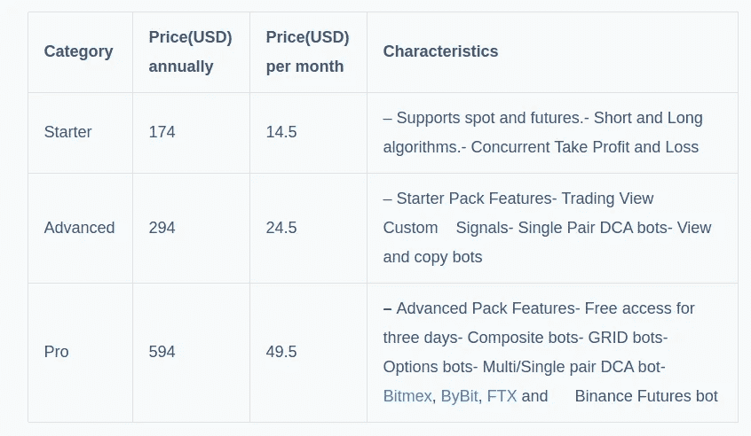

3commas Pricing

## Bitsgap 定价

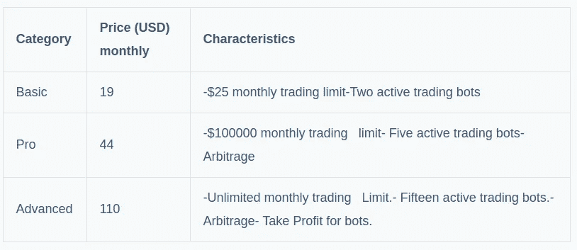

Bitsgap Pricing

这三个软件包都提供了交易信号、投资组合、扩展订单类型和演示交易。额外的专业套装提供优先支持。

## 四元定价

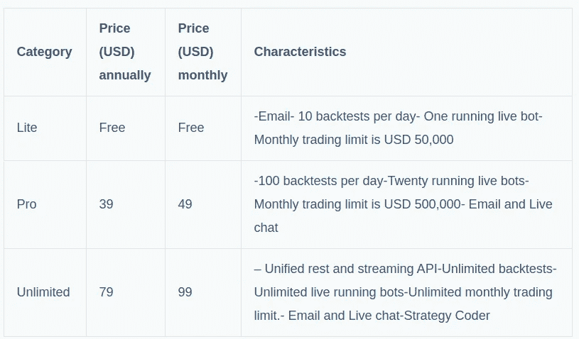

Quadency Pricing

# Bitsgap vs 3Commas vs Quadency:客户支持

## Bitsgap

你可以在[【邮件保护】](https://blog.coincodecap.com/cdn-cgi/l/email-protection#9feceaefeff0edebdffdf6ebecf8feefb1fcf0f2)给他们写信。 [Bitsgap](https://blog.coincodecap.com/go/bitsgap) 还运营一个[电报频道](https://t.me/Bitsgap)来回答你的疑问。您还可以在 [Twitter 上与他们联系。](https://twitter.com/Bitsgap/)

## 3commas

您可以通过以下电子邮件 id 给他们写信:

支持:[【邮件保护】](https://blog.coincodecap.com/cdn-cgi/l/email-protection#2b585e5b5b44595f6b18484446464a58054244)

支付信息:[【邮件保护】](https://blog.coincodecap.com/cdn-cgi/l/email-protection#8cffede0e9ffccbfefe3e1e1edffa2e5e3)

法律问题:[【电子邮件受保护】](https://blog.coincodecap.com/cdn-cgi/l/email-protection#412d2426202d0172222e2c2c20326f282e)

附属机构:[【受电子邮件保护】](https://blog.coincodecap.com/cdn-cgi/l/email-protection#077766757369627574473464686a6a6674296e68)

[3commas](https://blog.coincodecap.com/go/3commas) 运行一个[电报通道](https://t.me/commas)，在此共享定期更新。他们还有一个 [Youtube 频道](https://www.youtube.com/channel/UCig8XY-gsthRgM-zyv1nx6Q/videos)，里面有很多关于我们如何使用这个平台的视频。你也可以在推特上和他们联系。

## 四元制

你可以通过[【电子邮件保护】](https://blog.coincodecap.com/cdn-cgi/l/email-protection#87f4f2f7f7e8f5f3c7f6f2e6e3e2e9e4fea9e4e8ea)写信联系支持他们。他们也有一个实时聊天选项，但它只适用于专业订阅用户。

Quadency 运营着一个 Youtube 频道，里面有关于如何使用这个平台的视频。

他们的支持团队成员也活跃在[电报频道。](https://t.me/joinchat/Fbj0HRHlGePeT8QeV-4uBg)你也可以在[推特](https://twitter.com/quadency)上与他们联系。

# Bitsgap vs 3Commas vs Quadency:结论

总之， [Bitsagap](https://blog.coincodecap.com/go/bitsgap) 、 [3Commas](https://blog.coincodecap.com/go/3commas) 和 [Quadency](https://blog.coincodecap.com/go/quadency) ，这三个交易机器人都是密码市场上三个[最好的密码交易机器人](/coinmonks/crypto-trading-bot-c2ffce8acb2a)。如果你正在寻找更多的机器人尝试 Quadency，如果你正在寻找更多的交流平台和期货交易尝试 Bitsgap。如果你是一个便宜的，容易开始交易的机器人解决方案，试试 3Commas。

概括而言，交易所的主要特点如下-

## Bitsgap

*   预定义的机器人
*   易于设置和使用
*   他们提供期货和现货交易。
*   用于分析您的活动的交互式仪表板。
*   他们支持大量的加密货币交易。
*   允许在进行实际投资之前进行回溯测试
*   现场和演示交易平台
*   投资组合
*   风险管理
*   套利

## 3Commas

*   用户友好的跨平台界面
*   可定制的不同类型的交易机器人
*   智能交易
*   密码信号

## 四元制

*   使用方便
*   直观的用户体验和强大的仪表板
*   管理所有加密资产的统一平台
*   无需交换账户的即时交换
*   高级图表
*   投资组合

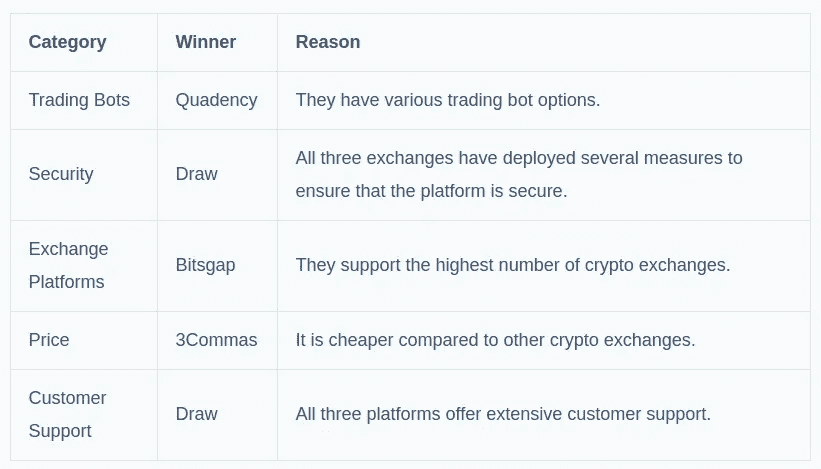

Bitsgap vs 3Commas vs Quadency

*原载于 2020 年 12 月 11 日 https://blog.coincodecap.com***。**