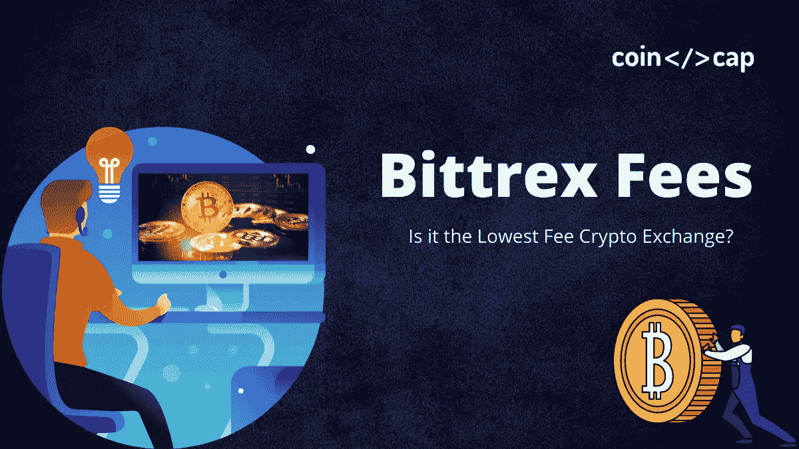
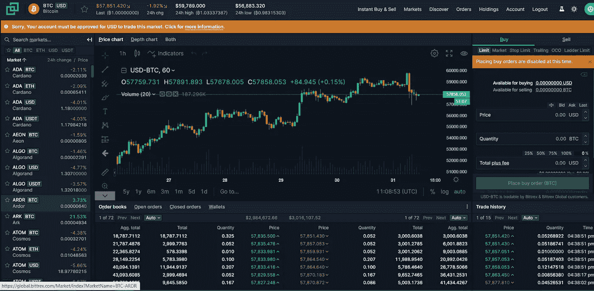
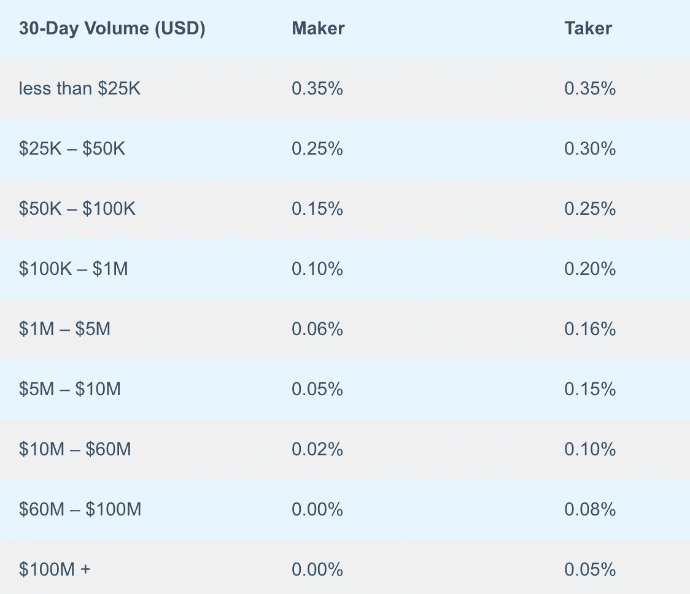

# Bittrex 费用 2021:您支付的费用是否过高？

> 原文：<https://medium.com/coinmonks/bittrex-fees-2305c8a68d6d?source=collection_archive---------11----------------------->

[**Bittrex**](https://blog.coincodecap.com/go/bittrex) 是最古老的[加密货币交易所](https://blog.coincodecap.com/crypto-exchange)之一，自 2014 年开始运营，总部位于华盛顿州西雅图。最重要的是，安全性一直是 Bittrex 的重中之重。由于其顶级的安全措施，该交易所从未遭到黑客攻击。此外，该平台每天有 3 亿美元的交易量。然而，该平台也有一个有吸引力的费用结构，因此让我们了解一下 [Bittrex](https://blog.coincodecap.com/go/bittrex) 的所有不同类型的费用。

# 总结(TL；博士)

*   [Bittrex](https://blog.coincodecap.com/go/bittrex) 是最古老的[加密货币交易所](https://blog.coincodecap.com/go/crypto-exchange)之一。自该平台推出以来，黑客从未盗取过用户的资金。
*   [**Bittrex**](https://blog.coincodecap.com/go/bittrex) 在其撮合系统完成交易指令时收取交易费用或佣金。
*   交易量大的用户必须支付较少的庄家和庄家费用。
*   Bittrex 对存款不收取任何费用。然而，当你从一个钱包转移资金到另一个钱包时，会产生网络费用。
*   在提取资金时， [Bittrex](https://blog.coincodecap.com/go/bittrex) 会收取一笔费用，以支付将资金从一个加密货币地址发送到另一个加密货币地址的网络费用。
*   Bittrex 对固定存款或取款不收取任何费用。但是，您的银行可能会收取您发送和接收电汇的费用。
*   Bittrex 有一个推荐计划，通过它你可以赚更多。每次有人使用你的推荐链接在 Bittrex 上交易，你将获得 10%的佣金。
*   虽然 Bittrex 的费用很低，但与币安和 T21 的费用相比还是很低。币安对所有交易收取 0.1%的费用。这是加密货币行业中最低的费用。

# Bittrex 费用:交易费

交易费是本交易所撮合引擎完成一笔交易指令时， [**Bittrex**](https://blog.coincodecap.com/go/bittrex) 收取的佣金。此外，费用是根据你交易的资金数量收取的。根据订单是制造商还是接受者，费用会有所不同。此外，交易量高的用户可以享受费用优惠，因为这些用户增加了平台的流动性。但是，没有执行的订单不收取任何费用。

# 制造商收取的费用

庄家创建买入或卖出订单，这些订单不会立即执行。取而代之的是，接受者下达必须立即执行的订单。

您可以创建一个只在 ETH 价格低于指定值时执行的卖单/做市商单。当您的现有订单与新的购买订单(接受者购买订单)匹配时， [**Bittrex**](https://blog.coincodecap.com/go/bittrex) 将收取交易的做市商费用。同样，交易中的接受者将被收取接受者费用。

# Bittrex 费用:30 天交易量

Bittrex 奖励交易量高的用户，因为这些用户增加了平台的流动性。所以，平台会根据你过去 30 天以美元计算的总交易量，减免一笔交易费用。

[**Bittrex**](https://blog.coincodecap.com/go/bittrex) 每天更新每个账户的 30 天成交量。你可以通过进入你的账户并点击“我的活动”来查看你 30 天的活动量

以下是根据一个账户 30 天交易量制定的费用表:

# 区块链费用

## 押金费用

Bittrex 对存款不收取任何费用。然而，一些硬币和代币需要资金从一个地址转移到另一个地址，然后才能存入。在这种交易中会产生一笔网络费用， [**Bittrex**](https://blog.coincodecap.com/go/bittrex) 无法避免这笔费用。

## 取款费

Bittrex 收取一定的费用来支付网络费用。当您将资金从一个加密货币地址转移到另一个外部地址时，会产生网络费用。网络费用支付给“矿工”，他们将加密货币交易添加到公共记录或区块链中，从而帮助维护网络。网络费用取决于硬币或令牌以及网络当时的流量。

## 固定费用

[**Bittrex**](https://blog.coincodecap.com/go/bittrex) 存取美元不收取任何费用。但是，您的银行可能会收取您接收和发送电汇的费用。

# Bittrex 费用:推荐计划

Bittrex 有一个推荐计划，通过它您可以获得。报名参加这个推荐项目很简单。你只需登录你的 Bittrex 账户，点击“账户”，然后点击“[推荐计划](https://blog.coincodecap.com/go/bittrex)”在这里，您可以找到您独特的推荐代码和链接。您可以在您的社交媒体页面上分享此推荐链接。每次有人用你的链接在 Bittrex 上交易，你就赚 10%的佣金。

# Bittrex vs 币安的费用

Bittrex 的交易费用很低，但与币安的**相比，它就差远了。币安对所有交易收取 0.1%的费用。这是加密货币行业中最低的费用。了解这两个平台之间的差异并选择您喜欢的平台可能会对您有所帮助。要了解更多信息，请阅读下面的文章。**

** [## 币安 vs Bittrex |哪个对你来说是最好的交换？[2021]

### 在本文中，我们将比较两个全球加密交易所币安 vs Bittrex。币安是最大的加密货币…

blog.coincodecap.com](https://blog.coincodecap.com/binance-vs-bittrex) 

如果你想更多地了解币安，你可以去我们的币安评论栏目。

# Bittrex 费用:结论

Bittrex 是一种快速、安全且易于使用的加密货币交易所。对于新手和有经验的交易者来说，这都是一个很好的交流机会。 [**Bittrex**](https://blog.coincodecap.com/go/bittrex) 以高交易量奖励用户。这些用户必须支付较低的制造商和接受者费用。Bittrex 也有一个推荐项目，通过它你可以获得资金。此外，该平台提供免费的在线钱包服务，您可以使用它来存储您在该平台上交易的所有硬币和代币。

# 常见问题

【Bittrex 有手机 app 吗？

是的，Bittrex 确实有一个移动应用程序，可以在 iOS 和 Android 设备上使用。

**Bittrex 安全吗？**

是的，Bittrex 是一个安全的交易所。此外，该平台自 2014 年成立以来从未遭到黑客攻击。安全性一直是 Bittrex 的重中之重。此外，80%到 90%的用户资金都安全地存放在冷库中。这些存储都是离线的，即使网站被黑，这些资金也不会受到影响。用户还可以通过 google authenticator 在自己的账户上设置双因素认证或 2FA。

**bit trex 钱包安全吗？**

虽然 [Bittrex](https://blog.coincodecap.com/go/bittrex) 从未遭到大规模黑客攻击，但一些用户报告称遭到黑客攻击，并丢失了他们存储在 [Bittrex 钱包](https://bittrex.com/discover/all-about-digital-wallets)中的资金。这种情况经常发生在帐户上没有设置 2FA 的用户身上。因此，选择一个强密码并设置 2FA 以尽可能保证您的帐户安全是至关重要的。仍然建议您将资金存储在硬件钱包中，因为这是存储加密资金最安全的方式。

**如何联系 Bittrex？**

你可以去 [Zendesk](https://bittrex.zendesk.com/hc/en-us) 上的支持页面联系 [Bittrex](https://blog.coincodecap.com/go/bittrex) 。在这里，您可以阅读有关常见问题、用户设置、新闻和公告、帐户故障排除等的文章。你的大部分疑问都可以通过阅读文章来解决。如果你需要更多帮助，你可以填写一张“支持票”支持团队将检查您的问题。除了 Zendesk，你还可以通过:
[脸书](https://www.facebook.com/bittrex/)
[Twitter](https://twitter.com/BittrexExchange?ref_src=twsrc%5Egoogle%7Ctwcamp%5Eserp%7Ctwgr%5Eauthor)
[Slack](https://bittrex.zendesk.com/hc/en-us/articles/115002224092-How-do-I-get-invited-to-the-Bittrex-Slack-channel-)联系 Bittrex

*   [加密交易机器人](/coinmonks/crypto-trading-bot-c2ffce8acb2a)
*   [币安 vs Bittrex |哪个对你来说是最好的交换？【2021】](https://blog.coincodecap.com/binance-vs-bittrex)
*   [最佳加密交易所| 2021 年十大加密货币交易所](https://blog.coincodecap.com/crypto-exchange)
*   [加密钱包最佳实践——如何保护你的硬币？](https://blog.coincodecap.com/how-to-secure-your-crypto-wallet)
*   [加密价格和虚假交易量](https://blog.coincodecap.com/crypto-price-the-fake-trading-volume)
*   [TigerTrade Review —高级加密交易终端](https://blog.coincodecap.com/tigertrade-review-an-advance-crypto-trading-terminal)** 

***原载于 2021 年 6 月 24 日 https://blog.coincodecap.com***。****