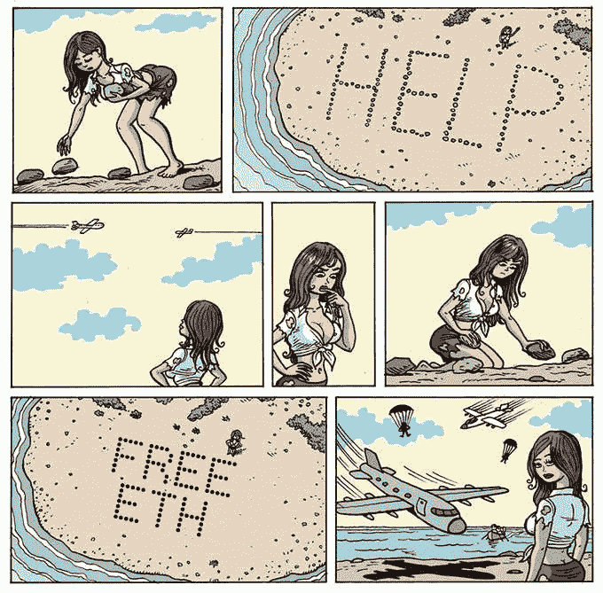
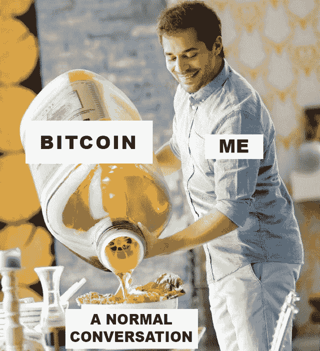
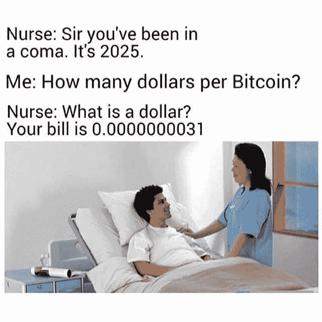

# Bittrex 全球推出令牌化股票|以太坊 2.0 推出

> 原文：<https://medium.com/coinmonks/bittrex-global-launched-tokenized-stocks-ethereum-2-0-launched-44916f21ad9f?source=collection_archive---------3----------------------->

[Source](https://www.reddit.com/r/Bitcoin/comments/k7c9kh/bitcoin_moon_balloon/)

## 脸书支持的天秤座协会更名为 Diem | GBV 收购 OMG 网络

*   脸书支持的数字支付集团 Libra Association[周二](https://www.cnbc.com/2020/12/01/facebook-backed-libra-digital-currency-has-been-renamed-diem.html)表示，它将更名为“Diem”Diem 是脸书组织的一个独立组织，负责管理数字货币。其他协会成员包括安德森·霍洛维茨、比特币基地、Spotify、Lyft 和优步。
*   Bittrex Global 已经在其数字资产交易所推出了苹果、特斯拉和亚马逊等股票的交易。
*   信用卡巨头 Visa 今天宣布，它将把其拥有 6000 万商户的全球支付网络与区块链以太坊上由 Circle Internet Financial 开发的美元硬币(USDC)连接起来。这种数字货币现在价值 29 亿美元。

## [四缺](https://quadency.com/?r=ea20aa360c45d1f5ad47a19a)

试试 [Quadency](https://quadency.com/?r=ea20aa360c45d1f5ad47a19a) ，这是一个为交易者打造的交易终端，让他们的加密交易自动化。阅读我们的[季度回顾](/coinmonks/quadency-review-a-crypto-trading-automation-platform-3068eaa374e1)。

> *查看我们的* [*最佳加密交易机器人*](/coinmonks/whats-the-best-crypto-trading-bot-in-2020-top-8-bitcoin-trading-bot-c16adeb13317) *列表。*

## 最新消息📰

*   “小队”的一名成员[开始使用](https://www.wired.com/story/member-squad-takes-cryptocurrency/)加密货币
*   MicroStrategy [希望通过可转换票据筹集 4 亿美元](https://www.theblockcrypto.com/linked/86887/microstrategy-400-million-convertible-notes-bitcoin),并用净收益购买比特币
*   加密交易所 Bittrex global 列出了苹果、亚马逊、特斯拉的股票进行交易
*   S&P 道琼斯指数将于 2021 年推出加密货币指数
*   GBV [收购](https://gbv.capital/gbv-omg-synqa/) OMG 网络(OMG)！
*   Visa [与以太坊数字美元初创公司](https://www.forbes.com/sites/michaeldelcastillo/2020/12/02/visa-partners-with-ethereum-digital-dollar-startup-that-raised-271-million/?sh=d6d95994b1f5)合作，融资 2.71 亿美元
*   Btc-e 运营商威尼克[因洗钱指控被判 5 年](https://www.coindesk.com/btc-e-operator-vinnik-sentenced-to-5-years-in-prison-on-money-laundering-charges)监禁
*   Infura [收购 any.sender](https://blog.infura.io/announcing-our-acquisition-of-any-sender-and-the-alpha-release-of-infura-transactions/) 并释放 Infura 交易！
*   BeaconChain [推出](https://beaconscan.com/slot/1)与“F 先生在这里”涂鸦
*   Compounder.finance [被地毯拉](https://rekt.ghost.io/deathbed-confessions-c3pr/)超过 1200 万美元
*   Aave 协议 V2 [推出](/aave/the-aave-protocol-v2-f06f299cee04)
*   1inch exchange [为每个人启用私人](https://twitter.com/1inchExchange/status/1334992381242961930)交易
*   比特币基地、币安和 Okex 宣布推出以太坊 2.0 贝丝

> *报税季即将来临，使用最好的* [***加密报税软件***](/coinmonks/best-crypto-tax-tool-for-my-money-72d4b430816b) *来申报你的加密报税吧。*

[source](https://twitter.com/EthereumMemes/status/1334908071387090946/photo/1) : ETH Memes

> BlockFi 首次推出加密奖励信用卡。在日常购物中获得 1.5%的比特币奖励。现在加入等候名单。

## 好的读物📑

*   [始料未及(？)](https://www.coincenter.org/the-unintended-consequences-of-the-stable-act/)稳定行为的后果
*   Uniswap 的[金融](https://research.paradigm.xyz/uniswaps-alchemy)炼金术
*   投机[攻击](https://nakamotoinstitute.org/mempool/speculative-attack/)
*   [Diem](/coinmonks/guide-to-diem-or-libra-2-0-cf90a31c9430) (或 Libra 2.0)指南
*   P2SH 之战:第一次比特币战争的不为人知的故事
*   比特币的新[制度](/@Solairis_/new-institutional-theoric-model-for-bitcoin-138e94233bf6)理论模型
*   [Sushiswap](https://rekt.ghost.io/sushiswap-saved-0xmaki-speaks-out/) 得救了——0x maki 说出来了
*   以太坊 2.0 [税务](https://gordonlawltd.com/ethereum-2-tax-guide/)指南
*   [所有制经济中的领导](https://variant.fund/leadership-in-the-ownership-economy/)
*   Eth2 砍杀[预防](/prysmatic-labs/eth2-slashing-prevention-tips-f6faa5025f50)提示
*   [Stablecoins 2.0](https://arxiv.org/pdf/2006.12388.pdf) :经济基础和基于风险的模型
*   [以太坊](/dappnode/guardians-of-ethereum-a-validator-dao-proposal-d82e76231b45)守护者:验证者道提案

> *买一个* [***硬件钱包***](/coinmonks/the-best-cryptocurrency-hardware-wallets-of-2020-e28b1c124069)*[*保护你的加密货币*](/coinmonks/how-to-prevent-cryptocurrency-hacking-and-theft-from-your-wallet-65c8ff767766) *。**

**

*[Source](https://www.reddit.com/r/CryptoCurrency/comments/k70am0/well_somebody_has_to_do_it/)*

*下周我将代表 Bitquery 参加 Bharat 虚拟研讨会的 [**Build，所以如果你想了解如何从币安智能链获取数据。**](https://www.binance.com/en/blog/421499824684901115/Build-for-Bharat--House-of-Workshops-feat-Google-Marlin-Band-and-ANKR?utm_campaign=Bitquery%27s%20Newsletter&utm_medium=email&utm_source=Revue%20newsletter) **[**报名**](https://www.airmeet.com/e/0f97f7e0-11e6-11eb-9180-f75161baafe2?utm_campaign=Bitquery%27s%20Newsletter&utm_medium=email&utm_source=Revue%20newsletter) 参加工作坊。***

## *开发商*

*   *使用 GraphQL APIs 查询 [Conflux 区块链](https://bitquery.io/blog/conflux-blockchain-api)*
*   *这是我的[未来 IPFS 主办的网站](https://twitter.com/achatainga/status/1329151805465489409?s=20)用 GatsbyJS 和 ReactJS 制作的样子*
*   *[将视频放到 Filecoin 上](https://blog.textile.io/video-on-filecoin-using-voodfy-project-and-powergate/)*
*   *[实打实秘密竞赛的获胜者](https://blog.soliditylang.org/2020/12/03/solidity-underhanded-contest-winners/)*
*   *[探索 Eth2](https://www.symphonious.net/2020/12/04/exploring-eth2-attestation-inclusion-rates-with-chaind/) :带链的认证包含率*
*   *顶级游戏理论家蒂姆·拉夫加登[发表了他对 1559 年](http://timroughgarden.org/papers/eip1559.pdf)的正面分析*
*   *[在 Cardano 上运行](https://www.reddit.com/r/ethereum/comments/k669ff/running_solidity_smart_contracts_on_cardano/) Solidity 智能合约*
*   *通过免费服务提供和绘制数据很容易，这是由 IPFS 实现的。*
*   *[金门](https://loredanacirstea.medium.com/golden-gate-trustless-bridging-ethereum-evm-blockchains-part-2-transaction-replay-b021786d3c59) —诚信桥梁以太坊(EVM)区块链*
*   *Eth2 中的[新功能](https://hackmd.io/@benjaminion/eth2_news/https%3A%2F%2Fhackmd.io%2F%40benjaminion%2Fwnie2_201130)*
*   *[举证责任](https://blog.ethereum.org/2020/11/30/the-1x-files-code-merkleization/):代码篡改*
*   *如何[在比特币中建立一个中继](https://stonecoldpat.medium.com/how-to-build-a-relay-as-a-service-in-bitcoin-b37368661c2)作为服务*

> *想成为以太网和 **Web3 开发者**？[从这里开始](http://blog.coincodecap.com/go/learn)。*

## *多方面的*

*   *[Radicle](https://radicle.xyz/)——Github 的分散替代方案*
*   *[冰窖](https://space.storage/)发布*
*   *写一条只能阅读一次的加密信息*
*   *MyCrypto [冬天](https://winter.mycrypto.com/)*
*   *介绍 [ZOMG](https://forum.zcashcommunity.com/t/introducing-zomg/37906) ！*
*   *比特币[内存池](https://mempool.space/)浏览器*
*   *[USM-oracle](https://www.npmjs.com/package/usm-oracles)—从多个来源提取 Oracle 数据的智能合同集合。*
*   *Uniswap [赠款](https://gov.uniswap.org/t/rfc-uniswap-grants-program-v0-1/9081)项目 v0.1*
*   *新型 [Messari](https://messari.io/) 端子*
*   *uLABS [天然气期货](/uma-project/ulabs-gas-futures-token-9f51682778dd)令牌*
*   *Loopring 的 [zkRollup](/loopring-protocol/looprings-zkrollup-amm-is-live-2f8251cd0fcd) AMM*

## *播客和视频💽*

*   *罗恩·保罗[比特币，自由](https://stephanlivera.com/episode/234/) &金钱中的自由*
*   *以太坊开发[入职](https://www.youtube.com/watch?v=ipFJeK0M5ks&feature=youtu.be)*
*   *尼尔·弗格森[比特币&货币](https://stephanlivera.com/episode/235/)革命*
*   *[以太坊 2.0](https://unchainedpodcast.com/ethereum-2-0-what-you-need-to-know/) :你需要知道的*

**

*[Source](https://www.reddit.com/r/CryptoCurrency/comments/k72tq6/the_next_head_of_the_family_needs_to_start_somehow/)*

## *黑客马拉松、活动和峰会*

*   *Inout 7.0 虚拟黑客马拉松挑战赛*

## *加密交易和折扣🔖*

*   *注册参加[**by bit**](/coinmonks/bybit-exchange-review-dbd570019b71)exchange，赢取高达 625 美元的奖金。*
*   *当你加入[***mud rex***](https://mudrex.com/signup?referral_code=COIN3566)***时，你可以获得 25 美元的积分来支付费用。****
*   *试用 [**Coinrule**](https://webapp.coinrule.io/coupon/coinmonks-7-25-3-e2bf6c60e795407381edf98d1a174ac2?fp_ref=coincodecap) ，使用[此链接](https://webapp.coinrule.io/coupon/coinmonks-7-25-3-e2bf6c60e795407381edf98d1a174ac2?fp_ref=coincodecap)可获得 7 天免费试用和 3 个月 25%优惠。*

## *产品评论和其他加密软件📙*

*   *[block fi vs Celsius](/coinmonks/blockfi-vs-celsius-vs-hodlnaut-8a1cc8c26630)vs Hodlnaut*
*   *2020 年排名前五的[密码借贷平台](https://blog.coincodecap.com/top-5-crypto-lending-platforms)*
*   *[2020 年最佳加密交易机器人](/coinmonks/whats-the-best-crypto-trading-bot-in-2020-top-8-bitcoin-trading-bot-c16adeb13317)*
*   *[莱杰 vs 特雷佐](/coinmonks/ledger-nano-s-vs-x-battery-hardware-price-storage-59a6663fe3b0)*
*   *[区块链评论](/coinmonks/blockfi-review-53096053c097)*
*   *[PrimeXBT 审查](/coinmonks/primexbt-review-88e0815be858) —利用交易、费用和成本*
*   *[FTX 密码交易所评论](/coinmonks/ftx-crypto-exchange-review-53664ac1198f)*
*   *[Deribit 审查](/coinmonks/deribit-review-options-fees-apis-and-testnet-2ca16c4bbdb2) —选项、费用、API 和 Testnet*
*   *[YouHodler Review](/coinmonks/youhodler-4-easy-ways-to-make-money-98969b9689f2) —赚取 12%的加密利息*
*   *[eToro 评论](/coinmonks/etoro-review-78807ddeb33c) —在美国购买比特币*

*想让我们展示你的产品吗？请通过 [Twitter @coinmonks](https://twitter.com/coinmonks) 联系我们*

## *照片说明了一切📷*

**

*[source](https://www.reddit.com/r/CryptoCurrency/comments/k73lvl/mainstream_adoption/)*

## *乔布斯👷*

*   *营销[实习生](https://cryptocurrencyjobs.co/marketing/gemini-marketing-intern/)，双子座*
*   *商业[开发商](https://cryptocurrencyjobs.co/sales/aave-business-developer/)，Aave*
*   *Linum 实验室正在招聘一名 CTO 和一名全栈开发者*
*   *圈子在招人！请查看我们的:[https://www.circle.com/en/careers](https://www.circle.com/en/careers)*
*   *扩大 Chainlink Labs 作为[销售主管](https://jobs.lever.co/chainlink/6bb12110-439a-4033-9b7c-d5e0baaf33ed?lever-origin=applied&lever-source%5B%5D=Week%20in%20Ethereum)的影响力*
*   *生态系统[开发者](https://cryptocurrencyjobs.co/marketing/3box-ecosystem-developer/)*
*   *合作伙伴集成[经理](https://cryptocurrencyjobs.co/engineering/chainlink-partner-integrations-manager/)*
*   *[阿兹特克的招人](/aztec-protocol/were-hiring-5cd7cf5b0667)！加入 ZK 的尖端与私人 L2 从 PLONK 的创造者*
*   *0x 寻找各种类型的[开发人员](https://0x.org/about/jobs)和一名[抹茶营销经理](https://boards.greenhouse.io/0x/jobs/4923909002)*
*   *Chainlink Labs 在所有部门都有 [40 多个职位](https://www.chainlinklabs.com/careers#open-roles)*
*   *Nexus Mutual: [在欧洲时区经历了稳健发展](https://angel.co/company/nexus-mutual-1/jobs/967538-smart-contract-engineer)*
*   *比特之路正在招聘[区块链安全开发部](https://jobs.lever.co/trailofbits/4f459855-3299-462f-9e73-299a840d5baf) & [密码学分析师](https://jobs.lever.co/trailofbits/56af8506-3205-4c7b-b28d-ba8292bd1a47)*

## *在 Coinmonks 上发布*

*如果你喜欢在 crypto/区块链空间上写教育文章，并且想在 Coinmonks 出版物上发表。只需在**发邮件给我或者 DM 我**[***推特***](https://twitter.com/coinmonks)***