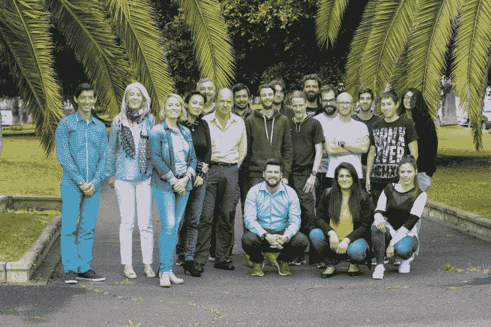

# BitTube Airtime 解释道:在未经审查的 P2P 网络上，无需第三方参与，即可获得时间报酬

> 原文：<https://medium.com/coinmonks/bittube-airtime-explained-get-paid-for-your-time-without-third-party-involvement-on-the-uncensored-b41ab03a34de?source=collection_archive---------4----------------------->

BitTube Airtime 将于 8 月 13 日推出。我决定多了解一些。这是钻头的采访。管队。如果你喜欢或从这次采访中学到了什么，请尽情阅读并在社交媒体上分享。

The BitTube team

**为了提醒我们，您能否用几句话概括一下 BitTube 的愿景？**

我们的愿景是将视频分享带到一个新的高度，让货币化对每个人都公平。目标是利用区块链技术为用户创建一个安全透明的生态系统，并提供无广告的体验。BitTube 是一个更大愿景的一部分:人们希望自由表达自己。

**从项目开始以来，你完成了什么？**

在公开发布之前，我们已经为这个平台工作了一年。在最初的发展之后，我们经历了一次大规模的品牌重塑，这是自然而然的，也是品牌建立的过程。然后，我们完善了算法，做了一些必要的分叉，以保护硬币的开采和发行。我们希望摆脱媒体播放器中的挖掘，这有利于移动设备和整体用户体验。每周我们都会发布一篇更新文章，描述每天的进展和改进。

什么是广播时间，它是如何工作的？

在衡量视频受欢迎程度的方式上，播放时间改变了游戏规则。它用一个视频被观看的总时间来代替观看次数。这让我们更好地理解内容如何能够保持观众的兴趣。它删除了那些标题让你仅仅为了观看次数而点击的点击诱饵视频。我们不仅仅测量总的观看时间。这是一个复杂的系统，评估内容创作者，并为整个社区或企业带来透明度，无论谁想访问奖励浏览器。它提供了一个奖励分配的框架和一个公平的基础来激励高质量和重要的视频。

**这对使用 BitTube 的各方有什么好处？**

控制 BitTube 货币化系统的播放时间模式是明确的，不太可能改变。它给予付出如此多努力和时间来制作引人入胜的材料的视频创作者信任和动力。迄今为止，他们害怕审查和任何其他平台的去货币化，即使是在多年的工作之后。所有用户都参与到 P2P 网络中，没有第三方参与，我们还能要求什么好处呢？它将权力交到社区手中。

**未来我们还能期待 BitTube 有哪些发展和美好的东西？**

我们开发了一整套工具，可供专业制作人或版权所有者使用。他们可以决定哪些内容可以通过播放时间赚钱，哪些内容可以作为额外费用提供。这些和更多的功能将提供给专业会员。我们希望在今年年底，BItTube 平台上的收入或在线钱包中的任何余额都可以通过我们的借记卡在任何接受万事达卡的 POS 系统或 ATM 上消费。该卡的所有者将可以选择参加视频审核，反对盗版和不适当的内容。

至于即将推出的功能和产品，接下来的开发将集中在为智能电视、Win 和 Mac 部署应用程序上。然后为企业和产品植入打开一个创造者市场。BitTube 将成为观众的一站式解决方案，并提供广泛的免费和付费视频/频道。最后，我可以给你一个提示:音乐和电影公司的内容会随之而来。

理想情况下，您能描述一下 5 年后 BitTube 及其用途吗？

未来肯定会有有趣的时光。随着视频分享和消费呈指数级增长，它将成为世界上最大的 P2P 网络。从开发者的角度来看，这将带来大量的数据用于改善和使网络达到其无限的容量。像目前大多数成功的平台一样，BitTube 将“雇佣”数百万热衷于制作酷镜头的人，并为他们提供全职或额外收入。并为视频和电影爱好者提供了一个用户友好和易于获取的丰富的娱乐数据选择。

The BitTube logo

*我希望你喜欢这次面试。喜欢并分享它，这样其他人也可以了解它。*

*跟随* [*位。管上的*](https://twitter.com/ipbc_dev) *和*[*Catoshi*](https://twitter.com/Cryptonoobie)*。*