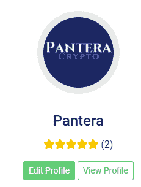

# Bitworkerss！自主创业从来没有这么容易过！

> 原文：<https://medium.com/coinmonks/bitworkerss-self-employment-has-never-been-this-easy-46d73aa6736f?source=collection_archive---------7----------------------->

[编辑:此评论中呈现的网站已关闭，可能不会再回来了]。

用[**bitworkers！**](https://read.cash/@Pantera/bitworkerss-offer-your-skills-first-impression-bec5024b#bad-link) 我们提供我们的技能供出租。我们可以在安全和用户友好的环境中宣传我们的服务和专业知识，并从我们的工作中获利。

[**bitworkers！**](https://bitworkerss.cash/) 现已上线，(处于测试阶段)，这看起来已经成为你在家工作，开始自主创业的绝佳机会。

在[**bitworkers！**](https://bitworkerss.cash/) ，我们需要你的工作技能。并且支付是加密货币(比特币现金)形式的即时支付。

这个平台也是一项可以扩大比特币现金生态系统的服务，因为有数百万自由职业者在寻找在线工作。这是一个非 KYC 中心，每个人都可以申请和提供他们的技能和资格。

有技能和资格的自由职业者会找到一个没有垃圾邮件的平台来宣传他们的职业。微作业和请求也是可能的。

[**bitworkers！**](https://bitworkerss.cash/) 提供类似 Fiverr 的服务，集成加密货币，平台费用减半。

# 注册程序和细节

我报名参加了[**bitworkers！**](https://bitworkerss.cash/) 毫不费力地创建了一个工作岗位。我花了 15 分钟来熟悉这个平台，虽然只是测试版，但经过一些修改，它将成为顶级平台。

该网站加载速度很快，虽然只是在测试阶段，可能会有一秒钟的额外延迟，但这并不会降低用户的体验。该网站是顺利的，并给予了用户很大的自由与选择。

## 发布新职务费用

发布新职位时，将一次性收取 2.5 美元的基本费用。这是为了防止垃圾邮件，我们会注意到这项费用以后会减少，因为我们的帐户将获得更多的声誉。

你可以免费编辑、暂停和恢复任何职位，除了最初的职位。创建第二个职位需要支付额外的费用。

该平台有一个内置的钱包，我们可以很容易地发送一些 BCH，以支付发布我们的职位的成本。

我轻松地创建了这个职位，提供覆盖任何加密货币项目或平台的审查服务，并添加了两个包。一个是 500 字的简单回顾，第二个是 10 分钟阅读材料的全面回顾。

我添加了这些细节，即使在支付发布费后，我仍然可以编辑参数和文本，而不需要额外的费用或付款。

我觉得这种曝光对很多想在公共场合展示自己的技能和经验的人来说是有用的。

搜索某些技能很简单，因为标签是可用的，通过简单的搜索，我们可以找到我们正在寻找的所有职位。

例如，一个开发人员希望一个有经验的作家在他的平台上创建一个评论。他们要做的就是搜索[**bitworkers！**](https://bitworkerss.cash/) 以职位信息包含的关键词作为标签。

执行此搜索将带来提供此类技能的用户的所有结果:

## 用户界面

用户界面是用户友好的，精心设计的。

我们可以打开账户，观察一组选项供选择:

顶部是我们将使用的重要按钮。

*   **仪表盘**是我们账户的主页，就是上图中的那个。
*   **消息**是一个很酷的功能，因为我们可以向平台的任何用户发送消息，并询问更多关于工作要求的细节。

*   **收益**打开我们的平台内钱包。

它包含各种不言自明的信息。我还没有测试过取款，因为这个选项适用于超过 50 美元的余额，而不是更少的金额。

*   **购物**将开放我们从平台上的购买(我们购买并支付的工作，或那些仍在等待)。

*   **管理销售**

**“我的销售”**菜单是最重要的，因为它为我们提供了工作岗位的编辑选项和关于我们工作的额外信息。

方便的是，一旦需要用户交互或我们的工作处于发布前的待定阶段，就会出现红色警告。

从该菜单中，我们还可以:

*   编辑
*   暂停或
*   恢复工作岗位，

通过点击设置图标。

*   **账户设置**

在此页面中，我们可以更改密码和个人资料信息。

*   **点评**

工作完成后，员工会收到员工的评分。我参加了两个测试交易，管理员给了我一个评论。对于那些寻求雇佣自由职业者的人来说，评论同样重要，因为它为其他人提供了更好的细节。

*   **观察列表**

我们可以通过按 like(“heart”)按钮保存每个作业，并在以后使用“Watchlist”选项查看所有作业。当平台包含更多应用程序时，这将非常有用，因为找到用户想要的应用程序会更容易。

*   **关联公司**

最后，我们有一个代销商选项，我们可以使用我们的代销商链接并邀请其他人，同时我们也将从收益中赚取 1%。

> **我们支付的推荐/加盟奖金从 1%开始，随着你的账户级别的增加而增加。**
> 
> [**——bitworkers！**](https://bitworkerss.cash/)

我的代销商链接是这样的:[**https://bitworkers . cash？my affid = 14**](https://bitworkerss.cash?myaffid=14)

## 查看我们的个人资料

从“我的帐户”屏幕，我们可以查看或编辑我们的个人资料:

点击“查看个人资料”将显示其他人在访问我们在[**bitworkers 上的帐户时看到的个人资料屏幕！**](Bitworkerss!)

我们也有个人资料级别，当我们完成选定数量的工作时，我们会获得这些级别。随着我们在平台上声誉的提高，我们可以达到四个级别(包括徽章)。

我们的级别越高，我们获得的费用就越低，会员奖金就越多。

# 结论

自由职业者和个体户的平台需要时间才能成功，需要开发者的耐心。虽然，我认为加密货币社区最终会拥抱[**bitworkers！**](https://bitworkerss.cash/) 为其特点和目的。

这是一个充满希望的市场，我认为这是加密货币行业所缺少的。随着加密技术的应用越来越多，我们应该将相关服务的重点放在简化加密交易上。

[**bitworkers！**](https://bitworkerss.cash/) 已经选择比特币现金进行支付，因为这是最好的支付方式。BCH 操作简单，速度快，价格便宜。

有数以百万计的互联网用户提供他们的技能和专业知识，虽然有其他选择，如 Fiverr，这些也是利用互联网自由职业者的辛勤工作和奉献精神。

[**bitworkers！**](https://bitworkerss.cash/) 是使用比特币现金进行所有支付。通过这样做，它绕过了传统银行网络设置的限制，允许世界上的每个人加入，因为也没有地理限制。

我期待自由职业者，尤其是加密货币领域之外的自由职业者，加入[**bitworkers！**](https://bitworkerss.cash/) 自挣机会显著。

[**bitworkers！**](https://bitworkerss.cash/) 正在为加密货币行业提供服务，其用例可以帮助加密货币的采用达到更高的水平。

[**bitworkers！**](https://bitworkerss.cash/) 是一个平台，求职者可以在这里找到比竞争对手更好的条件，不受 KYC 和地理位置的限制。

出色的设计和许多可用的选项使这成为自由职业者的顶级平台，最棒的是这一切都是由加密货币驱动的。

# 更多信息:

*网址:*[*https://bitworkerss.cash/*](https://bitworkerss.cash/)

*   [**bitworkers！贝塔出来了！你加入吗？**](https://read.cash/@CryptoMax/bitworkerss-beta-is-out-are-you-in-fbcb1ab8)
*   [**bitworkers。现金创意:如何从中获利**](https://read.cash/@CryptoMax/bitworkersscash-ideas-how-can-you-profit-from-it-e55edb32)

***导语图片来自:****[*Unsplash*](https://unsplash.com/photos/ArQP1OwlEs4)*，由* [*迈克·萨伊兹*](https://unsplash.com/@mikesaez7) *(已修改)**

****跟我上:****

**●*[***read cash***](https://read.cash/@Pantera)*●*[***noise cash***](https://noise.cash/u/Pantera99)*●*[***Medium***](/@panterabch)*●*[***Hive***](https://hive.blog/@pantera1)*●*[***Steemit【t】***](https://steemit.com/@pantera1)*

**●* [***推特***](https://twitter.com/Panterabch)*●*[***LinkedIn***](https://www.linkedin.com/in/panterabch/)**●*[*Reddit*](https://www.reddit.com/user/PanteraBCH)**

***本文最初发表于*[*https://read . cash*](https://read.cash/@Pantera/bitworkerss-offer-your-skills-first-impression-bec5024b)*。(重写为介质)***

> **加入 [Coinmonks 电报频道](https://t.me/coincodecap)，了解加密交易和投资**