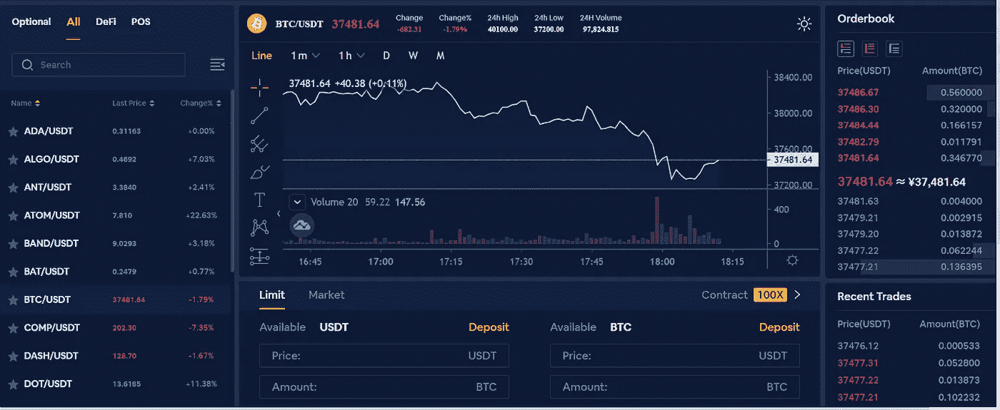

# Bityard Review 2022 —邀请码、交易费和功能

> 原文：<https://medium.com/coinmonks/bityard-review-7d104239be35?source=collection_archive---------1----------------------->

Bityard

本文将回顾 [**Bityard**](https://blog.coincodecap.com/go/bityard) ，它是领先的加密货币交易所之一，提供安全、简单、快速的加密资产交易服务。他们拥有来自 150 多个国家的 100，000 多名用户。Bityard 已经与全球多家公司成功合作，如 [CoinMarketCap](https://coinmarketcap.com/) 、[币安](https://blog.coincodecap.com/go/binance)等等。

> 使用我们的 [**Bityard**](https://blog.coincodecap.com/go/bityard) **邀请码**获得 258 USDT 费用折扣— **zPe4QC**

# 摘要

*   [Bityard](https://blog.coincodecap.com/go/bityard) 是一家领先的加密货币交易所，成立于 2014 年，总部位于新加坡。
*   从四个不同国家的金融监管机构获得许可证。
*   提供各种交易选项，如现货交易、杠杆交易、合约交易、保证金交易和复制交易。
*   使用 k 线，一种加权平均技术，通过收集前三大交易所的数据来计算平台的价格:[币安](https://blog.coincodecap.com/go/binance)，火币网和 OKEx。
*   他们提供日常采矿来赚取比亚迪和 USDT。
*   支持三种媒介存放资金。(加密卡、维萨卡/万事达卡、非处方药)
*   他们使用高安全性架构来保护您的资金和平台。他们将大部分资金存储在冷钱包中，并使用双因素身份认证。
*   用户友好的界面帮助你快速开始交易。演示模式可用，这将有助于您熟悉该平台。
*   全天候实时聊天将帮助您解决客户的问题。

# 比特币交易期权

## 现款现货交易

加密现货交易允许您购买加密资产，并持有它们，直到它们的价格上涨，或使用它们来购买不同的资产。Bityard 支持 30 多种加密资产，如比特币、以太币、莱特币等等。

[Bityard](https://blog.coincodecap.com/go/bityard) Review: Spot Trading

## 期货合约交易

期货合约允许你在一个预先定义的日期和价格，根据资产的价格变动进行交易。它们被用来对冲其他投资或在动荡的市场交易时锁定利润。每份合同都包括一个买方、一个卖方和一个固定的价格。

期货交易帮助你成倍增加你的回报；然而，它们可能有风险。合约交易可以让你每天获利。

如果你认为资产价格会上涨，你可以买入/做多资产合约，在你的目标实现时平仓。同样，如果你认为资产价格会下降，你可以卖出/做空资产合约。这有助于你从买卖市场中获利。

您可以从 16 种加密资产选项中进行选择，如比特币、比特币现金、以太坊、莱特币、Ripple、EOS、TRON 等。

**另外，阅读** [**期货交易——Crypto**](https://blog.coincodecap.com/futures-trading)**期货交易指南。**

[Bityard](https://blog.coincodecap.com/go/bityard) Review: Futures Contract Trading

## 杠杆交易

杠杆允许你用借来的资金在公开市场上投资或交易，作为资金来源。杠杆交易让交易者可以选择交易更大的金额，甚至用更少的资金。

[Bityard](https://blog.coincodecap.com/go/bityard) 提供从 5 倍到 100 倍的宽杠杆范围。

Bityard Review: Leveraged Trading

## 保证金交易

保证金允许你用较低的金额交易较高价值的资产。你可以在不实际拥有资产的情况下获得巨额利润或亏损。
[Bityard](https://blog.coincodecap.com/go/bityard) 采用隔离边距而非交叉边距的系统；因此，你不会被清算。你留出的保证金与你的其他交易头寸是分开的。

**另外，读一读** [**Bityard 保证金交易**](https://blog.coincodecap.com/bityard-margin-trading) **的终极指南。**

# 复制交易

复制交易允许用户[从专家那里复制交易策略](/coinmonks/top-10-crypto-copy-trading-platforms-for-beginners-d0c37c7d698c)。它帮助你赚取更好的利润，并向有经验的交易者学习。Bityard 平台为您提供专家交易者的详细信息，如利润率、交易天数、赢率 30D、损益比 30D、30D 总交易量以及每个交易专家的追随者。交易者列表数据每两小时更新一次。

Bityard 提供了一个灵活的副本交易设置。也可以根据交易日、风格、P/L 比率 30D 进行筛选。

此外，他们提供不同的风格，如短期，中期，长期，高风险，种族，轻贸易，稳定，等等。交易日分为三十以内，三十到六十，六十到八十，不限。损益比率分为小于 20、20 到 60 和大于 60%。

警告值帮助您选择您希望接受的最大复印量。最大金额可为 200 美元，且应大于 5 美元。

默认的止损比率将与专家的相同；如果你愿意，你可以自己设定。

最大仓位金额是跟随专家仓位的仓位总金额。最大限额为 4000 美元。

此外，您可以设置单日跟踪本金，这允许您设置一天的累计金额，在此之后将不会复制任何订单。可设置的最大金额为 4000 美元。

**也，读** [**Bityard 复制交易**](https://blog.coincodecap.com/bityard-copy-trading) **。**

# 比特亚德每日采矿公司

您可以参与日常挖掘，以获得随机数量的加密资产作为奖励。加密资产将包括比亚迪(比特码令牌)或 USDT。

礼金可以作为交易费用。它们不能被提取或兑换成其他硬币。 [Bityard](https://blog.coincodecap.com/go/bityard) 下单时自动扣除采矿所得的礼金。

Bityard Review: Daily Mining

# k 线

Bityard 使用外部比特币定价数据。保证了平台上显示的价格是公平透明的。

k 线是一种加权平均实时定价技术，从三大交易所币安、火币和 OKEX 收集数据。这是一条公平和平衡的路线。用于计算币安、Huobi 和 OKEX 平均值的数据权重分别为 30%、40%和 30%。

# 如何创建一个 Bityard 帐户？

要开始使用 Bityard，首先，您需要创建一个帐户。

*   上 [Bityard](https://blog.coincodecap.com/go/bityard) 官网。
*   首先，选择右上角的开始选项。
*   其次，输入所需凭据，设置强密码。
*   第三，输入验证码验证账户。
*   最后，点击注册创建帐户。

# 比特亚德·KYC(了解你的客户)

Bityard 使用 KYC 来防止洗钱、恐怖融资或任何此类非法活动。他们使用一个五步流程，详述如下-

1.  **验证程序**

Bityard 使用可靠的验证来源，如身份证、护照、银行对账单或公用事业账单。他们反复检查文件的真实性以避免任何风险。如果你用卡支付，那么你的卡需要通过验证。

2.**制裁和政治人物名单筛选**

完成验证后，Bityard 将根据制裁和政治公众人物(pep)名单对您进行筛选。

3.**合规官**

Bityard 正式授权合规官确保反洗钱/KYC 政策的有效实施和执行。

4.**监控交易**

Bityard 不仅验证您的身份，还分析您的交易模式。他们依赖数据分析作为风险评估和可疑检测工具。

5.**风险评估**

[Bityard](https://blog.coincodecap.com/go/bityard) 使用风险评估来减少任何洗钱或任何此类非法活动。他们根据优先级分配资源，以便更高的风险得到更多的关注。

# Bityard 评论:安全性

[新加坡商业管理局(ACRA)](https://www.acra.gov.sg/) 、[澳大利亚交易报告与分析中心(AUSTRAC)](https://www.austrac.gov.au/) 、爱沙尼亚金融监管局(MTR)、美国金融监管局(MSB)已向 [Bityard](https://blog.coincodecap.com/go/bityard) 颁发金融许可证。这些许可证确保您的资金安全。

Financial Licenses

Bityard 中的通信完全由 SSL 加密。这有助于您避免网络钓鱼攻击。

大部分资金存放在冷库里，是离线的，安全的。只有资金中的聪明部分被放在热钱包里。

他们提供实时风险管理和审计工具，以了解市场情况。

此外，您可以通过执行以下操作来保护您的帐户-

1.  您可以设置一个电子邮件验证，用于保留密码、取款或在帐户中执行任何重大更改。
2.  您还可以利用短信验证提款或任何重大活动。
3.  要取款，您必须输入额外的个人识别码。
4.  为了确保或报告任何未经授权的登录，您可以检查登录记录。
5.  提款访问管理允许您包括具体的地址，以避免转移资金到错误的地址。

# 比特码令牌(比亚迪)

比亚迪是基于以太坊的去中心化数字资产，总供应量 210 M，一个新用户注册后获得六个比亚迪。每个 Bityard 账户最多接收 16 个 BYD。

比亚迪可用于:

1.  交易费用扣除。
2.  上市超额收益
3.  全球加密业务的更多应用将很快出现。

注册新账号，在 Bityard 上交易或者日采都可以获得比亚迪。

# Bityard 附属计划

Bityard 为其用户提供了各种不同的交易者获利方式。你可以使用 Bityard 联盟计划，你可以成为交易所的商业伙伴，还可以赚取高达 60%的 Bityard 交易费佣金。你可以很容易地使用这个联盟计划，并通过推荐你的朋友来赚取利润。

# 比特码费用

货币兑换费为 0.05%。

开平仓交易费可以计算为保证金*杠杆* 0.05%。开仓和平仓费在开仓时预扣，平仓时不收取。交易费用不影响初始保证金。

如果您的持仓时间少于 12 小时，您无需支付任何隔夜费。如果您持有该头寸超过 12 小时，并在 SGT 05:55:00 后平仓，将使用以下公式向您收取费用-保证金*杠杆* 0.045% *天数。

Bityard 提供 5 USDT 的低价交易入口。

# 比特码存款

[Bityard](https://blog.coincodecap.com/go/bityard) 提供三种不同的存款方式。

1.  从你的加密钱包转账。
2.  用维萨卡或万事达卡购买 USDT。
3.  而是通过场外交易商从菲亚特获得的密码。法定货币存款仅在越南、Mainland China 和印尼受支持。

所有受支持的加密货币都有最低存款额。最少需要 15 个 USDT-Omni、15 个 USDT-ERC20、10 个 USDT-Omni、0.001 个 BTC、0.05 个 ETH、0.001 个 BTC、100 个 XRP、500 个 TRX 或 5 个 EO。

Bityard minimal deposit

Bityard 支持 USDT(Omni、ERC20、TRC20)、BTC、ETH、EOS、XRP、TRX 和 HT。

加密货币存款需要网络节点确认。确认大约需要十到六十分钟。您应该在存款前检查地址，因为地址可能会改变。

通过 OTC 进行的存款是实时发生的，而通过外部钱包进行的存款则取决于网络拥塞情况。

**存款不收手续费。**

# Bityard 提款

您可以在 USDT-奥米银行、USDT- ERC20 银行和 USDT- TRC20 银行取款。您必须在电子邮件中提交取款地址、金额、密码和验证码，才能完成交易。

**最低取款金额为 50 USDT** 。在新加坡时间 9:00–21:00 之间，您可以每天提取两次。

如果您的 KYC(了解您的客户)完成与否，提款限额也会有所不同。

此外，最高提款限额为 100 000 USDT。

取款手续费是 2 美元。

# Bityard 评论:用户体验

[Bityard](https://blog.coincodecap.com/go/bityard) 为初学者提供了一个易于使用且用户友好的界面。该平台支持多种语言，如英语、葡萄牙语、巴哈萨语等。它支持**暗**和亮模式。

演示平台有助于您熟悉环境。您可以根据自己的需求定制图表。

Bityard Trading Terminal

市场相关信息在左边，图表在中间，订单在右边。页面底部提供了订单历史记录。该平台也可用于安卓和 T2 iOS 平台的移动应用程序中，以便在旅途中管理你的资金。

# Bityard 移动应用程序

如果你不能使用 Bityard 交换平台的桌面版本，你也可以使用它的移动应用程序。Bityard 移动应用程序具有与桌面类似的所有功能，并且还提供出色的功能。此外，该应用程序在 Android 和 iOS 上都可用。

# Bityard 评论:客户支持

[Bityard](https://blog.coincodecap.com/go/bityard) 提供实时聊天功能。你可以在推特上联系他们。

他们还有一个活跃的[电报](https://t.me/BityardEnglish)和 [Youtube](https://www.youtube.com/channel/UCXrwpEV_CMIQyvRGUYHs_Uw) 频道。您也可以通过[【电子邮件保护】](https://blog.coincodecap.com/cdn-cgi/l/email-protection#1c6f696c6c736e685c7e7568657d6e78327f7371)给他们写信。

# Bityard 评论:利弊

## 赞成的意见

1.  易于使用和用户友好的界面。
2.  [**Bityard**](https://blog.coincodecap.com/go/bityard)**目前正在向新用户赠送高达 258 USDT 的欢迎奖金。**
3.  **Bityard 拥有四个不同国家监管机构颁发的许可证。**
4.  **交易费用低。**
5.  **它们提供了从 5 倍到 100 倍的杠杆范围。**
6.  **他们支持场外存款。**
7.  **没有滑动成本。**

## **骗局**

1.  **他们没有保险基金。**
2.  **它们提供有限的加密货币支持。**
3.  **场外交易在有限的国家得到支持。**

# **Bityard 审查:结论**

**[**Bityard**](https://blog.coincodecap.com/go/bityard) 是一个用户友好的加密货币交易所，面向全球用户，提供加密现货、合约、杠杆、保证金和复制交易选项。他们获得了来自四个不同国家的金融许可证，并拥有高安全性架构来保护您的资金。交易费用相对较低。每日采矿可以帮助你赢得 USDT 和比亚迪代币。**

**Bityard 提供多种存款方式。您可以通过 OTC 柜台通过菲亚特购买 crypto。易于使用的交易终端吸引了初学者。一个庞大的客户支持其用户更快地解决他们的查询。总之， [Bityard](https://blog.coincodecap.com/go/bityard) 能够为其客户提供一流的[密码交换](https://blog.coincodecap.com/go/aax)服务。**

> **使用我们的 [Bityard](https://blog.coincodecap.com/go/bityard) 推荐代码获得 258 USDT 费用折扣— zPe4QC**

# **常见问题(FAQ)**

****什么是 Bityard？****

**[Bityard](https://blog.coincodecap.com/go/bityard) 是领先的加密货币交易所之一，提供安全、简单、快速的加密资产交易服务。**

****Bityard 合法安全吗？****

**Bityard 从新加坡商业管理局(ACRA)[、澳大利亚交易报告和分析中心(澳大利亚交易报告中心)](https://www.acra.gov.sg/)[、爱沙尼亚金融监管局(MTR)和美国金融监管局(MSB)获得了金融服务许可证。因此，它是合法的。
此外，它采用最佳标准来保护您的加密货币。](https://www.austrac.gov.au/)**

****如何在 Bityard 上交易？****

**在 Bityard 上，你需要存入资金才能开始交易。**

****Bityard 支持菲亚特吗？****

**是的，确实如此。你可以通过场外交易商从菲亚特购买密码。法定货币存款仅在越南、Mainland China 和印尼受支持。**

****Bityard 支持哪些加密货币？****

**Bityard 支持 USDT(Omni、ERC20、TRC20)、BTC、ETH、EOS、XRP、TRX 和 HT 等等。**

**Bityard 提供多少杠杆？**

**Bityard 提供了 5 倍到 100 倍的杠杆范围。**

****Bityard 的过夜费什么时候收？****

**如果您持有该头寸超过 12 小时，并在 SGT
05:55:00 之后平仓，将使用以下公式向您收取费用-保证金*杠杆* 0.045% *天数。**

## **另外，阅读**

*   **[学习以太坊和 Web3 开发](http://blog.coincodecap.com/go/learn)**
*   **最好的[密码交易机器人](/coinmonks/crypto-trading-bot-c2ffce8acb2a)**
*   **[3 商业评论](/coinmonks/3commas-review-an-excellent-crypto-trading-bot-2020-1313a58bec92) | [Pionex 评论](/coinmonks/pionex-review-exchange-with-crypto-trading-bot-1e459d0191ea) | [Coinrule 评论](https://blog.coincodecap.com/coinrule-review-a-perfect-trading-bot)**
*   **[AAX 交易所评论](/coinmonks/aax-exchange-review-2021-67c5ea09330c) | [德里比特评论](/coinmonks/deribit-review-options-fees-apis-and-testnet-2ca16c4bbdb2) | [FTX 密码交易所评论](/coinmonks/ftx-crypto-exchange-review-53664ac1198f)**
*   **[n 零审核](/coinmonks/ngrave-zero-review-c465cf8307fc)**
*   **[Bybit 交换审查](/coinmonks/bybit-exchange-review-dbd570019b71)**
*   **[3Commas vs Cryptohopper](/coinmonks/3commas-vs-pionex-vs-cryptohopper-best-crypto-bot-6a98d2baa203)**
*   **最好的比特币[硬件钱包](/coinmonks/the-best-cryptocurrency-hardware-wallets-of-2020-e28b1c124069?source=friends_link&sk=324dd9ff8556ab578d71e7ad7658ad7c)**
*   **[密码本交易平台](/coinmonks/top-10-crypto-copy-trading-platforms-for-beginners-d0c37c7d698c)**
*   **[莱杰纳米 s vs x](https://blog.coincodecap.com/ledger-nano-s-vs-x)**
*   **[Vauld Review](https://blog.coincodecap.com/vauld-review)|[you hodler Review](/coinmonks/youhodler-4-easy-ways-to-make-money-98969b9689f2)**
*   **最好的[加密税务软件](/coinmonks/best-crypto-tax-tool-for-my-money-72d4b430816b) | [硬币追踪评论](/coinmonks/cointracking-review-a-reliable-cryptocurrency-tax-software-5114e3eb5737)**
*   **最佳[加密贷款平台](/coinmonks/top-5-crypto-lending-platforms-in-2020-that-you-need-to-know-a1b675cec3fa)**
*   **[莱杰 Nano S vs 特雷佐 one vs 特雷佐 T vs 莱杰 Nano X](https://blog.coincodecap.com/ledger-nano-s-vs-trezor-one-ledger-nano-x-trezor-t)**
*   **[block fi vs Celsius](/coinmonks/blockfi-vs-celsius-vs-hodlnaut-8a1cc8c26630)vs Hodlnaut**
*   **[Bitsgap 审查](/coinmonks/bitsgap-review-a-crypto-trading-bot-that-makes-easy-money-a5d88a336df2) | [Quadency 审查](/coinmonks/quadency-review-a-crypto-trading-automation-platform-3068eaa374e1)**
*   **[埃利帕尔泰坦评论](/coinmonks/ellipal-titan-review-85e9071dd029) | [赛克斯斯通评论](https://blog.coincodecap.com/secux-stone-hardware-wallet-review)**
*   **[区块链评论](/coinmonks/blockfi-review-53096053c097) |在你的密码中赚取高达 8.6%的利息**
*   **[DEX Explorer](https://explorer.bitquery.io/ethereum/dex) 和[区块链 API](https://explorer.bitquery.io/graphql)**
*   **[加密套利](/coinmonks/crypto-arbitrage-guide-how-to-make-money-as-a-beginner-62bfe5c868f6)指南:新手如何赚钱**
*   **最佳[加密制图工具](/coinmonks/what-are-the-best-charting-platforms-for-cryptocurrency-trading-85aade584d80)**
*   **了解比特币最好的[书籍有哪些？](/coinmonks/what-are-the-best-books-to-learn-bitcoin-409aeb9aff4b)**
*   **包括附属链接**

> **[直接在您的收件箱中获得最佳软件交易](/coinmonks/newsletters/coinmonks)**

****

***原载于 2021 年 1 月 17 日 https://blog.coincodecap.com**T21*[。](https://blog.coincodecap.com/bityard-reivew)**