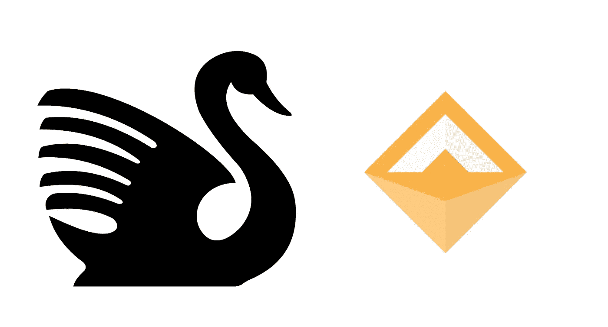
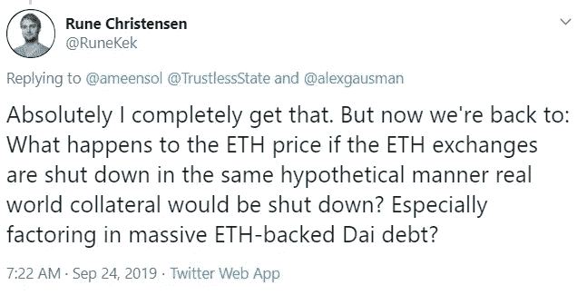

# 黑天鹅、信托资产与多抵押品戴

> 原文：<https://medium.com/coinmonks/black-swans-trusted-assets-and-multi-collateral-dai-8e795dee959d?source=collection_archive---------1----------------------->

当多抵押品 DAI (MCD)推出时，有一些关于哪些资产类型应该添加到它的激烈讨论正在酝酿中。特别是引入与真实资产挂钩的代币，可能涉及 KYC 和/或政府扣押的风险。

这类讨论非常具有挑战性，因为众所周知，人类不擅长将极端事件概念化。我们倾向于严重依赖建立在经验基础上的直觉，根据定义，我们不会经常经历极端事件。

保险是关于管理极端事件的，我从事保险工作已经有一段时间了，所以这里是我对使用广泛使用的保险技术进行讨论的想法。

考虑承担新风险的一种方式是理解可能的最坏情况，或可能的最大损失(PML)。如果你对 PML 的结果感到满意，那么问题就变成了风险的合理价格，而不是是否应该承担风险。

我主张考虑以同样的方式向 MCD 引入新资产。首先确定 PML 情景会是什么样子，然后决定这对于系统来说是否可以接受，如果可以，那么开始考虑风险参数。请注意，这些项目之间存在反馈循环，因为它们并不是完全独立的。

# 是什么导致了戴的失败？

首先，有必要了解单侧支 DAI (SCD)的当前故障模式作为参考点。最明显的一个是，如果 ETH 价格下跌得非常远、非常快或出现“缺口”。这可能导致戴的联系汇率被打破，因为戴将成为抵押不足，而 MKR 造币厂可能不足以稳定金融体系。2018 年证明，以太网价格的大幅下降可以由 SCD 系统充分处理，有时差距很大，达 20%-30%。但是我们仍然不知道系统在哪个点上真正被测试。50%?70%?谁知道呢。

那么，什么样的情况会导致 ETH 价格出现巨大的价格差距，或者将 DAI 置于失败模式。

1.  Rune Christensen (MakerDAO 的创始人)认为，针对交易所的协调行动可能会导致 ETH 价格大幅下跌。我对此并不确信，因为即使是各国政府的协调行动也不会在时间上完全协调一致，尽管可能会出现巨大缺口，但我不确定这些缺口是否足以打破盯住美元的政策。当然，我实际上不知道，如果 MakerDAO 可以在不打开其他人的情况下最小化这种风险，那为什么不呢？
2.  有争议的分叉导致两条链上的 ETH 价格大幅降低。我认为这种风险实际上比第一种风险更有可能发生，并且可能是增加其他资产的关键原因。这可能相当于 MakerDAO 选择任何分叉的一边(因为一些资产不太可能在两个链上共存)。
3.  以太坊的技术故障是另一种可能性。无论 MCD 和资产类型如何，这种风险都会存在，因此值得注意，但并不真正影响本次讨论。
4.  价格反馈神谕可能会被破解。不管 MCD 如何，这种风险也将存在，但是随着每个新资产需要更多的先知，这种风险也会增加。
5.  马克尔道治理可以被增选。同样，无论 MCD 和资产类型如何，这种风险都会存在，因此在讨论中我将忽略它。
6.  智能合约失败的技术风险。SCD 在这一点上经过了很好的测试，但是无论资产类型如何，转向 MCD 都会增加失败的风险。
7.  可能还有其他的。引用唐纳德·拉姆斯菲尔德的话。

# 为什么要搬到 MCD？

向 MCD 添加任何资产，都必须有利于整个系统。因此，它需要:

1.  降低进入上述故障模式之一的可能性；和/或
2.  更普遍地有益于生态系统，例如允许戴扩大规模。

我认为，光是 ETH 就有足够的“经济带宽”来大幅提高 DAI，而当前的瓶颈是真正的 DAI 需求。这在未来可能会有所改变，但我认为 MakerDAO 目前应该优先考虑降低他们转向 MCD 的失败风险。我还认为，在引入系统变更时，预防故障模式应该比扩展 DAI 优先得多，任何增加故障风险的权衡都应该持怀疑态度。

具体来说，使用新资产迁移到 MCD 必须:

1.  降低 DAI 整体抵押不足的风险；和
2.  放心，额外预言和智能合同技术风险增加的风险足够低，仍然会更好。

# 包括可信资产

让我们回到介绍“信托”资产以及戴盯住美元可能产生的影响。直觉上，可能的最大损失场景是信托资产的资产价值很快变为零。可能不是因为实际的基础资产价值发生变化，而是因为政府或监管机构强制代币发行者冻结或没收资产。

那么在这种情况下会发生什么呢？

新 MKR 被铸造出来，然后出售，以有效地对目前抵押不足的资产进行再抵押。对于戴来说，这不一定是一种失败模式，这取决于有多大比例的担保品需要重新抵押。

这突出了一个关键点:

> 在 MCD 中，任何资产发生故障的可能性都会增加，但后果没有那么严重，而且整个系统实际上可以更好地抵御整体故障。

这是因为增加的非 ETH 资产越多，如果 ETH 遭遇足够大的价差，后果就越轻。

风险是可能性和后果的组合，而“可信”资产有望在总体水平上实际降低风险。当然，这要求信托资产不要一下子全部破产，也不要占抵押品的很大一部分。但我们现在关注的是如何为风险定价，而不是是否应该承担风险。

# MakerDAO 是否应该在 MCD 中添加可信资产？

向 MCD 添加新的资产，即使是可信的资产，如果管理和定价得当，实际上可以在整体水平上降低风险。这也许是反直觉的，但这也意味着，如果作为抵押品持有的 ETH 比例有意义地减少，对 MCD 来说只有真正的好处，因为这就是好处所在。如果 ETH 仍然是 90%的抵押品，那么风险状况没有实质性的改变。

综合考虑，我现在更喜欢 SCD。除非有一个具体的建议，将多种非 ETH 相关资产添加到 MCD 中，大幅降低 ETH 作为抵押品的比例，否则我看不出 MCD 有多大意义。因此，这可能是一个时机问题，因为生态系统需要首先建立其他资产。

最后一点，如果你可以有 MCD，而没有仍然与 ETH 不相关的“可信”资产，那么这显然更好。少了一个担心的风险。这是未来的一个选择吗？我不确定，但我希望如此。

我只是等着看最终会有什么选择。

*如果您想覆盖 MakerDAO 智能合约失败的技术风险，您现在可以购买智能合约保险*[*Nexus Mutual*](https://nexusmutual.io/)*。*

*通过输入 makerdaoscd.nexusmutual.eth 作为合同地址，在此处* *获取报价* [*。*](https://app.nexusmutual.io/#/SmartContractCover)

> [直接在您的收件箱中获得最佳软件交易](https://coincodecap.com/?utm_source=coinmonks)

