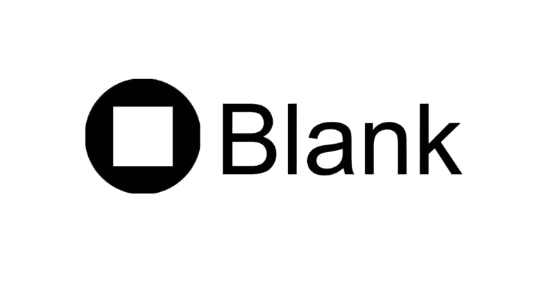
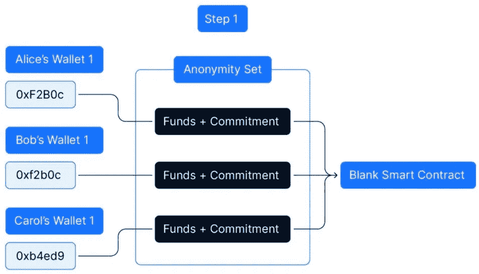
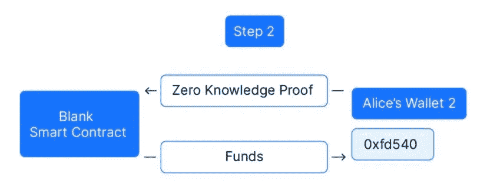
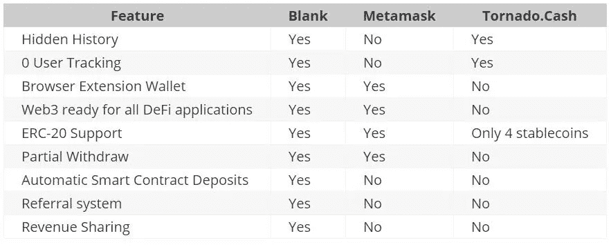
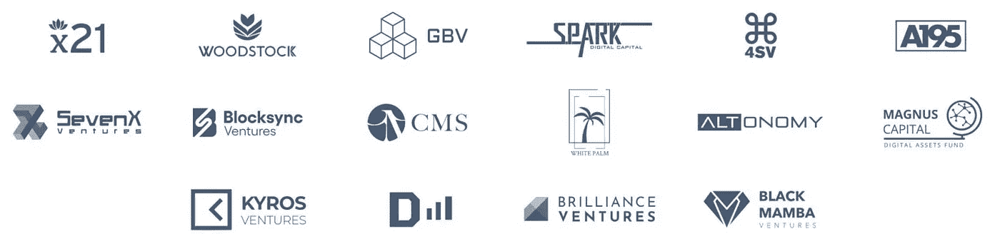

# Blank:关注隐私的浏览器扩展钱包

> 原文：<https://medium.com/coinmonks/blank-a-privacy-focused-browser-extension-wallet-114c7e4dd816?source=collection_archive---------4----------------------->

## 空白钱包是一个基于以太坊的 Chrome 扩展钱包，向用户提供不可追踪的身份。

空白钱包是一个基于[以太坊](https://ethereum.org/)的非托管浏览器钱包，专注于为加密用户提供高水平的隐私和匿名。该项目旨在通过智能合同引入 [ERC-20](https://ethereum.org/en/developers/docs/standards/tokens/erc-20/) 池的概念，这将有助于隐藏用户信息和交易。

用户隐私是当今区块链行业最关心的问题之一。如果一个人能够访问你的钱包地址，他可以很容易地使用以太扫描这样的块浏览器追踪你所有的进出交易历史细节。许多平台正在努力引入隐私因素，但不幸的是，完全隐私或匿名仍然是一个遥远的目标。

[Blank](https://www.goblank.io/) 声称提供最大限度的用户隐私或匿名，并致力于为现有的隐私解决方案添加一些额外的功能。它使用一个智能契约来隐藏金额和源钱包的详细信息。它使用支持 0.1、1、10 和 100 ETH 智能合约池的现有基础设施作为核心组件来提供钱包隐私。

在此之后，Blank 还将在一个名为匿名集的资金池中添加用户财务数据，以保护用户的确切交易不会被泄露。匿名集合中的交易越多，隐私就越大。

对于取款，每当用户提出取款请求时，Blank 将创建一个新的钱包地址，其中将包含用户请求的所需金额。现在，这里的问题是，不同于一般加密交易中通常出现的源钱包地址，这里的交易将来自持有每个人资金的池化智能合同。

## **如何运作？**

空白钱包 V1 功能主要是基于龙卷风现金私人交易。它使用智能合约，允许所有传入的以太网或令牌以非托管方式存放，并受到强加密技术的保护。

## **存款**

为了存款，用户首先生成交易秘密，然后将取消者的 [Pedersen 散列](https://iden3-docs.readthedocs.io/en/latest/iden3_repos/research/publications/zkproof-standards-workshop-2/pedersen-hash/pedersen.html)、秘密和资金发送到智能合约。这个过程叫做承诺，并在合同中登记。

哈希函数是一种单向函数，这意味着人们可以很容易地从秘密中导出哈希，但是从给定的哈希中导出秘密几乎是不可能的。这种方法确保了只有当用户确认拥有承诺的特定秘密时，他/她才有权从合同中提取一定数量的资金。

**撤回**

一旦用户确认拥有承诺的特定秘密，他们就可以继续提取他们的资金。对于退出，使用 zk-Snark 技术。

zk-Snark 技术是一种过程，通过该过程，用户可以验证他们已经向存款智能合同进行了存款，并且持有来自未用承诺列表的秘密，而不提及他们的确切存款对应于秘密。因此，取款地址不能直接链接到存款地址。

匿名集合包含等待特定面额取款的存款交易列表。它与隐私商数直接相关。匿名集合中的交易数量越多，隐私[越大](https://www.altcoinbuzz.io/reviews/secret-network-scrt-the-privacy-hub-for-entire-blockchain-ecosystem/)。

上面提到的内部过程将由空白应用程序负责。它提供了匿名池到新创建的浏览器扩展[钱包](https://www.altcoinbuzz.io/tag/wallet/)的简单无缝集成。空白用户不需要写下秘密短语或手动创建几个钱包。

此外，为了提供额外的安全性，防止在链上和链外媒体上跟踪用户活动，Blank 平台已经与 Tor 网络集成。Tor 网络将用于向节点提供商发送交易或与 dApps 交互，确保用户完全匿名。

## **优点**

*   **掩盖你的财富** —只有基金的所有者有权接触、查看和管理基金。所有单个基金都被组合在一个集合智能合约中，实际上任何人都无权查看你的资产详情。
*   **隐藏您的财富来源** —空白将为您提供隐藏/取消隐藏资金来源的灵活性。
*   **无形交易活动** —不需要 KYC。为了确保高水平的隐私，每当用户选择提款或交易请求时，Blank 将创建一个新的钱包，这意味着没有过去的历史。

## **空白钱包如何实现安全性**

隐私和安全密不可分。如果在隐私条款和条件中有任何妥协，就不能实现完全安全。因此，为了实现一个注重隐私的钱包，该平台决定保持高安全性标准。

Blank 将在浏览器的本地存储中存储所有敏感和关键的钱包信息，如加密的种子短语、地址、密钥和帐户数据，以及 Tornado 机密，并且它与任何外部网站、网络或应用程序完全隔离。钱包所有者对其数据和资产拥有完全控制权。

[zk-Snarks](https://www.investopedia.com/terms/z/zksnark.asp) 的关键输入细节可以从钱包的种子短语中提取，因此，用户需要强制保存种子短语，包括 zk-Snarks 机密，以便将来需要时可以导入钱包数据。

## [**空白令牌**](https://www.coingecko.com/en/coins/blank)

空白是平台的本机令牌。它在空白生态系统中起着重要的作用，并具有以下重要的效用:

*   **令牌持有者的费用放宽—** 空白钱包用户有权为使用平台的隐私功能支付服务费。然而，该平台正在为空白代币持有者提供放宽的服务费。根据一个人持有的代币数量，代币持有者被分为几个等级。服务收费的不同等级和放宽如下:
*   1，000 个空白代币—费用减少 10%
*   5，000 个空白代币— 15%的费用减免
*   10，000 个空白代币—费用降低 25%
*   **从 50%的费用中燃烧代币—** 空白项目已决定从空白钱包的智能合约中收取的 50%的费用将用于从市场上买回空白代币，并在以后燃烧它们，这将导致总的流通代币供应量减少。
*   **流动性提供者赚取 50%的费用—** 该项目将奖励在 [Uniswap](https://uniswap.org/) 中为 ETH/BLANK 对维持流动性的用户。Blank 的目标是将一半费用按比例分配给流动性提供者。
*   **推荐和奖励系统仅使用空白代币—** 为了扩大空白代币的覆盖范围，平台决定在平台的原生代币中分发推荐奖励和空投。
*   **令牌持有者的专属功能和“访问优先”功能—** 该平台已将钱包的部分功能仅限空白令牌持有者使用。精英用户将通过特殊邀请获得参与早期测试环境(如钱包的 alpha 或 beta 测试)的独家访问权。

## **对比**

**合作伙伴**

## **社交场合**

[网站](https://www.goblank.io/)

[中等](https://blankwallet.medium.com/)

[推特](https://twitter.com/BlankWallet)

[电报](https://t.me/blankwallet)

[Github](https://github.com/Blank-Wallet/)

## **结论**

Blank 是一款以隐私为中心的钱包。它旨在为用户资金和交易提供隐私和匿名。钱包只向指定用户提供资金所有权。除了所有者之外，任何人都不能访问或检查资金来源或交易细节。它在各种以隐私为重点的项目(如 Tornado Cash)的现有解决方案的基础上工作，并采用其核心基础设施战略为四种不同的 ETH 面值(. 1、1、10 和 100)建立一个智能合同池。钱包还没有激活。确切的功能和声称的隐私可以在钱包为用户推出时进行测试。

**资源:** [空白白皮书](https://blank-wallet.github.io/extension-whitepaper/book/overview/overview.html)

**阅读更多:** [密码朋克:创造历史的 NFTs](/coinmonks/cryptopunks-nfts-that-made-history-52e00259152a)

***注:*** *本帖首发* [*此处*](https://www.altcoinbuzz.io/reviews/wallet/blank-a-privacy-focused-browser-extension-wallet/) *上*[***altcoinbuzz . io***](http://www.altcoinbuzz.io/)*。*

**通过我的推荐加入**

Crypto.com[币安](https://binance.com/en/register?ref=E8PCD3AF)——

跟我来

**👉** [推特](https://twitter.com/rumadas123)

**👉** [领英](https://www.linkedin.com/in/ruma-das-a1439320/)