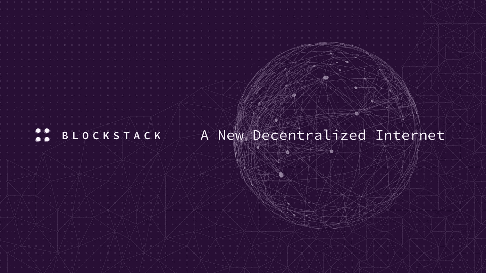
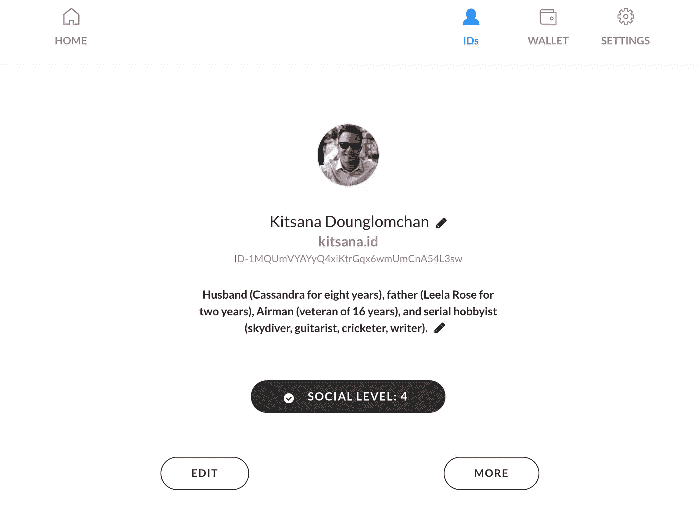
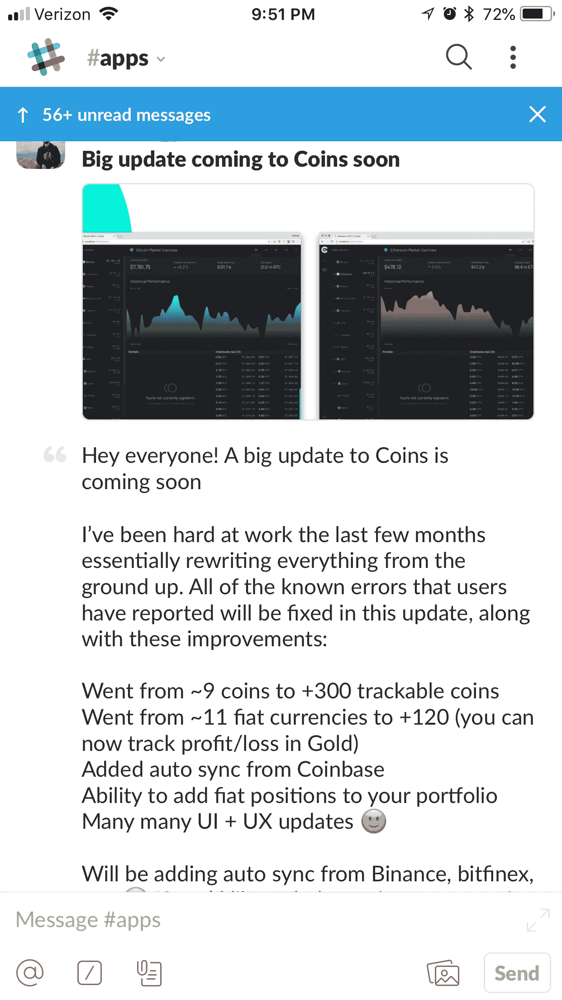
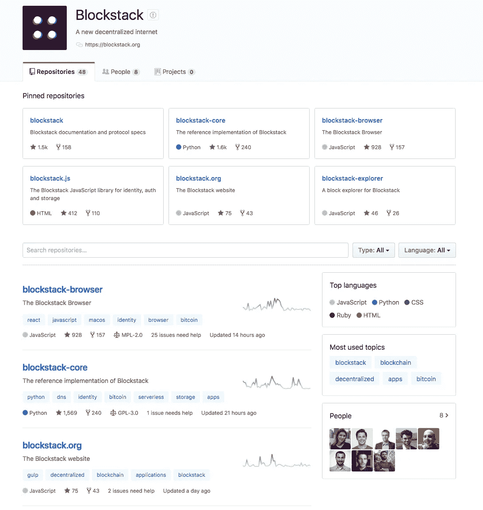

# 一个接一个:堆叠新的互联网

> 原文：<https://medium.com/coinmonks/block-by-block-stacking-the-new-internet-c3fb8b9d87b4?source=collection_archive---------8----------------------->

随着剑桥分析公司(Cambridge Analytica)最近证实脸书数据泄露事件，拥有自己的数据变得越来越重要。但如果没有可行的替代方案，像#DeleteFacebook 这样的运动将继续失败并失去势头。在目前的情况下，用户没有像脸书或 Twitter 这样的集中服务的可行替代品。虽然我想知道有多少人真正关心拥有他们的数据意味着什么——更愿意将他们的信息交给硅谷巨头以方便使用——但有一群人正在努力将这种权力还给人民。

今天在这个领域最有前途的一个是由联合创始人[瑞安·谢伊](https://www.linkedin.com/in/ryaneshea)和[穆尼布·阿里](https://www.linkedin.com/in/muneebali)领导的 *Blockstack* 团队。

我可以写一下 *Blockstack* 从联合广场风险投资公司、文克莱沃斯双胞胎和基金会资本等知名参与者那里筹集了 5200 万美元，但这已经被[报道过了](https://www.coindesk.com/usv-winklevoss-bros-invest-in-blockstacks-50-million-ico/)。相反，我想讨论现在和不久的将来你可以在 *Blockstack* 上实际做的事情(尽管我仍然不得不提到 *Blockstack* 执行代币销售的方式，因为它是所有未来项目的守法、道德模型)。

## 入职流程

U pon 注册 Blockstack，你会得到一长串字符和数字作为你在平台上的默认“id”；这是免费的。但只有少数几个 satoshis，你能够购买自己的“身份证”在一个小时左右，如果它仍然可用。

Setting up a Blockstack ID is a simple process. Users can either keep the assigned one or pay a few satoshis to own a personalized ID.

出于许多原因，我喜欢拥有我的“id”的想法。不过，最主要的一点是，我现在可以为 *Blockstack* 生态系统中的每个 Dapp 提供通用登录。这减少了我不得不信任像 Lastpass 这样的集中服务来管理我所有的密码的需要——或者上帝禁止我的大多数账户使用相同的密码。为一个网站生成一个特定密码的日子也一去不复返了，因为它的要求比其他的更严格。

通过不必将我所有的密码都交给一个集中的服务——这无疑是非常有用的——您可以提高易用性和身份安全性。集中服务是一个远离所有密码信息泄露的数据缺口，由于在 *Blockstack* 上没有密钥链和密码的集中存储位置，您已经消除了这个问题。虽然目前 *Blockstack* 上的 Dapps 数量有限，但随着团队激励开发人员在他们的平台上建立类似 [Blockstack Signature Fund](https://bitcoinmagazine.com/articles/blockstack-partners-vcs-launch-25-million-blockstack-signature-fund/) 这样的程序，这种单一“id”登录在未来将变得更有价值。

## “让我们来谈谈 Dapps，宝贝”

T 在*块料堆*上最好的 Dapp 是石墨。我很喜欢使用加密聊天应用隐身(我实际上与它的联合创始人之一亚历山大聊了一个小时，同时通过 Blockstack 社区奖励计划提供反馈)，但隐身还没有足够多的人使用它的聊天功能作为日常使用。然而你现在就可以开始在日常生活中使用石墨。它目前是谷歌文档的精简版，但你可以使用文本和电子表格创建器。我也喜欢他们使用“保险库”存储的想法，以便能够从世界任何地方安全地访问您的文件。当你用 Google Docs 等更好的东西来交换更强大的功能时，你可以用 Graphite 真正拥有和控制你自己的数据。

A sneak peek at the new UI for Coins, a Dapp built on Blockstack

目前最好的加密货币投资组合 Dapp 是硬币，但除非它增加跟踪加密货币的能力——目前它支持比特币、比特币现金、以太坊、Monero、Ripple、Zcash、Dash、以太坊经典和莱特币——否则它的长期效用将是有限的。然而，根据 *Blockstack* Slack chat 上的硬币创造者的说法，即将有一个大规模的更新。此次更新将包括 300 多种加密货币，120 种法定货币，并与比特币基地自动同步。如果这一更新成功，硬币 Dapp 将立即成为大多数加密货币持有者的可行用途。由于 Blockstack 的许多早期用户可能也持有各种加密货币，因此有一个“杀手级”硬币跟踪 Dapp 是很重要的。

## 象征性销售

这与*积木*的实际用途没有任何关系，但我为该团队成功完成象征性销售的方式喝彩。正如在 [TwoBitIdiot 的 Medium posts](/@twobitidiot/a-token-to-self-regulate-tokens-but-really-a61da77e6a7b) 中被多次引用的那样，Blockstack、Filecoin 和 Zeppelin 等项目正在采取谨慎、守法的方法，以确保他们的代币销售是合法的，只在代币在实际网络中真正有用后，才向未经授权的投资者发行代币。

也没有类似七五折提前购买优惠的噱头；合格和不合格投资者的“堆栈”价格是一样的。这一切都是假设 *Blockstack* 团队甚至决定将他们的代币出售给未经认可的投资者，直到他们的法律代表不认为这是一种证券。

这种以正确的方式做事情的耐心让我认为 Ryan Shea 和 Muneeb Ali 应该是那种在著名的斯坦福棉花糖实验中等待 15 分钟的孩子，该实验测量儿童的延迟满足感，然后将这种新生特征跟踪到他们未来的成年期。

## 开放源代码

B *lockstack* 有一个极其活跃的 [Github](https://github.com/blockstack) 页面。我看过很多 ICO 项目，你在 Github 上找不到任何源代码，或者即使你找到了页面，它看起来也是空的，就像狂野西部曾经繁荣的鬼城。虽然我理解出于专有的原因，为什么个人可能想让他们的部分代码不被公众看到，但我不明白为什么你想让所有的东西都不被公众看到。但是所有 *Blockstack 的*各种产品的 Github 页面都是活跃的，核心开发团队和普通用户都经常更新。

最近[宣布](https://forum.blockstack.org/t/taking-blockstack-mobile-announcing-mobile-sdk-developer-previews/4992)*block stack*发布了 iOS 和 Android 移动平台的开发者工具。根据该团队的说法，“Blockstack 移动软件开发套件允许您在您最喜欢的移动平台上开发分散的 Blockstack 应用程序。”随着我们的生活越来越依赖智能手机，向这些平台的扩展只会进一步增加更多用户加入的可能性。

## 最后的想法

lockstack 是这场竞赛的领跑者之一，这场竞赛旨在为我们对互联网的现有理解创造一种替代方案。但是 *Blockstack* 的最终成功与它所吸引的在该平台上构建应用的开发者有着内在的联系。虽然游戏开发者、投资者和引领潮流的用户都在努力寻找“互联网 3.0”的来源。

随着人类生活在未来几年进一步数字化，我相信人们实际控制自己的在线数据将很快变得至关重要，而不是将数据委托给集中的第三方。Blockstack 的开发者和核心贡献者们似乎正在进行严肃而持久的努力，将这种力量还给人民。