# 块散列

> 原文：<https://medium.com/coinmonks/block-hash-18514618c10d?source=collection_archive---------4----------------------->

Image taken from [here](https://img.etimg.com/thumb/msid-81993233,width-650,imgsize-753834,,resizemode-4,quality-100/blockchain-getty.jpg)

在我的上一篇博客中，我讨论了工作证明的概念，nonce，难度，哈希值的范围和一些最终确定难度级别的计算。在这篇博客中，我将讨论块哈希，特别是比特币区块链的各种块头。

# 1.什么是块散列

块哈希是块的唯一哈希，用于维护存储在块中的数据的完整性。是的，你答对了，这是一个矿工竞争找到一个特定的哈希从 19 个零或 20 个零或任何数量的零开始的哈希，以获得块奖励。下图是 [**块 691719**](https://www.blockchain.com/btc/block/00000000000000000008a89e854d57e5667df88f1cdef6fde2fbca1de5b639ad) ，其块 hash 用红色突出显示。

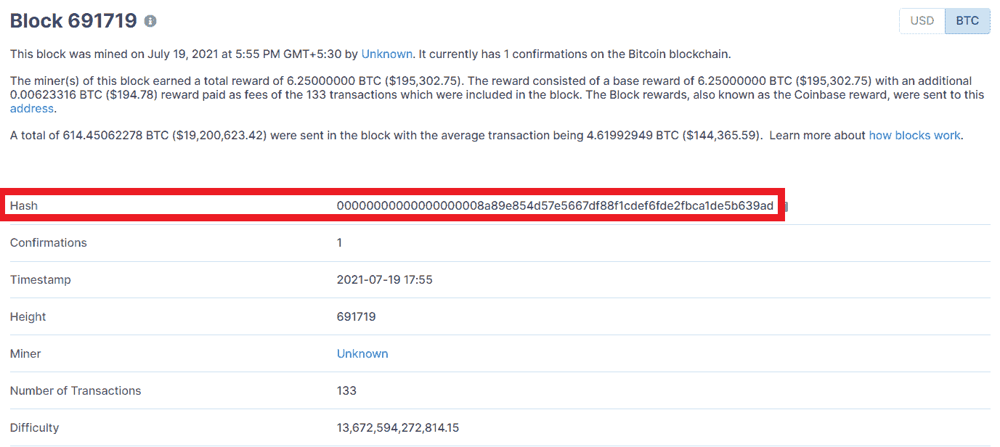

# 2.块标题

为了获得块散列，挖掘器必须组合块头以获得以一些零开始的特定散列。其实矿工不一定要结合，这一切都是挖矿软件的后端过程，不过这个你应该是知道的。以下是组合在一起以获得块哈希的块头:

1.  块版本
2.  前一个块哈希
3.  Merkle 根
4.  时间戳
5.  位
6.  目前

以上所有六个元素组合在一起，以获得块散列。**但是**上面的列表中有一个 header 是动态的，在寻找块 hash 中起主要作用，那就是 **Nonce** 。Nonce 是矿工在块头中添加的数字(只是一个数字),以便获得从特定数字 0 开始的散列。如果没有这一点，人们将很容易创建块的散列，或者在块中进行一些更改，而没有人会知道在区块链中进行了更改。我在以前的博客中讨论过 nonce。这里是我上一篇博客例子中 nonce 的[高亮链接](https://blog.vulnfreak.org/2021-07-18-BlockchainPart4/#:~:text=34d43fece89b4dff57cebb297e60d16477ad4c9f797036f07514d1a75afdc9c0-,138Hello,-00bb645c75727a5e63a9d91d1230dd314697673a66530c445081a1cc81b43219)。Nonce，这个词来源于*废话*，在块中没有任何意义，只是为了得到一个特定格式的 hash 而添加的。我将在这个博客中谈论 merkle 根，其余的标题我将在接下来的博客中讨论。

# 3.Merkle 根

有一个 merkle 树的概念，它只是一棵树，就像在《数据结构与算法》这门课中看到的那样。这个概念用于存储事务散列，使得如果在块中的事务中进行了任何改变，则对应于存储事务散列的叶节点的父节点的散列将立即改变，这将因此改变 merkle 根的散列。这有助于识别在哪个事务中进行了更改，而不是遍历整个树。这里有一个特殊之处，父节点总是有两个子节点，如果父节点只有一个子节点，那么它会被复制，这就是父节点获得两个子节点的方式。
**现在的问题是，树叶里储存了什么数据？**答案是，交易的所有散列都存储在 merkle 树的叶子中。让我们看看下面的图片:

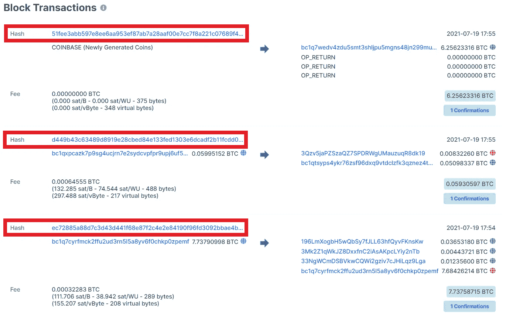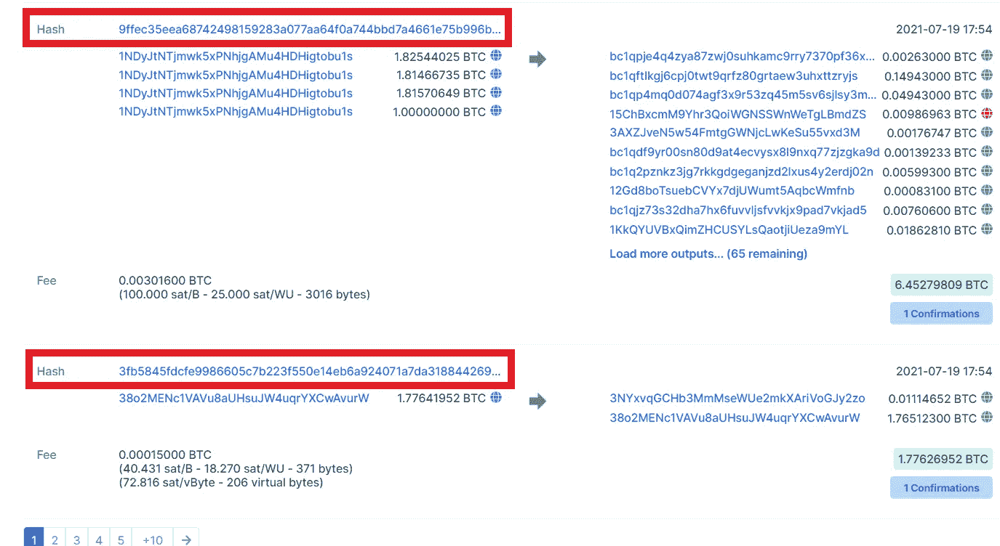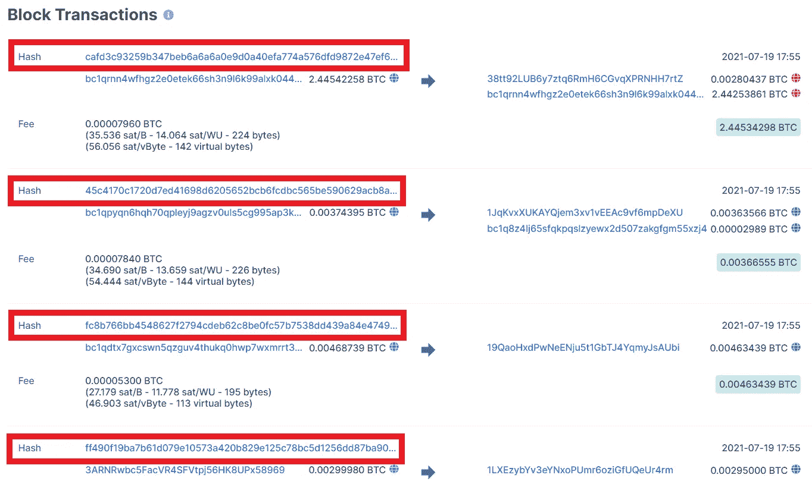

以上截图是 [**区块 691719**](https://www.blockchain.com/btc/block/00000000000000000008a89e854d57e5667df88f1cdef6fde2fbca1de5b639ad) 的前几笔交易，你可以在该区块看到那里的全部交易列表。突出显示的散列是事务散列，它存储在 merkle 树的叶子中。树叶具有事务散列，并且它们对应的父节点存储从它们的孩子的散列计算的散列。让我们看看下图:

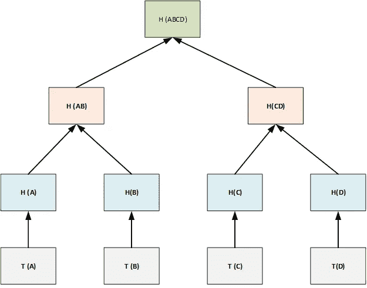

Image taken from [here](https://tutorialsdiary.com/wp-content/uploads/2018/10/Merkle_Tree_In_Blockchain.png)

在上图中， **T(A) T(B) T(C) T(D)** 是存储在块中的事务， **H(A) H(B) H(C) H(D)** 是它们各自事务的散列，就像我上面用红色突出显示的块 691719 事务一样。 **H(AB)** 和 **H(CD)** 分别是将 **H(A) H(B)** 和 **H(C) H(D)** 的 hash 组合计算出来的 hash。而 **H(ABCD)** 是将 **H(AB)** 和 **H(CD)** 的 hash 组合起来找到的 hash，也是 merkle 根。
如果假设您在事务 C 或 **T(C)** 中更改了某些内容，那么散列 **H(C)** 将自动更改，因此散列 **H(CD)** 将更改，因此散列 **H(ABCD)** 将像连锁反应一样更改，并且由于散列 **H(ABCD)** 是 merkle 根，并且用于块散列的形成，所以块散列将最终更改。在调查中，您可以借助他人存储的另一份分类账(区块链数据库)获得其价值发生变化的交易路径，并且可以将其还原。这就是为什么这个 merkle 根被用在块头中来创建块散列。

# 4.仔细查看块标题

让我们借助捕捉来查看块标题。以下快照来自 [**块 2021**](https://www.blockchain.com/btc/block/2021) 和**前一个块散列**的快照来自 [**块 2020**](https://www.blockchain.com/btc/block/2020) 因为块 2021 的前一个块将是块 2020，所以块散列也是。

# 4.1 块版本

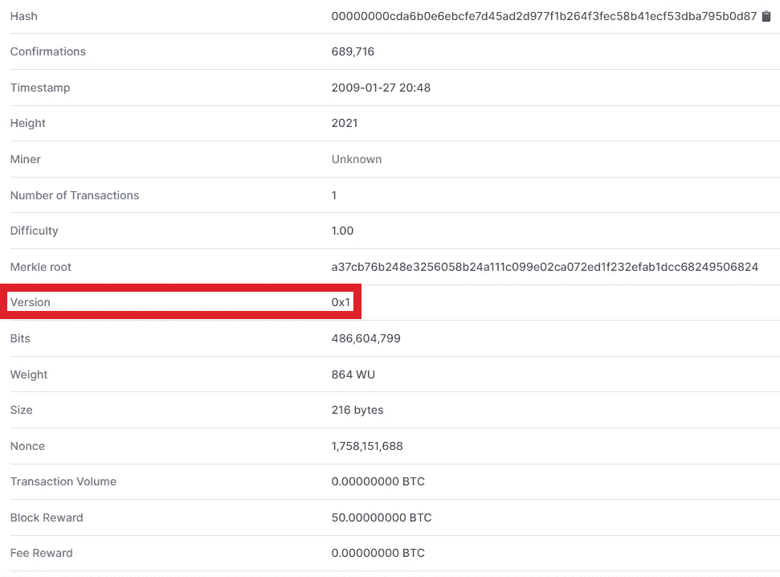

# 4.2 先前块散列

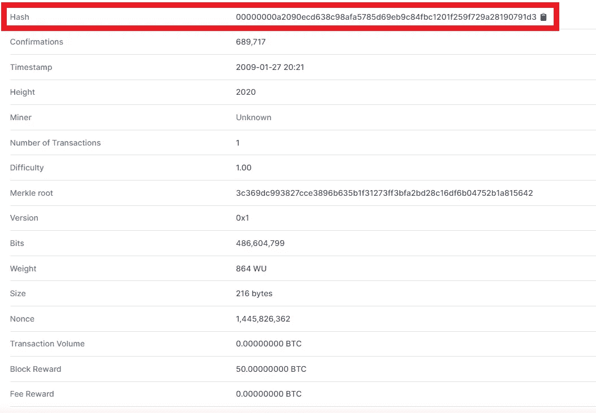

# 4.3 Merkle 根

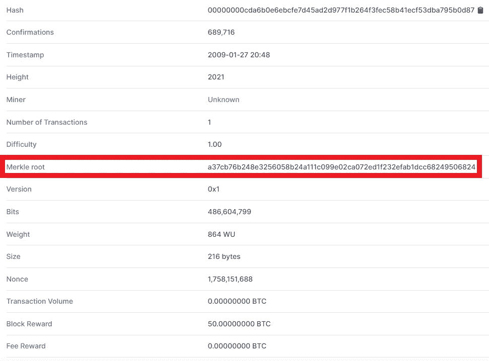

# 4.4 时间戳

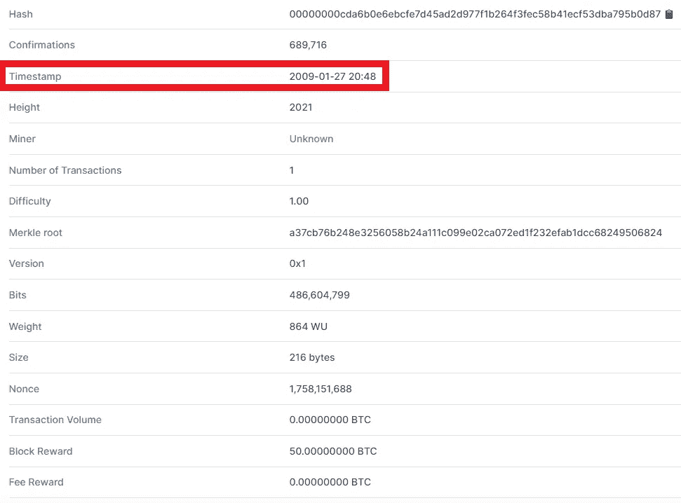

# 4.5 位

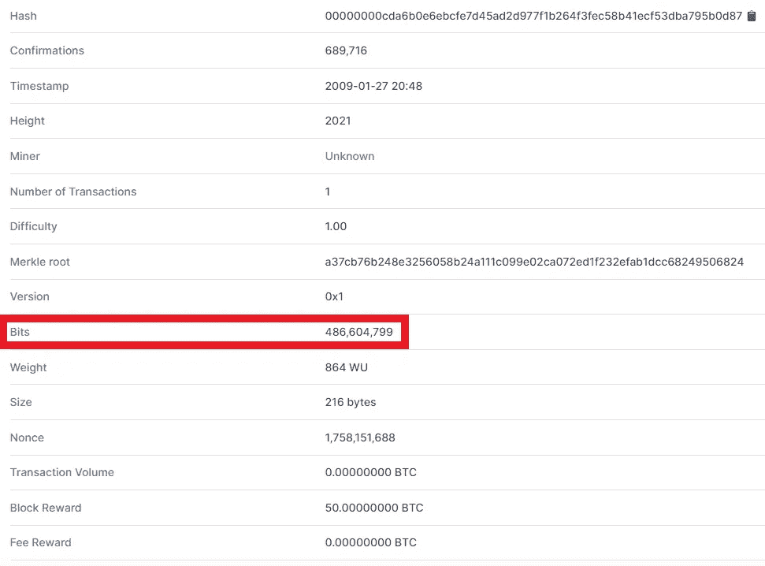

# 4.6 随机数

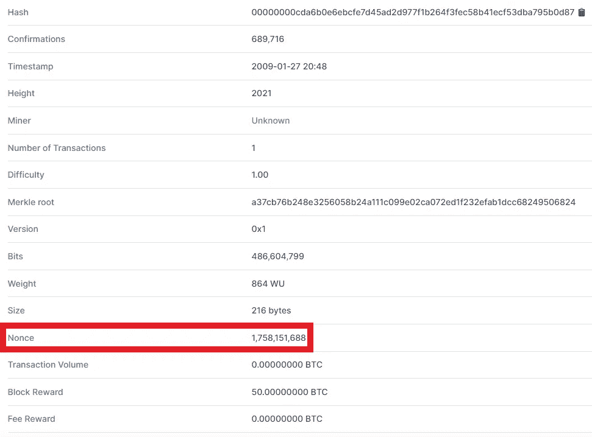

在这篇博客中，我已经讨论了块头的概念，块头的需要，merkle 树的概念，块头中 merkle 根的需要和 nonce。在下一篇博客中，我将讨论与块头相关的其他概念，以及这篇博客中没有讨论的块头的其他部分。

> 社交媒体链接:[LinkedIn](https://www.linkedin.com/in/ansh-vaid/)|[GitHub](https://github.com/AnshVaid4)|[insta gram](https://www.instagram.com/being_optimist/)|[Twitter](https://twitter.com/anshvaid4)
> 
> 访问我的网站:[https://cybergeeks.website/](https://cybergeeks.website/)
> 
> *原载于*[*https://github.com*](https://github.com/AnshVaid4/Blogs/blob/caff161e83f7cb87d41468660ab5875de2cd47a4/blogs/2021-10-13-ExploitingServices.md)*。*

> 加入 Coinmonks [电报频道](https://t.me/coincodecap)和 [Youtube 频道](https://www.youtube.com/c/coinmonks/videos)了解加密交易和投资

## 另外，阅读

*   [最佳比特币保证金交易](/coinmonks/bitcoin-margin-trading-exchange-bcbfcbf7b8e3) | [比特币保证金交易](https://blog.coincodecap.com/bityard-margin-trading)
*   [加密保证金交易交易所](/coinmonks/crypto-margin-trading-exchanges-428b1f7ad108) | [赚取比特币](/coinmonks/earn-bitcoin-6e8bd3c592d9)
*   [WazirX vs coin dcx vs bit bns](/coinmonks/wazirx-vs-coindcx-vs-bitbns-149f4f19a2f1)|[block fi vs coin loan vs Nexo](/coinmonks/blockfi-vs-coinloan-vs-nexo-cb624635230d)
*   [BlockFi 信用卡](https://blog.coincodecap.com/blockfi-credit-card) | [如何在币安购买比特币](https://blog.coincodecap.com/buy-bitcoin-binance)
*   [火币交易机器人](https://blog.coincodecap.com/huobi-trading-bot) | [如何购买 ADA](https://blog.coincodecap.com/buy-ada-cardano) | [Geco？一次审查](https://blog.coincodecap.com/geco-one-review)
*   [加密复制交易平台](/coinmonks/top-10-crypto-copy-trading-platforms-for-beginners-d0c37c7d698c) | [五大 BlockFi 替代方案](https://blog.coincodecap.com/blockfi-alternatives)
*   [CoinLoan 点评](https://blog.coincodecap.com/coinloan-review)|【Crypto.com】点评 | [火币保证金交易](/coinmonks/huobi-margin-trading-b3b06cdc1519)
*   [Bybit vs 币安](https://blog.coincodecap.com/bybit-binance-moonxbt)|[stealth x 回顾](/coinmonks/stealthex-review-396c67309988) | [Probit 回顾](https://blog.coincodecap.com/probit-review)
*   [顶级付费加密货币和区块链课程](https://blog.coincodecap.com/blockchain-courses)
*   [在美国如何使用 BitMEX？](https://blog.coincodecap.com/use-bitmex-in-usa) | [BitMEX 评论](https://blog.coincodecap.com/bitmex-review)
*   [最佳期货交易信号](https://blog.coincodecap.com/futures-trading-signals) | [流动性交易所评论](https://blog.coincodecap.com/liquid-exchange-review)
*   [南非的加密交易所](https://blog.coincodecap.com/crypto-exchanges-in-south-africa) | [BitMEX 加密信号](https://blog.coincodecap.com/bitmex-crypto-signals)
*   [MoonXBT 副本交易](https://blog.coincodecap.com/moonxbt-copy-trading) | [阿联酋的加密钱包](https://blog.coincodecap.com/crypto-wallets-in-uae)