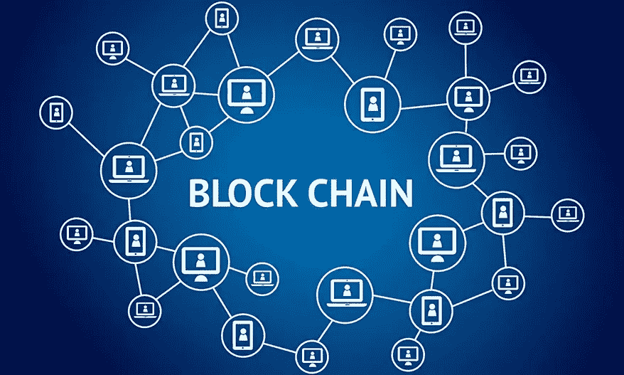

# 区块链 101

> 原文：<https://medium.com/coinmonks/blockchain-101-4094a048bf13?source=collection_archive---------5----------------------->

我喜欢开始接触新技术，不是通过学习书籍或观看视频，而是通过快速理解高层次的基本概念。一旦你这样做了，你继续学习的兴趣就会保持下去。

本文旨在捕捉和解释区块链中的基本概念，这很重要。当这些概念清晰时，你可以很容易地深入到各个方面。

source: Datafloq

## **什么是区块链？**