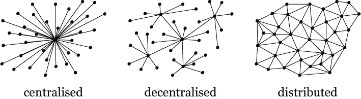
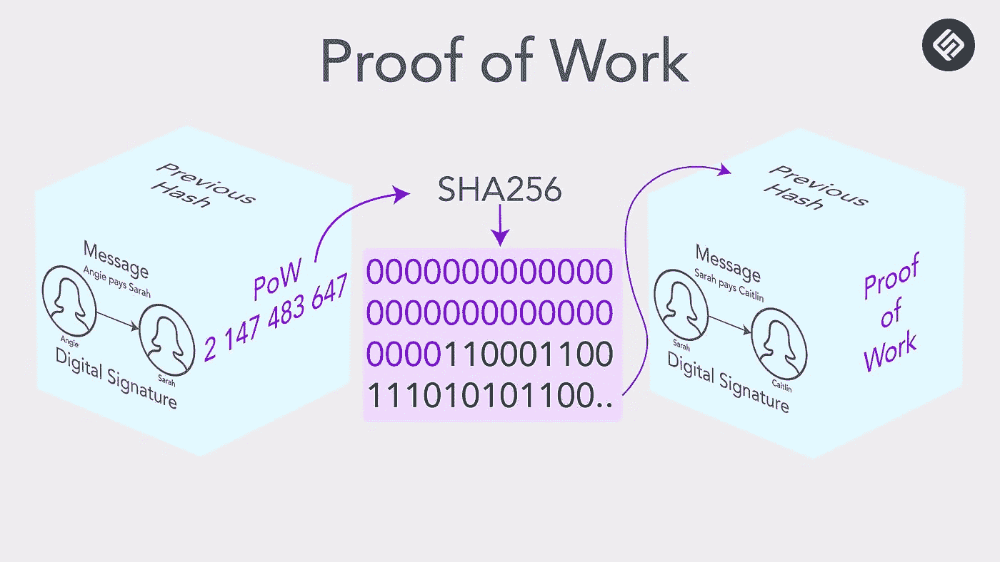
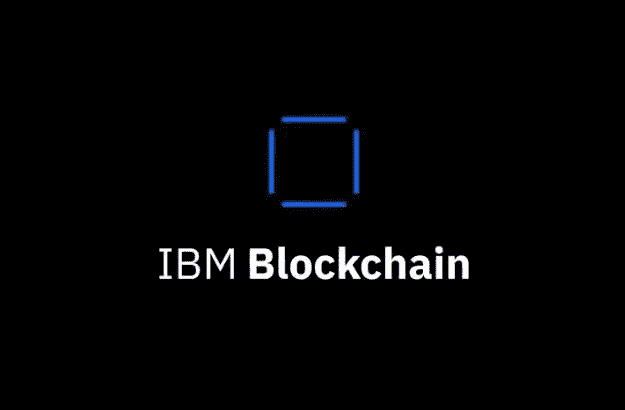

# 区块链 101

> 原文：<https://medium.com/coinmonks/blockchain-101-5e19b7249db8?source=collection_archive---------1----------------------->

## 区块链最近成了一个热门词汇，媒体和不同类型的公司几乎可以用这个词来形容任何事情。那些对这个词的误用会让公众怀疑区块链技术到底是什么。

这就是为什么我写了这篇文章，让每个对区块链感兴趣的人了解它背后的概念。

区块链可以比作账本，更准确地说，它是建立在点对点网络之上的 ***电子账本。***
与其称之为伊莱杰，就区块链而言，我们称之为 ***块。*** ***这些块保存数据，并以密码方式相互链接。***

需要知道的一件重要事情是，区块链不是一个东西。它更像是将多种不同技术放在一起创建一个特定的体系结构。同样，web 应用程序也不是一个东西，而是多种技术组合在一起，形成一个连贯的功能性应用程序。

为了帮助您更好地理解这些不同的部分和技术是如何协同工作的，我们将深入探讨它们。

## 区块链是如何形成的。

区块链是由一个人或一群人以 ***中本聪*** 的名字创建的。区块链的概念是为了支持比特币的实施而产生的，比特币是最早成功的加密货币之一。尽管它是为了支持加密货币的创建而创建的，但区块链现在有多种用途。

Photo by [André François McKenzie](https://unsplash.com/@silverhousehd?utm_source=medium&utm_medium=referral) on [Unsplash](https://unsplash.com?utm_source=medium&utm_medium=referral)

# 对等网络、分配和去中心化。

如上所述，区块链是建立在对等网络之上的，这允许它是分散的和分布式的。其中一些概念可能很难理解，所以让我们多解释一下。

## 对等网络。

对等网络是一种节点相互连接的网络，有点像互联网。唯一的区别是它们之间直接共享信息，不需要中央服务器。

> ***节点，钱包，签名。***
> 
> *节点是区块链网络中的一个实体(即一个人或一台计算机),每个节点都是区块链及其数据的副本。为了能够在区块链上进行交易和交互，一个节点通常需要两样东西一个钱包和一个数字签名。*
> 
> 钱包是一个字母数字串(即一串字母和数字)，代表你的地址。换句话说，你的地址代表了你在网络中的身份(即你是谁)。如果我们使用公钥和私钥加密术语，您的地址将是您的公钥。在某些情况下，钱包也可以由私钥组成，但与公钥不同的是，该密钥需要保密，并将用于创建您的数字签名。
> 
> 当有人决定进行交易时，就会产生数字签名。为了对交易进行签名，使用你的公钥(即地址)和私钥对数据进行数学运算，这个运算的结果是一个数字，我们称之为数字签名。

## 集权与分权。

为了更好地理解集中和分散，你可以想想脸书和其他流行的 web 应用程序是如何工作的。

这些系统是集中系统的好例子，因为它们都由一个集中的实体控制。这意味着任何数据传输都需要通过第三方完成。这也意味着你必须信任第三方。

> 以脸书为例，他们的数据可能分散在世界各地不同的服务器上，但所有的数据都在一个实体的控制之下，这个实体就是脸书。

分散式系统试图通过不依赖第三方来破坏这种集中式架构。

[Difference between centralised, decentralised and distributed.](https://github.com/dwyl/cid/issues/5)

## 阻止。

块是区块链的基本单位，就像节点是链表的基本单位一样。块通常是两个不同的部分，头和体。让我们先解释一下头。

[The different part of the block and the data it hold](https://www.banterly.net/content/images/2016/12/Picture3.png)

**表头中的数据。**

头用于存储这些信息块的索引、块的随机数、块的散列和前一个块的散列。

*   **索引**:索引保存特定区块的编号(即他在区块链的位置)
*   **时间戳**:时间戳告诉我们这个块是什么时候创建的。
*   **哈希和前一个哈希。**hash 是一个数字签名块，是在 hash 函数的帮助下制作的。哈希函数是一种数学函数，它将任意数量的数据转换为固定长度的字母数字字符串。对输入的任何改变，即使是最小的改变，都会导致完全不同的散列。这使得几乎不可能找到给出其输出的散列函数的输入。如前所述，区块链的每个块都有其前面的块的散列。
*   **Nonce:** 在前面的段落中，我们解释了猜测散列函数的输入是不可能的。这部分是对的，找到散列函数输入的一种方法是计算所有可能的输入，这叫做强力攻击。为了解决这个问题，我们可以将一个随机数作为输入或散列，这将使这种类型的暴力攻击难以进行。nonce 还用于工作证明共识协议，我们将在本文后面解释。

**数据体。**

主体用来存储你想放入区块链的数据。我们通常将块持有的数据称为事务，但这些术语可以互换。

# 区块链协议。

协议是编程到区块链中的一组规则，指示它应该如何工作。某个国王或区块链的实现指示它如何工作。

该协议确保网络按照创建者设计的方式运行，即使它是自治的，不受任何人控制。

工作证明是区块链中使用的协议之一，这是一种特殊的协议，称为共识协议。

> 一致协议允许分散系统在区块链的情况下达成协议。该协议包括选择将哪个区块添加到区块链。

事实上，只有在网络参与者之间达成一致意见后，您才能在区块链中添加新的块，并且一旦完成，该块将永远不会被擦除或更改。

## 采矿和工作证明。

在工作证明中，计算机中的节点相互竞争散列该块，直到它们获得由协议选择的特定结果，例如，给定的散列应该以特定数量的零开始。为此，他们调整块中的一个参数以获得正确的散列，通常参数调整是我们在本文前面部分解释的随机数。

通过解决工作证明来产生块的节点被命名为矿工，并且它们在完成工作证明后获得奖励。

[https://lh6.googleusercontent.com/FdscZdjcf9kwCqqXgLr5KWV9K4GjTkdeFIj-btc_Afnr7i1Ou_LLMGVKVCPRLFougIhSe-hEcsHtPropEAq6kbCaV_adOQF3veSYMZ4l91meEjYrcKFtayv9byTgi6t9QrCsXN6F](https://lh6.googleusercontent.com/FdscZdjcf9kwCqqXgLr5KWV9K4GjTkdeFIj-btc_Afnr7i1Ou_LLMGVKVCPRLFougIhSe-hEcsHtPropEAq6kbCaV_adOQF3veSYMZ4l91meEjYrcKFtayv9byTgi6t9QrCsXN6F)

## 我们如何利用区块链和使用区块链技术的公司。

区块链可以以多种不同的方式使用，其中一种更常用的情况是创建加密货币，它也可以用于供应链。例如，沃尔玛正在使用区块链来更好地跟踪和管理他们的产品业务，这项技术的使用案例是无限的，这里有 3 家公司正在使用区块链。

*   crypto kitties:crypto kitties 是一款位于区块链以太坊的区块链游戏，目标是收集和繁殖虚拟猫。

[Cryptokitties logo](https://upload.wikimedia.org/wikipedia/commons/c/c5/Cryptokitty.gif)

*   **以太坊**:以太坊是一个区块链，允许开发分散式应用程序，通常称为 Dapps。

Photo by [Clifford Photography](https://unsplash.com/@cliffordgatewood?utm_source=medium&utm_medium=referral) on [Unsplash](https://unsplash.com?utm_source=medium&utm_medium=referral)

*   **IBM** : IBM 是区块链领域的主角，它提供了包括区块链技术在内的多种应用。

## 另外，阅读

*   最好的[密码交易机器人](/coinmonks/crypto-trading-bot-c2ffce8acb2a)
*   [Deribit 审查](/coinmonks/deribit-review-options-fees-apis-and-testnet-2ca16c4bbdb2) |选项、费用、API 和 Testnet
*   [FTX 密码交易所评论](/coinmonks/ftx-crypto-exchange-review-53664ac1198f)
*   [Bybit 交换审查](/coinmonks/bybit-exchange-review-dbd570019b71)
*   最好的比特币[硬件钱包](/coinmonks/the-best-cryptocurrency-hardware-wallets-of-2020-e28b1c124069?source=friends_link&sk=324dd9ff8556ab578d71e7ad7658ad7c)
*   [密码本交易平台](/coinmonks/top-10-crypto-copy-trading-platforms-for-beginners-d0c37c7d698c)
*   最好的[加密税务软件](/coinmonks/best-crypto-tax-tool-for-my-money-72d4b430816b)
*   [最佳加密交易平台](/coinmonks/the-best-crypto-trading-platforms-in-2020-the-definitive-guide-updated-c72f8b874555)
*   最佳[密码借贷平台](/coinmonks/top-5-crypto-lending-platforms-in-2020-that-you-need-to-know-a1b675cec3fa)
*   [莱杰 Nano S vs 特雷佐 one vs 特雷佐 T vs 莱杰 Nano X](https://blog.coincodecap.com/ledger-nano-s-vs-trezor-one-ledger-nano-x-trezor-t)
*   [block fi vs Celsius](/coinmonks/blockfi-vs-celsius-vs-hodlnaut-8a1cc8c26630)vs Hodlnaut
*   [bits gap review](/coinmonks/bitsgap-review-a-crypto-trading-bot-that-makes-easy-money-a5d88a336df2)——一个轻松赚钱的加密交易机器人
*   为专业人士设计的加密交易机器人
*   [PrimeXBT 审查](/coinmonks/primexbt-review-88e0815be858) |杠杆交易、费用和交易
*   HaasOnline 评论享受九折优惠
*   [埃利帕尔泰坦评论](/coinmonks/ellipal-titan-review-85e9071dd029)
*   [赛克斯石评论](https://blog.coincodecap.com/secux-stone-hardware-wallet-review)
*   [BlockFi 评论](/coinmonks/blockfi-review-53096053c097) |从您的密码中赚取高达 8.6%的利息
*   开发人员的最佳加密 API
*   [最佳区块链分析工具](https://bitquery.io/blog/best-blockchain-analysis-tools-and-software)
*   [加密套利](/coinmonks/crypto-arbitrage-guide-how-to-make-money-as-a-beginner-62bfe5c868f6)指南:新手如何赚钱
*   顶级[比特币节点](https://blog.coincodecap.com/bitcoin-node-solutions)提供商
*   最佳[加密制图工具](/coinmonks/what-are-the-best-charting-platforms-for-cryptocurrency-trading-85aade584d80)
*   了解比特币最好的[书籍有哪些？](/coinmonks/what-are-the-best-books-to-learn-bitcoin-409aeb9aff4b)

> [在您的收件箱中直接获得最佳软件交易](/coinmonks/newsletters/coinmonks)

