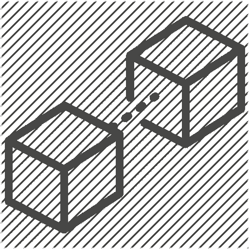
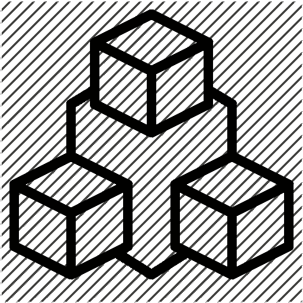

# 区块链 101:初学者理解技术指南

> 原文：<https://medium.com/coinmonks/blockchain-101-beginners-guide-to-understanding-the-technology-75a75f863ec2?source=collection_archive---------0----------------------->

**什么是区块链？**

当你听到区块链，这个词是比特币的同义词，它经常被混淆为同一个类别，而且由于比特币可能被视为“神奇的互联网货币”的负面看法，区块链经常被忽视。然而，区块链可能是技术上最重要的进化之一，甚至比互联网首次公开时更有意义。区块链为比特币提供了动力，尽管它的最初目的是为比特币和其他加密货币而创建的，但这只是这一强大技术的一个应用。

> [发现并回顾最佳区块链软件](https://coincodecap.com)

作为一个**的起点**，把区块链想象成云中的一个公共电子表格，可以通过编程来记录和跟踪任何有价值的东西。一旦交易发生，就会创建一个记录，并由参与网络的计算机进行全局验证。一旦交易通过验证，记录将永久不变。交易的所有者有能力自由地、即时地移动任何有价值的东西，而没有边界或中介。可以应用于区块链的一些例子是金融交易、医疗记录，甚至是土地所有权。

当互联网首次公开时，它的主要目的是存储和检索信息。目前，存储和跟踪这类数据的做法已经过时，没有像互联网早期那样发展。那么，在现有流程的情况下，区块链技术到底有什么特别之处呢？

让我们来分析一下为什么区块链会彻底改变我们相互交往的方式:

*   **信息**。区块链批量存储信息，称为区块，所有区块都以连续的方式链接在一起。如果有人对信息进行了更改，该块不会被更改或重写，而是创建一个新的块来存储该信息，显示在特定日期和时间进行了新的更改。区块链是几个世纪以来“总财务账本”的演变，本质上区块链是一种跟踪数据随时间变化的非破坏性方法。例如，假设两个人对谁拥有一块土地有争议，区块链可以通过其不变的分类账确定谁确切拥有该财产，以及随着时间的推移该财产被转让给了谁。

*   **放权**。这并不是将这些记录保存在一本古老的书籍或一个单一的文件系统数据库中，而是为区块链带来了一个最重要的方面，以及它如何实际上变革了今天的技术:区块链被设计成**去中心化**，并分布在一个大型计算机网络中。由于存储在区块链上的信息是分散的，这大大降低了篡改任何数据的能力。这种去中心化的模式创造了一种独特的人性化技术，它创造了数据中的**信任**。在链上添加新的块之前，有一个必须发生的过程。首先，必须解决创建该块的密码难题。无论哪一台计算机解决了密码难题，它都与网络上的所有其他计算机共享解决方案，这被称为“工作证明”整个计算机网络将验证原始计算机解决的工作证明，如果正确，块将被添加到链中。这些复杂的数学难题和来自网络上其他计算机的验证的结合确保了我们可以**信任链上的每一个区块。这种现象允许网络对每笔交易进行确认、验证并建立信任，因此用户可以简单地与已经完全保险的数据进行交互。这是区块链技术最重要的特征之一，以及它如何将全部能量传递给用户的一个很好的过渡**

*   **不再有中介**。通常，当你促成双方之间的交易时，会有银行或律师等中间人查看记录并对信息保密。这些中介充当双方之间的信任，并负责验证，例如，人 A 是特定财产的合法所有者。这种方法限制了风险，但增加了验证交易的另一个步骤，这意味着花费更多的时间和金钱。例如，如果土地所有权存储在区块链中，就不需要中间人，因为存储在区块链中的所有信息都已经过验证，是真实的，不能被篡改，数据是安全的。这种可信的点对点数据交互可以彻底改变我们相互访问、验证和交易的方式。

区块链不是一个单一的网络，它是一种**类型**的技术，可以通过许多不同的应用程序以各种方式实现。当你花更多时间在区块链适用的真实世界用例上时，你会开始意识到这项技术不仅会扰乱数十亿美元的行业，还会扰乱数万亿美元的行业。截至今天，区块链正在通过其第一个杀手级应用**加密货币**扰乱货币系统、金融市场和民主化风险投资。普通人现在有机会投资于最新技术，而这些技术以前只有私人机构或高净值个人才能获得，进入门槛低得多。区块链迫使银行业重新思考其当前的做法，因为它使个人能够充当自己的银行，并允许在全球范围内自由移动加密货币，而无需任何中介。迄今为止，密码市场价值 3000 亿美元，预计价值数万亿美元。如你所见，分权的基本主题是权力从机构转移到个人。区块链能走多远？蒂姆·德雷珀认为，这将迫使政府成为一种服务，个人可以选择最适合自己的政府，而无需搬迁:

*“沿着这条路走下去，你将不必离开一个地方去选择一个更好的政府。无论我在哪里，我都可以从智利获得社会保障，从加拿大获得医疗保险，从俄罗斯获得教育。整个系统将更加虚拟化。”— Draper(通过 Cointelegraph)*

这已经在爱沙尼亚发生，你可以在网上 3 小时内成为“电子居民”,并能够在全球范围内经营你的业务，同时为爱沙尼亚的税务系统服务。例如，你可以在爱沙尼亚的在线政府平台[https://e-resident.gov.ee](https://e-resident.gov.ee)建立一个虚拟办公室，进行会计和报告，无论你在世界的哪个地方开展业务。

区块链将如何进行技术革命的范围在很大程度上还没有确定，因为这是一个大部分未知的领域。我们目前处于底层，然而，生态系统，能源和社区是早期互联网时代的回忆。成千上万的开发人员出于纯粹的热情为这项技术做出贡献，世界级的研究人员和科学家将大部分时间投入到区块链，数十亿的风险资本涌入生态系统。不管我们认为区块链会有多有效，随着时间的推移，它肯定会获得很多关注。

# ❤️喜欢，分享，留下你的评论

如果你喜欢这篇文章，不要忘记喜欢，与你的朋友和同事分享，并在下面留下你对这篇文章的评论。跟我来……