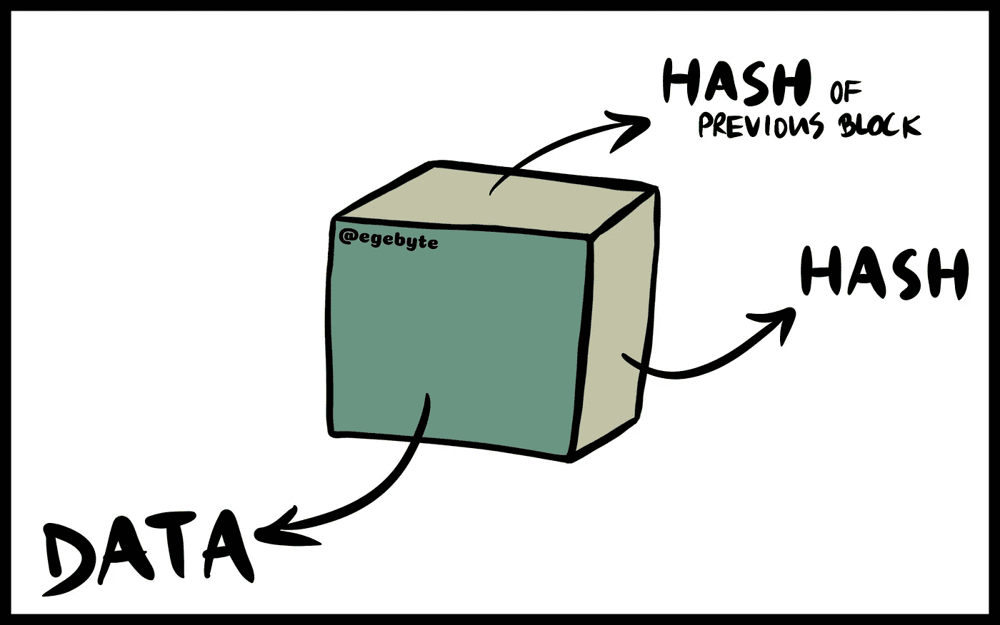
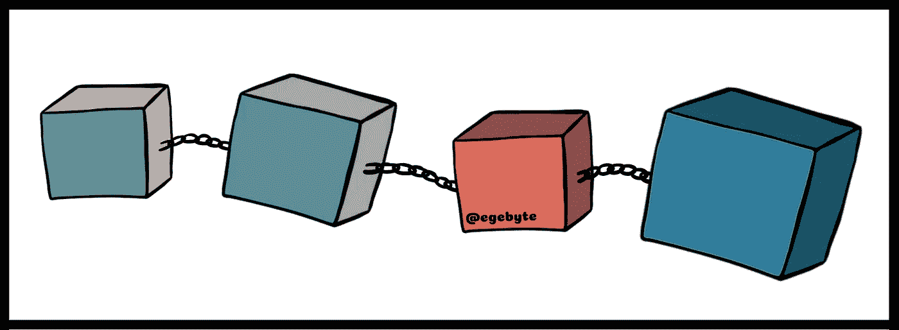
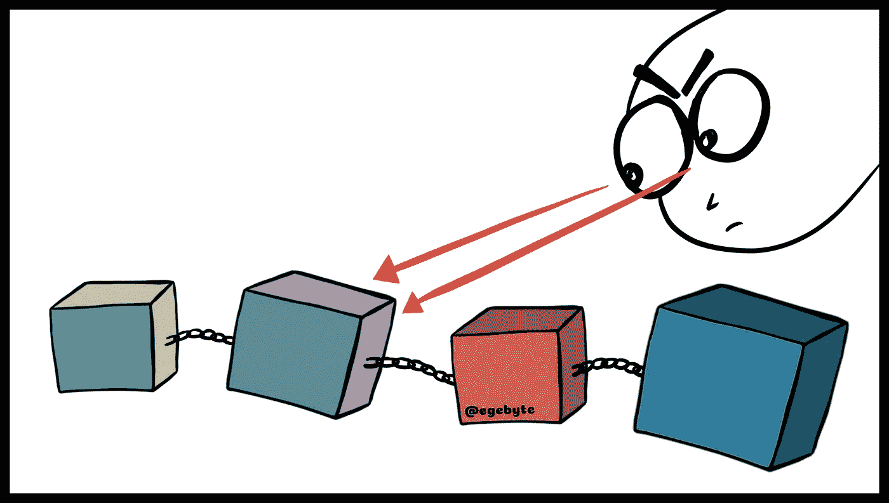
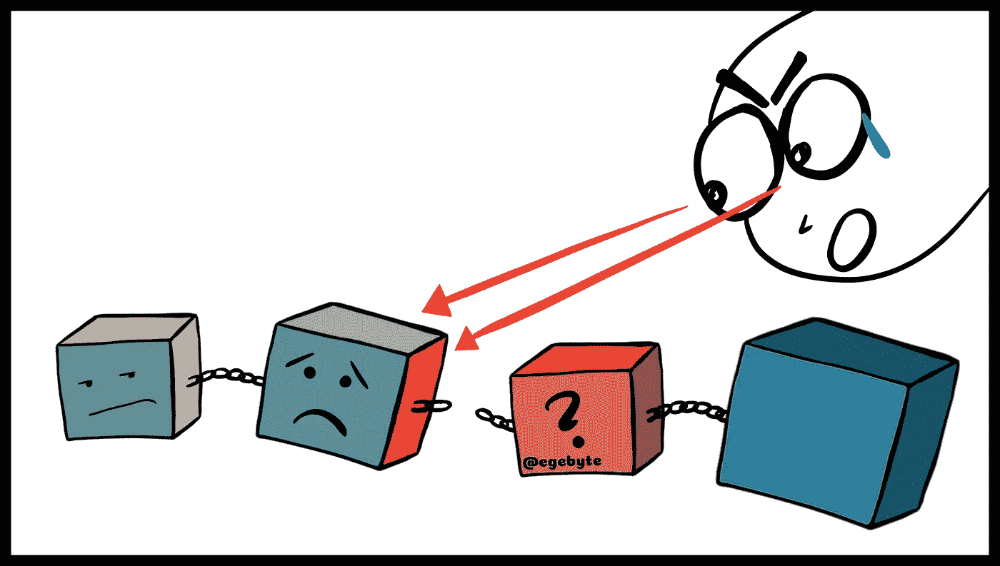
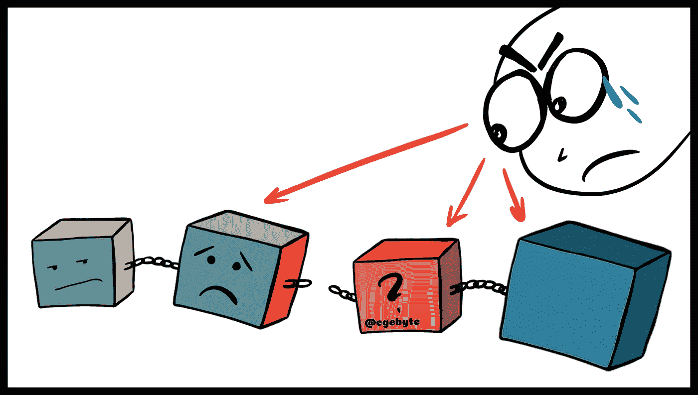

# 区块链 101——面向非开发人员。

> 原文：<https://medium.com/coinmonks/blockchain-101-for-non-developer-minds-3c4b67554149?source=collection_archive---------8----------------------->

英语里有一个很别致的词，那就是“共识”。它在拉丁语中的词根是“ **consentire** ”和“ **consens** ”，意思是“同意”或“同意”。然后在 17 世纪中期变成了今天这个词。共识意味着普遍同意。这有什么关系？

**共识是金钱和区块链在某些方面的共同特质。**

先来了解一下钱。根据定义，货币是一种被普遍接受的交换媒介，一种价值衡量手段。见“接受”二字。这意味着金钱需要人们相信它，首先接受它，才能成为一种资产。要让某样东西成为价值的衡量标准，简单来说就是需要有大量的人接受它。金钱需要社会共识才能存在。共识在区块链技术中也起着重要的作用，但我们一会儿就会谈到这一点。

区块链，简单来说就是一个数据库。区块链是包含信息的区块链。一些研究人员在 1991 年描述了这种技术，他们打算给数字文档加上时间戳，这样就不可能回溯或更改它们。这就像一个公证人。

因此，由于密码技术，这个数据库使我们能够安全地进行交易。块正在被创建，它们包含我们的信息，这些信息被编码以避免被敌人攻击。区块链只是一个分布式账本，对任何使用最高级别密码学的人完全开放。

## **什么是账本？**

想象一下，有人给另一个人发了一个 BTC。包含这两个人在交易之前和之后的余额的所有细节被保存在一个笔记本中，这个笔记本被称为分类账。这个系统防止了我们的双重花费问题，这意味着使用相同的信息两次。当你发送一些新自行车的照片时，使用相同的信息两次可能不是问题，但当涉及到金钱时，这是一件大事。重复支出问题是当前经济体系造成的最关键问题之一。

让我们了解一切是如何运作的。当一项交易进行时，它会被发布到全球数百万台电脑上。不是一台，而是数百万台电脑，都使用最高水平的加密技术。矿工开始工作，他们试图解决棘手的问题，第一个解决问题的人可以验证区块，并获得数字货币奖励。然后，该块被链接到另一个，另一个导致一连串的块。

你想仔细看看街区吗？这是我画的一幅简单的画。不要低估积木的力量。

Understanding Blocks — Blockchain 101

首先是数据。数据根据生态系统而变化。它可能包括有关交易的细节、参与方和金额。另一个基本的东西是散列。一个块包含散列和前一个块的散列。哈希就像一个代码，是字母和数字的独特组合。它们是根据加密哈希函数创建的，允许我们为每个大小的数据创建固定长度的哈希。这就像指纹一样，它可以识别数据块和内容。第三个元素是前一个块的散列。这是创建链的元素。

A chain of blocks — Blockchain 101

由于前一个块的散列，创建了一个链。这是使它安全的东西。一旦创建了一个块，就会计算它的散列值。改变块内的某些东西也会导致散列的改变。

> **很简单，如果指纹变了，那就不再是同一块了。**

在检测关于先前块的变化时，散列是有用的。你看，一切正常，没有问题。块是有序的，链是无问题的。

Adversaries wanting to change something — Blockchain 101

让我们看看当有人用积木改变某物时会发生什么。链中的第二个块有前一个块的散列，也有它自己的散列。指纹更改后，会再次计算其哈希。因此，下一个块的哈希与前一个块的哈希不同。

Chain is broken — Blockchain 101

积木链被打破了，这就像蝴蝶效应一样。如果你改变过去的某个街区，一切都得改变。对手必须改变链条中的每一个细节，才能让一切恢复正常。为了能够防止这种变化，防止腐败，有一种叫做工作证明的东西。

这个系统基本上减缓了新块的创建并防止了损坏。说到比特币生态系统，每 10 分钟就会创建一个区块，该区块包含前 10 分钟的所有交易。如果你想改变过去某个街区的某些东西，那么你必须为后面的每个街区做工作证明。你必须对每个街区进行验证。这几乎是不可能的。

Proof-of-Work required for all the blocks! — Blockchain 101

这种方法很难改变以前的块。想要黑掉一个街区的人必须黑掉前面所有的街区，因此也就黑掉了区块链的整个商业历史。如果你改变了一些东西，那么你必须改变下面的所有东西。安全性来自系统的特性、散列和工作机制的证明。区块链安全的另一个原因是它是分布式的。

> 从技术角度来看，区块链被定义为分布式和复制的数据库，允许安全交易，而不需要验证交易的中央机构，因此区块链可以被视为一个去中心化的自治组织(DAO)。由于区块链，这个组织可以完全自主、去中心化、透明和安全地运行。(14，米若)

区块链没有一个中央机构来处理和管理这个链条，而是使用一个点对点的网络，任何人都可以加入。它使用户能够在没有任何中央机构的情况下进行交易。

**点对点呢？那是什么？**为了更好的了解这个系统，我们先来看看**互联网的前 3 层**。只是简单的概述，没什么大不了的。

1.  以太网:那是 1974 年，当时，这意味着两台计算机的计算。
2.  TCP/IP:这意味着多台计算机的计算。
3.  HTTP:这意味着交流网络内容。

最后一种需要一个权威，一个人们可以从网上下载和上传的中央系统。这是数字支付开始的时代。但是在这方面有几个问题。比如依赖某种中央权威，还有另一个关键问题叫做重复支出，我们上面提到过。让我们重申一下我们说过的话。

> 当发送不同文档的副本时，这听起来可能不是问题。但是当涉及到钱的时候，汇两次钱会产生很多问题。这可以看作是一个知识被使用了两次，这样说起来听起来并不坏，但是相信我，确实如此。

除此之外，还有隐私问题，因为权威拥有我们的信息。而且它们又慢又贵。如果它们被黑客攻击，可能会发生可怕的事情。

因此，我们需要一个全新的系统来解决这些问题。幸运的是，中本聪在 2008 年发表了著名的比特币白皮书。摘要的第一句为:

> “电子现金的纯点对点版本将允许在线支付直接从一方发送到另一方，而无需通过金融机构。”

还记得 HTTP 吗？这是一个人们可以通过基于客户端的服务器下载或上传数据的系统。这意味着数据存储在服务器中。这让我们思考可靠性和隐私问题。在论文中，Nakamoto 谈到了 P2P 系统，在该系统中，数据从一个对等点直接发送到另一个对等点，而不存储在服务器中。当谈到“重复支出问题”时，这是一个突破。

## **点对点系统是如何运作的？**

当有人加入时，他会得到区块链的完整副本。然后当一个新的块被创建时，这个新的块被发送给网络上的每个人。每个人都要验证该块，以确保它没有被篡改。如果没有问题，每个节点都将这个块添加到自己的区块链中。这个网络中的所有节点产生共识。他们同意哪些块是有效的，哪些是无效的。

为了能够篡改区块链，你需要篡改链上的所有块，为每个块重做工作证明，并控制超过 50%的 p2p 网络。这几乎是不可能做到的。

## **区块链为什么安全？**

安全性来自系统的特性、散列和工作机制的证明。区块链安全的另一个原因是它是分布式的。简而言之，分类帐分配、工作证明和散列系统使它变得安全。

区块链技术现在被用于不同的领域，如医疗记录、金融期权，并有望用于许多领域，包括电子公证、投票系统等。

在对积木和它们的链条做了所有这些肤浅的总结之后，我想用一首我喜欢的乐队的歌来结束这篇文章，因为它现在还不算是一篇正式的文章，不是吗？

祝一切顺利，亲爱的锁链！

## **参考文献**

1.  *共识|在线词源词典共识的来源和含义*。(2021).Etymonline。[https://www.etymonline.com/word/consensus](https://www.etymonline.com/word/consensus)
2.  j . g . miró(2016 年)。区块链和西班牙银行的案例。*什么是区块链？*，13–14。[https://kth . diva-portal . org/smash/get/diva 2:943967/full text 01 . pdf](https://kth.diva-portal.org/smash/get/diva2:943967/FULLTEXT01.pdf)
3.  麻省理工学院开放式课程。(2020a 年 1 月 23 日)。*区块链基础知识&密码学*【视频】。YouTube。[https://www.youtube.com/watch?v=0UvVOMZqpEA](https://www.youtube.com/watch?v=0UvVOMZqpEA)
4.  麻省理工学院开放式课程。(2020b 年 1 月 23 日)。*介绍给 15 号。S12 区块链与金钱，2018 秋季*【视频】。YouTube。[https://www.youtube.com/watch?v=EH6vE97qIP4&t = 5s](https://www.youtube.com/watch?v=EH6vE97qIP4&t=5s)
5.  麻省理工学院开放式课程。(2020c 年 1 月 23 日)。*钱，账本&比特币*【视频】。YouTube。[https://www.youtube.com/watch?v=5auv_xrvoJk&t = 1s](https://www.youtube.com/watch?v=5auv_xrvoJk&t=1s)
6.  中本聪(2008 年)。比特币:一种点对点的电子现金系统。 *SSRN 电子杂志*。已发布。https://doi.org/10.2139/ssrn.3440802

 [## 最佳免费加密交易机器人——前 16 名比特币交易机器人[2021]

### 2021 年币安、比特币基地、库币和其他密码交易所的最佳密码交易机器人。四进制，位间隙…

medium.com](/coinmonks/crypto-trading-bot-c2ffce8acb2a)  [## 最佳 6 个加密交易信号电报通道

### 这是乏味的找到正确的加密交易信号提供商。因此，在本文中，我们将讨论最好的…

medium.com](/coinmonks/best-crypto-signals-telegram-5785cdbc4b2b)  [## BlockFi 评论 2021 —通过您的加密获得 8.6%的利率

### 让你的密码发挥作用，获得比特币和其他加密货币的最佳利率

medium.com](/coinmonks/blockfi-review-53096053c097) 

> 加入 [Coinmonks 电报频道](https://t.me/coincodecap)，了解加密交易和投资

## 另外，阅读

*   [什么是融资融券交易](https://blog.coincodecap.com/margin-trading) | [成本平均法](https://blog.coincodecap.com/dca)
*   [BigONE 交易所评论](/coinmonks/bigone-exchange-review-64705d85a1d4) | [电网交易机器人](https://blog.coincodecap.com/grid-trading)
*   [3 商业评论](/coinmonks/3commas-review-an-excellent-crypto-trading-bot-2020-1313a58bec92) | [Pionex 评论](/coinmonks/pionex-review-exchange-with-crypto-trading-bot-1e459d0191ea) | [Coinrule 评论](/coinmonks/coinrule-review-2021-a-beginner-friendly-crypto-trading-bot-daf0504848ba)
*   [莱杰 vs n 格拉夫](/coinmonks/ledger-vs-ngrave-zero-7e40f0c1d694) | [莱杰纳诺 s vs x](/coinmonks/ledger-nano-s-vs-x-battery-hardware-price-storage-59a6663fe3b0) | [币安评论](/coinmonks/binance-review-ee10d3bf3b6e)
*   [Bybit Exchange 审查](/coinmonks/bybit-exchange-review-dbd570019b71) | [Bityard 审查](/coinmonks/bityard-review-7d104239be35) | [CoinSpot 审查](https://blog.coincodecap.com/coinspot-review)
*   [3 commas vs crypto hopper](/coinmonks/3commas-vs-pionex-vs-cryptohopper-best-crypto-bot-6a98d2baa203)|[赚取加密利息](/coinmonks/earn-crypto-interest-b10b810fdda3)
*   最好的比特币[硬件钱包](/coinmonks/the-best-cryptocurrency-hardware-wallets-of-2020-e28b1c124069?source=friends_link&sk=324dd9ff8556ab578d71e7ad7658ad7c) | [BitBox02 回顾](/coinmonks/bitbox02-review-your-swiss-bitcoin-hardware-wallet-c36c88fff29)
*   [BlockFi vs 摄氏](/coinmonks/blockfi-vs-celsius-vs-hodlnaut-8a1cc8c26630) | [Hodlnaut 点评](/coinmonks/hodlnaut-review-best-way-to-hodl-is-to-earn-interest-on-your-bitcoin-6658a8c19edf) | [KuCoin 点评](https://blog.coincodecap.com/kucoin-review)
*   [Bitsgap 审查](/coinmonks/bitsgap-review-a-crypto-trading-bot-that-makes-easy-money-a5d88a336df2) | [Quadency 审查](/coinmonks/quadency-review-a-crypto-trading-automation-platform-3068eaa374e1) | [Bitbns 审查](/coinmonks/bitbns-review-38256a07e161)
*   [密码本交易平台](/coinmonks/top-10-crypto-copy-trading-platforms-for-beginners-d0c37c7d698c) | [Coinmama 审核](/coinmonks/coinmama-review-ace5641bde6e)
*   [印度的加密交易所](/coinmonks/bitcoin-exchange-in-india-7f1fe79715c9) | [比特币储蓄账户](/coinmonks/bitcoin-savings-account-e65b13f92451)
*   [CoinDCX 评论](/coinmonks/coindcx-review-8444db3621a2) | [加密保证金交易交易所](https://blog.coincodecap.com/crypto-margin-trading-exchanges)