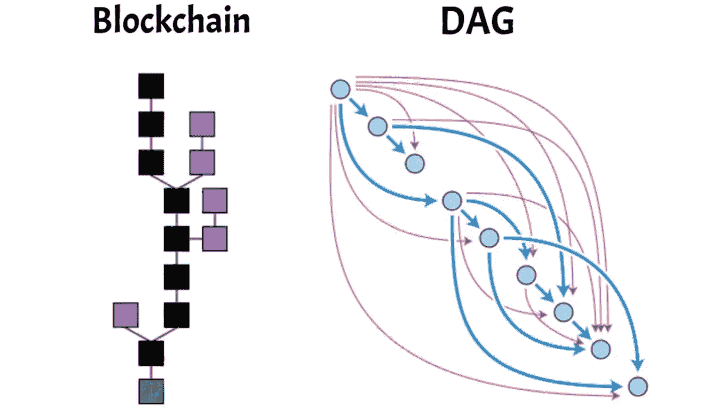
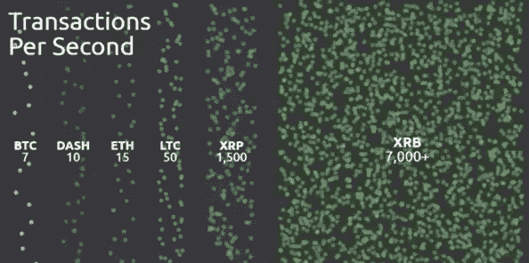

# 「区块链 3.0」——「dApp 更好的解决方案」？程序员解释

> 原文：<https://medium.com/coinmonks/blockchain-3-0-dag-a-better-solution-for-dapp-programmer-explain-4057029b05d0?source=collection_archive---------7----------------------->

什么是区块链 3.0？为什么您应该关心您是否正在构建/计划构建分散式应用程序？

> 什么是「DAG」有向无环图？

「DAG」是许多可以安全储存资料的资料结构之一。

> 和区块链有什么不同？

Blockchain VS DAG

让我们想象一下，我们在一个班级里，有 30 名学生，在他们提交论文后，老师需要给他们打分。

**方案一〖区块链〗** `**A teacher**`一次互相过 30 张纸。
—「试卷被异步评分」

**解决方案 2【DAG】** 老师会要求每个`**student**`在提交论文和`**teacher verify the work**`之前，必须对其他学生的一篇论文进行评分。
——【试卷同步评分】

> 为什么我们需要「DAG」？

用「区块链 1.0」和「区块链 2.0」的说法，我们证明了它是安全的，并且有可能拥有「货币互联网」和「可编程货币」。然而，有一个问题是每个区块链开发商都知道的。

TPS

「Visa」目前的 TPS 是「10，000」，如果我们想在一个区块链的基础上构建许多应用程序，10，000 tps 不会杀死它。这就是为什么我们需要一种方法来扩大规模！

> 披露/有用链接

**关于我**
我是一名全栈 javascript 开发人员，也是新区块链项目的贡献者之一。

**在 NEO 之上用 Javascript 构建去中心化应用？** [尼奥·区块链，编程教程，Javascript](https://medium.com/blockchain-under-the-hood)