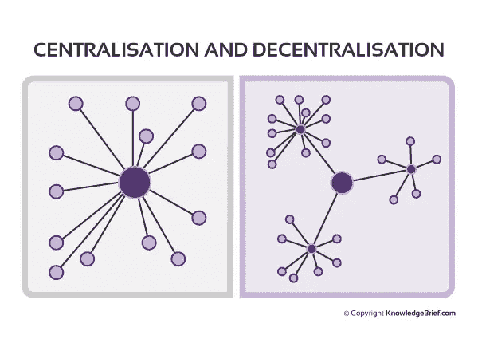
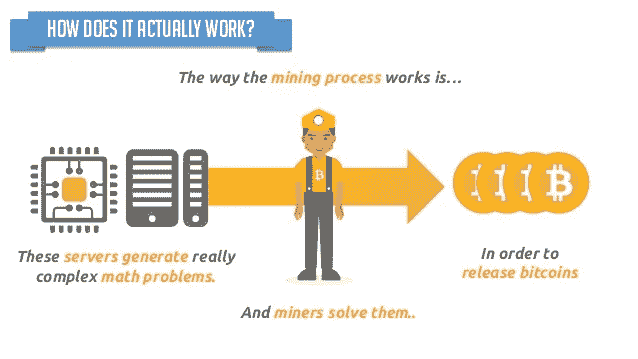
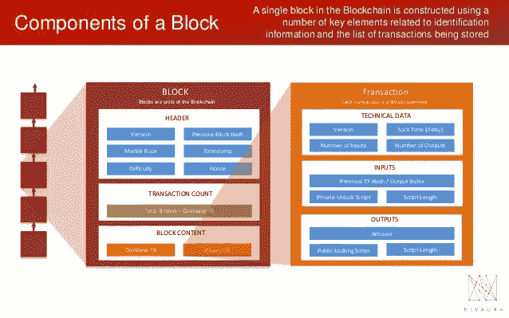
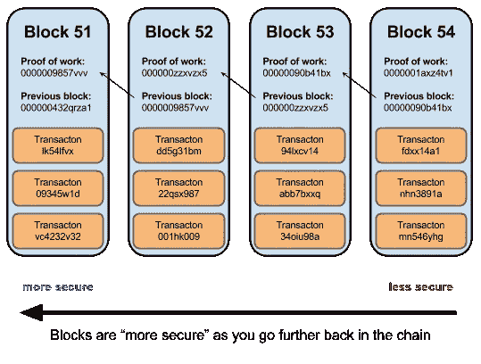
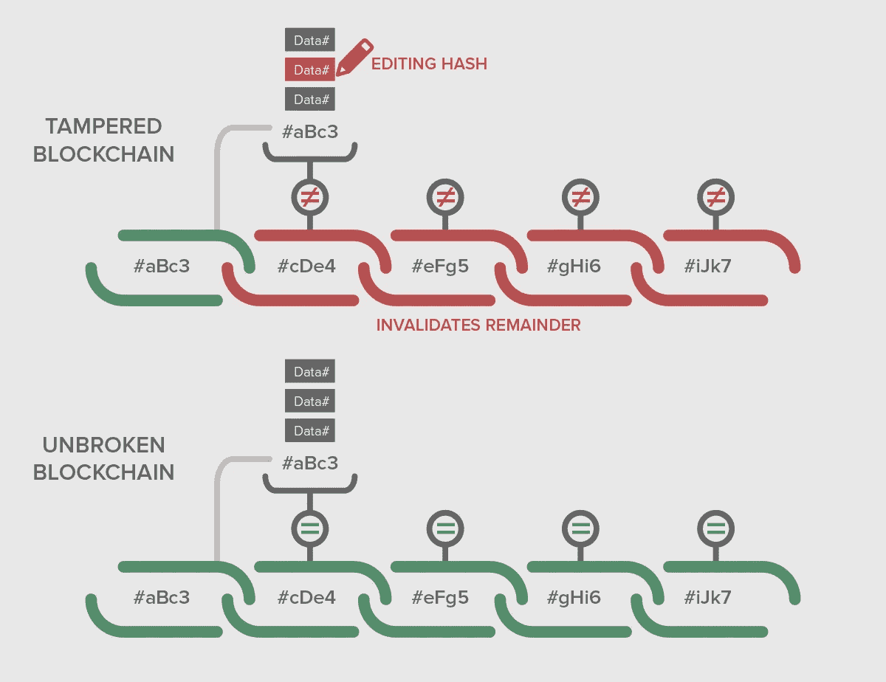
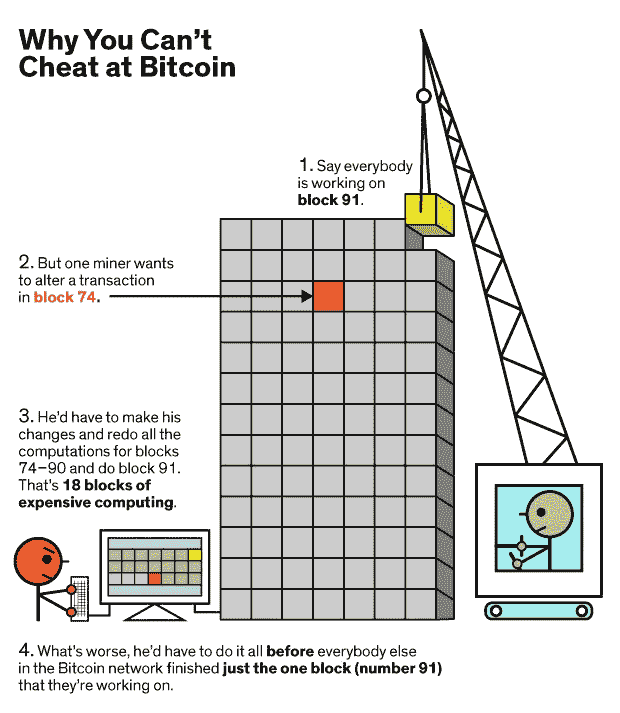
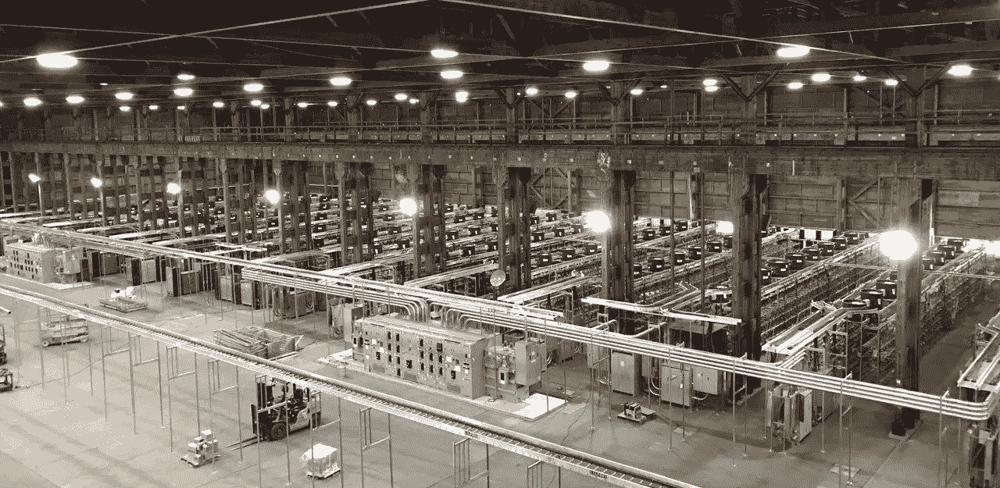
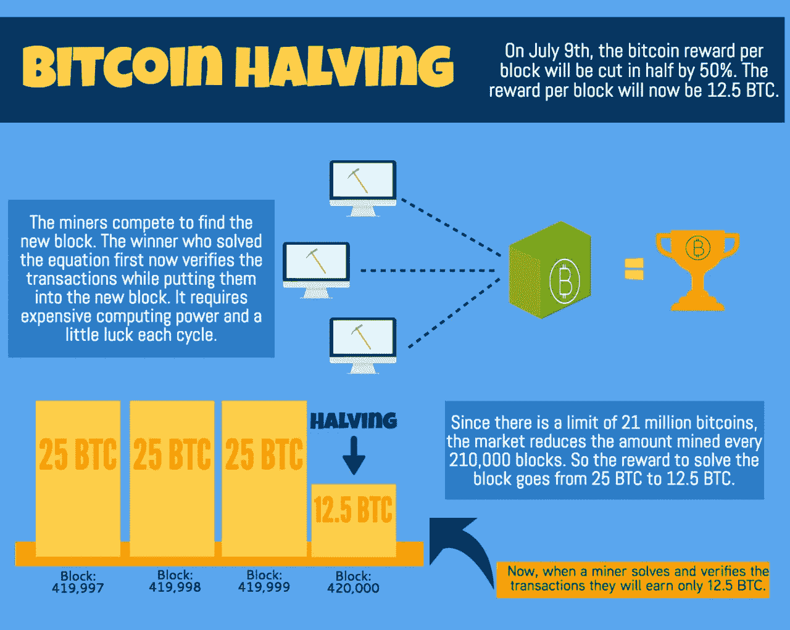
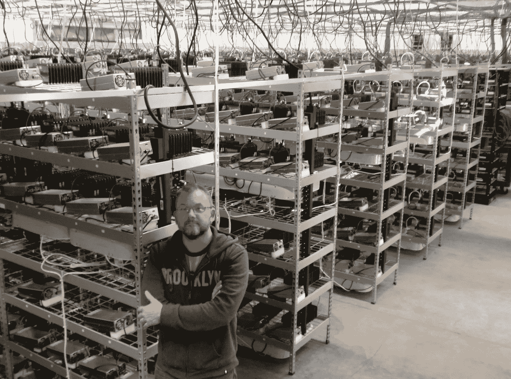
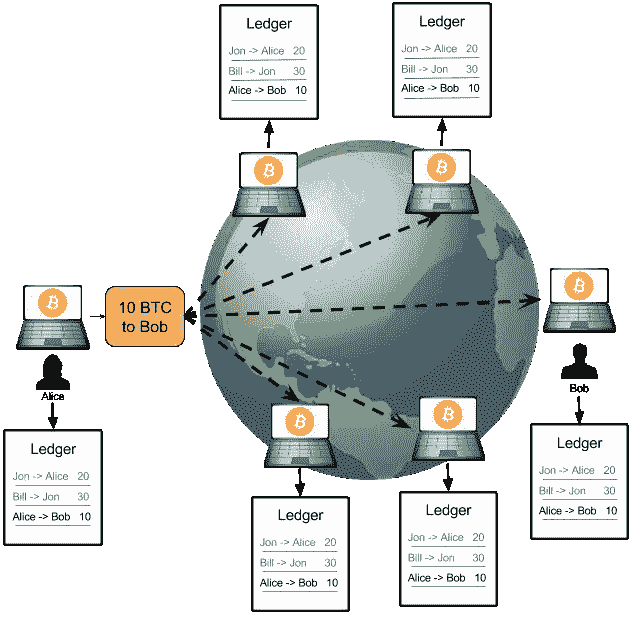

# 区块链:去中心化的治理系统——崩溃

> 原文：<https://medium.com/coinmonks/blockchain-a-decentralised-system-of-governance-an-analogy-d4efcbe18f07?source=collection_archive---------3----------------------->

当我听到人们说区块链不是比特币时，我觉得很有趣。它立即告诉我的是，说出这话的人(包括所有知名人士)没有尝试阅读原版的[比特币白皮书](https://bitcoin.org/bitcoin.pdf)，对区块链缺乏基本的了解。

这显然是错误的信息，真的很遗憾。[早期的互联网也未能幸免](http://www.newsweek.com/clifford-stoll-why-web-wont-be-nirvana-185306)

说“区块链不是比特币”有点像想要道路而不是汽车的人(因为他们有马车)或者想要互联网而不是电子邮件的人(因为我们已经有了邮局)。

没有比特币，真的不会有区块链。

原因如下。

# 工作证明。

比特币(网络)最大、最深刻的创新是信任去中心化。

Centralisation vs Decentralisation

你如何让迄今为止互不认识的随机人群信任自己并执行同一套指令，换句话说，每次都做正确的事情——拜占庭将军的问题。

我将用一个简单的类比来解释这个解决方案。

想象一下，你刚刚获得了一张银行牌照，可以建立一家数字化的纯在线银行。你的银行将被称为第一银行。你还提出了一个不雇佣任何员工的公司结构。

是，没有在册员工。

然而，你允许来自世界各地的任何人加入 bankOne 并为其工作。要为 bankOne 工作，他们只需要一台电脑/笔记本电脑和互联网接入。他们还需要从 bankOne 的网站上下载其软件。该软件是他们为银行进行交易处理所需的唯一软件，任何有电脑的人都可以免费下载。让我们称这个软件为 bankSoft。

您的客户只需要一个钱包应用程序(移动或桌面)来访问 bankOne 进行金融交易。这个应用程序也可以在网站上下载。不需要个人互动。

那么，为 bankOne 工作的人是如何获得报酬的呢？

重申一下，没有人在 bankOne 挣工资。绝对没有人。

因为没有人得到报酬，所以你想出了一个报酬计划，在这个计划中，任何人得到报酬的唯一方式就是他们与 bankSoft 处理的交易总额。

最初，他们将获得他们处理的任何交易金额(价值)的 10%。我们还可以说，bankSoft 的构建方式是，每 4 年后，这一比例就会下降一半。所以 4 年后，10%变成了 5%，4 年后变成了 2.5%，如此类推。除此之外，每次您促成交易(如资金转账等)时，您还会收到小额交易费用。

在前四年，任何成功完成交易的人都有权获得已完成交易的 10%。这 10%会*神奇地*发给这个人。

让我给你讲一个假设的例子。

你推出了 bankOne，当然它还不是一家受欢迎的银行。此外，没有人相信你的薪酬模式会起作用，甚至没有人相信你会有任何客户。你最终会让某人(比如说一个朋友)下载 bankSoft 来处理交易。然后你扮演第一个顾客。因为只有一个人(你的朋友)处理交易，他得到最初处理金额的 10%和小额交易费。

几个月后，关于 bankOne 的银行模式的消息传开了，又有四个人(来自世界各地)通过下载 bankSoft 加入进来。

*现在的问题是:* ***【这 5 个人中谁来处理这些交易，因此拿走 10%和交易费？***

在他们不知道的情况下，您已经在 bankSoft 中解决了这一切。

您创建了 bankSoft，它以 10 分钟为间隔收集待处理的交易。这意味着，如果在过去 10 分钟内发生了 20 笔价值 100 万英镑的交易(比如一种新货币)，它们都将进入*“待处理池”——但*“为您的银行工作”的 5 人中只有一人(即下载的 bankSoft)能够处理这笔交易，并获得 10 万英镑(10%)和另外 5000 英镑的交易费。

*但是谁呢？*

在 bankSoft 内部，有一种算法可以生成一个随机的数学问题，任何回答这个问题的人都可以处理*“待处理池”*中的所有交易。这些数学问题是以这样一种方式产生的，即它们涉及许多猜测来寻找答案。然而，这个问题很难解决，但一旦解决了，其他人就很难验证正确答案。

这么说吧，bankSoft 中的算法会产生与质数乘法相关的问题。

bankSoft 给出的随机问题可以是这样的:

两个素数的乘积是什么给出 **77** 。这很容易。不是 *1 和 77】*就是【7 *和 11】*。

现在想象一下，这个问题给出了数字 **8083** ，然后问你用来得出这个数字的两个质数的乘积。在到达[ *59 和 137]* 之前，需要一段时间和一点密集的计算。

你看，关键是在处理*“待处理池”中的事务之前，你必须做许多随机的(尽管毫无意义的)**工作**。*一旦一个人给出答案(通过广播给其他人)，其他任何人都很容易验证其正确性。能够提供答案的人首先处理*“待定池”*中的交易，并获得 *105，000(新货币)*奖励。

必须完成的工作就是所谓的**工作证明**。你刚刚证明了你做了一些工作来得到那个答案。

Proof Of Work

通过竞争，你可以立即看到内在的自我管理系统。

现在为 bankOne 工作的 5 人中的一人意识到，为了能够首先回答随机问题，他需要让更多的人尝试不同的素数组合。另一个人意识到他需要开发一个软件来为他进行随机猜测，还有一个人投资了更强大的硬件来更快地进行计算。都是为了争取处理未决交易的权利。

在更广泛的计算机科学方面，这被称为**博弈论。换句话说，他们不得不与自己竞争来挣钱。这种竞争创造了解决拜占庭将军问题的随机人群之间的信任。**

这些相互竞争的人通常被称为 [**矿工**](https://en.bitcoin.it/wiki/Mining) 。它们用于处理事务，并进一步保护这些事务(稍后将详细介绍)，在任何给定时间，只有一个 miner 可以处理挂起的事务(并创建一个块)。

Mining

在由任何一个矿工在*“待处理池”*中处理这些交易之后，他们在分类账中创建一个条目，并且该分类账的新状态(添加了新交易)被发送给所有其他参与的矿工。该分类账由每个矿工独立维护。

由挖掘器挖掘的条目(仅由*待处理池*中的那些事务组成)被称为**块** *(事务的)*。因此，块只是经过验证的事务的集合。随着更多的*“待定池”*交易通过解决数学问题*(从而创建块)*而被创建和处理，它们随后被链接在一起并成为历史，以创建永远不变的分布式分类账。

Anatomy of A Block

这个不同区块的链被称为**区块链**。事实上，如果任何新的矿工加入，他将不得不下载整个区块链(当前分类帐的状态)来运行一个**完整节点**，以便成为 bankOne 全球分布式劳动力的一部分。

顺便说一下，*“待定池”*被称为**内存池**。

所创建的每个块被赋予一个数学签名，并且这些签名对于每个块是唯一的，以至于在不改变先前链接的块的签名的情况下它们不能被改变。

例如，当**块 1** 被创建时，它被赋予 ***sig1(块 1)*** 。

当 **BLOCK2** 被创建并链接到 **BLOCK1** 时，签名为***SIG 1(block 1)***+***SIG 2(block 2)***

当**区块 3** 被开采时，它被赋予签名 ***sig1(区块 1)*** + ***sig2(区块 2)*** + ***sig3(区块 3)*** 。

并且一直持续到第 n 个 ***块*** 即:***SIG 1(BLOCK 1)****+****SIG 2(BLOCK 2)***+***SIG 3(BLOCK 3)…………****+****符号(BLOCKN)***

Blockchain with PoW and Signature

这样，当任何恶意的人试图改变比如说 **BLOCK3** 时，他将不得不在 10 分钟的窗口内重新计算所有预先存在的块的签名(这是创建一个新的有效块所需的时间)。

此外，签名背后的数学是一个**单向散列函数**。

散列函数是简单的数学术语，指的是用一种方式很容易做到而不可能逆转的事情。打个比方，打破一个玻璃杯。容易掉落和破碎，但很难将碎片重新组合成整体。

本质上，它是一个数学函数，接收一条消息并给出一个随机一致的输出，但你永远无法将该输出还原为原始输入。这就是为什么它是单向的。

这就是在区块链上实现**不变性**的方法。

The Immutable Blockchain

bankSoft 最大的优点之一是它有一个内置的传感机制，允许它改变前面提到的数学“质数”问题，并在 10 分钟内解决。

如果*“看到”*只有一个矿工，它会调整质数问题，让那一个矿工在 10 分钟内解决。如果有五个矿工，这将使它变得有点困难，因为有更多的资源专用于它。

这就是所谓的**难度调整**。

越来越多的矿工开始意识到这一点。人们看到，他们可以向 bankOne 投入的机器/计算机资源越多，他们赚的钱就越多。bankSoft 的另一个微妙之处是，矿工们直到每个月底才被允许申报他们的收入(10% +交易费)。

因此，这意味着存在一种激励机制，让矿工不去欺骗系统。如果任何一个矿工试图作弊，他将失去他的收入。在区块链的例子中，月底是在 100 个区块被开采之后。

Why You Cant Cheat The Blockchain

此外，因为所有的矿工(位于世界各地)在他们的计算机上具有相同的分类帐副本，所以欺骗或黑客攻击确实非常困难，因为人们必须在他们的计算机上在 10 分钟内(将另一个块添加到区块链所花费的时间)找到所有那些其他矿工并改变记录、重新计算散列和重建块。

一项几乎不可能完成的任务。

A Single Bitcoin Mining Rig

这个案例中的 bankSoft 是一个 [**比特币挖矿**](https://www.buybitcoinworldwide.com/mining/software/) 软件，任何人都可以下载该软件来运行矿，银行的客户可以使用任何比特币钱包进行发送和接收。

客户是创建*“待定池”*的人，他们的**比特币钱包**会自动生成一个公钥**地址**(类似于银行账号)和一个相关的私钥，用于签署要在网络上广播的交易。这是由钱包软件自动完成的。[公钥实际上是原始公钥的散列]

最初的 10%奖励在每 4 年后减半(如上所述)称为**减半**。但与我在类比中使用的 10%不同，这实际上是凭空创造的比特币数量。开始是 *50 BTC* 然后 2016 年变成了 *25 BTC* 现在是 *12.5 BTC* 。

Halving

我们创建的 bankOne 本身(连同所有连锁交易)实际上就是 [**比特币区块链**](https://blockchain.info/) 。这就是它如此强大的原因——强大到足以让基础比特币加密货币(带一个小 b)，即激励矿工的相同机制，现在拥有真正的价值。

该价值源自其固有的**[**工作证明**](https://www.youtube.com/watch?v=ELA91d_mx80)**机制，即****计算能力****硬件****电力**和**开采区块和保护链所需的互联网资源**。******

******这些是** [**有形物**](https://steemit.com/bitcoin/@proofmaster/5-years-ago-wired-magazine-called-bitcoin-an-abstraction-destroyed-their-wallet-keys-and-now-can-t-access-usd120k-worth-of) **和成本** [**真钱**](https://coinmarketcap.com/currencies/bitcoin/) **。******

****我需要提到的另一件事是，流通中的比特币数量是有限的——2100 万。那个数字只是创造者随机选择的。****

****因此，这意味着我们有一种通货紧缩的货币。它是特意构建在比特币核心软件中的。****

********

****Bitcoin Mining Farm****

****下次你从任何人那里听到**[**区块链不是比特币**](https://finance.yahoo.com/news/lightning-labs-ceo-back-bitcoin-not-blockchain-world-180021768.html?guccounter=1)**，请不要理会。那种说法充满了知识上的无知。********

************

******The Structure of bankOne: A global decentralised bank (Bitcoin Blockchain)******

*********PS*** *:所有图片均来源于 google images，所有者保留其版权。*******

****我也知道我把这里很多复杂的解释过于简单化了，有些解释在某些地方和上下文中可能是不严谨的。请原谅我。****