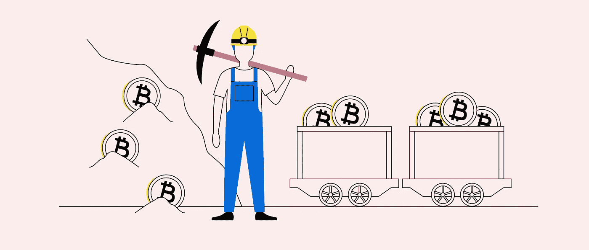

# 区块链算法。第二部分。工作证明

> 原文：<https://medium.com/coinmonks/blockchain-algorithms-part-2-proof-of-work-e7febcc1b69f?source=collection_archive---------4----------------------->

## 优异奖

*工作证明(PoW)* 是基于在客户端执行一些相当长的工作(找到问题的解决方案)的需要，保护网络不被出于自私目的过度使用(例如，拒绝服务攻击或组织垃圾邮件)的想法，其结果在服务器端容易且快速地得到验证。

所用计算的一个关键特性是所花时间的不对称性——它们对于寻找解决方案来说是巨大的，而对于验证来说是微不足道的。

## 创造的历史

1993 年，美国计算机科学家**辛西娅·德沃克**和以色列密码学家**莫尼·诺尔**的工作首次描述了它的原理。他们为 PoW 创建了一个理论基础，提出创建一种算法，只向那些正确解决了某个问题的用户提供对某些数据的访问。

“工作证明”算法开发的下一步是 1996 年创建的 **Adam Back 的***Hashcash*——该工具有助于防止 DoS 攻击(拒绝服务)和其他服务中断，如网络垃圾邮件，要求用户做某些工作。

2004 年 8 月，密码爱好者 Hal Finney 发表了他的研究成果。该系统通过接收基于工作证明并在 RSA 中签名的不可替代或不可替代的 Hashcash 令牌来工作，然后该令牌可以在人与人之间转移。

**RPoW** 通过使用来自可信服务器的用于确认硬币所有权的机制，解决了重复花费的问题，该机制允许任何国家的系统参与者访问，以分析操作的正确性和完整性。在国际上，RPoW 被评为第一版加密货币资产。

工作证明这个术语是由马库斯·雅各布森和阿里·朱尔斯在 1999 年正式创造的。

> 2008 年，所有这些发展结合在一起，形成了**中本聪**，也就是我们今天所知的**比特币**。

后来(2009 年)，比特币开发者提出了一种渐进的方法，将工作证明作为共识算法来实现，用于确认交易和将新块转移到区块链。

作为基础，Satoshi 用 **SHA-256** 哈希算法(SHA-256 比原来的哈希卡什算法更安全)取了*哈希卡什*，PoW 保证了区块链网络的运行:用来生成新的块，保证整个网络的安全。

## 工作证明是如何工作的？

简而言之，网络(节点)的矿工们相互竞争来解决复杂的、复杂的计算难题。这些谜题很难解答，但是检查正确答案很容易。

挖掘器是网络基础设施中处理事务(挑选和挑选成块)的设备。当事务发生时，矿工节点接收并验证事务，将它们传送到存储器，然后将它们分组到一个块中。

当矿工找到加密问题的正确解决方案时，他将能够向网络添加一个块，在此之后，其他矿工将确认任务已正确完成。之后，为找到正确解的节点计算报酬。

## 比特币区块链的威力

比特币是一个基于区块链的系统，由分散节点的集体工作提供支持。这些节点中的一些被称为矿工，它们负责向区块链添加新的块。为此，矿工需要猜测一个伪随机数(nonce)。

这个数字与块中显示的数据相结合，并通过哈希函数传递，这应该会产生一个符合给定条件的结果(例如，一个以 4 个零开始的哈希)。

> 当找到匹配结果时，其他节点将检查结果的有效性，矿工的节点将获得块奖励。

因此，除非找到有效的 nonce，否则不可能向主链添加新的块，而有效的 nonce 又会生成特定块的解决方案(称为块的散列)。每个已确认的块包含一个块哈希，代表矿工所做的工作，这就是为什么它被称为工作证明。

工作证明有助于保护您的网络免受各种攻击。成功的攻击将需要大量的处理能力和大量的计算时间，因此它将是无效的，因为攻击网络的成本将大于潜在的回报。

工作证明的一个问题是复杂的算法计算保证了网络安全，但是这些计算不能在生态系统之外使用。

## 工作证明的基础

在工作证明一致性算法的模型中，两个参数起主要作用:计算能力(散列率)和找到随机随机数的概率。

> 这两个参数是相互关联的:散列率越高，生成块的机会就越大。

由于比特币网络的巨大增长，需要非常大的容量来生成块，所以现在池主要从事比特币挖掘。到 2012 年，比特币网络的总哈希值超过了世界上最强大的计算机的计算能力。

GPU 充当网络节点:1 个 GPU = 1 个节点。计算 GPU，而不是 IP 作为节点，防止了多个 IP 地址所有者接管网络。

## 缺点和优点

1.  巨大的采矿农场的创建和巨大的计算能力集中在一只手里造成了所谓的 **51%攻击**的危险。当整个哈希速率的一半以上集中在一只手上时，这就成为可能
2.  每月都在增加的过度用电

1.  伪造结果的不可能性——在生成块之前，所有网络节点都会检查找到的随机数
2.  不可能“准备”结果——寻找下一个块的随机数的工作只有在前一个块的工作完成之后才开始
3.  Sibyl 攻击的不可能性——一个理论上的攻击者将无法创建大量的虚假节点，在这些节点的帮助下，他可以“大规模”压制其他网络节点的意见
4.  对诚实参与的激励—当一个节点开始“欺骗”并试图破坏网络时，它可能会被网络中的其他参与者永久阻止
5.  收益的诚实性——潜在回报的数量直接取决于节点拥有的散列率

工作证明算法用于许多流行的加密货币:比特币、以太坊、莱特币、Zcash、Monero。

 [## 区块链算法。第一部分。共识；一致

### 在这一系列文章中，我们将考虑分布式分类帐功能的各种算法，基本的…

medium.com](/nerd-for-tech/blockchain-algorithms-part-1-consensus-7cb9bd363d88) 

> 加入 Coinmonks [电报频道](https://t.me/coincodecap)和 [Youtube 频道](https://www.youtube.com/c/coinmonks/videos)了解加密交易和投资

## 也阅读

 [## 杠杆代币[多头代币]终极指南

### 杠杆化令牌是具有杠杆化风险敞口的 ERC20 令牌，不考虑保证金、要求、管理…

medium.com](/coinmonks/leveraged-token-3f5257808b22)  [## 最佳加密交易所| 2021 年十大加密货币交易所

### 加密货币交易所的加密交易需要了解市场，这可以帮助你获得利润。之前…

blog.coincodecap.com](https://blog.coincodecap.com/crypto-exchange)  [## 2021 年最佳加密交换平台| CoinCodeCap

### 如果我们看看今天的场景，许多加密货币交换平台提供了广泛的功能和深度…

blog.coincodecap.com](https://blog.coincodecap.com/best-swap-platforms)  [## 2021 年最佳加密借贷平台| 6 大比特币借贷平台

### 获得比特币和其他加密货币的最佳贷款利率

medium.com](/coinmonks/top-5-crypto-lending-platforms-in-2020-that-you-need-to-know-a1b675cec3fa)  [## 2021 年 6 大最佳硬件钱包|顶级加密硬件钱包[更新]

### 最好的加密货币硬件钱包是绝对必要的。我们将在 NGRAVE、Ledger Nano X 和…

medium.com](/coinmonks/the-best-cryptocurrency-hardware-wallets-of-2020-e28b1c124069)  [## 2021 年最佳免费加密交易机器人

### 2021 年币安、比特币基地、库币和其他密码交易所的最佳密码交易机器人。四进制，位间隙…

medium.com](/coinmonks/crypto-trading-bot-c2ffce8acb2a)  [## 最佳 4 个加密交易信号电报通道

### 这是乏味的找到正确的加密交易信号提供商。因此，在本文中，我们将讨论最好的…

medium.com](/coinmonks/best-crypto-signals-telegram-5785cdbc4b2b)  [## 获取信号、交易机器人和套利

### 在本文中，我们将讨论 bits gap——一个满足您所有交易需求的一站式加密交易平台…

blog.coincodecap.com](https://blog.coincodecap.com/bitsgap-review)  [## 40 个最佳电报频道，用于加密、电影、表演和演讲| CoinCodeCap

### 随着我们周围无限的信息，我们很难筛选和了解有价值的信息。电报有…

blog.coincodecap.com](https://blog.coincodecap.com/best-telegram-channels)