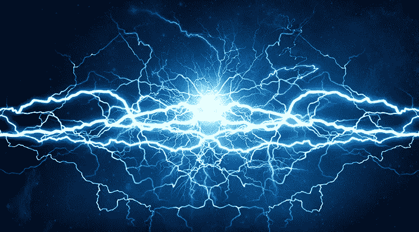

# 区块链和能源

> 原文：<https://medium.com/coinmonks/blockchain-and-energy-8cb868d7fd0?source=collection_archive---------9----------------------->

走进你的房子。走进一家商店。你在看灯吗？电脑？咖啡机？现在去商店外面；去你的房子外面。你看见街灯了吗？汽车？这个清单可以一直列下去，但是——嗯——你明白了。

我们谈论的是现代社会发展所围绕的一切——对我们几乎所有的生活都至关重要的东西。

我们在谈论能源。

如果我们告诉你市场将会改变，而且已经在改变了，会怎么样？如果我们告诉你，区块链正在渗透并很可能威胁主导能源市场，会怎么样？有点吓人？

不完全是。

这实际上是迈向未来的一大步。

事实上，它已经开始了。两年前，一家太阳能电池板公司成为首批使用以太智能合同销售能源的公司之一。这只是开始。大约在同一时间，区块链被应用于阿姆斯特丹的能源贸易。此类加密货币，区块链交易正在持续增长。

但是等等——你会说。肯定会有问题，这些是我们在深入区块链能源市场之前需要考虑的事情。确实如此。事实上，在我们开始改造我们所知道的能源市场之前，有几个主要的考虑事项需要解决。

在处理能源方面的新技术时，成本是一个明显的考虑因素。由于成本较高，许多人反对应用区块链，但区块链专家用降低区块链自身成本和能源使用的方法来打击这种论点，使其成为当前能源系统的可行替代方案。

当然，许多人担心区块链的潜在可扩展性，但该领域的专家再次证明区块链确实适用，稍微私有化可扩展性不会成为问题。

数据。对于不使用区块链的能源公司来说，这实际上是一个更大的问题。随着监管力度的加大、网络攻击等等，能源行业需要大量的数据存储；能源公司发现自己陷入了一个必须存储和验证的数据坑。是的，你得到了它。区块链是验证所有那些耗费能源行业大量时间和能源的数据的解决方案。

区块链反对者提出的每一个潜在问题，专家们似乎都能轻而易举地提供现成的解决方案。应用新技术时可能总会出现复杂情况，但是，公平地说，我们总会找到解决方案。

准备好迎接能源行业的未来了吗？

我们是。