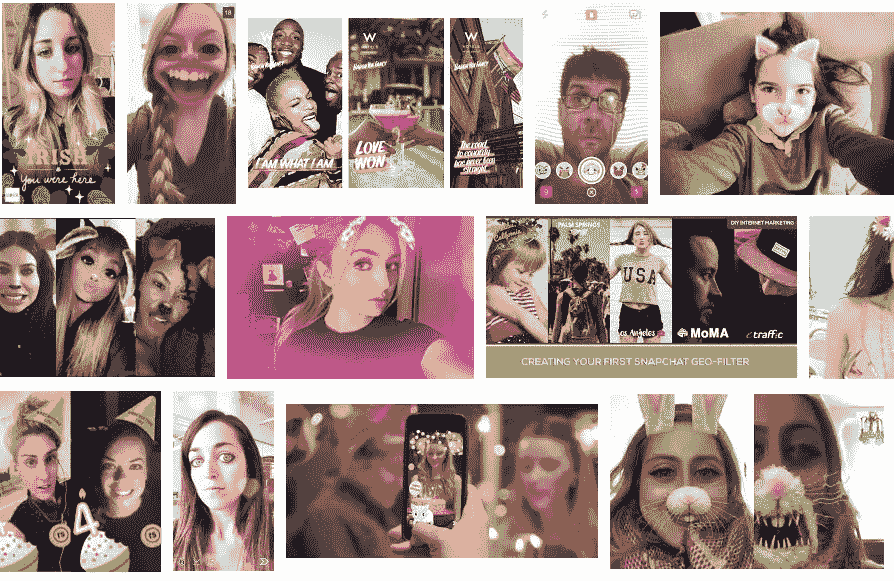
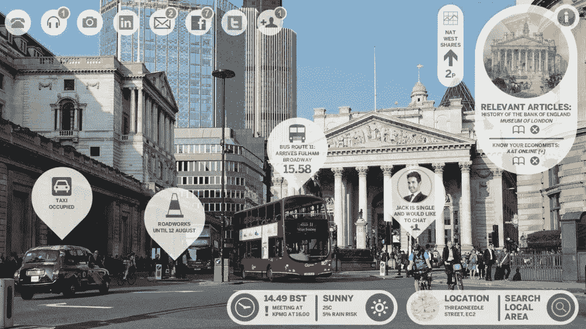

# 区块链和物联网使 AR 成为日常体验的一部分

> 原文：<https://medium.com/coinmonks/blockchain-and-iot-make-ar-part-of-daily-experience-d567ee3edbd6?source=collection_archive---------7----------------------->

让我们为即将到来的变革做好准备。在这里，我分析了经济走向新的数字体验的重要趋势，这与包括区块链在内的创新技术有关。在本文中，我将探索增强现实，这项技术有望在不久的将来成为日常生活的重要组成部分。

# **注意力经济扩张**

今天，实物不再流行。几个世纪以来，人们收集财富，争夺土地，购买奢侈品，但今天他们对虚拟战利品越来越感兴趣。社交媒体和游戏成就中的认可成为现代生活的一个有形方面。为什么会这样？

让我们来看看“**注意力经济**的概念，它有助于我们理解虚拟现实入侵下的社会进程。人的注意力是源头。我们关注自己喜欢或需要的东西，比如爱好、工作、家庭、游戏、健康。我们通过购买时髦的衣服、漂亮的汽车、在社交网络上发帖和评论来吸引注意力。公司通过广告吸引和购买注意力。由于注意力是一种有价值的资源或商品，特定的行业对其进行衡量、管理和分配。虚拟和数字产业使用社交网络、搜索引擎、视频游戏和互联网媒体等工具快速有效地处理这类商品。

How to attract attention of the audience

同时，对于顾客来说，虚拟的注意力比实体商品更好。豪华车很贵，但每个人都可以很容易地在车旁或车内拍一张照片。它们吸引的注意力很容易衡量，而且不需要花费任何成本。参加活动和场所，制作有趣的内容，与虚拟观众交流，变得比买东西更有价值。

> 虚拟产品和服务可能最终解决工业经济问题，如需求下降、生态灾难和自动化导致的失业。当由注意力经济驱动的虚拟空间用个性化的增强现实扰乱我们的日常生活时，它就会发生。

# **基于物联网和区块链的增强现实**

增强现实，或 AR，是一种在现实世界中构建虚拟系统的技术。与使用耳机、触觉设备和运动传感器将我们沉浸在另一个地方的虚拟现实(VR)不同，AR 将数字信息带入现实世界。增强现实可能会通过个人智能手机显示屏、耳机、智能眼镜和公共视频输出设备来展示自己。为了开始增强现实体验，我们还需要将上下文数据输入到这样的设备中。最简单的例子就是智能手机摄像头，它可以捕捉人脸，并在移动中添加可爱的滤镜。要像这样玩 AR，我们需要互联网和安装在智能手机上的利用计算机视觉技术的应用程序。

Examples of augmented reality

今天，AR 在技术上受到现有网络、软件和设备的限制。AR 的价值来自于它与我们日常生活的无缝融合。几十个应用程序、沉重的互联网流量和 VR 头戴设备无助于实现 AR 日常体验。为了将上下文数据应用于现实世界，我们需要不同的数据存储、联网和程序执行方法。

> 这是物联网和区块链技术的结合，让 AR 成为我们日常体验的一个独特部分。网状网络、分散的数据存储和即时反应是这种协作的三个主要特征。

**网状网络** —一种分散式网络拓扑，其中节点相互协作以向彼此分发数据。作为安全区块链生态系统的一部分，多个物联网设备可以直接相互通信以及与用户的智能手机通信。通过本地蓝牙和 Wi-Fi 使用快速安全的点对点连接，AR 体验不需要互联网。

**物联网设备上的分散数据存储**。最近的设备可以在需要的地方传递上下文信息。区块链是在网络中保持数据受保护、可用和备份的最佳技术。

**推送通知**以及在当前位置可获得特定 AR 体验时的其他即时反应场景。区块链的智能合约可以在满足特定条件(如用户特征和权限、时间和位置或之前与其他用户的交互)时执行 AR 场景。智能合同使 AR 和物联网主动技术能够自动运行，而无需集中授权。

> 可扩展、可靠且不可信的区块链技术支持没有任何第三方的对等契约行为。这一技术基础为实现 AR 和改变我们的日常体验提供了绝佳的机会。

# **零售营销的虚拟现实**

*零售、餐饮和个人服务是最先应用基于物联网和区块链的增强现实来吸引客户注意力的行业。*

## **定位和个性化**

电子商务开发了广泛的营销工具，包括针对客户群、重新定位、推荐、个性化忠诚度计划、推荐计划等等。

Augmented reality show in the shopping mall

如果零售店使用相同的功能会怎样？他们可以向顾客发送通知，当他或她接近商店时，他或她搜索一些特定的产品或服务。当忠诚计划的成员进入购物中心时，商店可以向他们发送特别优惠和导航信息。如果你的朋友推荐了一家餐馆，当你在附近散步时，评论就会出现在手机屏幕上。

## **引人注目**

商店已经使用摄像头和具有 AR 功能的交互式公共屏幕。他们用虚拟试衣间给顾客带来惊喜，虚拟试衣间通过摄像头捕捉顾客，并展示他们在这家商店穿着的时尚服装。如果他们能提取一些顾客的个人信息，他们会给顾客看他们最近在网上浏览过的衣服。

商店可能会通过安排虚拟景点来吸引有特定兴趣的目标观众，从而鼓励用户亲自前往。视频游戏商店可以聚集许多粉丝，如果它把虚拟游戏角色放在只能通过智能手机看到的地方，并允许与它互动。

# **游戏和社交**

Foursquare、Pokemon Go 和许多其他应用程序已经表明，将虚拟交流转移到物理空间非常有吸引力。

## **虚拟游戏变成现实**

增强现实实现了生动的体验、激动人心的交流和团队合作的游戏机制，可以抓住大量听觉的注意力。有了区块链，这些游戏将变得更加适应物理位置、环境数据和游戏玩家。例如，参与者和游戏算法会把虚拟物体放在不会造成伤害的公共场所。可以改变游戏的进程，以适应特定游戏者的行为，从而创造迷人的游戏体验。当地企业将把 AR 游戏连接到它们的输出设备，如扬声器、屏幕和投影仪，当游戏玩家走到附近时，向他们显示秘密信号。

AR displays statuses in social networks

## **目标网络**

AR 会让现实生活中的交流更加高效流畅。在专业会议中，与会者可能会撰写虚拟名片，显示有关他们兴趣和能力的重要信息。其他 VR 应用程序将帮助人们陈述他们的社会地位，并根据兴趣爱好、语言交换实践、约会偏好等找到对方，或者从黑名单中避免潜在的危险人物。

# **基于位置的解决方案**

*通过与周围使用区块链的物联网设备连接，个人设备变成了多功能导航器。用户可以根据自己的喜好建立路线，发现新的地方，并与路线和其他人互动。*

## **虚拟导航旅游**

AR 将把一条普通的旅游路线变成一个迷人的故事，其中包含特殊的地点、人物和来自其他人的信息。AR 应用程序将使用智能手机摄像头和显示方向的屏幕为游客导航。当观光客接近历史古迹时，物联网设备将以他们的语言发送音频或视频数据。导游和当地企业可以在景点附近留下信息，帮助游客并宣传他们的服务。

Navigation App uses AR

## **向人群广播重要信息**

使用 AR 机构和公共活动的协调者可以向参与者广播重要信息，例如位置地图、导航、上下文数据或活动时间表。在紧急情况下，连接在网状网络中的物联网设备可能是人与当局之间唯一的通信方式。它们将帮助分析和模拟紧急情况，并发送可操作的数据。

这些用例只是从数字空间到现实世界采用数字营销工具、游戏机制和社交互动的大趋势的一部分。将物理空间中的这种交互与计算机设备进行比较，我们可以说，AR 是输出技术，物联网输入数据，区块链通过其智能合约和分散网络处理信息。

> 这些技术的结合将有效地分散人类的注意力并管理行为，就像它在社交网络、在线游戏、网上购物中一样。科技巨头和初创公司已经在投资 AR 产品，因为这一趋势对经济格局非常重要。

# ❤️喜欢，分享，留下你的评论

如果你喜欢这篇文章，不要忘记喜欢，与你的朋友和同事分享，并在下面留下你对这篇文章的评论。

> [直接在您的收件箱中获得最佳软件交易](https://coincodecap.com/?utm_source=coinmonks)

