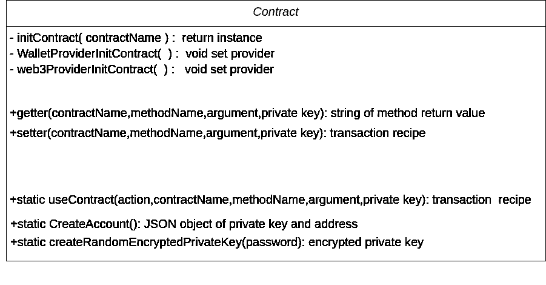

# 区块链和 JavaScript:如何提供智能合约服务

> 原文：<https://medium.com/coinmonks/blockchain-and-javascript-how-to-offer-your-smart-contracts-as-a-service-dee7a84290f8?source=collection_archive---------2----------------------->

最近，我开始和一个大型的前端和后端开发团队一起工作。这个项目很简单，我开发的唯一一个智能合同需要几个小时就可以使用。但是我不得不面对一个严峻的挑战，因为我团队中的大多数人对区块链一无所知。让情况变得更复杂的是，由于项目的预期用户不熟悉区块链，因此要求永远不要使用元掩码或任何钱包。为了解决这个问题，我们的团队创建了一个 javascript **类**来与部署在我们的私有网络上的任何智能合同进行交互，作为[区块链服务](https://blog.coincodecap.com/what-is-blockchain-a-simple-guide-for-dummies/)。

# 到底什么是区块链服务类

作为一个没有区块链背景的开发人员，更简单的解决方案是创建一个与区块链交互的类。服务类将由前端和后端开发人员使用。每个开发人员可以根据自己的需要以不同的方式使用这个类。这个类会是这样的



对于本文，我尽可能灵活地创建了这个类。区块链服务类对于后端来说很简单，但是对于前端来说，有点难。让我们从简单的开始。

## 对于后端开发人员

大多数后端开发人员将只在两个方面需要区块链类首先从区块链读取数据并将其解析到前端，或者最重要的是进行管理任务，如添加地址或授予权限。

例如，我们可能需要作为智能合约的所有者提交交易，给予许可或将资产发送到某些地址。只有管理员可以做到这一点。

## 对于前端开发人员

最重要的任务是初始化用户帐户。请记住，作为区块链开发者，你需要让用户自己进行交易。但是如果你不使用钱包，你怎么能做到呢？为此，我们需要初始化一个用户类。有时我们需要他私钥来提交交易或检查权限。其他用户只需要读取一些数据公共数据，所以在这种情况下我们不需要他们的私钥。我们确信在任何情况下**用户必须为自己保留地址**并且不要发送给我们的服务。

现在我们该怎么做呢？

# 让我们开始编码吧

最重要的一步是找到一种不使用元掩码来签署交易的方法，然后我们需要找到一种为用户生成私钥并保证私钥安全的方法。最后一步是为前端开发人员提供一种灵活的方式来管理用户帐户或只提交交易。我们走吧。

## meta mask/wallet 替代品

我发现最好的选择是使用钱包提供商。我们用来迁移松露契约的同一个 npm 包模块。

```
npm install @truffle/hdwallet-provider
```

它是如何工作的？我们将只需要私钥来签署交易，然后我们将使用`path`和`fs` npm 包来加载合同的构建文件(合同工具)，如下所示:

```
const contract = require('[@truffle/contract](http://twitter.com/truffle/contract)');
const WalletProvider = require('[@truffle/hdwallet-provider](http://twitter.com/truffle/hdwallet-provider)');
// assume for now you already have the contract artificaits 
const contractArtificaits;
const contract = contract(contractArtificaits);
const instance = await this.contract.deployed(); 
// instance could be used to interact with the smart contract
```

要使用`const instance`,你需要写类似这样的东西

```
await this.instance[<the method name>](<method argument>,{from:<your account public address>});
/* 'from' keyword may not be useful to read data from blockchain. Unless you try to read from function that use modifier*/
```

现在，我们准备创建我们的类并与我们的契约交互。在开始创建我们的类之前，我们必须添加一些 npm 模块。我们将需要`path` & `fs`来加载契约的构建文件，并需要`web3` & `hdWalletProvider`来与 solidity 契约交互，我们将在后面详细讨论。最后`crypto-js`加密私钥。我们将在文章的最后谈到这一点。

```
'use strict';
const contract = require('[@truffle/contract](http://twitter.com/truffle/contract)');
const WalletProvider = require('[@truffle/hdwallet-provider](http://twitter.com/truffle/hdwallet-provider)');
const CryptoJS = require("crypto-js");
const path= require('path');
const fs = require('fs');
const Web3 = require('web3');
const web3 = new Web3(new Web3.providers.HttpProvider('[http://127.0.0.1:8545/'](http://127.0.0.1:8545/'))); 
const web3Provider = new Web3.providers.HttpProvider('[http://127.0.0.1:8545/'](http://127.0.0.1:8545/'));
```

## 创建一个类

我们将这个类命名为`Contract`，然后创建一个带有可选私钥作为参数的构造函数。

```
class Contract{constructor(privateKey = ''){
      this.privateKey = privateKey;
   }

}
```

初始化与我们的智能合约交互的实例。如果我们有或没有私钥，我们有两种可能性。如果我们已经有了私钥，我们将如上所述使用 wallet provider 创建实例。否则我们将使用默认方式使用`web3`。Web3js 是最著名的与 Solidity 交互的库之一。这两个类在初始化方面的主要区别在于提供程序。

创建接受合同名称的`initContract()`,然后获取合同的技巧并检查私钥是否存在。我们用`HDWalletProvider`初始化合同以签署事务，否则我们使用`Web3`读取事务。

```
/*Inside Contract Class*/
  async initContract(contractName){
  /*Get Contract Articicates*/
    const filePath =   path.resolve('build/contracts/'+contractName+'.json');
    let rawdata = fs.readFileSync(filePath);
    this.contractArtificaits = JSON.parse(rawdata);
    this.contract = contract(this.contractArtificaits);
    /*Check private key*/
    if (this.privateKey) {
      await this.WalletProviderInitContract();
    }
    else{
      await this.web3ProviderInitContract();
    }
    this.instance = await this.contract.deployed();
    return this.instance;
  }/*Create contract instance using WalletProvider*/
   async WalletProviderInitContract(){
    this.provider = new   WalletProvider(this.privateKey,"[http://127.0.0.1:8545/](http://127.0.0.1:8545/)");
    this.contract.setProvider(this.provider);
    }/*Create contract instance using Web3*/
async web3ProviderInitContract(){
    this.contract.setProvider(web3Provider);
    }
```

现在我们可以使用`this.instance`来执行契约方法。

## 创建 Getter 和 Setter 方法

是一个私有函数，只有当我们需要从任何契约中调用函数时，我们才能在内部使用它。对于 getter 和 setter 方法，我们可以自由地签署一个事务，或者读取我们的私有密钥，或者如果我们需要使用另一个。(这是可选的，我添加这个特性是为了让我的代码对我的团队来说更加灵活)

```
/*Read Transactions*/
  async getter(contractName,methodName,args,_privateKey ='') {
    if (_privateKey !== '') {
         this.privateKey = _privateKey;
    }  
    await this.initContract(contractName)
    if (this.privateKey) {
      return await this.instance[methodName](...args,{from:web3.eth.accounts.privateKeyToAccount(this.privateKey).address});        
    }
    else{
      return await this.instance[methodName](...args);        
    }
  }/*Submit Transactions*/
async setter(contractName,methodName,args,_privateKey ='') {
    if (_privateKey !== '') {
        this.privateKey = _privateKey;
    } 
    await this.initContract(contractName);
    const value = await this.instance[methodName](...args,{from:web3.eth.accounts.privateKeyToAccount(this.privateKey).address});
    return value;
    }
```

最后要做的是添加一个静态函数来与契约**交互，而不需要**初始化契约类对象。如果他们需要进行交易，这个函数是为后端创建的。并且不需要使用类。

```
static async useContract(method,contractName,methodName,args,_privateKey ='') {
    const contract = new Contract()
    if (method === 'get') {
        return await contract.getter(contractName,methodName,args,_privateKey);
    } 
    else if(method === 'set'){
           return await contract.setter(contractName,methodName,args,_privateKey);
          }
    else{
        throw Error('Invalid Option');
        }     
    }
```

完成后，我们应该有类似的东西。

```
'use strict';
const contract = require('[@truffle/contract](http://twitter.com/truffle/contract)');
const WalletProvider = require('[@truffle/hdwallet-provider](http://twitter.com/truffle/hdwallet-provider)');
const path= require('path');
const fs = require('fs');
const CryptoJS = require("crypto-js");
const Web3 = require('web3');
const web3 = new Web3(new Web3.providers.HttpProvider('[http://127.0.0.1:8545/'](http://127.0.0.1:8545/'))); 
const web3Provider = new Web3.providers.HttpProvider('[http://127.0.0.1:8545/'](http://127.0.0.1:8545/'));
class Contract {

  constructor(privateKey='') {
    this.privateKey = privateKey;
    }

    /*Contract Initialization */
  async initContract(contractName){
    const filePath = path.resolve('build/contracts/'+contractName+'.json');
    let rawdata = fs.readFileSync(filePath);
    this.contractArtificaits = JSON.parse(rawdata);
    this.contract = contract(this.contractArtificaits);
    if (this.privateKey) {
      await this.WalletProviderInitContract();
    }
    else{
      await this.web3ProviderInitContract();
    }
    this.instance = await this.contract.deployed();
    return this.instance;
  }

  async WalletProviderInitContract(){
    this.provider = new WalletProvider(this.privateKey,"[http://127.0.0.1:8545/](http://127.0.0.1:8545/)");
    this.contract.setProvider(this.provider);
    }

  async web3ProviderInitContract(){
    this.contract.setProvider(web3Provider);
    }

    /*Account creation */
  static async getAccount(privateKey) {
    return web3.eth.accounts.privateKeyToAccount(privateKey);
    }static async createAccount() {
    const newAccout = await web3.eth.accounts.create();
    return newAccout;
    }/*Transactions submmitions */
  async getter(contractName,methodName,args,_privateKey ='') {
    if (_privateKey !== '') {
         this.privateKey = _privateKey;
    }  
    await this.initContract(contractName)
    if (this.privateKey) {
      return await this.instance[methodName](...args,{from:web3.eth.accounts.privateKeyToAccount(this.privateKey).address});        
    }
    else{
      return await this.instance[methodName](...args);        
    }
  }async setter(contractName,methodName,args,_privateKey ='') {
    if (_privateKey !== '') {
        this.privateKey = _privateKey;
    } 
    await this.initContract(contractName);
    const value = await this.instance[methodName](...args,{from:web3.eth.accounts.privateKeyToAccount(this.privateKey).address});
    return value;
    }

  static async useContract(method,contractName,methodName,args,_privateKey ='') {
    const contract = new Contract()
    if (method === 'get') {
        return await contract.getter(contractName,methodName,args,_privateKey);
    } 
    else if(method === 'set'){
           return await contract.setter(contractName,methodName,args,_privateKey);
          }
    else{
        throw Error('Invalid Option');
        }     
    }}  
module.exports = Contract
```

这是接下来我们需要为用户生成私有公钥的困难部分，然后找到一种安全提交密钥的方法。

# 创建区块链账户

Web3 提供了一个简单方法来创建区块链帐户，就像这样使用 `create()`

```
static async createAccount() {
    const newAccount = await web3.eth.accounts.create();
    return newAccount;
}
```

`newAccount`将返回一个带有地址和私钥的 JSON 对象。现在用户应该保管好他的密钥来使用他的帐户。但是如果我们需要他在服务器上提交一个事务，而我们不想保存他的私钥，该怎么办呢？

我找到的最佳答案是使用用户密码加密我的私钥用户有密码，而我只有加密的文本

```
/* Private Key Management */
  static async createRandomEncryptedPrivateKey(password) {
    const newAccount = web3.eth.accounts.create();
    const privateKey = newAccount.privateKey;
    const encryptedPrivateKey = CryptoJS.AES.encrypt(privateKey, password).toString();
    return encryptedPrivateKey;
  }static async accountFromEncryptedPrivateKey(encryptedPrivateKey, password) {
    const decryptedObject = CryptoJS.AES.decrypt(encryptedPrivateKey, password);
    const decryptedPrivateKey = decryptedObject.toString(CryptoJS.enc.Utf8);
    return web3.eth.accounts.privateKeyToAccount(decryptedPrivateKey);
  }
```

最后，我们的类应该是这样的

```
'use strict';
const contract = require('[@truffle/contract](http://twitter.com/truffle/contract)');
const WalletProvider = require('[@truffle/hdwallet-provider](http://twitter.com/truffle/hdwallet-provider)');
const path= require('path');
const fs = require('fs');
const CryptoJS = require("crypto-js");
const Web3 = require('web3');
const web3 = new Web3(new Web3.providers.HttpProvider('[http://127.0.0.1:8545/'](http://127.0.0.1:8545/'))); 
const web3Provider = new Web3.providers.HttpProvider('[http://127.0.0.1:8545/'](http://127.0.0.1:8545/'));
class Contract {

  constructor(privateKey='') {
    this.privateKey = privateKey;
    }static async createAccount() {
       const newAccount = await web3.eth.accounts.create();
       return newAccount;
     }

    /*Contract Initialization */
  async initContract(contractName){
    const filePath = path.resolve('build/contracts/'+contractName+'.json');
    let rawdata = fs.readFileSync(filePath);
    this.contractArtificaits = JSON.parse(rawdata);
    this.contract = contract(this.contractArtificaits);
    if (this.privateKey) {
      await this.WalletProviderInitContract();
    }
    else{
      await this.web3ProviderInitContract();
    }
    this.instance = await this.contract.deployed();
    return this.instance;
  }

  async WalletProviderInitContract(){
    this.provider = new WalletProvider(this.privateKey,"[http://127.0.0.1:8545/](http://127.0.0.1:8545/)");
    this.contract.setProvider(this.provider);
    }

  async web3ProviderInitContract(){
    this.contract.setProvider(web3Provider);
    }

    /*Account creation */
  static async getAccount(privateKey) {
    return web3.eth.accounts.privateKeyToAccount(privateKey);
    }static async createAccount() {
    const newAccout = await web3.eth.accounts.create();
    return newAccout;
    }/*Transactions submmitions */
  async getter(contractName,methodName,args,_privateKey ='') {
    if (_privateKey !== '') {
         this.privateKey = _privateKey;
    }  
    await this.initContract(contractName)
    if (this.privateKey) {
      return await this.instance[methodName](...args,{from:web3.eth.accounts.privateKeyToAccount(this.privateKey).address});        
    }
    else{
      return await this.instance[methodName](...args);        
    }
  }async setter(contractName,methodName,args,_privateKey ='') {
    if (_privateKey !== '') {
        this.privateKey = _privateKey;
    } 
    await this.initContract(contractName);
    const value = await this.instance[methodName](...args,{from:web3.eth.accounts.privateKeyToAccount(this.privateKey).address});
    return value;
    }

  static async useContract(method,contractName,methodName,args,_privateKey ='') {
    const contract = new Contract()
    if (method === 'get') {
        return await contract.getter(contractName,methodName,args,_privateKey);
    } 
    else if(method === 'set'){
           return await contract.setter(contractName,methodName,args,_privateKey);
          }
    else{
        throw Error('Invalid Option');
        }     
    }/* Private Key Management */
  static async createRandomEncryptedPrivateKey(password) {
    const newAccount = web3.eth.accounts.create();
    const privateKey = newAccount.privateKey;
    const encryptedPrivateKey = CryptoJS.AES.encrypt(privateKey, password).toString();
    return encryptedPrivateKey;
  }static async accountFromEncryptedPrivateKey(encryptedPrivateKey, password) {
    const decryptedObject = CryptoJS.AES.decrypt(encryptedPrivateKey, password);
    const decryptedPrivateKey = decryptedObject.toString(CryptoJS.enc.Utf8);
    return web3.eth.accounts.privateKeyToAccount(decryptedPrivateKey);
  }}  
module.exports = Contract
```

目前，我们的团队正在寻找提供区块链即服务的最佳方式，以便以更快、更简单的方式实施区块链。然后我们将创建我们的微服务。如果你有什么更好的解决方法，请分享给我。我希望我说清楚了。但是，如果你有任何问题，请随时问我。

我们正计划实施更多的功能，如获取事件日志，并分离前端团队的区块链服务，然后后端团队的区块链服务。我们很高兴听到您的意见或任何建议，以制定更好的解决方案。

[](https://coincodecap.com)

> [在您的收件箱中直接获得最佳软件交易](https://coincodecap.com/?utm_source=coinmonks)

[](https://coincodecap.com/?utm_source=coinmonks)