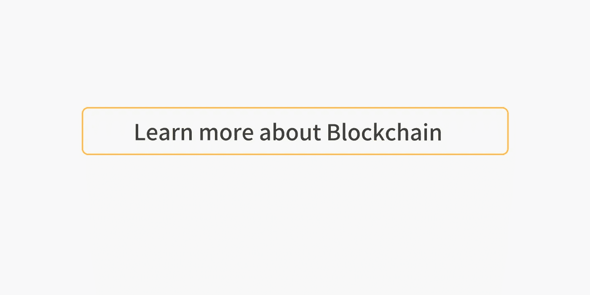

# 新兴区块链架构模式

> 原文：<https://medium.com/coinmonks/blockchain-architecture-pattern-s-86913335c27d?source=collection_archive---------1----------------------->

A high level reference architecture for blockchain applications.

一种模式正在出现，即如何构建超越 DAPP 的区块链应用程序，DAPP 由单个链上的几个智能联系人组成。

这并没有什么错，但在以太坊上每秒只有几个事务，直到 Casper 登陆(理论与现实相当吻合)，我们将需要另一个地方来存放我们的数据，因为保持一个相当大的应用程序的所有状态，至少在明年是不现实的。即使这是现实的，也有无限的机会将主链与特定应用的侧链结合起来。

描述的模式可以在一些即将到来的项目中看到，包括 [FOAM](https://foam.space/) (无关联)。

从较高的层面来看，模式如下所示:

1.  **在一个大链上创建一个智能契约，将一些令牌绑定到一个智能联系人。**智能契约中的绑定令牌可用于注册新节点、确保良好行为等。
2.  **下链做你的事。**这是侧链。它可以有自己的令牌，或者完全独立的密码经济学。它能够以应用程序所需的数量和速度处理事务。嫩薄荷在这里是绝佳的选择。这是业务逻辑能够生存的地方。
3.  **(用主链签到)。这不是严格要求的。您可以将主链用作注册表，或者使用绑定的硬币作为确保侧链保持良好行为的一种方式。**
4.  **(使用大链令牌引导初始网络。)**这也不是严格要求的。每个人(目前)都在以太坊上推出代币是有原因的。这可能会改变到 EOS 或 NEO，谁知道呢，但这种模式可以在任何支持智能联系人的平台上重播。

# 配置

常见的组合可能包括:

(ETH、EOS、BTC、NEM、NEO 中的一种)Tendermint、Ethermint、Hyperledger Fabric、锯齿、Burrow、Private Ethereum、Private EOS 中的一种)

# 这促成了哪些新业务？

构建一个区块链应用程序看起来越来越像构建一个 web 应用程序或移动应用程序。有各种各样的工具，所有这些工具都需要您输入您的核心业务逻辑。缺少主链分叉(ETH、NEO、NEM 等。)你可以简单地使用 Tendermint 或 Hyperledger(织物、锯齿)之类的东西，它们本质上是盒子里的区块链。它允许你把你的业务逻辑，编译，并让别人运行确切的代码。太神奇了！而且每个月都变得越来越容易。

这种模式似乎对 IOT 特别有用，就像在泡沫中看到的那样。我经常想到一个具有雾架构的区块链(设备上有一个小链，边缘上有一个稍大的链，云中有完整的状态)，它提供了全部的好处去中心化和不变性，但速度像 IOT。

用户可以在一个公共链上持有代币，这样他们可以更容易地交易，但仍然可以从您的定制网络中获得价值。

我们仍处于用这项技术解决易得之果问题的不成熟阶段。身份、供应链，所有这些都是真正需要区块链解决方案的大问题，但思考手机的用途仍然感觉像 1992 年。我们没有看到应用程序商店，也没有看到能够实现这一点的各种业务。我一直围绕着密码经济学所支持的激励机制来思考。

**Click to learn more about Blockchain**