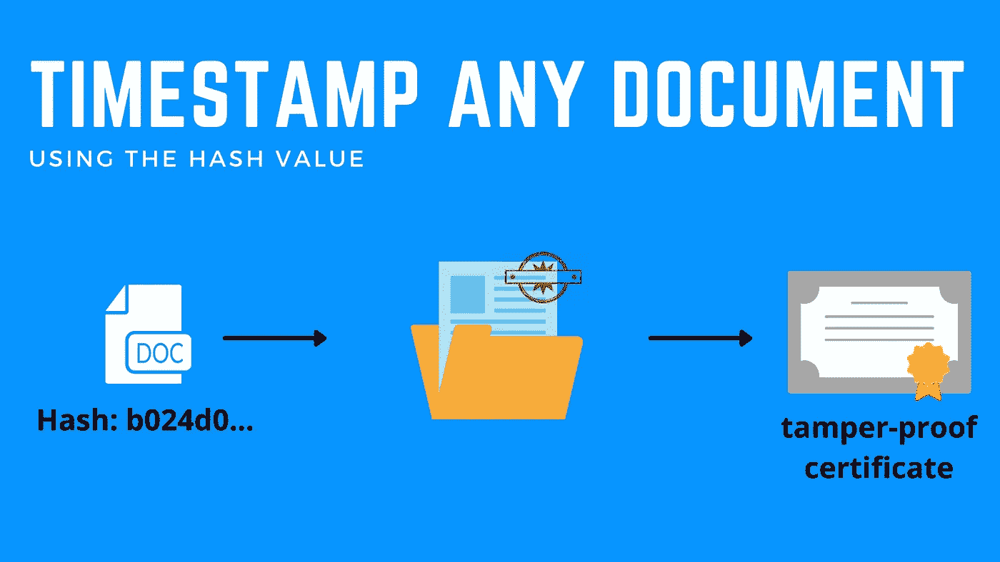
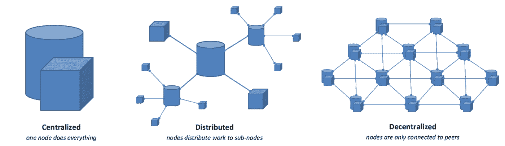
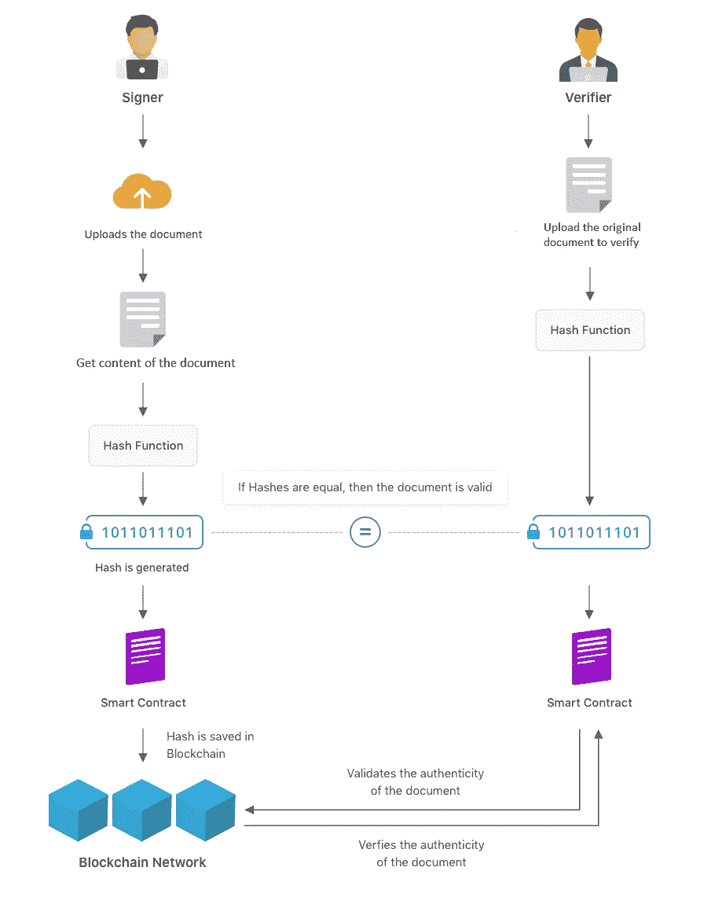
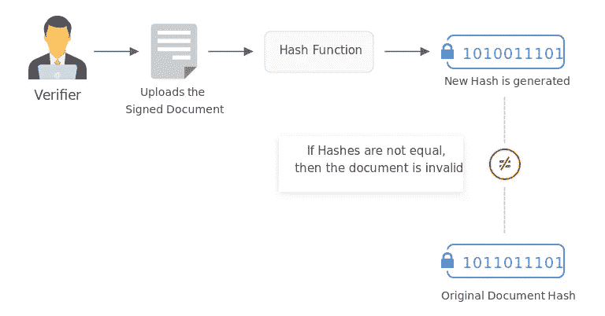
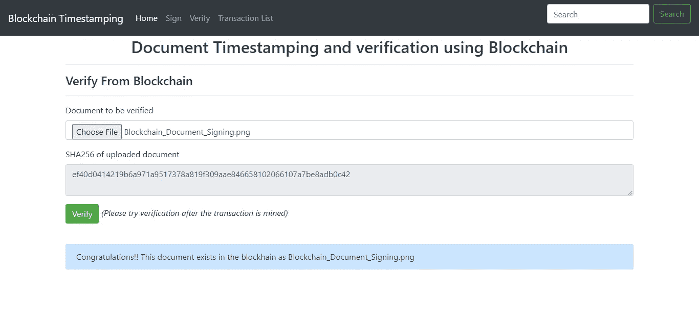

# 基于区块链的文档时间戳和验证

> 原文：<https://medium.com/coinmonks/blockchain-based-document-timestamping-and-verification-1bafd36b6c1f?source=collection_archive---------1----------------------->

Picture taken from : [originstamp](https://originstamp.com/)

# 介绍

使用纸质文档很麻烦，而且世界正朝着使用数字文档的方向发展。数字文档使用起来很方便，但证明其真实性往往是个问题。能证明文件没有被篡改吗？有没有可能证明你收到的文件和你之前看过的是一样的？由于没有确认和验证数字化文档的通用协议，在私人和政府机构中分析文档的过程是困难的。如果有一种机制来验证文档的真实性并确认文档的真实性和内容，这将方便用户管理他们的数字文档。针对上述问题提出的解决方案使用区块链技术。

政府文档的安全存储、方便检索和受保护的访问阻碍了高效运作，并增加了许多政府的成本。基于区块链的系统可以通过提供文档或证书的真实性的公共和私人证明来充当这些文档的验证交换所。一个基于区块链的文件验证系统也可以用来签发不可能伪造的数字证书。这有助于消除组织的声誉风险，并提高利益相关方的信任度和透明度。

区块链可以解决现有的验证数字资产有效性的问题，如出生证明的照片、陈述任何合同的 pdf 文档或指定商业交易的已签署法律文件，效率非常高，实施成本非常低。由于区块链(信息的永久去中心化账本)的特性，这些数字签名可以被任何人访问。因此，任何有权访问区块链的人现在都可以验证数字资产的真实性，而不必依赖可信的中介。

Decentralized Ledger

# **相关工作**

使用数字文档的主要问题之一是验证过程的模糊和不透明。数字文档更容易被修改，包括有意的修改和错误。为了克服这个问题，人们一直在尝试各种方法和方案。

一个众所周知的方案是带有公钥基础设施(PKI)的数字签名。 ***有效的数字签名保证了数字文档的三个主要安全要求，即真实性(文档是由已知的发送者创建的)、不可否认性(发送者不能否认已经发送了文档)和完整性(文档在传输中没有被更改)*** 。但是基于 PKI 的解决方案在成本和可用性方面不是很受欢迎。此外，数字签名不能识别文档在某一时间的存在或数字文档的出处，例如文档的主要所有者。

如今，许多独立的文档查看和编辑应用程序，如 Adobe Acrobat Reader、Microsoft Word，都可以让用户在文档上附加数字签名。已经有很多像 Docusign 和 Echosign 这样的数字签名服务可以帮助签署法律文件。所有这样的文档签名平台允许它们的用户安全地签名文档，并且还为签名的文档提供云存储。由于你需要盲目信任第三方来存储你的文档，这些服务对企业比普通用户更有吸引力。

问题是，我们如何创建数字证据来证明数字资产(出生证明、商业合同、教育证书的软拷贝)已经由授权组织或政府机构认证(签名),其次，世界各地的任何人如何在不依赖第三方或中介的情况下验证特定数字资产的真实性？

有了区块链文档签名，就不需要盲目信任第三方，无论是时间戳还是存储签名。通过建立一个区块链文件签署平台，可以取代第三方，防止任何人在操纵或争议的情况下追溯记录。区块链提供了完整性，以实现真实性，基于区块链的文件验证解决方案。而且目前孟加拉国还没有使用区块链的数字文档验证系统。

# 背景

在本节中，我们提供一些关于数字签名、文档时间戳和可信时间戳机构的背景知识

## 什么是数字签名？

数字签名是一种验证数字消息或文档真实性的数学方案。在满足先决条件的情况下，有效的数字签名使收件人有很强的理由相信消息是由已知的发件人创建的(验证)，并且消息在传输过程中没有被更改(完整性)。数字签名方案通常由三种算法组成；

1.  *一种密钥生成算法，从一组可能的私钥中统一随机选择一个私钥。该算法输出私钥和相应的公钥。*
2.  *一种签名算法，给定一条消息和一个私钥，产生一个签名。*
3.  *一种签名验证算法，根据给定的消息、公钥和签名，接受或拒绝消息的真实性声明。*

需要两个主要属性:-

1.  ***首先，由固定消息和固定私钥生成的签名的真实性可以通过使用相应的公钥来验证。***
2.  其次，在不知道一方的私钥的情况下，为该方生成有效签名在计算上应该是不可行的。数字签名是一种身份验证机制，它使邮件的创建者能够附加一个代码作为签名。

## 什么是时间戳和 TSA 权限？

可信时间戳是安全地跟踪文档的创建和修改时间的过程。时间戳被定义为在特定时间段内存在的特定文档或文件的标准。它可以用来证明自时间戳发布以来文档没有被修改过。因此，为了确保文档在一定时间内存在，数字签名中必须包含可信的时间戳。

因为如果文档有争议，如果没有时间戳，很难证明数字签名在签名时是有效的。这是因为大多数签名证书会在一两年后过期，因此很难证明文档在未来几年内的有效性。如果没有商业合同等具有法律约束力的文件的时间戳，有人可能会更改他们计算机上的时钟，然后更改并重新签署一份文件，这反过来可能会导致代价高昂的法律诉讼，因为不同的当事人可能会对彼此的主张提出争议。这就是为什么可信的时间戳必须由可信的第三方发布——这就是为什么需要时间戳机构。一个时间戳机构，被信任并被允许根据请求对信息进行时间戳标记。

该机构也可以是未来时间戳信息的验证机构。在可信时间戳服务中，时间戳信息只有在被可信的 TSA(例如 GlobalSign.com)打上时间戳时才可以被验证。大多数用户必须付费才能使用这项服务。但是这项服务也可以是免费的(【https://www.freetsa.org】T4)。

## 为什么使用区块链来标记时间戳？

区块链本身提供了可信第三方的所有特征:-

*   它促进了简单、快速和安全的在线交易。因此文件可以在任何地方被验证。
*   这是一个分散的分布式网络，注册的交易不能追溯更改，所以不需要信任第三方时间戳机构。
*   这允许参与者以廉价的方式验证和审计交易。不像 PKI 和 TSA，不需要额外的基础设施(软件-硬件)。
*   它还可以确保数字文档的出处和复制，因为每个文档的数字指纹都是唯一的。通过基于区块链的时间戳服务，PKI 的目标以及时间戳机构可以被实现。

# 建议的解决方案和系统架构

所提出的解决方案并不建议将数字资产存储在区块链上(这将是一种非常低效和昂贵的方法)。同样，如果原始文件与每个节点公开共享，它将失去机密性。相反，它只存储数字资产已经由区块链上的机构认证(或签名)的证明。如果任何人想要验证数字资产的合法性，他们可以通过使用提供的证据来检查数字资产来简单地验证数字资产。因此，区块链在这个解决方案中的作用是为这些证据提供一个不可变的存储容器。

概括地说，建议的解决方案包括以下步骤:

1.  *创建数字指纹，该数字指纹是数字文档的加密散列(SHA-512)*
2.  *将数字资产的数字指纹存储到区块链*
3.  *使用存储在区块链上的数字指纹验证数字资产，并审查发行该资产的机构。*

**System overview**

关于系统架构的更详细的讨论将在下一篇文章中概述

参与区块链文件签署生态系统的利益相关者可分为两类:-

*   签名者:签名者是那些想要在区块链中对他们的数字文档进行数字签名并创建数字时间戳的人
*   **验证者**:任何想要验证签名者共享的文档的人。

## 第一步:数字指纹

就像人类独有的指纹一样，数字资产也有独特的**指纹**。更确切地说，数字资产的指纹可以通过使用所谓的加密哈希函数来创建。这些函数可以获取几乎任何大小的文件(word、excel、pdf、图像等)。)作为输入参数来创建一串字母和字符(这是一个非常独特的指纹)作为输出。将使用以下公式导出文档的哈希:

> ***𝐻𝑎𝑠ℎ*=*𝑆𝐻𝐴*-256(*𝐷𝑎𝑡𝑎*)**
> 
> [SHA-256]是 SHA-256 散列函数[数据]代表文件的内容

## 步骤 2:文档的元数据

在这个步骤中，可以收集文档的额外元数据信息。元数据信息可以包含各种信息，例如文档名称、所有者名称、所有者地址、电子邮件等。

## 第三步:提交指纹和签名给区块链

在这个步骤中，文档的数字指纹和元数据被'**发送'**到区块链。这是该解决方案中第一次需要与区块链进行交互。请务必记住，存储在区块链上的不是数字资产本身，而是资产信息(其指纹)和元数据。在区块链网络中成功提交事务后，它返回一个事务散列。该哈希对于所有区块链事务都是唯一的。该散列确保存在有效的区块链事务，但不确保文档的完整性。

## 步骤 4:传输签名的数字资产

利用我们现有的方式，通过电子邮件、在线表格、文件共享平台等工具共享信息。，数字资产现在可以分发给任何一方，因为它是一个像任何其他文件一样的文件。

*注意:没有必要共享数字资产的指纹，因为它们存储在区块链上。只有作为数字文档本身的数字资产才应该被共享。*

## 步骤 5:数字资产验证

接收方验证数字资产真实性的过程类似于之前执行的步骤，从从接收到的文件重新创建数字指纹开始。接下来，向区块链发起检索指纹的请求。任何验证者只需在系统中上传相同的文档，就可以从交易时间开始验证文档的完整性和存在性。

# 原型实现

基于这个概念验证(POC)开发了一个演示 nodejs 应用程序。在这个演示中，Ropsten 区块链网络(测试)已被用于存储区块链中任何文档的哈希和元数据。该应用程序目前托管在 Azure 云平台上，具有以下功能-

*   在线时间戳和验证服务的原型，包含所有可能的富文本文档，确保数据隐私。
*   实施一个门户网站，用户可以在其中注册和上传数字文档。
*   与本地/公共(测试)以太坊区块链网络集成。
*   智能合同开发在区块链存储有用信息。

【https://blockchain-timestamping.azurewebsites.net/】现场试玩网址:

**Github 网址:[https://github.com/sharif2008/blockchain-timestamping](https://github.com/sharif2008/blockchain-timestamping)**

# **结论**

**区块链以其信任和可追溯性等特性为文档签名行业提供了巨大的机会。区块链的签名证明不受任何单一实体的控制。区块链文件签署平台的成员则充当公证人或证人来证明签名。一个基于区块链的签名平台也为用户提供了访问文档和快速确认签名真实性的能力。**

*****反馈****:shariful.islam@bcc.gov.bd***

*****PS:如果你喜欢这篇文章，请用掌声支持它*** 👏 ***。欢呼*****

** [## 加密交易机器人——2021 年最佳免费加密交易机器人

### 2021 年币安、比特币基地、库币和其他密码交易所的最佳密码交易机器人。四进制，位间隙…

medium.com](/coinmonks/crypto-trading-bot-c2ffce8acb2a)  [## 最佳 6 个加密交易信号电报通道

### 这是乏味的找到正确的加密交易信号提供商。因此，在本文中，我们将讨论最好的…

medium.com](/coinmonks/best-crypto-signals-telegram-5785cdbc4b2b)  [## BlockFi 评论 2021:利弊和利率

### 今天，我们提出了一个全面的 BlockFi 评论，这是一个成立于 2017 年的加密贷款平台，拥有其…

blog.coincodecap.com](https://blog.coincodecap.com/blockfi-review)  [## 加密税务软件——五大最佳比特币税务计算器[2021]

### 不管你是刚接触加密还是已经在这个领域呆了一段时间，你都需要交税。

medium.com](/coinmonks/best-crypto-tax-tool-for-my-money-72d4b430816b)  [## Pionex 评论 2021 |免费加密交易机器人和交易所

### Pionex 是为交易自动化提供工具的后起之秀。Pionex 上提供了 9 个加密交易机器人…

medium.com](/coinmonks/pionex-review-exchange-with-crypto-trading-bot-1e459d0191ea)**