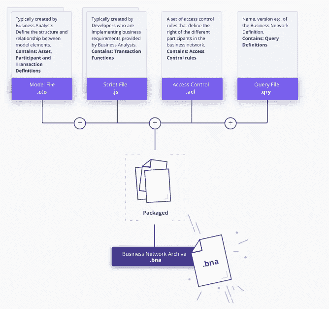
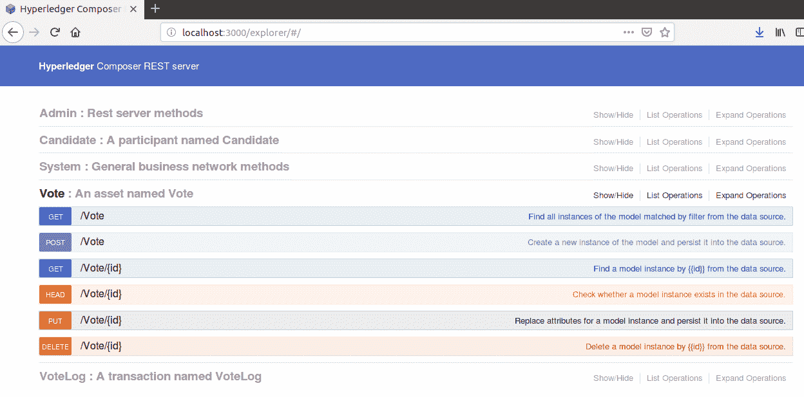
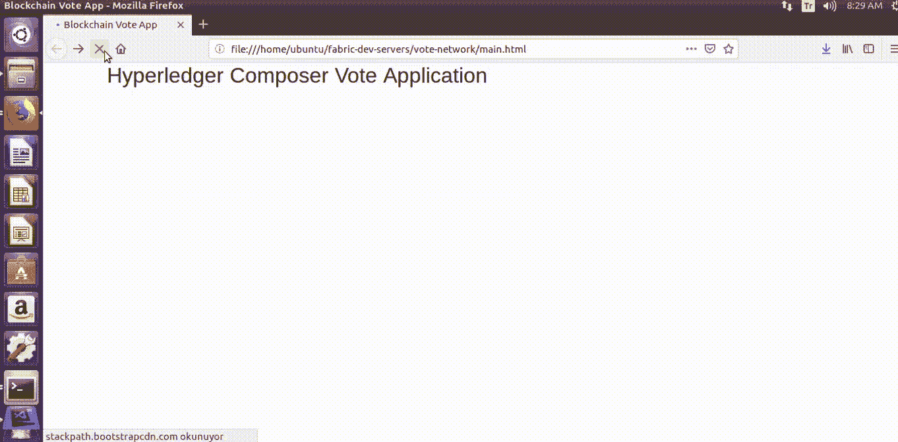
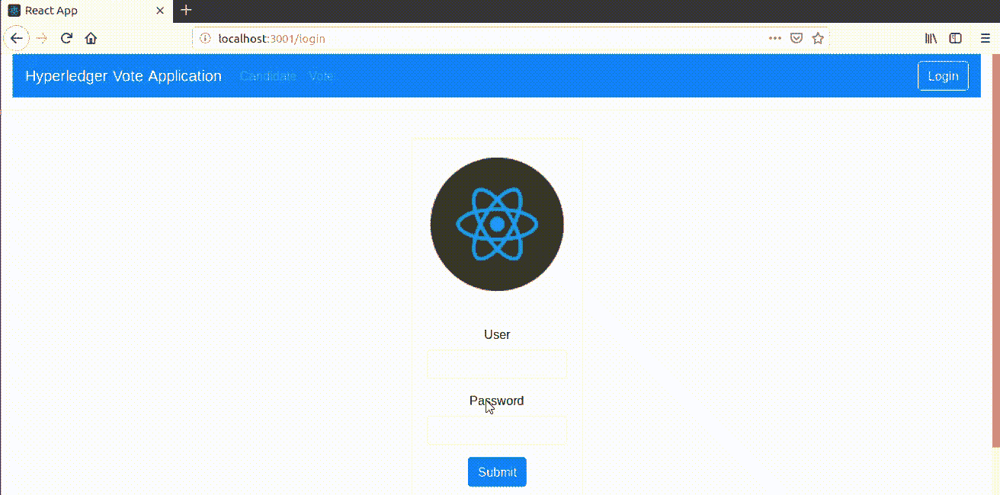
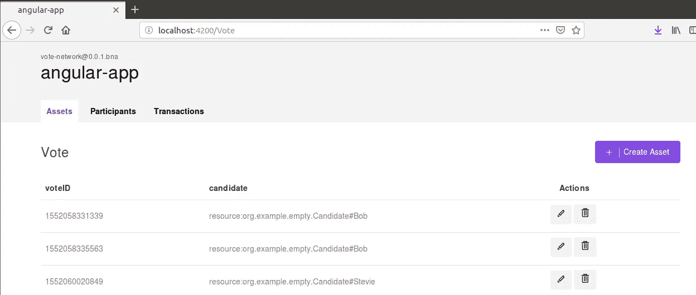

# Hyperledger Composer 上基于区块链的投票应用

> 原文：<https://medium.com/coinmonks/blockchain-based-vote-application-on-hyperledger-composer-e08b1527031e?source=collection_archive---------0----------------------->

yperledger Composer 是一个广泛的、开放的开发工具集和框架，使开发区块链应用程序变得更加容易。Composer 支持现有的 Hyperledger Fabric 区块链基础架构，使用 Composer 可以轻松创建区块链环境。我们只关注生成业务网络档案的模型、脚本和访问控制文件。bna)。业务网络存档文件已经准备好部署在一个存在 Hyperledger Fabric 和 Node.js 的分布式账本上了，之后我们只需要开发一个 web 接口，用我们想要的语言使用这个 Rest API。

## ***安装必备:***

下面介绍如何在 Hyperledger Composer 上实现基于区块链的投票应用程序。对于 Hyperledger Composer，我们需要检查我们是否拥有合成和安装所需的所有先决条件，如果我们没有:`Docker Engine`、`Docker-Compose`、`Node`、`npm`、`git`、`Python`、`VSCode`(没必要，但有用)。从这里的[到](https://hyperledger.github.io/composer/v0.19/installing/installing-prereqs.html)，您可以找到如何安装上述先决条件。

## ***安装开发环境:***

如果我们确信我们的先决条件已经安装，我们将继续安装我们将使用的开发环境。我们从安装有用的 CLI 工具(`composer-cli` 这是必不可少的，`generator-hyperledger-composer`、`composer-rest-server`和`Yeoman`)开始，这些工具是我们在开发 Composer 时需要的。然后，我们需要安装 Hyperledger Fabric 来部署我们的业务网络。如何安装我们上面描述的 CLI 工具和 Hyperledger Fabric 在这里解释[。](https://hyperledger.github.io/composer/v0.19/installing/development-tools.html)

然后我们通过这些命令唤醒 Hyperledger 结构；

```
cd ~/fabric-dev-servers
export FABRIC_VERSION=hlfv11
./startFabric.sh
./createPeerAdminCard.sh
```

就这样，所有安装步骤都完成了。

## 开始开发 Hyperledger Composer 项目:

我们从业务网络定义的开发开始，这是我们正在构建的关键概念。根据[官方文档](https://hyperledger.github.io/composer/v0.19/business-network/businessnetworkdefinition)，它被定义为“业务网络定义是 Hyperledger Composer 编程模型的一个关键概念。它们由`BusinessNetworkDefinition`类表示，在`composer-common`模块中定义，并由`composer-admin`和`composer-client`导出。下面的图片完美地展示了 BNA 的部分，我们将根据我们的需要改变它。



Taken from [https://hyperledger.github.io/composer/v0.19/business-network/businessnetworkdefinition](https://hyperledger.github.io/composer/v0.19/business-network/businessnetworkdefinition)

我们应该对你在上图中看到的文件进行一些修改。但是首先，我们正在使用`Yeoman`并按照以下步骤创建一个业务网络结构；

```
yo hyperledger-composer:businessnetwork**1.** Enter **vote-network** as network name and desired information for description, author name, and author email **2\.** Select **Apache-2.0** **as** the license
**3.** Enter **org.example.empty
4\.** Select **No**when asked whether to generate an empty network
```

如您所见，业务网络由资产、参与者、事务、访问控制规则以及可选的事件和查询组成。因此，我们做了以下修改。

*   **模型文件(。cto):** 它包含所有资产、参与者和事务的类定义，我们将它们建模如下:

```
namespace org.example.emptyasset Vote identified by voteID {
    o String voteID
    --> Candidate candidate
}participant Candidate identified by candidateId {
    o String candidateId
    o String firstName
    o String lastName
}transaction VoteLog {
    o String voteID
    --> Candidate candidate
}
```

*   **脚本文件(。js):** 它包含当一个事务到来时执行的事务处理器函数。

```
/**
 * @param {org.example.empty.VoteLog} tx
 * @transaction
 */
async function logAdd(tx) {
    let assetRegistry = await getAssetRegistry('org.example.empty.Vote');
  	var factory = getFactory()
    var asset = factory.newResource('org.example.empty', 'Vote', tx.voteID)
    asset.candidate = tx.candidate
    await assetRegistry.add(asset);
}
```

*   **访问控制(。acl):** 包含基本的访问控制规则。

```
/**
 * Access control rules for vote-network
 */
rule Default {
    description: "Allow all participants access to all resources"
    participant: "ANY"
    operation: ALL
    resource: "org.example.empty.*"
    action: ALLOW
}

rule SystemACL {
  description:  "System ACL to permit all access"
  participant: "ANY"
  operation: ALL
  resource: "org.hyperledger.composer.system.**"
  action: ALLOW
}
```

## 生成业务网络档案并部署它:

在定义了业务网络之后，必须通过导航到`vote-network`目录(或者具有您输入的另一个名称的目录)并运行以下命令，将它打包到可部署的业务网络档案(`.bna`)文件中；

```
composer archive create -t dir -n
```

现在，我们在`vote-network`目录中创建了一个名为`vote-network@0.0.1.bna`的业务网络归档文件，我们需要开始将其部署到 Hyperledger Fabric。我们再次导航到`vote-network`目录，并有序地运行命令。

> ***注意*** *:如果您已经创建了一个* `*vote-network*` *目录，那么您需要更改它的名称*

*   安装企业网络

```
composer network install --card PeerAdmin@hlfv1 --archiveFile vote-network@0.0.1.bna
```

*   启动业务网络

```
composer network start --networkName vote-network --networkVersion 0.0.1 --networkAdmin admin --networkAdminEnrollSecret adminpw --card PeerAdmin@hlfv1 --file networkadmin.card
```

*   将网络管理员身份作为可用的业务网卡导入

```
composer card import --file networkadmin.card
```

## 生成 REST 服务器:

此时，Hyperledger Composer 会显示一个 REST 服务器，我们会参照在前面步骤中建模和定义的 BND 来生成它。我们再次导航到`vote-network`目录，并按顺序运行命令。

```
composer-rest-server**1.** Enter **admin@vote-network** as card name **2\.** Select **never use namespaces**
**3.** Select **No** when asked whether to secure the generated API **4\.** Select **Yes** when asked whether to enable event publication
**5.** Select **No** when asked whether to enable TLS security
```

之后，生成的 API 连接到部署在`http://localhost:3000`地址的区块链和业务网络。下面有一张图是端点是什么样子的；



我们应该安装的所有东西都完成了。现在我们可以开发一个网页并连接到 REST 服务器。该应用程序有两个版本(其中一个是用 jQuery framework 开发的，另一个是用 React framework 开发的)，我们将分别对它们进行解释。源代码可在[这里](https://github.com/burakcanekici/BlockchainBasedVoteAppOnHyperledgerComposer)；

## jQuery 版本:

根据官方网站的说法[，jQuery 是一个快速、小巧、功能丰富的 JavaScript 库。它用于向 Hyperledger Composer 提供的 REST 服务器发送 post 和 get 请求。](https://jquery.com/)

每当有候选人被选为投票人时，结果就会显示出来，如下图所示；



下面是 jQuery 代码；

## React 版本:

据[官方网站](https://reactjs.org/)介绍，React 是一个用于构建用户界面的 JavaScript 库。它是声明性的和基于组件的。它用于开发网页，并向 Hyperledger Composer 提供的 REST 服务器发出 post 和 get 请求。

结果如下所示。用户可以登录系统，选择他们想要的候选人。创建新候选人或删除现有候选人存在于候选人选项卡中。由于用户需要登录系统，如果用户没有通过系统验证，候选人和投票选项卡会重定向到登录屏幕。

在这个项目中，`vote-react`目录是存放所有 React 代码和文件的地方，在这里[可以找到](https://github.com/burakcanekici/BlockchainBasedVoteAppOnHyperledgerComposer/tree/master/vote-react)；



此外，Hyperledger Composer 为开发环境提供了两个机会；

*   首先是网上游乐场环境。我们还可以在浏览器上设置和管理我们的业务网络、资产、参与者和交易。从[这里](https://hyperledger.github.io/composer/v0.19/tutorials/playground-tutorial.html)，你可以找到如何使用操场环境的教程。
*   第二个是针对 Rest API 的 Angular 4 应用程序。Hyperledger Composer 在 4200 端口上显示现有的 web 应用程序，就像我们在此应用程序中所做的应用程序一样。从这里的[到](https://hyperledger.github.io/composer/v0.19/tutorials/developer-tutorial.html)，你可以看到如何在第 6 步唤醒它并采样下图；



> [在您的收件箱中直接获得最佳软件交易](https://coincodecap.com/?utm_source=coinmonks)

[](https://coincodecap.com/?utm_source=coinmonks)